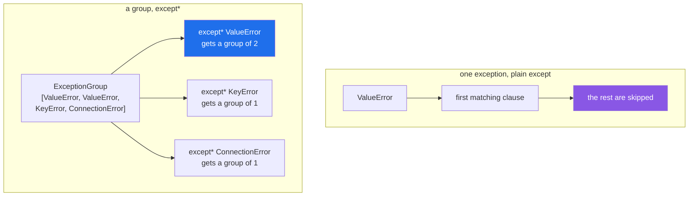

# 4.5 — `ExceptionGroup` and `except*`: many failures at once

## One-line answer

When several independent things fail together, one exception can only report one of them —
`ExceptionGroup` carries all of them, and `except*` runs **every** matching clause instead of only the
first.

---

## The story

Four parcels go out on the same round, and the round comes back with three problems.

One address was wrong. One was refused at the door. One van broke down and that parcel is still in it.

The driver could hand over the first slip he finds and say "there was a problem". That is one true fact
out of three, and whoever reads it will fix one thing and be surprised twice more tomorrow.

What he actually does is hand over all three slips at once, clipped together, with a note on top saying
*three problems on the Bristol round*. Different people deal with different slips — the address goes to
the office, the refusal goes to the customer, the van goes to the garage — and all three get dealt with in
the same afternoon.

The clip is the point. Three separate problems, arriving together, staying separate.

---

## The idea in plain language

Everything so far in this day has assumed **one** failure travelling upward
([1.1](../01-raising-and-catching/1.1-what-raising-does.md)). That is right when one thing was happening.

It stops being right when several independent things were happening at once — twenty concurrent fetches,
a batch of validations, a set of parallel tasks. If three of the twenty fail, raising one exception
reports one failure and discards two, and the caller fixes a third of the problem.

`ExceptionGroup` is an exception that **contains other exceptions**, in `group.exceptions`. It is not a
subclass of them: a group holding `ValueError`s is not a `ValueError`, so `except ValueError:` does not
catch it. That is deliberate — a group is a different kind of thing, and handling one member is not
handling the group.

`except*` is the syntax for handling them, and it behaves differently from `except` in three ways worth
holding on to:

**Every matching clause runs**, not just the first. A group with a `ValueError` and a `TypeError` runs
both clauses. Compare `except`, where first match wins and the rest are skipped
([1.2](../01-raising-and-catching/1.2-try-except-and-catching-by-type.md)) — this is the opposite rule,
and it is the one people forget.

**Each clause receives a group**, not an exception. `except* ValueError as group:` binds an
`ExceptionGroup` containing only the `ValueError`s, so you iterate `group.exceptions`. Even when there is
one.

**Whatever is unhandled is re-raised as a smaller group**, automatically. Nothing is silently dropped.

Two more facts, and then where you will actually meet it.

`BaseExceptionGroup` is the parent; `ExceptionGroup` is the subclass that may only contain `Exception`s.
If a group could contain a `KeyboardInterrupt`
([1.4](../01-raising-and-catching/1.4-the-bare-except.md)), it is a `BaseExceptionGroup`.

And you will meet this **from tomorrow**, not by writing it yourself. `asyncio.TaskGroup` raises an
`ExceptionGroup` when any of its tasks fail
([Day 19, 4.8](../../../day-19-typing-dataclasses-and-concurrency/parts/04-concurrency/4.8-timeouts-and-taskgroup.md)),
and that is where nearly everybody meets their first one — usually as a confusing traceback with `+---`
characters in it. Knowing the shape today is what makes tomorrow's tracebacks readable.

The machinery is *PEP 654 — Exception Groups and except\** (2021,
<https://peps.python.org/pep-0654/>), which added both the classes and the syntax in Python 3.11.

---

## Why Setu needs it

- **Day 19's `asyncio.TaskGroup` is the plan's named concurrency example** — twenty fetches, timed — and
  when two of the twenty fail, this is the shape the failure arrives in
  ([Day 19, 4.7](../../../day-19-typing-dataclasses-and-concurrency/parts/04-concurrency/4.7-gather-and-twenty-fetches.md)).
- **Day 172's router tries four providers.** "All four failed" is four exceptions, and reporting only the
  last one hides that three of them failed for a different reason.
- **Day 233's eval suite runs many cases**, and a run where six evals failed should report six failures,
  not the first.
- **Day 16's `read_jsonl(on_error="skip")` counts what it skipped**
  ([Day 16, 2.5](../../../day-16-files-and-context-managers/parts/02-reading-and-writing/2.5-jsonl.md));
  a group is the version of that idea where the failures themselves are kept rather than counted.

---

## The mechanism

What one looks like when nobody catches it:

```text
$ uv run python -c "
raise ExceptionGroup('three parcels failed', [
    ValueError('7741: 5000g is over the 2000g limit'),
    KeyError('7742'),
    ConnectionError('7743: the card system is down'),
])
"
  + Exception Group Traceback (most recent call last):
  |   File "<string>", line 2, in <module>
  | ExceptionGroup: three parcels failed (3 sub-exceptions)
  +-+---------------- 1 ----------------
    | ValueError: 7741: 5000g is over the 2000g limit
    +---------------- 2 ----------------
    | KeyError: '7742'
    +---------------- 3 ----------------
    | ConnectionError: 7743: the card system is down
    +------------------------------------
```

**Read the shape.** The outer block is the group and its own traceback; then each member is numbered and
indented under it, with its own traceback. The `+---` characters are the tree drawing, and the first time
you see one in a real log it is worth remembering that this is all it is.

Handling them:

```python
def process_all():
    raise ExceptionGroup(
        "three parcels failed",
        [
            ValueError("7741: over the limit"),
            KeyError("7742"),
            ConnectionError("7743: the card system is down"),
            ValueError("7744: negative weight"),
        ],
    )


try:
    process_all()
except* ValueError as group:
    print("customer can fix :", [str(e) for e in group.exceptions])
except* KeyError as group:
    print("missing field    :", [str(e) for e in group.exceptions])
except* ConnectionError as group:
    print("come back later  :", [str(e) for e in group.exceptions])
```

**Line by line:**

- `ExceptionGroup("three parcels failed", [...])` — a message and a **list** of exceptions. Both are
  required, and the list may not be empty.
- **four** members, two of them `ValueError` — so the first clause has more than one to deal with, which
  is the case a single `except` cannot express at all.
- `except* ValueError as group:` — the star. `group` is an `ExceptionGroup` holding the two `ValueError`s,
  **not** a `ValueError`.
- `[str(e) for e in group.exceptions]` — iterating the members
  ([Day 9, 1.1](../../../day-09-comprehensions/parts/01-list-comprehensions/1.1-the-loop-and-the-comprehension.md)).
  This is the line that differs most from ordinary handling: there is always a collection.
- three clauses, and **all three run**. Not first-match.

Run on Python 3.12.12 on 2026-09-02:

```
customer can fix : ['7741: over the limit', '7744: negative weight']
missing field    : ["'7742'"]
come back later  : ['7743: the card system is down']
```

**Three lines of output from one raise.** Each group of failures went to the response that fits it, which
is [1.2](../01-raising-and-catching/1.2-try-except-and-catching-by-type.md)'s three-outcomes story, now
working when the three arrive together.

The rule that catches people:

```python
try:
    raise ExceptionGroup("mixed", [ValueError("a"), TypeError("b")])
except* ValueError:
    print("the ValueError clause ran")
except* TypeError:
    print("the TypeError clause ran too - both, not first-match")
```

**Line by line:**

- two clauses, two member types, and **both blocks execute**. With plain `except`, the second would be
  skipped.
- neither uses `as`, because the point here is only which blocks run.

```
the ValueError clause ran
the TypeError clause ran too - both, not first-match
```

And where it will actually reach you:

```python
import asyncio


async def one(i):
    if i % 2:
        raise ValueError(f"parcel {i} failed")
    return i


async def main():
    async with asyncio.TaskGroup() as tg:
        for i in range(4):
            tg.create_task(one(i))


try:
    asyncio.run(main())
except* ValueError as group:
    print(
        "TaskGroup collected",
        len(group.exceptions),
        "failures:",
        [str(e) for e in group.exceptions],
    )
```

**Line by line:**

- `async with asyncio.TaskGroup() as tg:` — tomorrow's tool
  ([Day 19, 4.8](../../../day-19-typing-dataclasses-and-concurrency/parts/04-concurrency/4.8-timeouts-and-taskgroup.md)).
  It waits for every task and collects the failures.
- `if i % 2:` — two of the four tasks fail, so there really are several
  ([Day 5, 1.2](../../../day-05-operators-and-conditionals/parts/01-operators/1.2-the-two-divisions.md)).
- `except* ValueError as group:` — **this is why the syntax exists.** A `TaskGroup` cannot raise one
  exception, because more than one thing failed independently.
- `len(group.exceptions)` — two, and both are reported.

```
TaskGroup collected 2 failures: ['parcel 1 failed', 'parcel 3 failed']
```

The two shapes:



---

## When it breaks

**A plain `except` that expected a member type:**

```text
$ uv run python -c "
try:
    raise ExceptionGroup('mixed', [ValueError('a'), TypeError('b')])
except ValueError:
    print('never - a group is not a ValueError')
except ExceptionGroup as group:
    print('caught the whole group:', len(group.exceptions), 'inside')
"
caught the whole group: 2 inside
```

**What it means.** `except ValueError:` does not match, because an `ExceptionGroup` containing
`ValueError`s is not a `ValueError` ([2.1](../02-the-hierarchy/2.1-catching-catches-subclasses.md)). This
is the first surprise everybody meets: existing handlers stop working when a library starts using
`TaskGroup`. The fix is `except*`, and where a plain `except ExceptionGroup:` is enough, note that it
gives you the group as one object — fine for logging, not for responding to each member differently.

**Mixing `except` and `except*` in one statement:**

```text
$ uv run python -c "
try:
    pass
except ValueError:
    pass
except* TypeError:
    pass
" 2>&1 | tail -3
SyntaxError: cannot have both 'except' and 'except*' on the same 'try'
```

**What it means.** A `try` uses one style or the other. The message is exact, and the reason is that the
two have incompatible semantics — first-match against every-match — so allowing both would make the
statement unreadable. Choose per `try`, and if a block can raise both a plain exception and a group, the
usual arrangement is `except*` throughout, since `except*` also handles a bare exception by wrapping it.

**`return`, `break` or `continue` inside an `except*` block:**

```text
$ uv run python -c "
def f():
    try:
        raise ExceptionGroup('g', [ValueError('a')])
    except* ValueError:
        return 'handled'
" 2>&1 | tail -3
  File "<string>", line 6
SyntaxError: 'break', 'continue' and 'return' cannot appear in an except* block
```

**What it means.** Because *every* matching clause runs, a `return` in one of them would abandon the
others — so the language forbids it outright rather than letting you write something ambiguous. The way
round it is to collect what you learn into a variable inside the clauses and act after the whole `try`
statement.

**An empty group:**

```text
$ uv run python -c "raise ExceptionGroup('nothing failed', [])" 2>&1 | tail -2
ValueError: second argument (exceptions) must be a non-empty sequence
```

**What it means.** A group is a report of failures, so a group with no failures is a contradiction, and
the constructor refuses. This bites when a collection is built by filtering — `ExceptionGroup("failed",
[e for e in results if isinstance(e, Exception)])` raises this on a run where everything succeeded. Check
the list before constructing, which is the same shape as "only raise if something is wrong".

---

## In production

**The professional habit is not to reach for `ExceptionGroup` by hand very often.** It earns its place in
exactly one situation: independent operations that ran together, where reporting one failure would hide
the others. Batch validation, parallel fetches, a fan-out to several services. For sequential code, where
the first failure stops everything anyway, one exception is the right shape and a group is ceremony.

**What changes at scale is that you meet groups whether or not you write them.** `asyncio.TaskGroup` and
`asyncio.timeout` produce them, and libraries built on those propagate them, so a codebase that upgrades
into concurrency finds existing `except ConnectionError:` handlers quietly failing to match. The
migration is mechanical — `except*` and iterate — but it has to be *done*, and the tell is a traceback
with `+---` in it reaching a top-level handler that used to catch everything.

**The failure that only appears with real data is the group with one member.** In testing, one task fails
and the group has one exception, so code that does `group.exceptions[0]` works perfectly. In production,
two fail at once — a shared dependency went down — and the second is silently ignored, which is exactly
the failure the group existed to prevent. **Always iterate**, even when you are sure there is one.

**The review comment a senior engineer leaves.** *"This catches `TimeoutError` around a `TaskGroup`, which
will never match — the group is not a `TimeoutError`. Use `except* TimeoutError` and iterate
`group.exceptions`, and log all of them; right now if three tasks time out we would report one, and only
by accident."*

**The interview question.** *"What is an `ExceptionGroup` for?"* For reporting several independent
failures at once, which one exception cannot do — the case being concurrent tasks or a batch. The details
worth adding: `except*` runs **every** matching clause rather than the first, which is the opposite of
plain `except`; each clause receives a *group* rather than an exception, so you always iterate; a plain
`except ValueError:` will not catch a group containing `ValueError`s; and anything unhandled is re-raised
as a smaller group, so nothing is dropped.

---

## Check yourself

```bash
uv run python -c "
group = ExceptionGroup('batch failed', [ValueError('a'), TypeError('b'), ValueError('c')])
print('is it a ValueError?', isinstance(group, ValueError))
print('members           :', [type(e).__name__ for e in group.exceptions])

try:
    raise group
except* ValueError as g:
    print('ValueError clause :', len(g.exceptions), 'members')
except* TypeError as g:
    print('TypeError clause  :', len(g.exceptions), 'members')
"
```

Both clauses run, and the first says two. Now change `except*` to plain `except` and read the error.

**Answer out loud, without scrolling up:**

> Say the one way `except*` behaves differently from `except` when two clauses both match, and say what
> the name after `as` is bound to.

---

**Next:** [4.6 — when not to use an exception](4.6-when-not-to-raise.md), the last document of the day.
