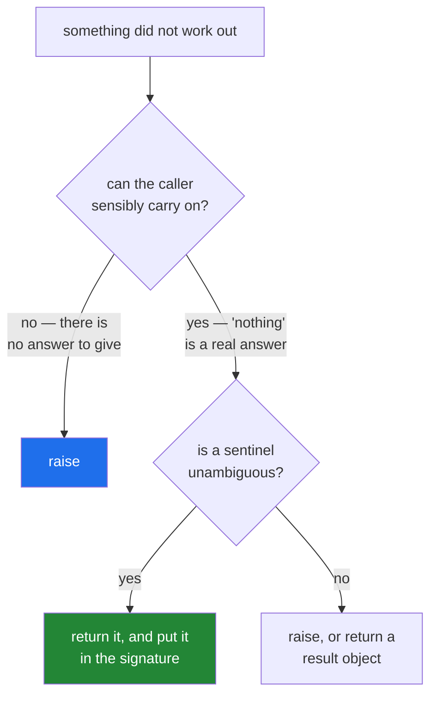

# 4.6 — When not to use an exception: the result that is not exceptional

## One-line answer

An exception says *this could not be done*; when "not found", "not yet", or "no match" is an ordinary,
expected outcome, return it — a sentinel, a default, or `None` with a signature that says so — and keep
raising for the cases where continuing would be wrong.

---

## The story

Somebody comes in and asks whether a parcel has arrived for them.

It has not.

The clerk says "not yet, try Thursday". Nobody writes an incident report. Nobody stops what they are
doing. It is one of the two answers the question has, and it is the more common one.

Now the other kind. Somebody hands over a parcel with no address on it. The clerk cannot post it, cannot
guess, and cannot hand it back and carry on as though it went — there is nothing sensible to do next
except stop and say so.

The difference is not how bad it is. A parcel that has not arrived may be a much worse day for the person
asking than a form filled in wrongly. The difference is whether the counter can carry on. *Not yet* is an
answer. *No address* is the absence of one.

---

## The idea in plain language

This whole day has argued for raising. This part is the boundary of that argument, and the rule is one
sentence: **raise when the caller cannot be given an answer; return when "no" is an answer.**

Four everyday situations where returning is right:

**"Not found", where absence is expected.** A cache lookup, a search, an optional configuration key. The
caller asked a question whose honest answer is sometimes "nothing". `dict.get` returns `None`;
`str.find` returns `-1`; `re.search` returns `None`; `next(it, default)` returns the default. All of them
have a raising twin — `d[k]`, `str.index`, `next(it)` — and the standard library offers both **on
purpose**, because both situations exist.

**A validator that reports every problem.** A function that raises on the first bad field can only ever
tell the user about one, so they fix it, resubmit, and are told about the next. Returning a list of
problems — empty means valid — lets a form show all four at once. (`ExceptionGroup`
([4.5](4.5-exception-groups.md)) is the other way to do this, and is the right one when the failures are
independent operations rather than findings about one input.)

**A predicate.** `is_valid(x)` returns a boolean. Nobody would write it to raise, and it is worth naming
because the same instinct sometimes produces `check_valid(x)` that raises where a boolean was wanted.

**A parser with an explicit "could not" outcome.** `parse(text)` returning `None` for "this is not a
date" is reasonable **if** the signature says so — `-> date | None`
([Day 19, 1.3](../../../day-19-typing-dataclasses-and-concurrency/parts/01-type-hints/1.3-optional-and-the-none-you-forgot.md)) —
and the caller is forced to think about it.

And the three that keep it honest:

**Never return `None` for a failure the caller was not told about.** That is
[1.1](../01-raising-and-catching/1.1-what-raising-does.md)'s original sin: the `None` travels and fails
somewhere unrelated. If `None` is a possible answer, it must be in the signature and in the docstring.

**Never return a sentinel that could be a real value.** `-1` works for `str.find` because a string index is
never negative in that context. `0` as "not found" for a count is a bug waiting.

**Do not build an error-code system.** Returning `(result, error)` pairs, or integer codes, re-invents what
exceptions do — and every caller who forgets to check gets a wrong answer silently, which is precisely
what raising prevents. The cases above are narrow and deliberate, not a licence.

The cost argument is real but small, and it is the one from
[4.2](4.2-eafp-and-lbyl.md): raising is more expensive than returning, so a tight loop where failure is
the *common* case is worth measuring. Correctness decides first; speed only breaks a tie.

---

## Why Setu needs it

- **`dict.get` and `next(it, default)` are all over this project already** — they are this rule, applied by
  the standard library.
- **Day 16's `read_jsonl(on_error="skip")` returns records and counts skips**
  ([Day 16, 2.5](../../../day-16-files-and-context-managers/parts/02-reading-and-writing/2.5-jsonl.md)),
  rather than raising per bad line, because one bad line in fifty thousand is an expected outcome of real
  data.
- **Day 172's router returns `None` from a *probe* and raises from a *call*** — asking whether a provider
  is available has two answers; asking it for a completion has one.
- **Day 233's eval suite reports every failing case**, so its checker returns findings rather than raising
  on the first.

---

## The mechanism

The standard library's own pairs, side by side:

```python
import re

s = "a heavy parcel"

print("find('zzz') :", s.find("zzz"))
try:
    s.index("zzz")
except ValueError as error:
    print('index("zzz"):', type(error).__name__, "-", error)
print("re.search   :", re.search("zzz", s))
```

**Line by line:**

- `s.find("zzz")` — returns **`-1`**, a sentinel. Absence is an ordinary answer to "where is this
  substring", so the method returns rather than raising.
- `s.index("zzz")` — the raising twin, for callers who consider absence impossible and want to stop if it
  happens. **Both exist because both intentions exist**, and choosing between them is choosing what the
  absence means to you
  ([Day 7, 2.4](../../../day-07-strings/parts/02-methods/2.4-find-index-and-in.md)).
- `re.search("zzz", s)` — returns `None` for no match, and this is safe because a match object is never
  falsy by accident; the idiom `if m := re.search(...)` reads correctly.

Run on Python 3.12.12 on 2026-09-02:

```
find('zzz') : -1
index("zzz"): ValueError - substring not found
re.search   : None
```

The same choice in your own code, measured:

```python
import timeit


def find_raise(items, target):
    for i, x in enumerate(items):
        if x == target:
            return i
    raise ValueError(f"{target!r} is not in the list")


def find_sentinel(items, target):
    for i, x in enumerate(items):
        if x == target:
            return i
    return -1


items = list(range(50))
miss = 999


def loop_raise():
    hits = 0
    for _ in range(20_000):
        try:
            find_raise(items, miss)
        except ValueError:
            hits += 1
    return hits


def loop_sentinel():
    hits = 0
    for _ in range(20_000):
        if find_sentinel(items, miss) == -1:
            hits += 1
    return hits


print("raising every time     :", f"{timeit.timeit(loop_raise, number=1):.3f}s")
print("returning -1 every time:", f"{timeit.timeit(loop_sentinel, number=1):.3f}s")
```

**Line by line:**

- two functions with **identical** search logic, differing only in what they do when they find nothing.
- `raise ValueError(f"{target!r} is not in the list")` — a good message
  ([3.3](../03-your-own/3.3-the-message-is-an-interface.md)), and the right choice **if** a caller asking
  for a missing item is a bug.
- `return -1` — the sentinel, correct here because these are list positions and a position is never
  negative in this function's contract.
- twenty thousand **misses** — the worst case for raising, chosen deliberately so the difference is
  visible at all.
- `timeit.timeit(loop_raise, number=1)` — the whole loop timed once, because the loop is already the
  repetition ([4.2](4.2-eafp-and-lbyl.md)).

```
raising every time     : 0.032s
returning -1 every time: 0.027s
```

**About twenty per cent, on a loop that misses every single time.** That is the honest size of the
performance argument: real, small, and nowhere near a reason to choose a sentinel when raising is the
correct semantics. Choose on meaning; check the clock only when a profile has already pointed here.

Which to reach for:



---

## When it breaks

**A `None` the caller was never warned about:**

```text
$ uv run python -c "
def find_parcel(parcels, pid):
    for p in parcels:
        if p['id'] == pid:
            return p

parcels = [{'id': 1, 'grams': 500}]
print('found  :', find_parcel(parcels, 1))
print('missing:', find_parcel(parcels, 2)['grams'])
"
found  : {'id': 1, 'grams': 500}
Traceback (most recent call last):
  File "<string>", line 9, in <module>
TypeError: 'NoneType' object is not subscriptable
```

**What it means.** The function has no `return` at the end, so it returns `None` — and nothing in its
name, signature or docstring says so. The failure lands in the caller, on a subscript, saying nothing
about parcels. **Either raise, or write `-> dict | None` and say in the docstring what `None` means**
([Day 19, 1.3](../../../day-19-typing-dataclasses-and-concurrency/parts/01-type-hints/1.3-optional-and-the-none-you-forgot.md)).
A function that falls off the end is choosing neither.

**A sentinel that collides with a real value:**

```text
$ uv run python -c "
def score(parcel):
    if 'grams' not in parcel:
        return 0        # 'not scored'
    return parcel['grams'] // 500

parcels = [{'grams': 100}, {}, {'grams': 500}]
scores = [score(p) for p in parcels]
print('scores    :', scores)
print('unscored? :', [s == 0 for s in scores])
print('but parcel 0 WAS scored, and its score is genuinely 0')
"
scores    : [0, 0, 1]
unscored? : [True, True, False]
but parcel 0 WAS scored, and its score is genuinely 0
```

**What it means.** `0` means both "not scored" and "scored zero", and the first parcel is a legitimate
zero: 100 grams divided by 500 is 0. The `unscored?` line says `True` for both, and there is no way to
recover the difference from the output. Every downstream check for "was this scored" is now wrong for a
real value. **A sentinel must be a value the function could never legitimately return** — which is why
`-1` works for a position and `0` almost never works for a count.

**Exceptions used for ordinary control flow:**

```python
def parse_all(rows):
    out = []
    for row in rows:
        try:
            out.append(int(row))
        except ValueError:
            continue
    return out
```

**Line by line:**

- `except ValueError: continue` — skipping unparseable rows, which is a reasonable *policy*.
- the cost, when most rows are bad: every skip raises and catches
  ([4.2](4.2-eafp-and-lbyl.md)).
- the real problem is not speed: **the count of skipped rows is thrown away**, so a run where 90% of rows
  failed looks identical to one where none did
  ([4.1](4.1-the-except-that-was-too-wide.md)).

**What it means.** This is not "wrong" so much as incomplete. Either keep the exception and count what it
cost — `skipped += 1`, exposed to the caller — or, if bad rows are the normal case rather than an
exception to it, make that explicit with a function that returns `(value, ok)` or filters first. The
question to ask is which the data actually is.

**Returning an error code, and the caller who did not check:**

```text
$ uv run python -c "
OK, TOO_HEAVY = 0, 1

def post(parcel):
    if parcel['grams'] > 2000:
        return TOO_HEAVY, None
    return OK, 'posted'

status, receipt = post({'grams': 5000})
print('receipt:', receipt)
print('receipt.upper() ->', receipt.upper())
"
receipt: None
Traceback (most recent call last):
  File "<string>", line 11, in <module>
AttributeError: 'NoneType' object has no attribute 'upper'
```

**What it means.** The status code was returned, correctly, and the caller ignored it — which is a thing
callers do, silently, forever. An exception cannot be ignored: not handling it stops the program
([1.1](../01-raising-and-catching/1.1-what-raising-does.md)). **That is the whole argument for exceptions
over return codes**, and it is why the narrow cases in this part are narrow: they work only where the
"nothing" answer is impossible to use by accident.

---

## In production

**The professional test is: could the caller reasonably carry on?** If yes — the value was optional, the
lookup was a question, the absence is data — return it, and put it in the type signature so nobody is
surprised. If no, raise, because raising is the only mechanism in the language that a caller cannot
accidentally ignore.

**What changes at scale is that "expected failure" becomes a measurable rate rather than a rare event.**
At a million records a day, a 0.1% malformed rate is a thousand failures, and treating each as an
exception produces a thousand log lines nobody reads
([4.3](4.3-logging-exception.md)) — while treating them as data produces one number on a dashboard that
can have a threshold on it. The design question stops being "is this exceptional?" and becomes "at what
rate does this stop being normal?", which is a question with an answer you can alert on.

**The failure that only appears with real data is the sentinel that turns up in the data.** A code that
uses `-1` for "unknown age" meets a system where `-1` was already a real value; `0` for "not scored" meets
a legitimate zero; an empty string for "missing" meets a genuinely empty field. This is why `None` is
usually a better sentinel than a number — it is a distinct type, and it cannot be confused with any
value in the domain — and why the signature has to say so.

**The review comment a senior engineer leaves.** *"`get_customer` returns `None` when the id is unknown
and the signature says `-> Customer`. Either raise `CustomerNotFound`, or change the return type to
`Customer | None` and let the type checker force the eleven call sites to handle it. Right now three of
them do not."*

**The interview question.** *"When would you *not* raise an exception?"* The answer is: when the failure
is an ordinary, expected outcome that the caller can act on — a lookup that found nothing, an optional
value, a parse that legitimately does not match — in which case return it, with a sentinel that cannot be
confused with a real value and a signature that says so. Then the boundary: never return `None` for a
condition the caller was not told about, and never build a return-code system, because a caller who
forgets to check a code gets a wrong answer while a caller who ignores an exception gets a traceback.

---

## Check yourself

```bash
uv run python -c "
s = 'a heavy parcel'
print('find :', s.find('zzz'))
try:
    s.index('zzz')
except ValueError as error:
    print('index:', error)

d = {'grams': 500}
print('get  :', d.get('service'))
try:
    d['service']
except KeyError as error:
    print('[]   :', type(error).__name__, error)
"
```

Four calls, two of them the raising twin of the other two. For each pair, say in one sentence which
caller intention it serves.

**Answer out loud, without scrolling up:**

> Give the one-question test for raise-versus-return, and say why returning an error code is worse than
> raising even though both let the caller decide.

---

**That is the day.** Back to the hub: [`LESSON.md`](../../LESSON.md), §4 for the build brief and §5 for
the tests that must be able to fail.
