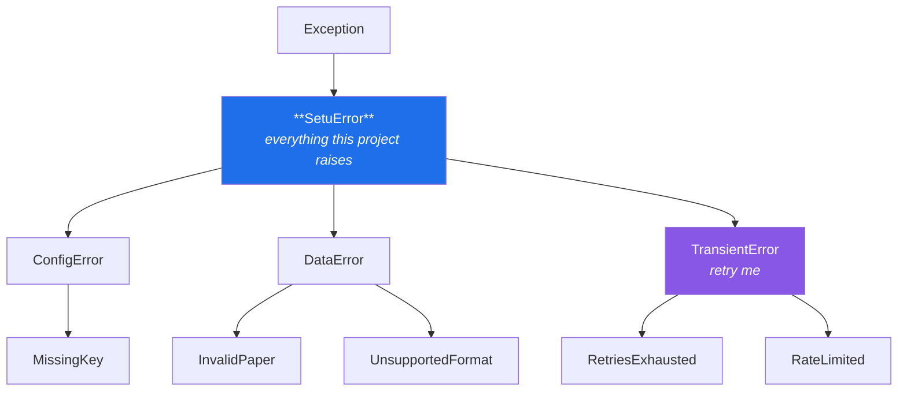

# Day 18 — Exceptions and custom error types

**Phase 2 · Module 2** · ID: **PY-22** (try-except, custom exceptions, error-handling practice)

> **Yesterday:** the package got layers.
> **Today:** you have already written four exception classes ad hoc — `MissingKey`,
> `RetriesExhausted`, `InvalidPaper`, `UnsupportedFormat`. Today they become a designed hierarchy,
> and you learn the two rules that make error handling either trivial or nightmarish for 222 more days.
> **Tomorrow:** typing, Pydantic, and concurrency — Phase 2 closes.

```bash
./m start 18 && ./m scaffold 18
```

**Time:** 90 minutes. **Request budget:** 0 model calls.

---

## §1 The story

Two rules. Everything else today is detail.

**Rule one: catch narrowly.** `except Exception` catches your network timeout, and also your typo,
your `KeyboardInterrupt`-adjacent bugs, and the `AttributeError` from code you wrote wrong five
minutes ago. You saw this on Day 14: a retry decorator with a broad filter retries a `TypeError`
three times, burns three free-tier requests, and reports a network failure. **Catch the specific
thing you know how to handle. Let everything else through.**

**Rule two: an exception is an interface.** When `search_papers()` fails, the caller needs to know
*which kind* of failure so it can respond: retry a timeout, refuse a bad query, escalate a corrupt
database. That is what a hierarchy is for:



With that shape, a caller can write `except setu.TransientError:` and automatically cover
`RateLimited` and everything transient you add in the next 222 days. It can write `except SetuError:`
to mean *"a problem this project knows about"* — as opposed to a bug. And a test can assert that a
function raises `DataError` without pinning the exact subclass, so refining the hierarchy later does
not break a hundred tests.

One more thing today, because it is the difference between a five-minute and a two-hour debugging
session: **exception chaining**. `raise NewError(...) from original` preserves the original in
`__cause__`, and the traceback prints *"The above exception was the direct cause of…"*. Losing that
is how "retries exhausted" ends up telling you nothing about why.

---

## §2 Setup — run this

```bash
mkdir -p days/day-18/lab
touch days/day-18/lab/errors.py
touch src/setu/errors.py
touch tests/test_errors.py
```

No new packages.

---

## §3 PY-22 — the mechanics

`days/day-18/lab/errors.py`:

```python
"""PY-22: try/except/else/finally, chaining, and why narrow beats broad."""

from __future__ import annotations


def the_four_blocks() -> None:
    def parse(raw: str) -> int:
        try:
            value = int(raw)
        except ValueError:
            print(f"    except: {raw!r} is not a number")
            return -1
        else:
            print("    else:   ran because NO exception happened")
            return value
        finally:
            print("    finally: always runs, on every path out")

    print("\nparse('42'):")
    print(f"  -> {parse('42')}")
    print("parse('x'):")
    print(f"  -> {parse('x')}")


def narrow_beats_broad() -> None:
    data = {"year": "not-a-number"}

    try:
        int(data["yaer"])          # typo: KeyError, not ValueError
    except ValueError:
        print("\n  ValueError handler did NOT run - good, the typo surfaced")
    except KeyError as exc:
        print(f"\n  KeyError: {exc}   <- the real bug, visible")

    try:
        int(data["yaer"])
    except Exception:
        print("  broad handler swallowed the typo and reported 'bad data'  <- the bug hides")


def chaining() -> None:
    class LoadFailed(RuntimeError):
        pass

    def load(raw: str) -> int:
        try:
            return int(raw)
        except ValueError as exc:
            raise LoadFailed(f"could not load {raw!r}") from exc

    try:
        load("nope")
    except LoadFailed as exc:
        print(f"\n{exc=}")
        print(f"{exc.__cause__=}   <- the original survives")
        print(f"{type(exc.__cause__).__name__=}")

    def swallow(raw: str) -> int:
        try:
            return int(raw)
        except ValueError:
            raise LoadFailed("could not load")   # no `from` - context is implicit, not explicit

    try:
        swallow("nope")
    except LoadFailed as exc:
        print(f"{exc.__cause__=}        <- None: you threw away the reason")
        print(f"{exc.__context__ is not None=}  <- Python kept it implicitly, but 'from' is the contract")


def hierarchy_lets_callers_choose() -> None:
    class AppError(Exception): ...
    class Transient(AppError): ...
    class RateLimited(Transient): ...
    class BadInput(AppError): ...

    for error in (RateLimited("429"), BadInput("empty query"), KeyError("bug")):
        try:
            raise error
        except Transient as exc:
            print(f"\n  {type(exc).__name__}: retry it")
        except AppError as exc:
            print(f"  {type(exc).__name__}: report to the user, do not retry")
        except Exception as exc:
            print(f"  {type(exc).__name__}: not ours - this is a bug, let it crash in prod")


def custom_exceptions_can_carry_data() -> None:
    class RateLimited(Exception):
        def __init__(self, provider: str, retry_after: float) -> None:
            super().__init__(f"{provider} rate-limited; retry after {retry_after}s")
            self.provider = provider
            self.retry_after = retry_after

    try:
        raise RateLimited("gemini", 12.5)
    except RateLimited as exc:
        print(f"\n  {exc}")
        print(f"  caller can act on structured data: {exc.retry_after=}")


if __name__ == "__main__":
    the_four_blocks()
    narrow_beats_broad()
    chaining()
    hierarchy_lets_callers_choose()
    custom_exceptions_can_carry_data()
```

**Line by line:**

- `else:` — runs **only if no exception was raised**. Its value is that the `try` block can hold just
  the one line that might fail, with the follow-up work in `else`. A `try` block wrapping ten lines
  catches failures you did not intend to catch.
- `finally:` — runs on every path out: success, handled exception, unhandled exception, even `return`.
  Note that the `return` in `except` still lets `finally` run first. This is what Day 16's context
  managers are built on.
- `data["yaer"]` — a typo raising `KeyError`. The narrow `except ValueError` lets it through, so you
  see the real bug. The broad `except Exception` reports it as bad data, and you spend an hour
  looking at the data.
- `raise LoadFailed(...) from exc` — **explicit chaining**. `__cause__` is set and the traceback says
  "direct cause".
- The `swallow` version — `__cause__` is `None`. Python still records `__context__` implicitly (so the
  traceback says "During handling of the above exception, another occurred"), but `from` is the
  contract that says *this is deliberate*. Always write it.
- `except Transient` before `except AppError` — **order matters**: Python takes the first matching
  clause, so subclasses must come before their parents. Reverse them and `RateLimited` is caught by
  `AppError` and the retry never happens.
- `super().__init__(f"...")` in a custom exception — sets the message. Then `self.retry_after` gives
  the caller **structured data**, not a string to parse. On Day 172 the provider router reads exactly
  this to decide how long to back off.

---

## §4 Build brief — `src/setu/errors.py`

Layer 0 (imports nothing from `setu`). Every module then imports from here.

```python
"""The Setu exception hierarchy. Layer 0: imports nothing from setu."""

from __future__ import annotations


class SetuError(Exception):
    """Base for every error this project raises deliberately.

    `except SetuError` means "a problem Setu knows about", as opposed to a bug.
    """


class ConfigError(SetuError):
    """Something about the environment or configuration is wrong."""


class MissingKey(ConfigError):
    """A required environment variable is absent or blank."""


class DataError(SetuError):
    """Input data is malformed, missing, or out of range."""


class InvalidPaper(DataError):
    """A Paper was constructed with missing or out-of-range fields."""


class UnsupportedFormat(DataError):
    """No registered loader handles this path's suffix."""


class TransientError(SetuError):
    """A failure that MAY succeed if retried. Everything retryable inherits from this."""


class RateLimited(TransientError):
    """TODO(me): carry `provider` and `retry_after` as attributes, not just in the message.

    - message should read like: "gemini rate-limited; retry after 12.5s"
    - retry_after must be a float and must be >= 0; raise ValueError if not
    """


class RetriesExhausted(TransientError):
    """TODO(me): carry `attempts` as an attribute.

    Message should name the attempt count. Always raised `from` the last underlying error.
    """
```

Then rewire the modules that currently define their own exceptions:

- `config.py` — import `MissingKey` from `errors` instead of defining it. **`MissingKey` must stay
  importable from `setu.config`** so Day 2's tests keep passing: `from setu.errors import MissingKey`
  at the top of `config.py` does exactly that.
- `papers.py` — same for `InvalidPaper`.
- `loaders.py` — same for `UnsupportedFormat`.
- `retry.py` and `decorators.py` — same for `RetriesExhausted`, and now `TransientError` becomes the
  sensible default for the `exceptions=` filter.

Note that `RetriesExhausted` inheriting from `TransientError` is a real design decision worth
defending: exhausting retries *now* does not mean it will fail in ten minutes.

---

## §5 The eval that must be able to fail

`tests/test_errors.py`:

```python
import pytest

from setu.errors import (
    ConfigError,
    DataError,
    InvalidPaper,
    MissingKey,
    RateLimited,
    RetriesExhausted,
    SetuError,
    TransientError,
    UnsupportedFormat,
)


@pytest.mark.parametrize(
    ("child", "parent"),
    [
        (MissingKey, ConfigError),
        (InvalidPaper, DataError),
        (UnsupportedFormat, DataError),
        (RateLimited, TransientError),
        (RetriesExhausted, TransientError),
        (ConfigError, SetuError),
        (DataError, SetuError),
        (TransientError, SetuError),
    ],
)
def test_hierarchy(child, parent):
    assert issubclass(child, parent)


def test_setu_error_is_not_too_broad():
    assert not issubclass(KeyError, SetuError)
    assert not issubclass(SetuError, ValueError), "SetuError must be a plain Exception subclass"


def test_catching_transient_covers_every_retryable_error():
    for error in (RateLimited("gemini", 1.0), RetriesExhausted(attempts=3)):
        with pytest.raises(TransientError):
            raise error


def test_rate_limited_carries_structured_data():
    exc = RateLimited("gemini", 12.5)
    assert exc.provider == "gemini"
    assert exc.retry_after == 12.5
    assert "gemini" in str(exc) and "12.5" in str(exc)


def test_rate_limited_rejects_a_negative_delay():
    with pytest.raises(ValueError):
        RateLimited("gemini", -1.0)


def test_retries_exhausted_names_the_attempt_count():
    exc = RetriesExhausted(attempts=4)
    assert exc.attempts == 4
    assert "4" in str(exc)


def test_retry_chains_the_original_cause():
    from setu.decorators import retry

    @retry(attempts=2, exceptions=(TransientError,), sleep=lambda _: None)
    def always():
        raise RateLimited("groq", 1.0)

    with pytest.raises(RetriesExhausted) as info:
        always()
    assert isinstance(info.value.__cause__, RateLimited), "raise ... from exc was omitted"


def test_config_still_exposes_missing_key():
    from setu.config import MissingKey as FromConfig

    assert FromConfig is MissingKey, "the re-export broke; Day 2's tests depend on this"


def test_papers_raises_the_shared_invalid_paper():
    from setu.papers import Paper

    with pytest.raises(DataError):
        Paper("", "title", 2017)


def test_no_bare_excepts_in_src():
    from pathlib import Path

    offenders = [
        f"{p.name}:{i}"
        for p in Path("src/setu").rglob("*.py")
        for i, line in enumerate(p.read_text(encoding="utf-8").splitlines(), 1)
        if line.strip() in ("except:", "except Exception:", "except BaseException:")
        and "noqa" not in line
    ]
    assert not offenders, f"broad except found: {offenders}"
```

**Line by line:**

- `test_hierarchy` — eight parametrised `issubclass` checks. Cheap, and it means the diagram in §1 is
  *executable documentation* rather than a picture that drifts.
- `test_setu_error_is_not_too_broad` — asserts what is **not** in the hierarchy. `SetuError` inheriting
  from `ValueError` would make `except ValueError` accidentally catch your config errors.
- `test_catching_transient_covers_every_retryable_error` — the payoff of the hierarchy, asserted. Add
  a new transient error later and it is covered for free.
- `test_papers_raises_the_shared_invalid_paper` — deliberately asserts the **parent** `DataError`,
  not `InvalidPaper`. Tests that pin the most specific class break every time you refine the
  hierarchy. Assert the level the caller actually cares about.
- `test_retry_chains_the_original_cause` — `info.value.__cause__`. Drop `from exc` and this goes red.
- `test_no_bare_excepts_in_src` — a repo-wide guard, in the family of Day 26's and Day 17's. It allows
  a `# noqa` escape, because Day 3's `verify_keys.py` legitimately needs one — and an escape hatch
  that must be written down is a decision rather than a habit.

```bash
uv run python -m pytest tests/test_errors.py -v
uv run python -m pytest -q          # everything still green after the rewiring
```

---

## §6 Request budget

| Resource | Spent today |
|---|---|
| LLM calls | **0** |

---

## §7 Traps

- **`except Exception`.** Hides your bugs as their bugs. Name what you can handle.
- **A bare `except:`.** Also catches `KeyboardInterrupt` and `SystemExit`. You cannot Ctrl-C out.
- **`except` clauses in the wrong order.** Subclasses first, or the parent shadows them.
- **`raise NewError()` without `from exc`.** The reason is lost from the contract.
- **`except X: pass`.** If you truly mean it, `contextlib.suppress(X)` says so out loud.
- **A ten-line `try` block.** Wrap only the line that can fail; put the rest in `else`.
- **Exception messages with no data.** `"invalid input"` versus `"year 3000 outside 1900..2100"`.
- **Inheriting from `BaseException`.** Never. `Exception` is the base for application errors.
- **A hierarchy so deep nobody catches the middle.** Three levels is plenty.
- **`assert` for validation.** `python -O` removes it (Day 5). Raise instead.

---

## §8 Verify before you code

Written **2026-08-21**:

- <https://docs.python.org/3/tutorial/errors.html> — `try`/`except`/`else`/`finally` and chaining.
- <https://docs.python.org/3/library/exceptions.html> — the built-in hierarchy; inherit from the
  closest sensible built-in.
- <https://docs.python.org/3/reference/simple_stmts.html#the-raise-statement> — `from` and `__cause__`.

---

## §9 Say it in an interview

> "Everything the project raises deliberately inherits from one base, with a `TransientError` branch
> for anything retryable — so the retry decorator's filter is one class rather than a list that has to
> be updated every time we add a failure mode. Exceptions carry structured data, not just a message:
> a rate-limit error has a `retry_after` float, so the backoff can use the server's number instead of
> guessing. And I re-raise with `from`, always, because 'retries exhausted' with no `__cause__` tells
> you nothing at 11pm. There's a test that greps the package for broad excepts, with a `# noqa` escape
> for the two places it's genuinely right — which makes those a decision rather than a habit."

---

## §10 Done when

Tick [`CHECKLIST.md`](CHECKLIST.md), then `./m check && ./m done 18`.
