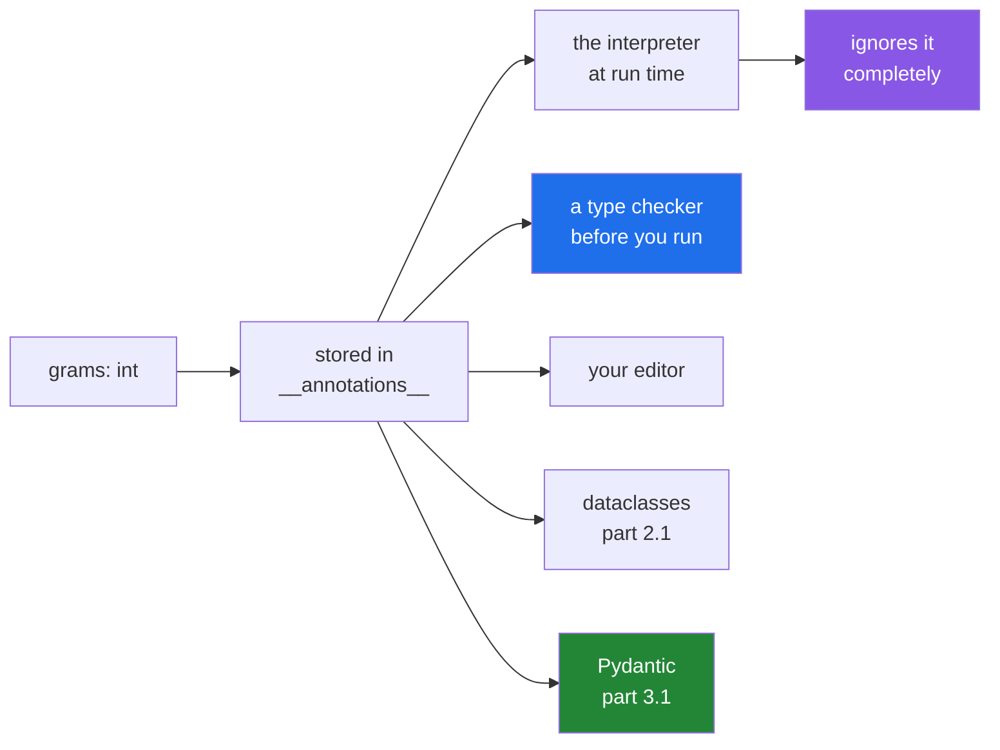

# 1.1 — A type hint is a note, not a rule

## One-line answer

Python stores your annotations and **never checks them**: `def weigh(grams: int)` accepts a string
happily, so a hint is a promise to readers and to tools, not a guard at run time.

---

## The story

The form on the counter has small grey words under each box.

Under the weight box: *in grams, whole numbers*. Under the service box: *standard, heavy, or overnight*.

Nobody at the counter enforces those words. You can write "quite heavy" in the weight box and the clerk
will take the form, because the words are printed on the paper, not built into it. The box is a box.

What the grey words are actually for is everybody else. The person filling it in knows what is wanted
without asking. The person reading it later knows what they should be looking at. And when the office
started running the forms through a scanner, the scanner could be told what each box was meant to hold —
and it began flagging the ones that did not match, which nobody had ever been able to do before.

The words did not change. Something started reading them.

---

## The idea in plain language

A **type hint** — also called an annotation — is the `: int` in `def weigh(grams: int) -> int:`. You met
the syntax on [Day 10, 1.6](../../../day-10-functions/parts/01-the-signature/1.6-the-signature-is-the-contract.md),
where it was introduced as part of a function's contract. This part is the fact that day left for today:
**Python does not enforce it.**

At run time, `weigh("heavy")` runs. `"heavy" * 2` is `"heavyheavy"`, and a function annotated
`-> int` returns a string with no complaint anywhere. The interpreter stores the annotation in a
dictionary called `__annotations__` and does nothing else with it.

That sounds like a weakness and is a deliberate design. Checking every argument on every call would cost
time on every call, forever, to catch a class of mistake that a tool can catch once, before the program
runs. So hints are **for readers and for tools**, and the tools are what make them pay:

- **A type checker** — `mypy`, `pyright`, or your editor's — reads them and tells you about mismatches
  without running anything ([1.4](1.4-the-type-checker.md)).
- **Your editor** uses them for completion and for jump-to-definition.
- **Pydantic reads them at run time and does enforce them**
  ([3.1](../03-pydantic/3.1-the-model-that-refuses.md)), which is the whole trick of that library and why
  it is on today.
- **`dataclasses` reads them to generate code** ([2.1](../02-dataclasses/2.1-what-dataclass-writes.md)).

That is the shape of the day: hints are inert, and then two libraries make them do work.

Three practical points.

**A hint is a claim, and a wrong claim is worse than none.** `-> int` on a function that sometimes returns
`None` misleads every reader and every tool. That specific case is [1.3](1.3-optional-and-the-none-you-forgot.md).

**Annotate the signature, not every local variable.** The signature is the interface, and it is what other
people read. `count: int = 0` inside a function adds noise and tells nobody anything.

**Hints go stale unless something reads them.** A hint nobody checks is a comment, and comments drift.
Running a type checker is what turns the whole exercise from decoration into a gate.

One piece of vocabulary. `__annotations__` is an ordinary dictionary attribute on the function object
([Day 14, 1.1](../../../day-14-decorators/parts/01-functions-as-values/1.1-a-function-is-a-value.md)),
mapping parameter names to whatever you wrote. `inspect.signature` reads the same information and prints
it back in the form you typed.

---

## Why Setu needs it

- **`TriageResult` as a Pydantic model is the plan's named example for `PY-23`**, and Pydantic builds it
  by reading exactly these annotations ([3.5](../03-pydantic/3.5-triage-result.md)).
- **Day 18's `RateLimited.__init__` already carries hints** —
  `(self, provider: str, retry_after: float) -> None`
  ([Day 18, 3.2](../../../day-18-exceptions/parts/03-your-own/3.2-an-exception-that-carries-data.md)) —
  written as documentation on a day when nothing read them. Today something does.
- **Day 17's `layout.py` used `-> set[str]` and `list[str] | None`**
  ([Day 17, 4.4](../../../day-17-modules-and-packages/parts/04-the-project/4.4-designing-the-public-surface.md)),
  and the `| None` in that signature is the difference between a caller who checks and one who does not.
- **Every model call from Day 172 returns structured output**, validated against a schema that is
  generated from annotations. A wrong hint there is a wrong schema.

---

## The mechanism

The demonstration is one function and one wrong argument:

```python
def weigh(grams: int) -> int:
    return grams * 2


print("a string went in    :", weigh("heavy"))
print("the hint said int   :", weigh.__annotations__)
print("nothing complained  : the return is a str, not an int")
```

**Line by line:**

- `def weigh(grams: int) -> int:` — two annotations. `grams: int` for the parameter, `-> int` for the
  return.
- `return grams * 2` — the body, which works for `int` and, by coincidence, for `str`
  ([Day 7, 1.1](../../../day-07-strings/parts/01-text/1.1-a-string-is-code-points.md)). That coincidence
  is what makes the failure silent rather than loud.
- `weigh("heavy")` — **runs.** No check, no warning, no error. The annotation was not consulted.
- `weigh.__annotations__` — the dictionary Python stored. It is a plain attribute on the function object,
  and you can read it, print it, and change it.

Run on Python 3.12.12 on 2026-09-02:

```
a string went in    : heavyheavy
the hint said int   : {'grams': <class 'int'>, 'return': <class 'int'>}
nothing complained  : the return is a str, not an int
```

**`heavyheavy`.** The function promised an `int` and produced a `str`, and the only thing that noticed is
the person reading this page.

Where the information lives:

```python
import inspect


def post(parcel: dict, *, service: str = "standard") -> str | None:
    """Post it, or return None if refused."""
    return None


print("__annotations__:", post.__annotations__)
print("signature      :", inspect.signature(post))
```

**Line by line:**

- `*, service: str = "standard"` — a keyword-only parameter with a default and a hint
  ([Day 10, 1.5](../../../day-10-functions/parts/01-the-signature/1.5-keyword-only-and-positional-only.md)).
  Annotations and defaults sit side by side and do not interfere.
- `-> str | None` — the modern way to write "a string or nothing"
  ([1.2](1.2-the-vocabulary.md)). Note the annotation is stored as an object, not as text.
- `post.__annotations__` — the raw dictionary. **The `return` key is where the return annotation goes**,
  which is why you cannot have a parameter called `return` — and you could not anyway, since it is a
  keyword.
- `inspect.signature(post)` — the same information, reassembled into the form you typed. This is what an
  editor shows in a tooltip and what `help()` prints.

```
__annotations__: {'parcel': <class 'dict'>, 'service': <class 'str'>, 'return': str | None}
signature      : (parcel: dict, *, service: str = 'standard') -> str | None
```

Who reads a hint, and when:



---

## When it breaks

**The wrong value travels, and fails somewhere else:**

```text
$ uv run python -c "
def weigh(grams: int) -> int:
    return grams * 2

def price(grams: int) -> float:
    return weigh(grams) / 500

print(price('heavy'))
" 2>&1 | tail -4
Traceback (most recent call last):
  File "<string>", line 8, in <module>
  File "<string>", line 6, in price
TypeError: unsupported operand type(s) for /: 'str' and 'int'
```

**What it means.** The mistake was at the call — a string where an integer was annotated — and the
traceback is about a division in `price`, two functions away. This is exactly
[Day 18, 1.1](../../../day-18-exceptions/parts/01-raising-and-catching/1.1-what-raising-does.md)'s "the
error moved away from its cause", and the hint that would have caught it at the call site was ignored.
**A type checker reports this without running anything**, which is the argument of
[1.4](1.4-the-type-checker.md).

**A hint that is a lie:**

```text
$ uv run python -c "
def find(parcels: list, pid: int) -> dict:
    for p in parcels:
        if p['id'] == pid:
            return p
    return None

print(find([], 1))
print(find([], 1)['grams'])
" 2>&1 | tail -4
None
Traceback (most recent call last):
  File "<string>", line 9, in <module>
TypeError: 'NoneType' object is not subscriptable
```

**What it means.** `-> dict` says a dictionary always comes back, and the last line of the function
returns `None`. Nothing at run time objects, so the annotation misleads every reader into not checking —
which is worse than no annotation at all, because an unannotated function at least prompts the question.
The honest signature is `-> dict | None`, and [1.3](1.3-optional-and-the-none-you-forgot.md) is the whole
of that.

**An annotation that is evaluated and fails:**

```text
$ uv run python -c "
def load(path: Pathish) -> None:
    pass
" 2>&1 | tail -2
NameError: name 'Pathish' is not defined
```

**What it means.** Annotations on a `def` are **evaluated** when the function is defined, so a name that
does not exist is a `NameError` at import time — not at call time. That is the one way an annotation can
break a program that would otherwise run. The two fixes are `from __future__ import annotations`, which
makes annotations strings and defers evaluation, and quoting the name: `def load(path: "Pathish")`. The
first is what this project uses, and it is why nearly every module here starts with that line.

**A stale hint nobody reads:**

```python
def retry_delay(error: Exception, *, default: float = 5.0) -> float:
    if isinstance(error, RateLimited):
        return error.retry_after
    return default
```

**Line by line:**

- the signature is honest today.
- six months later somebody changes it to return `None` when there should be no retry at all, and
  **does not change the `-> float`**.
- nothing fails. Every caller that does `time.sleep(retry_delay(e))` now sleeps on `None` — one caller,
  one `TypeError`, in production, on the retry path.

**What it means.** Hints rot exactly like comments unless a tool reads them on every change. That is not
an argument against writing them; it is the argument for [1.4](1.4-the-type-checker.md), and for the fact
that Pydantic ([3.1](../03-pydantic/3.1-the-model-that-refuses.md)) reads them at run time so they cannot
be wrong quietly.

---

## In production

**The professional habit is to annotate every public signature and let a checker read them in CI.** Not
locals, not obvious internal helpers — the boundaries: what a function takes and what it gives back.
Those are what other people read, what an editor completes against, and what a tool can verify. Everything
else is optional and mostly noise.

**What changes at scale is that annotations become the machine-readable part of a large codebase.** In a
project of forty modules, a checker answers "what breaks if I change this return type" across the whole
tree in seconds — a question that is otherwise a search and a guess. That is why teams adopt typing at the
point where the codebase outgrows one person's memory, and why the adoption is usually gradual: annotate
the boundaries first, turn the checker on for those files, widen from there.

**The failure that only appears with real data is the annotation that was true for the happy path.**
`-> dict` is correct for every input the author tried and wrong for the empty result, the timeout, and the
row that does not parse. Real data finds those, and the caller — who trusted the signature and did not
check — fails on a `NoneType`. This is why `| None` in a signature is not pedantry: it is the difference
between a caller who handles the case and one who cannot know it exists.

**The review comment a senior engineer leaves.** *"`-> Customer` but there is a bare `return` on line 40,
so this returns `None` on the not-found path. Either raise
([Day 18, 4.6](../../../day-18-exceptions/parts/04-in-anger/4.6-when-not-to-raise.md)) or make it
`-> Customer | None` and let the checker force the eleven call sites to handle it."*

**The interview question.** *"Does Python enforce type hints?"* No — the interpreter stores them in
`__annotations__` and ignores them, so a function annotated `int` accepts a string and runs. The follow-up
is what they are *for*, and the answer has three parts: readers, static checkers that run before the
program does, and libraries like `dataclasses` and Pydantic that read them at run time and generate code
or validate against them. The detail worth adding is that annotations on a `def` are evaluated at
definition time, which is why a forward reference needs `from __future__ import annotations` or quotes.

---

## Check yourself

```bash
uv run python -c "
def weigh(grams: int) -> int:
    return grams * 2

print('hint says     :', weigh.__annotations__)
print('string works  :', weigh('heavy'))
print('list works too:', weigh([1, 2]))
print('nothing checked anything')
"
```

Three calls, three types, no complaint. Now say which of the three the function was written for.

**Answer out loud, without scrolling up:**

> Python stores `grams: int` and does not check it. Name three things that *do* read it, and say what
> happens at import time if the annotation names a class that does not exist yet.

---

**Next:** [1.2 — the vocabulary: `list[str]`, `dict[str, int]`, `X | None`, `Any`](1.2-the-vocabulary.md).
