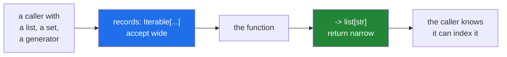

# 1.2 — The vocabulary: `list[str]`, `dict[str, int]`, `X | None`, `Any`

## One-line answer

Write `list[str]` and `int | None` with the built-in names — the `typing.List` and `Optional` spellings
are the old way — and be **loose about what you accept, precise about what you return**.

---

## The story

The grey words under each box on the form used to be one word: *weight*, *service*, *contents*.

They grew, because one word was not enough.

*Weight* became *weight in grams, whole numbers*, after somebody wrote "2.5" meaning kilograms.

*Contents* became *contents — a list, one item per line*, after a form came back with one line reading
"stuff".

And *service* became *service, or leave blank for standard* — which is the interesting one, because it is
the only box where the grey words say what **nothing at all** means. Before that line was added, a blank
service box was a question somebody had to go and ask.

None of those made the form longer in any way that mattered. Each of them removed a conversation.

---

## The idea in plain language

A bare `list` says "a list", which is barely more than nothing. `list[str]` says what is in it, and that
extra half-line is where all the value is: it lets a reader and a checker know what happens when the list
is iterated.

The vocabulary you actually need, in the modern spelling:

| Write | Means |
|---|---|
| `list[str]` | a list of strings |
| `dict[str, int]` | keys are strings, values are integers |
| `set[str]` | a set of strings |
| `tuple[int, str]` | **exactly** two items, an int then a str |
| `tuple[int, ...]` | any number of ints — the `...` is literal |
| `int \| None` | an int, or nothing ([1.3](1.3-optional-and-the-none-you-forgot.md)) |
| `int \| str` | either — worth avoiding unless the caller really can pass both |
| `Any` | give up; anything goes |
| `Callable[[int], str]` | a function taking one int, returning a str |

Two spellings exist for most of these, and you will read both.

The old way — `typing.List[str]`, `typing.Dict[str, int]`, `Optional[int]`, `Union[int, str]` — was
necessary before Python 3.9. Built-in generics landed in *PEP 585 — Type Hinting Generics In Standard
Collections* (2020, <https://peps.python.org/pep-0585/>), and the `|` union in *PEP 604 — Allow writing
union types as X | Y* (2019, <https://peps.python.org/pep-0604/>). **On Python 3.12 write the new ones.**
The old names still work and still appear everywhere in older code and tutorials.

Then the rule that decides most real annotations: **accept the widest thing you can use; return the
narrowest thing you have.**

A function that only iterates its argument should annotate `Iterable[str]`, not `list[str]` — then a
caller can pass a set, a generator ([Day 11, 2.1](../../../day-11-iterators-and-generators/parts/02-generators/2.1-yield-the-function-that-pauses.md)),
or a tuple. Annotating `list[str]` refuses all of those for no reason.

But a function that *returns* a list should say `list[str]`, not `Iterable[str]` — the caller has a list,
and telling them it might be a generator makes them defensive about something that is not true.

The abstract names come from `collections.abc`: `Iterable`, `Sequence`, `Mapping`, `Collection`,
`Callable`. `Iterable` if you loop once; `Sequence` if you index or need a length; `Mapping` if you look
things up.

**`Any` is an escape hatch and it spreads.** A value annotated `Any` silences the checker for everything
downstream of it, so one `Any` in the middle of a pipeline switches checking off for the rest. It is right
for genuinely unknown data — the result of `json.loads` — and wrong as a way of not deciding.

And **type aliases** make long annotations readable: `Manifest = list[dict[str, Any]]`, then
`def load() -> Manifest:`. It is an ordinary assignment; the name is just a name.

---

## Why Setu needs it

- **`TriageResult`'s fields are annotations** ([3.5](../03-pydantic/3.5-triage-result.md)), so this
  vocabulary is literally the schema Pydantic will generate and the model will be validated against.
- **Day 16's `write_jsonl` takes an `Iterable`, not a `list`**
  ([Day 16, 3.3](../../../day-16-files-and-context-managers/parts/03-buffering/3.3-fifty-thousand-lines.md)) —
  the accept-wide rule, and the reason a generator can be handed straight in without ever holding fifty
  thousand records.
- **Day 17's `internal_imports` returns `set[str]`**
  ([Day 17, 4.4](../../../day-17-modules-and-packages/parts/04-the-project/4.4-designing-the-public-surface.md)),
  which is the return-narrow rule: the caller gets to know it is a set and can rely on membership being
  cheap.
- **Day 18's `retry_delay` is `(Exception, *, float) -> float`**
  ([Day 18, 3.2](../../../day-18-exceptions/parts/03-your-own/3.2-an-exception-that-carries-data.md)),
  and the `Exception` there is deliberately wide because it takes anything and decides.

---

## The mechanism

One signature using most of the vocabulary at once:

```python
import inspect
from collections.abc import Iterable, Mapping
from typing import Any

Grams = int
Manifest = list[dict[str, Any]]


def summarise(
    records: Iterable[Mapping[str, Any]],
    *,
    limits: dict[str, Grams],
    tags: set[str] | None = None,
) -> tuple[int, list[str]]:
    return 0, []


print(inspect.signature(summarise))
print()
for name, hint in summarise.__annotations__.items():
    print(f"  {name:9} -> {hint}")
```

**Line by line:**

- `from collections.abc import Iterable, Mapping` — **not** `from typing import Iterable`, which is the
  deprecated location. `collections.abc` is where these live now.
- `Grams = int` — a type alias. It documents intent at no run-time cost; `Grams` **is** `int` and nothing
  checks that you did not mix them up. For a checked version you would need `NewType`, which is beyond
  today.
- `Manifest = list[dict[str, Any]]` — an alias for a long annotation, defined once and used by name. This
  is the main reason to write aliases at all.
- `records: Iterable[Mapping[str, Any]]` — **accept wide**. The function loops once and reads keys, so it
  takes anything iterable of anything mapping-like. A caller may pass a list of dicts, a generator of
  `Counter`s, or a tuple.
- `Mapping`, not `dict` — a `Mapping` is read-only in the type system, so this also documents that the
  function will not modify what it is given.
- `Any` as the value type — the honest answer for records read from JSON
  ([Day 16, 2.5](../../../day-16-files-and-context-managers/parts/02-reading-and-writing/2.5-jsonl.md)),
  where a value really can be anything.
- `limits: dict[str, Grams]` — a concrete `dict` because this one *is* a lookup table the function indexes
  into, and the alias makes it read as a domain quantity.
- `tags: set[str] | None = None` — optional, and it says so
  ([1.3](1.3-optional-and-the-none-you-forgot.md)). `None` is the default, which is the pattern that goes
  with it.
- `-> tuple[int, list[str]]` — **return narrow.** Exactly two items, of exactly these types. A caller can
  unpack it ([Day 8, 1.4](../../../day-08-containers/parts/01-sequences/1.4-unpacking-and-star-rest.md))
  knowing there are two.

Run on Python 3.12.12 on 2026-09-02:

```
(records: collections.abc.Iterable[collections.abc.Mapping[str, typing.Any]], *, limits: dict[str, int], tags: set[str] | None = None) -> tuple[int, list[str]]

  records   -> collections.abc.Iterable[collections.abc.Mapping[str, typing.Any]]
  limits    -> dict[str, int]
  tags      -> set[str] | None
  return    -> tuple[int, list[str]]
```

**`limits` prints as `dict[str, int]`.** The alias `Grams` vanished, because it was only ever another name
for `int` — which is the thing to know about aliases before you rely on one for safety.

The old spelling beside the new:

```python
from typing import Dict, List, Optional, Union

print("typing.List[str]      ==", List[str])
print("list[str]             ==", list[str])
print("Optional[int]         ==", Optional[int])
print("int | None            ==", int | None)
print("Union[int, str]       ==", Union[int, str])
print("int | str             ==", int | str)
print("same object?          ", Optional[int] == (int | None))
```

**Line by line:**

- `List[str]` and `list[str]` — both valid, and they print differently because they are different objects
  from different eras. `list[str]` is the one to write.
- `Optional[int]` and `int | None` — the same meaning. **`Optional` does not mean "this argument is
  optional"**; it means "this value may be `None`", which is a different claim
  ([1.3](1.3-optional-and-the-none-you-forgot.md)).
- `Optional[int] == (int | None)` — **`True`.** They compare equal, so this is a spelling choice rather
  than a semantic one.

```
typing.List[str]      == typing.List[str]
list[str]             == list[str]
Optional[int]         == typing.Optional[int]
int | None            == int | None
Union[int, str]       == typing.Union[int, str]
int | str             == int | str
same object?           True
```

Wide in, narrow out:



---

## When it breaks

**Annotating `list` where `Iterable` was meant, and refusing a generator:**

```text
$ uv run python -c "
def write_all(records: list[dict]) -> int:
    return sum(1 for _ in records)

rows = (r for r in [{'a': 1}, {'a': 2}])
print('a generator works at run time:', write_all(rows))
print('...but the annotation said list, so a checker rejects that call')
"
a generator works at run time: 2
...but the annotation said list, so a checker rejects that call
```

**What it means.** Nothing fails, because annotations are not enforced
([1.1](1.1-a-hint-is-a-note.md)) — and that is the problem: the code is *more* general than its signature,
so a type checker refuses a call that works. Callers then either fight the checker or wrap their generator
in `list(...)`, which materialises fifty thousand records to satisfy a comment
([Day 16, 3.3](../../../day-16-files-and-context-managers/parts/03-buffering/3.3-fifty-thousand-lines.md)).
**Annotate what you use, not what you had in mind.**

**A bare `tuple`, which says less than it looks:**

```text
$ uv run python -c "
def size() -> tuple:
    return 2000, 'grams'

w, u = size()
print(w, u)
print('the annotation allowed any tuple, of any length, of anything')
"
2000 grams
the annotation allowed any tuple, of any length, of anything
```

**What it means.** `-> tuple` permits `()`, `(1,)` and `(1, 2, 3)`, so a caller unpacking two values is
unchecked. `-> tuple[int, str]` is the claim actually being made, and it is what lets a checker catch a
three-item return added later. The same applies to bare `list` and bare `dict`: they are `Any` in a
costume.

**`Any` spreading:**

```text
$ uv run python -c "
import json
from typing import Any

def load(text: str) -> Any:
    return json.loads(text)

data = load('{\"grams\": 500}')
print(data.grams_typo_that_would_be_caught)
" 2>&1 | tail -3
AttributeError: 'dict' object has no attribute 'grams_typo_that_would_be_caught'
```

**What it means.** `-> Any` is honest about `json.loads`, and everything downstream of `data` is now
unchecked — a checker will not object to any attribute, any method, any operation. One `Any` at the top of
a pipeline switches type checking off for the rest of it. The fix is to **narrow at the boundary**: parse
into a real shape immediately, which is exactly what Pydantic is for
([3.1](../03-pydantic/3.1-the-model-that-refuses.md)).

**Mixing `X | Y` when the caller cannot really pass both:**

```python
def weigh(grams: int | str) -> int:
    return int(grams)
```

**Line by line:**

- `int | str` — accepts both, and now **every caller** has to be handled by the body and every reader has
  to wonder which is normal.
- `int(grams)` — works for both, and hides that a string is a parse and an int is a no-op.

**What it means.** A union in a signature is a promise to handle each member properly, and unions
accumulate: `int | str | float | None` is a function that has given up on having an interface. Usually the
right answer is either one type with the conversion done by the caller, or two functions with clear names.
The good uses of `|` are `X | None` and a small, closed set the domain genuinely has.

---

## In production

**The professional habit is `Iterable`/`Sequence`/`Mapping` on parameters, concrete types on returns, and
`Any` only where the data really is unknown.** That combination makes a function maximally usable and
maximally informative, and it is the single change that makes annotations feel useful rather than
bureaucratic.

**What changes at scale is that annotations become refactoring leverage.** Changing a return type from
`list[str]` to `set[str]` is a question a checker answers across forty modules in seconds — it names every
call site that indexes the result. Without annotations that is a search for `.  [0]` and hope. The
value grows superlinearly with the codebase, which is why the cost feels unjustified on day one and
obvious by month six.

**The failure that only appears with real data is the `Any` that was supposed to be temporary.** A
boundary function returns `Any` because "we do not know the shape yet", and six months later the shape is
known, forty functions consume it, and none of them is checked. The bug that surfaces is a renamed field
in an upstream payload: nothing catches it, and it fails at the deepest point of the pipeline. Narrowing
at the boundary — into a dataclass ([2.1](../02-dataclasses/2.1-what-dataclass-writes.md)) or a Pydantic
model — is the fix, and it is much cheaper to do at the start.

**The review comment a senior engineer leaves.** *"`records: list[dict]` — the body only iterates, so make
it `Iterable[Mapping[str, Any]]` and callers can pass a generator without materialising the batch. And the
return is `-> tuple`; say `tuple[int, list[str]]` so unpacking is checked."*

**The interview question.** *"How do you annotate a function that takes a collection?"* The answer is the
rule: accept the widest interface you actually use — `Iterable` if you loop, `Sequence` if you index,
`Mapping` if you look up — and return the concrete type you actually have, so the caller knows what they
can do with it. The details that place you: `list[str]` rather than `typing.List[str]` since 3.9, `X |
None` rather than `Optional[X]` since 3.10, `Optional` means "may be None" and not "may be omitted", and
`Any` disables checking for everything downstream so it belongs at a boundary you immediately narrow.

---

## Check yourself

```bash
uv run python -c "
from collections.abc import Iterable
from typing import Any

Manifest = list[dict[str, Any]]

def load(paths: Iterable[str], *, limit: int | None = None) -> Manifest:
    return []

import inspect
print(inspect.signature(load))
print('alias resolved to:', load.__annotations__['return'])
print('Optional[int] == int | None:', __import__('typing').Optional[int] == (int | None))
"
```

The alias is gone by the time it is printed. Say why that matters for `Grams = int`.

**Answer out loud, without scrolling up:**

> Give the rule for choosing between `list[str]` and `Iterable[str]` in a signature, and say which side of
> the function each one belongs on.

---

**Next:** [1.3 — `X | None`, and the `None` you forgot](1.3-optional-and-the-none-you-forgot.md).
