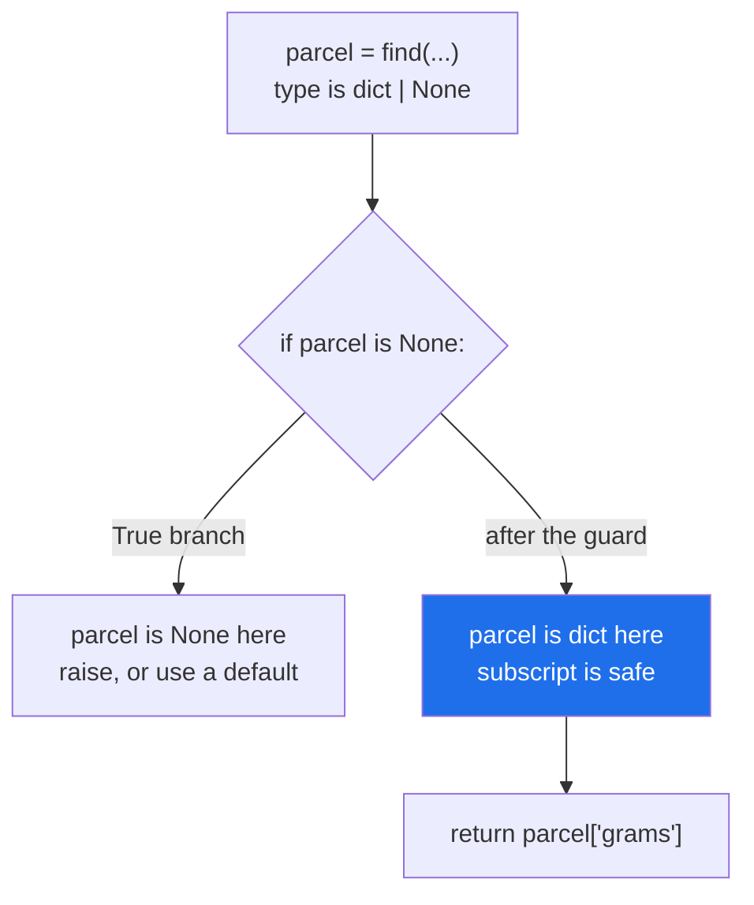

# 1.3 — `X | None`, and the `None` you forgot

## One-line answer

`X | None` says the value may be missing, and writing it is what forces every caller to decide what
missing means — which is why the honest signature is the fix for
[Day 18's](../../../day-18-exceptions/parts/04-in-anger/4.6-when-not-to-raise.md) silent `None`.

---

## The story

The service box on the form has a line under it now: *service, or leave blank for standard*.

Before that line, a blank box was a small crisis. The clerk did not know whether the customer had not
decided, had not seen the box, or had meant standard — so she asked, every time, and half the customers
were already out of the door.

The line did not change what a blank box means. Blank always meant standard; that was the rule, and the
office knew it. What the line changed is that the person filling in the form and the person reading it
later now both know it, without anybody being asked.

And it changed one more thing that nobody expected: the boxes **without** such a line started to mean
something. If the weight box has no "or leave blank" under it, a blank weight box is a mistake, and it can
be sent back rather than guessed at.

---

## The idea in plain language

`X | None` — the same thing as the older `Optional[X]` ([1.2](1.2-the-vocabulary.md)) — means "a value of
type `X`, or `None`". It is by far the most useful annotation in the language, and it is the one people
leave off.

The reason it matters is what it does to the caller. A function annotated `-> dict` promises a dictionary,
so the caller writes `result["grams"]` and moves on. A function annotated `-> dict | None` cannot be used
that way: the caller has to handle both, and a type checker will say so
([1.4](1.4-the-type-checker.md)). **The annotation is what turns "I might return nothing" from a secret
into a contract.**

That is the direct answer to
[Day 18, 4.6](../../../day-18-exceptions/parts/04-in-anger/4.6-when-not-to-raise.md)'s rule: returning
`None` for a failure is acceptable **only** when the signature says so. Without it, you have hidden a
second return type inside a function that claimed one.

Three things to get right.

**`Optional` does not mean "optional argument".** This is the single most common misreading of the word.
`Optional[int]` means "an int, or None"; whether an argument may be *omitted* is decided by having a
default. The two go together often — `tags: set[str] | None = None` — which is why they get confused, and
they are separate facts.

**Never use a mutable default to avoid `| None`.** `def add(item, basket: list = [])` is
[Day 4's](../../../day-04-objects/parts/03-identity-trap/3.1-the-mutable-default-argument.md) mutable
default argument, one of the oldest traps in the language. The correct shape is
`basket: list | None = None`, then `if basket is None: basket = []` in the body — and the annotation is
what makes that shape readable rather than mysterious.

**Narrow it once, early.** The pattern is a guard at the top:

```text
parcel = find(...)
if parcel is None:
    raise KeyError(pid)
# from here on, a checker knows parcel is a dict
```

After that `if`, a type checker treats `parcel` as a plain `dict` for the rest of the function — that is
called **narrowing**, and it is why the guard clause
([Day 5, 2.5](../../../day-05-operators-and-conditionals/parts/02-conditionals/2.5-the-conditional-expression.md))
is the idiomatic way to handle an optional rather than nesting the whole body in an `if`.

Use `is None`, not `if not value:`. An empty list, an empty string and `0` are all falsy
([Day 5, 2.2](../../../day-05-operators-and-conditionals/parts/02-conditionals/2.2-truthiness.md)), so
`if not value:` treats a legitimate empty result as missing. `is None` asks the question you meant.

---

## Why Setu needs it

- **Day 18's `ManifestError` carries `line: int | None`**
  ([Day 18, 3.4](../../../day-18-exceptions/parts/03-your-own/3.4-translate-at-the-boundary.md)) — a
  missing file has no line, a malformed record does, and the annotation is what tells a formatter to
  branch.
- **Day 17's `find_cycle` returns `list[str] | None`**
  ([Day 17, 4.4](../../../day-17-modules-and-packages/parts/04-the-project/4.4-designing-the-public-surface.md)),
  which is why its caller writes `if cycle is not None:` rather than trusting a list.
- **`TriageResult` will have optional fields** ([3.5](../03-pydantic/3.5-triage-result.md)), and in
  Pydantic the difference between "may be `None`" and "may be omitted" is enforced rather than
  documented — which is where getting the distinction right stops being pedantry.
- **Day 172's router returns `str | None` from a probe and raises from a call**
  ([Day 18, 4.6](../../../day-18-exceptions/parts/04-in-anger/4.6-when-not-to-raise.md)), and the two
  signatures are how a caller knows which is which.

---

## The mechanism

The function that lies, and the checker that catches it. First `find.py`:

```python
def find(parcels: list[dict], pid: int) -> dict | None:
    for p in parcels:
        if p["id"] == pid:
            return p
    return None


def grams_of(parcels: list[dict], pid: int) -> int:
    parcel = find(parcels, pid)
    return parcel["grams"]
```

**Line by line:**

- `-> dict | None` — **an honest signature**. `find` really can return nothing, and now it says so.
- `return None` at the end — explicit rather than falling off the end
  ([Day 18, 4.6](../../../day-18-exceptions/parts/04-in-anger/4.6-when-not-to-raise.md)). A bare fall-off
  returns `None` too; writing it means the reader can see it was intended.
- `parcel = find(parcels, pid)` — the caller. Its type is `dict | None`, and the caller has not looked.
- `return parcel["grams"]` — subscripting something that may be `None`. **At run time this works most of
  the time**, which is what makes it survive review and testing.

Run a type checker over it, on 2026-09-02 with `mypy==2.3.1`:

```text
$ uv run --with mypy==2.3.1 mypy find.py
find.py:10: error: Value of type "dict[Any, Any] | None" is not indexable  [index]
Found 1 error in 1 file (checked 1 source file)
```

**Line 10 is the subscript**, and the message names the type: `dict[Any, Any] | None`, which is not
indexable because half of it is not. Nothing was run; the file has no test data and needs none.

The fix is a guard:

```python
def find(parcels: list[dict], pid: int) -> dict | None:
    for p in parcels:
        if p["id"] == pid:
            return p
    return None


def grams_of(parcels: list[dict], pid: int) -> int:
    parcel = find(parcels, pid)
    if parcel is None:
        raise KeyError(pid)
    return parcel["grams"]
```

**Line by line:**

- `if parcel is None:` — **`is None`, not `if not parcel:`.** An empty dictionary is falsy and is a
  perfectly good parcel record; `is None` asks about the one case that means "not found"
  ([Day 4, 3.2](../../../day-04-objects/parts/03-identity-trap/3.2-is-versus-equals.md)).
- `raise KeyError(pid)` — the decision. It could equally have been a default, or `return 0`; what matters
  is that the function now *has* a decision instead of an accident
  ([Day 18, 2.2](../../../day-18-exceptions/parts/02-the-hierarchy/2.2-which-built-in-to-raise.md)).
- `return parcel["grams"]` — unchanged, and now correct: after the guard, `parcel` is narrowed to `dict`,
  so the subscript is checked and fine.

```text
$ uv run --with mypy==2.3.1 mypy find_ok.py
Success: no issues found in 1 source file
```

Two lines added, and the whole class of `NoneType` failures downstream of this function is gone.

Narrowing:



The checker follows the same reasoning a careful reader does — which is the point of writing the guard in
this shape rather than nesting.

---

## When it breaks

**The signature that hid the second return type:**

```text
$ uv run python -c "
def find(parcels: list[dict], pid: int) -> dict:
    for p in parcels:
        if p['id'] == pid:
            return p
    return None

print(find([], 1)['grams'])
" 2>&1 | tail -3
Traceback (most recent call last):
  File "<string>", line 8, in <module>
TypeError: 'NoneType' object is not subscriptable
```

**What it means.** `-> dict` and a `return None` in the same function. At run time nothing objects
([1.1](1.1-a-hint-is-a-note.md)), so the lie survives until a caller trusts it. And a type checker **does**
catch this one — the error is reported at the `return None`, not at the caller — which is one of the
clearest demonstrations that annotations pay for themselves.

**`if not value:` instead of `is None`:**

```text
$ uv run python -c "
def tags_for(pid: int) -> set[str] | None:
    return set() if pid == 1 else None

for pid in (1, 2):
    result = tags_for(pid)
    if not result:
        print(pid, '-> treated as not found')
    else:
        print(pid, '-> got', result)
"
1 -> treated as not found
2 -> treated as not found
```

**What it means.** Parcel 1 has an empty tag set, which is a real answer, and it is reported as "not
found" — identically to parcel 2, which genuinely has nothing. An empty set is falsy
([Day 5, 2.2](../../../day-05-operators-and-conditionals/parts/02-conditionals/2.2-truthiness.md)), and
`if not result:` cannot tell the two apart. **`if result is None:` distinguishes them**, and this is why
the guard is always written that way.

**A mutable default used to dodge `| None`:**

```text
$ uv run python -c "
def add(item: str, basket: list[str] = []) -> list[str]:
    basket.append(item)
    return basket

print('first  :', add('milk'))
print('second :', add('bread'))
"
first  : ['milk']
second : ['milk', 'bread']
```

**What it means.** [Day 4's](../../../day-04-objects/parts/03-identity-trap/3.1-the-mutable-default-argument.md)
trap: the default list is created once, when the function is defined, and shared by every call that omits
the argument. The annotation `list[str] = []` reads as "a fresh empty list", and it is not. The correct
form uses this part's tool: `basket: list[str] | None = None`, and `if basket is None: basket = []` in the
body.

**`Optional` read as "this argument may be omitted":**

```text
$ uv run python -c "
from typing import Optional

def post(parcel: dict, service: Optional[str]) -> str:
    return f'{parcel} via {service or \"standard\"}'

print(post({'id': 1}, None))
try:
    post({'id': 1})
except TypeError as error:
    print('but omitting it:', error)
"
{'id': 1} via standard
but omitting it: post() missing 1 required positional argument: 'service'
```

**What it means.** `Optional[str]` says the value may be `None`; it says nothing about whether the argument
may be left out, which is decided by a default. Passing `None` explicitly works; omitting it is a
`TypeError`. The two are independent, and a parameter that is optional in the everyday sense needs
**both**: `service: str | None = None`.

---

## In production

**The professional habit is that any function which can return nothing says so, and every caller narrows
with `is None` before use.** Those two things together turn a whole class of production `NoneType`
failures into a checker error at the moment the code is written. It is the highest-value annotation there
is, and it is the one most often skipped because the happy path works.

**What changes at scale is that `| None` becomes the shape of every boundary.** Lookups, caches, optional
configuration, "no rows returned", the last page of a paginated API — all of them are naturally optional,
and in a large system most functions are one hop from something optional. A codebase that annotates them
gets a checker that can trace the optionality outward and demand a decision at each hop; a codebase that
does not gets `AttributeError: 'NoneType' object has no attribute ...` in the logs, at a point several
layers away from the function that returned it.

**The failure that only appears with real data is the optional that was never `None` in testing.** A
fixture always has the row, the cache is always warm, the configuration file is always present. The
signature says `-> Config` because that is what the author ever saw, and the first empty environment —
usually the first deployment — finds the other branch. Writing `| None` costs nothing when the case never
happens and is the whole difference when it does.

**The review comment a senior engineer leaves.** *"`get_rate` is `-> float` but there is a `return None`
on the cache-miss path — make it `float | None` and let the checker find the callers. Also, line 61 uses
`if not rate:` and a rate of `0.0` is legitimate, so that should be `is None`."*

**The interview question.** *"What does `Optional[int]` mean?"* The trap is answering "the argument is
optional". It means the **value** may be `None`; whether an argument can be omitted is decided by a
default, and the two are independent — `service: str | None = None` is the shape that has both. The
follow-up worth pre-empting is how you handle one: a guard at the top with `is None` rather than
truthiness, because empty collections and zero are falsy and are usually legitimate values, and the guard
narrows the type so everything after it is checked as the plain type.

---

## Check yourself

```bash
uv run python -c "
def tags_for(pid: int) -> set[str] | None:
    return set() if pid == 1 else None

for pid in (1, 2):
    result = tags_for(pid)
    print(pid, 'truthiness says', 'missing' if not result else 'present', end=' | ')
    print('is-None says', 'missing' if result is None else 'present')
"
```

The two columns disagree on the first row. Say which one is right and why.

**Answer out loud, without scrolling up:**

> A function returns `None` on the not-found path and its signature says `-> dict`. Say what that costs
> the caller, and give the two-line change that makes a type checker enforce the handling.

---

**Next:** [1.4 — the type checker: what a hint buys you only when something reads it](1.4-the-type-checker.md).
