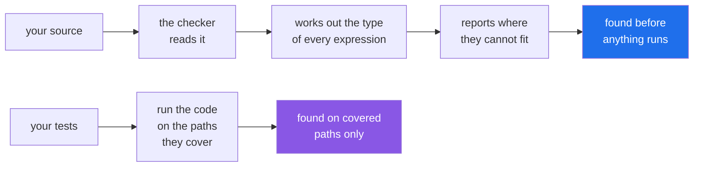

# 1.4 — The type checker: what a hint buys you only when something reads it

## One-line answer

A type checker reads your annotations **without running the program** and reports the mismatches — so a
wrong argument is found at the call site rather than three functions away, and hints stop being comments
that rot.

---

## The story

For years the forms were checked by whoever picked one up next.

Which worked, sort of. A wrong weight was found when somebody tried to price it. A missing address was
found at the sorting frame. Every mistake was found *eventually*, by somebody who was in the middle of
doing something else, several steps away from the person who made it.

Then the office got a scanner. It reads every form as it comes in and, before anything else happens, says
which boxes do not match the grey words under them.

Nothing about the forms changed. The grey words had been there all along, and every mistake the scanner
finds was findable before. What changed is **when** and **who**: it is found at the counter, in front of
the customer who can still fix it, instead of an hour later by somebody who cannot.

---

## The idea in plain language

A **type checker** is a program that reads your source, works out what type every expression has, and
reports where those types cannot fit together. It does not run your code, so it needs no data, no network
and no fixtures; it finds mistakes on code paths your tests never reach.

The two common ones are `mypy` and `pyright`. They agree on nearly everything; `pyright` is what most
editors run in the background, and `mypy` is what most projects run in CI. **Your editor is probably
already doing this** — the squiggle under a wrong argument is a type checker, and running it in a terminal
is the same thing with a report at the end.

The important behaviour to understand before you run one: **by default, it only checks what you annotate.**
An unannotated function is treated as `Any` everywhere ([1.2](1.2-the-vocabulary.md)), so its body is not
checked and calls to it are not checked. That is deliberate — it is what makes adoption possible in a
codebase that has none. You annotate a module, the checker starts checking it, and everything else is
unaffected.

Which gives the standard adoption path, and it is worth knowing because "turn it all on" fails:

1. Annotate the **signatures** of one module — its public functions.
2. Run the checker over that module and fix what it finds.
3. Widen, module by module, working from the leaves inward.
4. Turn on `--strict` for the modules that are ready, per module.

`--strict` is a bundle of stricter settings, and the two that bite are: every function must be annotated,
and calling an unannotated function from an annotated one is an error. On a fresh module it is the right
setting. On an old one it produces hundreds of findings and gets switched off.

**`# type: ignore` is the escape hatch, and it should carry the code.** `# type: ignore[arg-type]`
silences one specific finding on that line; a bare `# type: ignore` silences everything on it, including
the next mistake somebody makes there. It is the same argument as `# noqa`
([Day 2, 1.3](../../../day-02-quality-gate/parts/01-linting/1.3-fix-and-noqa-as-debt.md)): a targeted
silence is a decision, and a blanket one is debt.

**A note about this project.** The plan's Part 2 pins no type checker, so there is nothing to run here
today beyond a one-off. `uv run --with mypy==2.3.1 mypy <file>` uses an ephemeral environment and installs
nothing into the project — which is enough to see the tool work. Adding one to `pyproject.toml` and to
`./m check` would be a change to the stack and therefore a plan amendment (Principle 14), not something a
lesson decides on its own.

---

## Why Setu needs it

- **`TriageResult` is the contract reused from Day 172 to Day 240** ([3.5](../03-pydantic/3.5-triage-result.md)).
  Pydantic validates its *data* at run time; only a checker validates the *code* that builds and consumes
  it.
- **Day 18's `retry_delay(error) -> float`** is called by a retry loop that sleeps on the result
  ([Day 18, 3.2](../../../day-18-exceptions/parts/03-your-own/3.2-an-exception-that-carries-data.md)). The
  day somebody makes it return `None` on one path, a checker names every caller.
- **Day 17's layout test walks the import graph** and returns `list[str] | None`
  ([Day 17, 4.4](../../../day-17-modules-and-packages/parts/04-the-project/4.4-designing-the-public-surface.md)),
  which is precisely the shape [1.3](1.3-optional-and-the-none-you-forgot.md) says a checker enforces.
- **`./m check` is the project's gate** ([Day 2, 4.1](../../../day-02-quality-gate/parts/04-the-gate/4.1-what-m-check-actually-runs.md)),
  and knowing what a checker *would* add to it is what makes the amendment discussable rather than a
  guess.

---

## The mechanism

The file from [1.1](1.1-a-hint-is-a-note.md), where the failure appeared two functions from its cause:

```python
def weigh(grams: int) -> int:
    return grams * 2


def price(grams: int) -> float:
    return weigh(grams) / 500


print(price("heavy"))
```

**Line by line:**

- both functions annotated, so both are checked.
- `print(price("heavy"))` — the mistake, on line 9. At run time this raises inside `price`, on the
  division, with a traceback about `str` and `int` that names neither the caller nor the string.

Run a checker over it, on 2026-09-02:

```text
$ uv run --with mypy==2.3.1 mypy weigh.py
weigh.py:9: error: Argument 1 to "price" has incompatible type "str"; expected "int"  [arg-type]
Found 1 error in 1 file (checked 1 source file)
```

**Read what that gave you.** The line of the **call**, the argument position, the type that was passed,
the type that was wanted, and a code — `[arg-type]` — you can search for or silence precisely. Compare
with the run-time traceback, which pointed at a division inside a function that did nothing wrong.

Now the default-strictness behaviour, which decides how a real adoption goes:

```python
def weigh(grams):
    return grams * 2


def price(grams: int) -> float:
    return weigh(grams) / 500


price("heavy")
```

**Line by line:**

- `def weigh(grams):` — **no annotations.** The checker treats it as `Any` in and `Any` out, and does not
  look inside it.
- `def price(grams: int) -> float:` — annotated, so this one is checked.
- `weigh(grams)` inside `price` — calling an unannotated function. The result is `Any`, which the division
  then produces, which is returned from a function declared `-> float`. All of that passes by default.
- `price("heavy")` — still caught, because `price` is annotated.

```text
$ uv run --with mypy==2.3.1 mypy unannotated.py
unannotated.py:9: error: Argument 1 to "price" has incompatible type "str"; expected "int"  [arg-type]
Found 1 error in 1 file (checked 1 source file)
```

**One finding.** The unannotated function contributed nothing, and nothing complained about it — which is
what lets you add a checker to an existing codebase without a wall of noise.

The same file with `--strict`:

```text
$ uv run --with mypy==2.3.1 mypy --strict unannotated.py
unannotated.py:1: error: Function is missing a type annotation  [no-untyped-def]
unannotated.py:6: error: Returning Any from function declared to return "float"  [no-any-return]
unannotated.py:6: error: Call to untyped function "weigh" in typed context  [no-untyped-call]
unannotated.py:9: error: Argument 1 to "price" has incompatible type "str"; expected "int"  [arg-type]
Found 4 errors in 1 file (checked 1 source file)
```

**Four findings from the same nine lines**, and read the three new ones: the missing annotation, the `Any`
leaking out of a function that promised a `float`, and the untyped call from typed code. Those three are
the difference between "checking the parts that opted in" and "checking everything", and they are why
`--strict` goes on per module rather than repository-wide on day one.

What the checker sees, and when:



The two are complementary: a checker covers every path and knows nothing about behaviour; a test covers
one path and knows everything about it.

---

## When it breaks

**A bare `# type: ignore`, which silences the next mistake too:**

```text
$ uv run --with mypy==2.3.1 mypy ignored.py
Success: no issues found in 1 source file
```

Where `ignored.py` is:

```python
def weigh(grams: int) -> int:
    return grams * 2


weigh("heavy")  # type: ignore[arg-type]
weigh("heavy")  # type: ignore
```

**Line by line:**

- `# type: ignore[arg-type]` — silences **that one code** on that line. If a different kind of mistake
  appears on the same line later, it is still reported.
- `# type: ignore` — silences **everything** on that line, forever, including findings nobody has thought
  of yet.
- Both lines are wrong at run time and both are green.

**What it means.** `Success: no issues found` on a file with two genuine bugs in it. That is the correct
behaviour — you told it to be quiet — and it is why the bare form is worth banning in review. Write the
code in brackets, and where possible write a comment saying why, exactly as with `# noqa`
([Day 2, 1.3](../../../day-02-quality-gate/parts/01-linting/1.3-fix-and-noqa-as-debt.md)).

**Code that runs wrong and that a checker cannot see:**

```text
$ uv run python -c "
def weigh(grams: int) -> int:
    return grams * 2

data = {'grams': 'heavy'}
print(weigh(data['grams']))
"
heavyheavy
```

**What it means.** Here `data` is a literal, so its type is `dict[str, str]` and a checker *does* catch
this one. Change the literal to `json.loads(text)` and everything changes: the value is `Any`
([1.2](1.2-the-vocabulary.md)), so `weigh(data["grams"])` is accepted, and the wrong type sails through
into a function annotated `int`. **A checker cannot see past `Any`**, and everything arriving from outside
your program — JSON, a database driver, a web form — starts as `Any`. That is precisely the gap Pydantic
fills ([3.1](../03-pydantic/3.1-the-model-that-refuses.md)), by checking at run time at the boundary.

**A checker aimed at the wrong Python:**

```text
$ uv run --with mypy==2.3.1 mypy --python-version 3.8 probe.py
usage: mypy [-h] [-v] [-V] [more options; see below]
            [-m MODULE] [-p PACKAGE] [-c PROGRAM_TEXT] [files ...]
mypy: error: argument --python-version: Python 3.8 is not supported (must be 3.10 or higher)
```

**What it means.** A checker's findings depend on the Python version it is told to assume. Here the tool
refuses outright, because 3.8 is past its own support window — but aim it at a version it *does* support
and that is older than your syntax, and `list[str]` ([1.2](1.2-the-vocabulary.md)) and `X | None`
([1.3](1.3-optional-and-the-none-you-forgot.md)) start being reported as errors in code that runs
perfectly. If a checker objects to syntax you know is fine, the version setting is the first thing to
look at, and it is why a project pins the target in configuration rather than letting the tool guess.

**Believing the checker means the tests are unnecessary:**

```python
def price(grams: int) -> float:
    return grams * 2 / 500
```

**Line by line:**

- the annotation is right, the arithmetic is checked, and the function is entirely type-correct.
- **the formula is wrong** — it should be `grams / 500 * 2`, or the rate should be per kilogram, or
  whatever the business rule actually is.

**What it means.** A checker verifies that the *shapes* fit together. It has no opinion about whether the
answer is right, and it never will. Types and tests answer different questions
(Principle 7), and a codebase with a green checker and no tests knows that its functions can be called and
nothing about whether they work.

---

## In production

**The professional habit is that the checker runs in CI on the modules that are annotated, and the set of
annotated modules only grows.** Configuration lives in `pyproject.toml`, with a global baseline and
per-module overrides so newly written code can be `--strict` while older code is checked loosely. That
arrangement is what stops the usual failure of typing adoption: an all-or-nothing switch that produces
eight hundred findings and gets reverted.

**What changes at scale is that the checker becomes a refactoring tool rather than a bug finder.** Its
day-to-day value in a large codebase is answering "if I change this signature, what breaks" across every
module in seconds. That is a question with no other cheap answer, and it is why teams that adopt typing
rarely go back — not because it catches many bugs, but because it makes changes surveyable.

**The failure that only appears with real data is everything arriving as `Any`.** A checker is completely
confident about code that reads a JSON payload, because `json.loads` returns `Any` and `Any` is compatible
with everything. Every field rename, every string-where-a-number-was-expected, every missing key is
invisible. The only fix is to narrow at the boundary — parse into a dataclass or a Pydantic model
immediately — which is the argument the next two sections make.

**The review comment a senior engineer leaves.** *"Three `# type: ignore` with no code in this file. Add
the specific codes so a future mistake on those lines is still reported, and put a comment on the one at
line 40 saying it is waiting on the upstream stubs."*

**The interview question.** *"Do you use type checking, and what does it actually catch?"* The answer
worth giving is specific: it catches wrong arguments at the **call site** rather than several frames away,
and unhandled `None` — which is the biggest single category — and it does it on paths tests do not cover,
without running anything. Then the limits, which is what shows judgement: it cannot see past `Any`, so
data from outside the program is unchecked until you narrow it; it says nothing about whether the logic is
right; and adoption is per module, because default strictness deliberately ignores unannotated code.

---

## Check yourself

```bash
cd "$(mktemp -d)" && cat > probe.py <<'EOF'
def weigh(grams: int) -> int:
    return grams * 2

def find(rows: list[dict], pid: int) -> dict | None:
    return None

weigh("heavy")
print(find([], 1)["grams"])
EOF
uv run --with mypy==2.3.1 mypy probe.py
```

```
probe.py:7: error: Argument 1 to "weigh" has incompatible type "str"; expected "int"  [arg-type]
probe.py:8: error: Value of type "dict[Any, Any] | None" is not indexable  [index]
Found 2 errors in 1 file (checked 1 source file)
```

Two findings, both before anything ran. Now add `# type: ignore[arg-type]` to the `weigh` line and see
which one survives.

**Answer out loud, without scrolling up:**

> Name two things a type checker finds that a test suite would not, and one thing it cannot see at all.

---

**Next:** [2.1 — `@dataclass`: the `__init__`, `__repr__` and `__eq__` you stop writing](../02-dataclasses/2.1-what-dataclass-writes.md).
