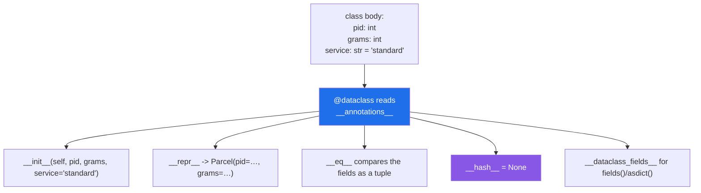

# 2.1 — `@dataclass`: the `__init__`, `__repr__` and `__eq__` you stop writing

## One-line answer

`@dataclass` reads the annotations in a class body and **generates** `__init__`, `__repr__` and `__eq__`
from them — so a record class is its field list and nothing else.

---

## The story

The counter's forms used to be typed up one at a time.

Somebody would rule the boxes, write the headings, get the spacing wrong, and end up with three versions
in circulation that were nearly but not quite the same — one had the service box before the weight box,
one had no box for a phone number, and the third had *contents* spelt two ways.

Then the office bought a template. You give it the list of headings, in order, and it prints the form:
boxes ruled, spacing even, every copy identical.

The interesting part is what stopped happening. Nobody argues about the layout any more, because nobody
lays it out. The only thing anybody writes down is the list of headings — which is the only thing that was
ever really a decision.

---

## The idea in plain language

Day 12 built a class the long way
([Day 12, 1.2](../../../day-12-classes/parts/01-the-blank-form/1.2-init-and-self.md)): `__init__` with a
parameter per field and an assignment per parameter. Day 15 added `__repr__` and `__eq__`
([Day 15, 3.2](../../../day-15-constructors-and-dunders/parts/03-the-dunders/3.2-repr-and-str.md),
[Day 15, 3.3](../../../day-15-constructors-and-dunders/parts/03-the-dunders/3.3-eq-and-the-duplicate.md)).
For a class that is *only* a record — a set of named values — that is about twenty lines of code where
three are decisions and seventeen are typing.

`@dataclass` writes the seventeen. You list the fields with annotations, and the decorator
([Day 14, 1.4](../../../day-14-decorators/parts/01-functions-as-values/1.4-the-at-sign-is-two-lines.md))
generates:

- **`__init__`** — one parameter per field, in order, with your defaults.
- **`__repr__`** — `Parcel(pid=7741, grams=500, service='standard')`, which is what you would have written.
- **`__eq__`** — compares the fields as a tuple, so two parcels with the same values are equal.

It reads the **annotations** to know what the fields are — which is [1.1](../01-type-hints/1.1-a-hint-is-a-note.md)'s
"something reads them", arriving for the first time. A line in the class body with no annotation is not a
field; it is an ordinary class attribute
([Day 12, 1.4](../../../day-12-classes/parts/01-the-blank-form/1.4-instance-and-class-attributes.md)),
and that distinction catches people.

Three things it also gives you, all in `dataclasses`:

- **`fields(obj)`** — the field definitions, so code can iterate them
- **`asdict(obj)`** — a dictionary, recursively
- **`astuple(obj)`** — a tuple, recursively

And one thing it deliberately does **not** do: check the types. A `@dataclass` with `grams: int` accepts
`"heavy"` without complaint, because annotations are inert
([1.1](../01-type-hints/1.1-a-hint-is-a-note.md)) and the decorator only reads them to find the field
names. That is [2.5](2.5-not-a-validator.md), and it is the reason Pydantic exists.

**When to reach for it.** Any class whose job is to hold named values: a configuration record, a parsed
row, a result. When the class has real behaviour — methods that do things, invariants to maintain — a
plain class is often clearer, and the question
[Day 12, 3.4](../../../day-12-classes/parts/03-the-paper-object/3.4-when-not-to-write-a-class.md) asked
still applies.

One default worth knowing now: a dataclass is **mutable and unhashable**. `__eq__` is generated, and a
class that defines `__eq__` loses the inherited `__hash__`
([Day 15, 3.4](../../../day-15-constructors-and-dunders/parts/03-the-dunders/3.4-hash-and-the-broken-set.md)),
so instances cannot go in a set or be dictionary keys. `frozen=True` changes both
([2.3](2.3-frozen-slots-kw-only.md)).

---

## Why Setu needs it

- **`TriageResult` is the plan's named example** ([3.5](../03-pydantic/3.5-triage-result.md)), and a
  Pydantic model is a dataclass-shaped thing that also validates — so this is the shape underneath it.
- **Day 12's `Paper` was written the long way on purpose** (Principle 2: from scratch before library), and
  today is when the library version arrives and the twenty lines become five.
- **Day 18's exception classes are records with behaviour**
  ([Day 18, 3.2](../../../day-18-exceptions/parts/03-your-own/3.2-an-exception-that-carries-data.md)) —
  and they are a good example of where a dataclass is *not* the answer, because an exception's
  `__init__` has to talk to `Exception`.
- **Every configuration object from Phase 12 onward** — model settings, split parameters, eval thresholds —
  is a frozen dataclass, because a `random_state` that can be changed after the fact is a reproducibility
  bug (Principle 4).

---

## The mechanism

Five lines, and what they produce:

```python
from dataclasses import asdict, astuple, dataclass, fields


@dataclass
class Parcel:
    pid: int
    grams: int
    service: str = "standard"


a = Parcel(7741, 500)
b = Parcel(7741, 500)
print("repr    :", a)
print("equal?  :", a == b)
print("fields  :", [f.name for f in fields(a)])
print("asdict  :", asdict(a))
print("astuple :", astuple(a))
a.grams = 900
print("mutable :", a.grams)
try:
    hash(a)
    print("hashable: yes")
except TypeError as error:
    print("hashable: no -", error)
```

**Line by line:**

- `@dataclass` — the decorator, applied to the class. It runs when the class is defined
  ([Day 17, 1.1](../../../day-17-modules-and-packages/parts/01-the-module/1.1-a-module-is-a-file-that-has-already-run.md))
  and adds the generated methods to it.
- `pid: int` — **an annotation with no value.** That is what makes it a field. Written as `pid = 0` with no
  annotation it would be an ordinary class attribute and no field at all.
- `service: str = "standard"` — a field with a default. Defaults must come after non-defaults, exactly as
  in a function signature
  ([Day 10, 1.3](../../../day-10-functions/parts/01-the-signature/1.3-defaults-and-when-they-run.md)),
  because that is what `__init__` becomes.
- `Parcel(7741, 500)` — positional, in field order, with `service` defaulted. No `__init__` was written.
- `a == b` — **`True`**, comparing two different objects. The generated `__eq__` compares the fields as a
  tuple, which is what you want for a record and is not the default for a plain class
  ([Day 12, 2.4](../../../day-12-classes/parts/02-attribute-lookup/2.4-your-object-and-equality.md)).
- `fields(a)` — the field definitions, each with a `.name`, `.type` and `.default`. This is how library
  code introspects a dataclass.
- `asdict(a)` and `astuple(a)` — conversions, **recursive**: a dataclass containing dataclasses becomes
  nested dictionaries.
- `a.grams = 900` — mutable by default.
- `hash(a)` — **fails**, because generating `__eq__` sets `__hash__` to `None`
  ([Day 15, 3.4](../../../day-15-constructors-and-dunders/parts/03-the-dunders/3.4-hash-and-the-broken-set.md)).

Run on Python 3.12.12 on 2026-09-02:

```
repr    : Parcel(pid=7741, grams=500, service='standard')
equal?  : True
fields  : ['pid', 'grams', 'service']
asdict  : {'pid': 7741, 'grams': 500, 'service': 'standard'}
astuple : (7741, 500, 'standard')
mutable : 900
hashable: no - unhashable type: 'Parcel'
```

What was actually generated:

```python
from dataclasses import dataclass
import inspect


@dataclass
class Parcel:
    pid: int
    grams: int
    service: str = "standard"


generated = [
    n
    for n in vars(Parcel)
    if n.startswith("__")
    and n
    not in ("__module__", "__qualname__", "__doc__", "__dict__", "__weakref__", "__annotations__")
]
print(generated)
print("__init__ signature:", inspect.signature(Parcel.__init__))
```

**Line by line:**

- `vars(Parcel)` — the class's own namespace
  ([Day 12, 2.1](../../../day-12-classes/parts/02-attribute-lookup/2.1-the-instance-dict.md)), which now
  contains methods nobody typed.
- the exclusion list — the dunders every class has, filtered out so only the added ones show.
- `inspect.signature(Parcel.__init__)` — the generated constructor, printed. **Compare it with the field
  list**: same names, same order, same defaults, same annotations.

```
['__dataclass_params__', '__dataclass_fields__', '__init__', '__repr__', '__eq__', '__hash__', '__match_args__']
__init__ signature: (self, pid: int, grams: int, service: str = 'standard') -> None
```

`__hash__` is in the list because it was explicitly set to `None`. `__match_args__` is for structural
pattern matching, which a dataclass supports for free.

What the decorator does:



---

## When it breaks

**A field with no annotation, which is not a field:**

```text
$ uv run python -c "
from dataclasses import dataclass, fields

@dataclass
class Parcel:
    pid: int
    service = 'standard'

print('fields   :', [f.name for f in fields(Parcel)])
print('signature:', __import__('inspect').signature(Parcel.__init__))
print('but      :', Parcel(1).service)
"
fields   : ['pid']
signature: (self, pid: int) -> None
but      : standard
```

**What it means.** `service = 'standard'` has no annotation, so `@dataclass` did not see it: it is an
ordinary class attribute shared by every instance
([Day 12, 1.5](../../../day-12-classes/parts/01-the-blank-form/1.5-the-shared-class-attribute.md)). It is
not in `__init__`, not in `__repr__`, not in `__eq__`, and not in `asdict`. **The colon is the whole
difference**, and a missing one produces a class that mostly works.

**A default before a non-default:**

```text
$ uv run python -c "
from dataclasses import dataclass

@dataclass
class Parcel:
    service: str = 'standard'
    grams: int
" 2>&1 | tail -2
    raise TypeError(f'non-default argument {f.name!r} '
TypeError: non-default argument 'grams' follows default argument
```

**What it means.** The generated `__init__` would be `(self, service='standard', grams)`, which is not a
valid signature ([Day 10, 1.3](../../../day-10-functions/parts/01-the-signature/1.3-defaults-and-when-they-run.md)).
The error arrives **when the class is defined**, which is at import
([Day 17, 1.1](../../../day-17-modules-and-packages/parts/01-the-module/1.1-a-module-is-a-file-that-has-already-run.md)),
so it cannot be missed. Reorder the fields, or use `kw_only=True`
([2.3](2.3-frozen-slots-kw-only.md)), which removes the restriction entirely.

**Putting one in a set:**

```text
$ uv run python -c "
from dataclasses import dataclass

@dataclass
class Parcel:
    pid: int

print({Parcel(1), Parcel(2)})
" 2>&1 | tail -2
TypeError: unhashable type: 'Parcel'
```

**What it means.** [Day 15, 3.4](../../../day-15-constructors-and-dunders/parts/03-the-dunders/3.4-hash-and-the-broken-set.md)'s
rule, applied automatically: an object with a generated `__eq__` and no `__hash__` cannot be a set member
or a dictionary key, because a mutable thing whose equality depends on its fields would break the hash
table the moment somebody changed one. `frozen=True` makes it hashable and is the right fix
([2.3](2.3-frozen-slots-kw-only.md)).

**Using one where behaviour belonged:**

```python
@dataclass
class Router:
    providers: list[str]
    timeout: float
    session: object
    _cache: dict
    _lock: object
```

**Line by line:**

- five fields, two of them private-by-convention
  ([Day 13, 3.1](../../../day-13-inheritance-and-abstraction/parts/03-encapsulation/3.1-public-protected-private.md)),
  one of them a lock.
- the generated `__init__` now takes all five, including the ones no caller should supply.
- the generated `__eq__` compares them, so two routers are "equal" if their caches happen to match.
- the generated `__repr__` prints a session object and a lock into every log line.

**What it means.** `@dataclass` is for records, and this is a service. Every generated method is wrong for
it: nobody wants to construct a router by passing a lock, nobody wants to compare two of them, and nobody
wants the cache in the `repr`. A plain class with a hand-written `__init__` says what it means. **The test
is whether comparing two instances by their fields makes sense** — if not, it is not a record.

---

## In production

**The professional habit is that every plain record in a codebase is a dataclass, and the field list is
the only thing anybody reads.** It removes the class of bug where a hand-written `__repr__` drifts from the
fields, or `__eq__` forgets one, and it makes a new field a one-line change instead of a four-place one.
For records that cross a boundary — read from JSON, from a form, from an API — a Pydantic model
([3.1](../03-pydantic/3.1-the-model-that-refuses.md)) is the same shape with validation added.

**What changes at scale is that `fields()` and `asdict()` turn records into data other code can process.**
Serialising to JSON, building a form, generating a schema, diffing two configurations, logging a
structured event — all of them can be written once against `fields()` and work for every dataclass in the
codebase. That is what makes the annotation-driven approach pay off beyond saving typing.

**The failure that only appears with real data is the `repr` that leaks.** A dataclass's generated
`__repr__` prints **every** field, so the moment somebody adds an `api_key` or a `password` to a config
record, every log line and every traceback that touches it contains the secret
([Day 18, 3.3](../../../day-18-exceptions/parts/03-your-own/3.3-the-message-is-an-interface.md), Principle
11). The fix is `field(repr=False)` on that field, and the habit is to think about it when a sensitive
field is added rather than after.

**The review comment a senior engineer leaves.** *"This is a dataclass with a connection pool and a lock in
it, so `__eq__` compares locks and `__repr__` prints the pool. Make it a plain class — the generated
methods are all wrong here. And on `Settings`, put `field(repr=False)` on `api_key` before it ends up in a
traceback."*

**The interview question.** *"What does `@dataclass` give you?"* `__init__`, `__repr__` and `__eq__`
generated from the annotated fields, plus `fields`, `asdict` and `astuple`. The details that show use
rather than reading: only **annotated** names are fields, so a missing colon silently produces a class
attribute instead; the generated `__eq__` sets `__hash__` to `None`, so instances cannot go in a set until
you use `frozen=True`; and it does **not** validate types, which is the line between it and Pydantic.

---

## Check yourself

```bash
uv run python -c "
from dataclasses import asdict, dataclass, fields

@dataclass
class Parcel:
    pid: int
    grams: int
    service = 'standard'

p = Parcel(7741, 500)
print('repr   :', p)
print('fields :', [f.name for f in fields(p)])
print('asdict :', asdict(p))
print('service:', p.service, '<- present, but not a field')
"
```

Three fields were written and two exist. Find the character that made the difference.

**Answer out loud, without scrolling up:**

> Name the three methods `@dataclass` generates, say what it reads to decide the field list, and say why
> an instance cannot go into a set.

---

**Next:** [2.2 — `field(default_factory=...)`, and the mutable default again](2.2-default-factory.md).
