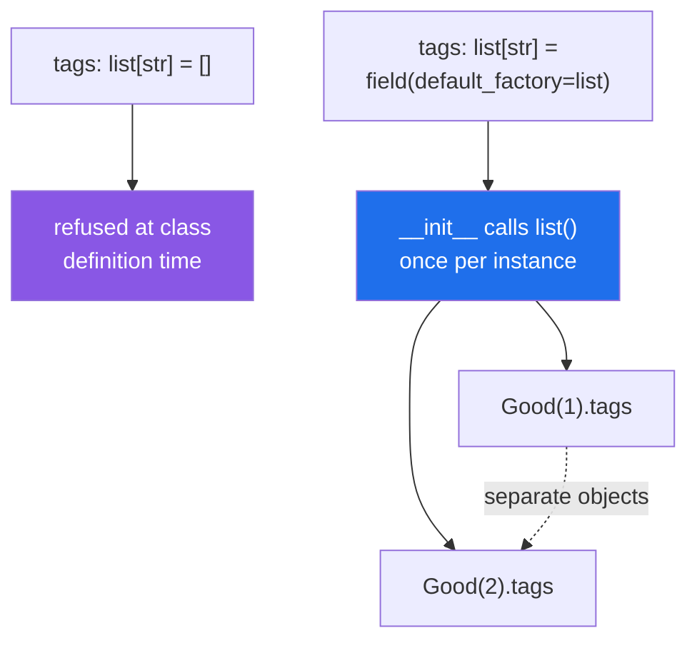

# 2.2 — `field(default_factory=...)`: the mutable default, caught this time

## One-line answer

A dataclass **refuses** a mutable default outright — `tags: list[str] = []` raises when the class is
defined — and `field(default_factory=list)` is how you say "a new empty one per instance".

---

## The story

The template prints a fresh form every time. That is the whole point of a template.

Except for one heading, where somebody set it up wrong: the *contents* box was given a starting value, and
the way the template was configured, it is not a starting value on each form — it is **one shared box**
that every form points at.

So the first customer writes "books" in it, and the next customer's form arrives with "books" already
printed. And when they add "shoes", the first customer's copy in the file now says "books, shoes".

Nobody could see it on any single form. Each one looked fine. It was only when two of them were laid side
by side that the shared box became visible.

The template supplier's newer version does not allow it: if you try to give a box a starting value that
can be written in, it refuses to build the template at all and tells you to supply a rule for making a
fresh one instead.

---

## The idea in plain language

[Day 4, 3.1](../../../day-04-objects/parts/03-identity-trap/3.1-the-mutable-default-argument.md) is the
mutable default argument: `def add(item, basket=[])` creates one list, when the function is defined, and
every call that omits the argument shares it.

A dataclass field with a default has the same problem, because the default becomes the parameter default
in the generated `__init__` ([2.1](2.1-what-dataclass-writes.md)). But dataclasses do something the
language does not: **they refuse.**

```text
tags: list[str] = []
```

raises `ValueError` at class definition time, with a message that names the fix. That is unusually kind —
it is the one place in Python where this mistake is caught for you rather than discovered.

The fix is `field(default_factory=...)`:

```text
tags: list[str] = field(default_factory=list)
```

`default_factory` takes a **callable**, and the generated `__init__` calls it once per instance. `list`,
`dict`, `set` are the common ones; a `lambda` or a function works for anything else —
`field(default_factory=lambda: {"standard": 2000})`.

Note it is `list`, not `list()`. You are passing the function, not the result of calling it
([Day 14, 1.1](../../../day-14-decorators/parts/01-functions-as-values/1.1-a-function-is-a-value.md)) —
which is the same distinction as `key=str.lower` versus `key=str.lower()`
([Day 8, 1.5](../../../day-08-containers/parts/01-sequences/1.5-sort-sorted-and-key.md)).

The refusal is decided by whether the default is **hashable**, which is a good approximation of "can this
be changed in place" ([Day 4, 2.5](../../../day-04-objects/parts/02-containers/2.5-hashability.md)).
Immutable defaults are fine and need no factory: `grams: int = 0`, `service: str = "standard"`,
`tags: tuple[str, ...] = ()`. A tuple as a default is a genuinely useful trick when the field never needs
to be modified.

`field()` does several other things worth knowing now, because they all sit in the same call:

| `field(...)` | Does |
|---|---|
| `default_factory=list` | a new one per instance |
| `default=0` | the same as writing `= 0`, and needed when combining with other options |
| `repr=False` | keep this field out of `__repr__` — the fix for a secret in a log |
| `compare=False` | exclude it from `__eq__` |
| `init=False` | not a constructor parameter; set it in `__post_init__` ([2.4](2.4-post-init.md)) |
| `metadata={...}` | arbitrary information for other tools to read |

`repr=False` is the one to remember. A dataclass prints every field
([2.1](2.1-what-dataclass-writes.md)), so an `api_key` field is in every traceback until somebody says
otherwise (Principle 11).

---

## Why Setu needs it

- **Every configuration record in this project has a list or dict field** — providers to try, thresholds
  per metric, tags — and every one of them needs a factory.
- **`TriageResult` will have a list of labels** ([3.5](../03-pydantic/3.5-triage-result.md)); Pydantic
  handles the same problem with the same `default_factory` keyword, so learning it here transfers exactly.
- **Day 3's `REQUIRED` is a tuple, not a list**
  ([Day 3, 1.2](../../../day-03-keys-and-budget/parts/01-secrets/1.2-dotenv-and-os-environ.md)) — the
  immutable-default trick, chosen before this part explained why it works.
- **Principle 11 is blast radius**, and `repr=False` on a credential field is one of the cheapest
  applications of it there is.

---

## The mechanism

The refusal, and then the fix:

```python
from dataclasses import dataclass, field

try:

    @dataclass
    class Bad:
        pid: int
        tags: list[str] = []

except ValueError as error:
    print("the class body itself raises:", error)


@dataclass
class Good:
    pid: int
    tags: list[str] = field(default_factory=list)


a, b = Good(1), Good(2)
a.tags.append("fragile")
print("a.tags:", a.tags, "| b.tags:", b.tags, "<- separate lists")
```

**Line by line:**

- `try:` around a **class definition** — unusual, and necessary here because the failure happens when the
  decorator runs, which is when the class statement executes
  ([Day 12, 1.1](../../../day-12-classes/parts/01-the-blank-form/1.1-a-class-is-a-blank-form.md)), not
  when anything is constructed.
- `tags: list[str] = []` — the mistake. A list literal as a default.
- `except ValueError as error:` — catching it so the rest of the file runs. In real code you would never
  see this; you would see an import fail.
- `field(default_factory=list)` — the fix. **`list`, not `list()`**: a callable is stored and called once
  per instance.
- `a, b = Good(1), Good(2)` — two instances, each getting its own `[]`.
- `a.tags.append("fragile")` — mutating one. The next line is the proof that it did not reach the other.

Run on Python 3.12.12 on 2026-09-02:

```
the class body itself raises: mutable default <class 'list'> for field tags is not allowed: use default_factory
a.tags: ['fragile'] | b.tags: [] <- separate lists
```

**Read the error message.** It names the type, the field, and the fix. Compare with the plain-function
version of this mistake ([Day 4, 3.1](../../../day-04-objects/parts/03-identity-trap/3.1-the-mutable-default-argument.md)),
which has no error at all — it simply behaves strangely for the rest of the program's life.

`field()`'s other options, on one class:

```python
from dataclasses import dataclass, field


@dataclass
class Settings:
    provider: str
    api_key: str = field(repr=False)
    retries: int = 3
    models: dict[str, str] = field(default_factory=dict)
    loaded_at: float = field(default=0.0, compare=False)


s = Settings("groq", "sk-live-abc123")
print("repr        :", s)
print("the key is  :", s.api_key, "<- present, just not printed")
print("equal?      :", s == Settings("groq", "sk-live-abc123", loaded_at=999.0))
```

**Line by line:**

- `api_key: str = field(repr=False)` — **`field()` with no default**, which is legal: it configures the
  field without giving it a value, so `api_key` is still a required constructor argument.
- `repr=False` — the field is excluded from `__repr__`. This is the line that keeps a credential out of
  every log and traceback (Principle 11,
  [Day 18, 3.3](../../../day-18-exceptions/parts/03-your-own/3.3-the-message-is-an-interface.md)).
- `models: dict[str, str] = field(default_factory=dict)` — a per-instance dictionary.
- `loaded_at: float = field(default=0.0, compare=False)` — **`default=`, not a bare `= 0.0`**, because it
  is being combined with another option. `compare=False` keeps it out of `__eq__`, which is what you want
  for a timestamp: two settings objects loaded at different moments are the same settings.
- the last print — two objects with different `loaded_at`, compared **equal**.

```
repr        : Settings(provider='groq', retries=3, models={}, loaded_at=0.0)
the key is  : sk-live-abc123 <- present, just not printed
equal?      : True
```

**`api_key` is missing from the `repr` and `loaded_at` is still in it** — `compare=False` affects `__eq__`
only, and the two options are independent. The equality line is the one to read twice: two `Settings` with
different `loaded_at` values compare equal, which is what `compare=False` bought.

One default, or one per instance:



---

## When it breaks

**`default_factory=list()` instead of `default_factory=list`:**

```text
$ uv run python -c "
from dataclasses import dataclass, field

@dataclass
class Parcel:
    tags: list[str] = field(default_factory=list())

Parcel()
" 2>&1 | tail -2
  File "<string>", line 3, in __init__
TypeError: 'list' object is not callable
```

**What it means.** `list()` is an empty list; `default_factory` needs something it can **call**. The error
arrives at construction rather than at class definition, which makes it slightly later than the mutable
default's, and the message is exact: the thing you gave is not callable. The same slip appears as
`default_factory=[]`, with the same result.

**A shared default that is not a literal:**

```text
$ uv run python -c "
from dataclasses import dataclass, field

DEFAULT_TAGS = []

@dataclass
class Parcel:
    pid: int
    tags: list[str] = field(default_factory=lambda: DEFAULT_TAGS)

a, b = Parcel(1), Parcel(2)
a.tags.append('fragile')
print('a:', a.tags, '| b:', b.tags)
"
a: ['fragile'] | b: ['fragile']
```

**What it means.** The factory is called per instance, correctly — and it returns **the same list every
time**, because the lambda closes over one module-level object
([Day 10, 2.4](../../../day-10-functions/parts/02-scope/2.4-closures-and-late-binding.md)). Every
protection in this part is defeated, and no error appears anywhere. The lambda has to *build* something:
`lambda: list(DEFAULT_TAGS)`, or better, make `DEFAULT_TAGS` a tuple so it cannot be shared by accident.

**A default that is mutable and hashable:**

```text
$ uv run python -c "
from dataclasses import dataclass

class Box:
    def __init__(self):
        self.items = []

@dataclass
class Parcel:
    pid: int
    box: Box = Box()

a, b = Parcel(1), Parcel(2)
a.box.items.append('milk')
print('a.box.items:', a.box.items, '| b.box.items:', b.box.items)
print('same object:', a.box is b.box)
"
a.box.items: ['milk'] | b.box.items: ['milk']
same object: True
```

**What it means.** `Box()` is hashable — an ordinary object is, by identity
([Day 4, 2.5](../../../day-04-objects/parts/02-containers/2.5-hashability.md)) — so the dataclass does not
refuse it, and one `Box` is shared by every instance. **The protection only covers the obvious cases:**
`list`, `dict`, `set`. Any object of your own with mutable state slips through, and the symptom is the
story's shared box exactly. The rule to carry: `default_factory` for **anything** that is not a number, a
string, a boolean, `None`, or a tuple of those.

**A secret in the `repr`, found in a log:**

```text
$ uv run python -c "
from dataclasses import dataclass

@dataclass
class Settings:
    provider: str
    api_key: str

s = Settings('groq', 'sk-live-abc123')
try:
    raise RuntimeError(f'could not connect with {s}')
except RuntimeError as error:
    print('[log]', error)
"
[log] could not connect with Settings(provider='groq', api_key='sk-live-abc123')
```

**What it means.** Nobody put the key in the message; they interpolated the settings object, and the
generated `__repr__` printed every field
([Day 18, 3.3](../../../day-18-exceptions/parts/03-your-own/3.3-the-message-is-an-interface.md)). The key
is now in the log, the error tracker and the ticket, and rotating it is the only fix (Principle 11).
`field(repr=False)` is one word, and the moment to add it is when the field is added.

---

## In production

**The professional habit is `default_factory` for every non-scalar default, and `repr=False` on every
credential the moment it is written.** Both are one-word decisions made at the field, and both prevent a
class of failure that is otherwise found by accident, months later, in a log or in a bug report about
data appearing where it should not.

**What changes at scale is that shared mutable state becomes cross-request contamination.** One shared
list on a dataclass default, in a web process handling thousands of requests, accumulates every request's
data — so it grows without bound *and* leaks one user's values into another's response. It is the same
mechanism as [Day 17's](../../../day-17-modules-and-packages/parts/01-the-module/1.3-sys-modules.md)
module-level state, arriving through a different door, and it is one of the classic sources of
"user A saw user B's data" incidents.

**The failure that only appears with real data is the mutable default that is only mutated on one path.**
A `tags` list that is read on every request and appended to only when a parcel is flagged looks perfectly
correct for months, because the append path is rare. When it does fire, every subsequent request sees the
flag. Tests that construct one object never see it; only a test that constructs two and mutates one does,
which is why that is exactly the test to write.

**The review comment a senior engineer leaves.** *"`field(default_factory=lambda: DEFAULT_CONFIG)` returns
the same dict to every instance — the factory has to build a new one, so `lambda: dict(DEFAULT_CONFIG)`,
or make `DEFAULT_CONFIG` immutable. And `token` needs `repr=False`; it is in the traceback from the
integration test right now."*

**The interview question.** *"What is `default_factory` for?"* For a mutable default: the callable is
invoked once per instance, so each object gets its own list rather than all of them sharing one — the
dataclass equivalent of the mutable default argument, except dataclasses **refuse** the literal form at
class definition time instead of letting it through. The detail that shows you have been caught by it: the
refusal only covers unhashable defaults, so an instance of your own class is accepted and shared, and a
factory that returns a module-level object is shared too.

---

## Check yourself

```bash
uv run python -c "
from dataclasses import dataclass, field

@dataclass
class Parcel:
    pid: int
    tags: list[str] = field(default_factory=list)
    api_key: str = field(default='', repr=False)

a, b = Parcel(1), Parcel(2)
a.tags.append('fragile')
print('a:', a, '->', a.tags)
print('b:', b, '->', b.tags)
print('key is set but unprinted:', repr(Parcel(3, api_key='sk-x').api_key))
"
```

Two separate lists, and a field that exists without appearing. Now change `field(default_factory=list)` to
`= []` and read the error.

**Answer out loud, without scrolling up:**

> Say what `field(default_factory=list)` does that `= []` cannot, and name the two kinds of mutable
> default the dataclass will happily accept anyway.

---

**Next:** [2.3 — `frozen`, `slots`, `kw_only`: the three flags worth knowing](2.3-frozen-slots-kw-only.md).
