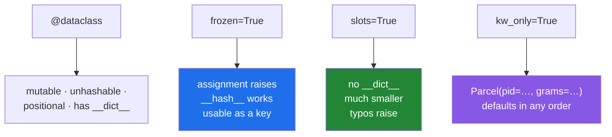

# 2.3 — `frozen`, `slots`, `kw_only`: the three flags worth knowing

## One-line answer

`frozen=True` makes the record unchangeable and hashable, `slots=True` makes it much smaller and catches
attribute typos, and `kw_only=True` makes every field a keyword argument — three words, three real
changes.

---

## The story

The template has three settings on the back, and the office turned all three on within a year.

**Ink, not pencil.** Once a form is filled in, it is filled in. If something is wrong you write a new
form, and the old one stays in the file exactly as it was — which is what made it possible to answer
"what did we agree on the fourteenth" for the first time.

**No margins.** The old forms had a wide margin where people wrote extra things, and every one of those
notes was a small private convention nobody else knew. The new template goes edge to edge. If a thing is
worth writing down it gets a box, and if it does not have a box it does not go on the form.

**Headings on every box, filled in by name.** Before, you could hand over a form with values in the boxes
and no labels, and it was fine as long as everybody remembered the order. Then somebody swapped the weight
and price columns in the layout, and three hundred forms were quietly wrong. Now you write *weight: 500*,
and the order stops mattering.

---

## The idea in plain language

`@dataclass` takes keyword arguments. Three of them change the class in ways worth understanding.

**`frozen=True` — the record cannot be changed after construction.**

Assigning to a field raises `FrozenInstanceError`. In exchange, the class gets a real `__hash__` — so
instances can go into a set or be dictionary keys, which a plain dataclass cannot
([2.1](2.1-what-dataclass-writes.md),
[Day 15, 3.4](../../../day-15-constructors-and-dunders/parts/03-the-dunders/3.4-hash-and-the-broken-set.md)).
That trade is not a coincidence: a hash is only safe if the values it is computed from cannot change.

It is a **shallow** freeze. A frozen dataclass holding a list still lets you append to that list; what is
frozen is the binding, not the object. For a genuinely immutable record, the fields have to be immutable
types too — `tuple` rather than `list`.

**`slots=True` — the instance has no `__dict__`.**

[Day 12, 2.3](../../../day-12-classes/parts/02-attribute-lookup/2.3-slots-and-a-million-objects.md)
introduced `__slots__` by hand; this is the same thing generated for you from the field list. Two
consequences: instances are **much** smaller, and an attribute that is not a field raises `AttributeError`
instead of silently creating a new one
([Day 12, 2.2](../../../day-12-classes/parts/02-attribute-lookup/2.2-setting-attributes-from-outside.md)).

That second one is the reason to use it even when memory is not a concern: `parcel.gram = 500` is a typo
that a slotted class refuses and an ordinary class accepts.

**`kw_only=True` — every field becomes keyword-only.**

`Parcel(7741, 500)` becomes a `TypeError`; `Parcel(pid=7741, grams=500)` is the only form
([Day 10, 1.5](../../../day-10-functions/parts/01-the-signature/1.5-keyword-only-and-positional-only.md)).
Two things follow: call sites say what they mean, and the defaults-must-come-last rule disappears, because
keyword arguments have no order.

That second effect is the practical reason people reach for it — a record with a default in the middle of
its field list is otherwise impossible to write without reordering
([2.1](2.1-what-dataclass-writes.md)).

**When to use which.** `frozen=True` for anything that is a value rather than a thing: configuration,
parameters, results, cache keys. `slots=True` for anything you will have a lot of, and for the typo
protection. `kw_only=True` for records with more than about three fields, where positional arguments stop
being readable. They combine: `@dataclass(frozen=True, slots=True, kw_only=True)` is a common line.

Both `slots=True` and `kw_only=True` arrived in Python 3.10, so older code will use `__slots__` by hand or
not at all.

---

## Why Setu needs it

- **Principle 4 is pin everything, including randomness.** Every configuration record from Phase 12 —
  `random_state`, split sizes, thresholds — is `frozen=True`, because a setting that can be changed after
  the run started is a reproducibility bug that no test will catch.
- **`TriageResult` is a result** ([3.5](../03-pydantic/3.5-triage-result.md)); Pydantic has the same
  option, spelt `model_config = ConfigDict(frozen=True)`, and the argument for it is identical.
- **Day 12's `__slots__` part** ([Day 12, 2.3](../../../day-12-classes/parts/02-attribute-lookup/2.3-slots-and-a-million-objects.md))
  did this by hand for a million objects; from Phase 4 onward, records built per row of a dataset are
  exactly that case.
- **Anything used as a dictionary key needs a hash** — a cache keyed by `(model, prompt_hash)` from Day
  172, a memo keyed by a parameter set — and `frozen=True` is what provides one.

---

## The mechanism

`frozen` and `kw_only`, on two small classes:

```python
from dataclasses import FrozenInstanceError, dataclass


@dataclass(frozen=True)
class Frozen:
    pid: int
    grams: int


f = Frozen(1, 500)
print("hashable now?", hash(f) is not None)
print("in a set     :", {Frozen(1, 500), Frozen(1, 500)})
try:
    f.grams = 900
except FrozenInstanceError as error:
    print("assignment   :", type(error).__name__, "-", error)


@dataclass(kw_only=True)
class KwOnly:
    pid: int
    grams: int


try:
    KwOnly(1, 500)
except TypeError as error:
    print("kw_only      :", error)
print("by keyword   :", KwOnly(pid=1, grams=500))
```

**Line by line:**

- `from dataclasses import FrozenInstanceError` — the exception type has a name, so it can be caught
  specifically ([Day 18, 1.2](../../../day-18-exceptions/parts/01-raising-and-catching/1.2-try-except-and-catching-by-type.md)).
  It is a subclass of `AttributeError`, which is the right family for "you cannot set that".
- `hash(f) is not None` — a frozen dataclass has a working `__hash__`, computed from the fields. The
  unfrozen version raised `TypeError` ([2.1](2.1-what-dataclass-writes.md)).
- `{Frozen(1, 500), Frozen(1, 500)}` — **two objects, one set member.** Equal fields, equal hash, so the
  set deduplicates them, which is exactly what a value type should do.
- `f.grams = 900` — refused. Note this is the *whole* protection: `frozen` does nothing else.
- `KwOnly(1, 500)` — a `TypeError`, and read the message: it counts `self` as the one allowed positional
  argument.
- `KwOnly(pid=1, grams=500)` — the required form, and the one that reads correctly at a call site.

Run on Python 3.12.12 on 2026-09-02:

```
hashable now? True
in a set     : {Frozen(pid=1, grams=500)}
assignment   : FrozenInstanceError - cannot assign to field 'grams'
kw_only      : KwOnly.__init__() takes 1 positional argument but 3 were given
by keyword   : KwOnly(pid=1, grams=500)
```

Now `slots`, where the difference is measurable:

```python
import sys
from dataclasses import dataclass


@dataclass
class Plain:
    pid: int
    grams: int


@dataclass(slots=True)
class Slotted:
    pid: int
    grams: int


p, s = Plain(1, 500), Slotted(1, 500)
print("plain   object + __dict__:", sys.getsizeof(p) + sys.getsizeof(p.__dict__), "bytes")
print("slotted object           :", sys.getsizeof(s), "bytes")
try:
    s.typo = 1
except AttributeError as error:
    print("and a typo               :", error)
```

**Line by line:**

- `sys.getsizeof(p) + sys.getsizeof(p.__dict__)` — the object **plus** its attribute dictionary. Measuring
  only the object would understate it badly, because the dictionary is where the fields live
  ([Day 12, 2.1](../../../day-12-classes/parts/02-attribute-lookup/2.1-the-instance-dict.md)).
- `sys.getsizeof(s)` alone — a slotted instance **has no `__dict__`**, so there is nothing to add.
- `s.typo = 1` — the second benefit. A slotted class has a fixed set of attribute names, so a misspelling
  is an `AttributeError` rather than a new attribute nobody will ever read
  ([Day 12, 2.2](../../../day-12-classes/parts/02-attribute-lookup/2.2-setting-attributes-from-outside.md)).

```
plain   object + __dict__: 344 bytes
slotted object           : 48 bytes
and a typo               : 'Slotted' object has no attribute 'typo'
```

**Seven times smaller** on this machine, for a two-field record. At a million rows that is the difference
between three hundred megabytes and fifty.

What each flag changes:



---

## When it breaks

**`frozen` is shallow:**

```text
$ uv run python -c "
from dataclasses import dataclass, field

@dataclass(frozen=True)
class Parcel:
    pid: int
    tags: list[str] = field(default_factory=list)

p = Parcel(1)
p.tags.append('fragile')
print('appended anyway:', p)
try:
    hash(p)
except TypeError as error:
    print('and unhashable :', error)
"
appended anyway: Parcel(pid=1, tags=['fragile'])
and unhashable : unhashable type: 'list'
```

**What it means.** Two failures at once. The list was modified despite `frozen=True`, because freezing
stops **assignment to the field**, not mutation of what the field points at
([Day 4, 2.2](../../../day-04-objects/parts/02-containers/2.2-what-in-place-means.md)). And the object is
still unhashable, because hashing it means hashing the list, and a list has no hash
([Day 4, 2.5](../../../day-04-objects/parts/02-containers/2.5-hashability.md)). **A frozen record with a
list field is frozen in name only** — use `tuple[str, ...]` and it becomes both genuinely immutable and
hashable.

**`slots=True` and reading a default off the class:**

```text
$ uv run python -c "
from dataclasses import dataclass

@dataclass(slots=True)
class Parcel:
    pid: int
    service: str = 'standard'

print('Parcel.service is:', repr(Parcel.service))
print('type            :', type(Parcel.service).__name__)
print('slots           :', Parcel.__slots__)
"
Parcel.service is: <member 'service' of 'Parcel' objects>
type            : member_descriptor
slots           : ('pid', 'service')
```

**What it means.** `Parcel.service` still *exists*, so `hasattr` says `True` — and it is not the string
`'standard'`. With slots, the class attribute is a **slot descriptor**, the machinery that reads and
writes the instance's storage
([Day 12, 2.3](../../../day-12-classes/parts/02-attribute-lookup/2.3-slots-and-a-million-objects.md)).
Instances still get the default from `__init__`, so `Parcel(1).service` is `'standard'`; it is only code
that reads the default **off the class** — `Parcel.service` as a "what is the default" lookup — that gets
a descriptor object instead of a value. It is a small thing and it is the most common surprise when adding
`slots=True` to an existing class.

**`slots=True` with inheritance:**

```text
$ uv run python -c "
from dataclasses import dataclass

@dataclass
class Base:
    pid: int

@dataclass(slots=True)
class Child(Base):
    grams: int

c = Child(1, 500)
c.anything = 'still works'
print('typo protection is gone:', c.anything)
"
typo protection is gone: still works
```

**What it means.** `Base` is not slotted, so it has a `__dict__`, and `Child` inherits it — which means
the slots are there and the dictionary is too, so arbitrary attributes are accepted again. **Slots only
work if every class in the chain has them**, and a single unslotted parent silently removes both the
memory saving and the typo protection.

**`frozen` mixed with an unfrozen parent:**

```text
$ uv run python -c "
from dataclasses import dataclass

@dataclass
class Base:
    pid: int

@dataclass(frozen=True)
class Child(Base):
    grams: int
" 2>&1 | tail -2
    raise TypeError('cannot inherit frozen dataclass from a '
TypeError: cannot inherit frozen dataclass from a non-frozen one
```

**What it means.** Refused at class definition, and the message is exact. The reverse is refused too. The
reason is that a frozen class's promise would be trivially breakable through a parent's `__setattr__`, so
the flag has to be consistent down the whole chain — which in practice means deciding it for a family of
records, not one at a time.

---

## In production

**The professional default for a value record is `@dataclass(frozen=True, slots=True)`, and `kw_only=True`
once there are more than about three fields.** Frozen because a record that nobody can modify is a record
that can be shared, cached, keyed and logged without anybody wondering whether it changed; slots because
the typo protection is free and the memory saving is occasionally enormous; keyword-only because a call
site with five bare positional values is unreadable and one transposition is a silent bug.

**What changes at scale is that immutability becomes a concurrency property.** A frozen record can be
handed to a thread ([4.3](../04-concurrency/4.3-threads.md)) or shared between tasks with no lock at all,
because there is nothing to race on — which is the cheapest possible answer to a class of bug that is
otherwise very expensive. Most of the "make it immutable" advice in concurrent programming is exactly this
flag.

**The failure that only appears with real data is the shallow freeze.** A frozen configuration object with
a `list` of providers looks immutable in review and in every test, and then one code path calls
`.append()` on it — legally, with no error — and every other holder of that "immutable" configuration sees
the change. It is the story's shared box again ([2.2](2.2-default-factory.md)), wearing a `frozen=True`
that does not cover it. Frozen records need immutable field types, and `tuple` is the one you reach for.

**The review comment a senior engineer leaves.** *"`Settings` is `frozen=True` with `providers: list[str]`,
so it is not actually immutable and it is not hashable either. Make it `tuple[str, ...]`. And add
`slots=True` — we build one of these per request and `sys.getsizeof` says it is 300 bytes of `__dict__`
each."*

**The interview question.** *"What does `frozen=True` give you?"* Immutability of the fields, and a working
`__hash__` in exchange — so the record can be a set member or a dictionary key, which a plain dataclass
cannot because generating `__eq__` sets `__hash__` to `None`. The detail that shows use: it is **shallow**,
so a frozen dataclass holding a list is neither immutable nor hashable, and the fix is immutable field
types. Then `slots=True` for size and typo protection, with the caveat that it only works if the whole
inheritance chain has it.

---

## Check yourself

```bash
uv run python -c "
import sys
from dataclasses import dataclass

@dataclass(frozen=True, slots=True)
class Key:
    model: str
    prompt: str

@dataclass(slots=True)
class Parcel:
    pid: int

k = Key('gemini', 'hello')
print('as a dict key :', {k: 1}[Key('gemini', 'hello')])
print('size          :', sys.getsizeof(k), 'bytes')
try:
    k.model = 'groq'
except Exception as error:
    print('frozen assign :', type(error).__name__)
try:
    Parcel(1).pdi = 2
except AttributeError as error:
    print('slotted typo  :', error)
"
```

One object used as a key, one assignment refused, one typo refused. Say which flag did each.

**Answer out loud, without scrolling up:**

> Say what `frozen=True` gives you in exchange for immutability, and say why a frozen dataclass with a
> `list` field is neither immutable nor hashable.

---

**Next:** [2.4 — `__post_init__`: validation and computed fields](2.4-post-init.md).
