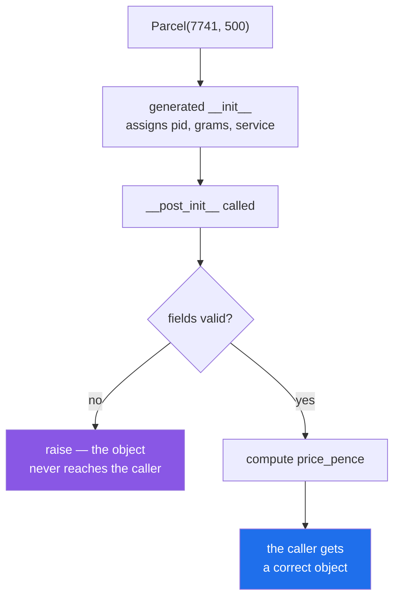

# 2.4 — `__post_init__`: validation and computed fields

## One-line answer

`@dataclass` generates `__init__` and then calls `__post_init__` if you defined one — which is where a
record checks itself and works out anything derived, so an object that exists is an object that is
correct.

---

## The story

The template prints the form and stops. It does not know anything about parcels.

So the clerk still does two things after the boxes are filled in, and both of them happen before the form
goes in the tray.

She **looks at it**: a negative weight, a service that is not one of the three, a blank address. Any of
those and the form does not go in the tray at all — it goes back over the counter, now, while the customer
is still there.

Then she **works out the price** and writes it in the box at the bottom. Nobody dictates the price; it
follows from the weight and the service, and writing it down at this moment means every later reader has
it without doing the arithmetic — and without the risk of two people doing it and disagreeing.

The template could not do either of those, because they are about parcels and it is about paper. What the
template *did* do is leave a defined moment for them: after the boxes, before the tray.

---

## The idea in plain language

`__post_init__` is a method the generated `__init__` calls at the end, after every field has been
assigned. If you do not define it, nothing happens. If you do, it runs with `self` fully populated.

It is for exactly two jobs.

**Validation.** Check the fields and raise if they are wrong
([Day 18, 2.2](../../../day-18-exceptions/parts/02-the-hierarchy/2.2-which-built-in-to-raise.md)). This is
[Day 12, 3.2](../../../day-12-classes/parts/03-the-paper-object/3.2-validation-in-init.md)'s idea — an
object that cannot exist in a bad state — moved into the one place a dataclass leaves for it.

**Computing derived fields.** A value that follows from the others: a price from a weight, a total from a
list, a normalised form of a name. Declare it with `field(init=False)` so it is not a constructor
parameter ([2.2](2.2-default-factory.md)), then set it in `__post_init__`.

`init=False` is the piece that makes computed fields work properly. The field still exists — it is in the
`repr`, in `__eq__`, in `asdict` — but it is not something a caller supplies. The generated `__init__`
skips it, and `__post_init__` fills it in.

Two rules that keep it useful.

**Validate before you compute.** A derived value computed from a bad input is a second wrong thing, and
raising after you have already stored it means the object briefly existed in a broken state. Check first,
then compute ([Day 18, 1.1](../../../day-18-exceptions/parts/01-raising-and-catching/1.1-what-raising-does.md)).

**Nothing expensive, and nothing outside the process.** `__post_init__` runs on every construction,
including in a loop over a million rows. A network call, a file read or a database lookup in there is a
performance problem you will not see until the data is real — and it makes the class impossible to
construct in a test.

There is a fourth thing worth knowing about, briefly, because you will meet it in other people's code:
`InitVar`. A field annotated `InitVar[str]` is a constructor parameter that is **passed to
`__post_init__`** and then discarded — not stored, not in the `repr`, not compared. It is for inputs that
are used to compute something and are not themselves part of the record.

And the interaction that surprises everybody: **`frozen=True` and `__post_init__` do not mix directly.**
A frozen dataclass refuses assignment ([2.3](2.3-frozen-slots-kw-only.md)), including from inside
`__post_init__`, so `self.price = ...` raises. The escape is
`object.__setattr__(self, "price", ...)`, which bypasses the check — legal, ugly, and a strong hint that a
Pydantic model ([3.1](../03-pydantic/3.1-the-model-that-refuses.md)) with a computed field would be a
better fit.

---

## Why Setu needs it

- **Day 12's `Paper.__init__` validated by hand**
  ([Day 12, 3.2](../../../day-12-classes/parts/03-the-paper-object/3.2-validation-in-init.md)), and this
  is where that logic goes once the constructor is generated.
- **`TriageResult` needs its confidence between 0 and 1** ([3.5](../03-pydantic/3.5-triage-result.md)), and
  Pydantic does this with a field constraint rather than a method — which is easier to read and is the
  argument for using it at boundaries.
- **Every configuration record from Phase 12 has a rule** — a test split that must sum to one, a threshold
  in a range — and a config object that can be built wrong is a run that fails an hour in
  (Principle 8).
- **Day 18's `RateLimited` computes its message in `__str__`** rather than storing it
  ([Day 18, 3.2](../../../day-18-exceptions/parts/03-your-own/3.2-an-exception-that-carries-data.md)),
  which is the other way to handle a derived value: compute on read instead of on construction.

---

## The mechanism

Validation and a computed field, together:

```python
import inspect
from dataclasses import dataclass, field


@dataclass
class Parcel:
    pid: int
    grams: int
    service: str = "standard"
    price_pence: int = field(init=False)

    def __post_init__(self) -> None:
        if self.grams <= 0:
            raise ValueError(f"grams must be positive, got {self.grams}")
        self.price_pence = self.grams * (2 if self.service == "standard" else 5)


print("built  :", Parcel(7741, 500))
try:
    Parcel(7742, -1)
except ValueError as error:
    print("rejected:", error)
print("signature:", inspect.signature(Parcel.__init__))
```

**Line by line:**

- `price_pence: int = field(init=False)` — a field with **no constructor parameter**. It is annotated, so
  it is a field; `init=False` keeps it out of `__init__`. Note it has no default and needs none, because
  `__post_init__` always sets it.
- `def __post_init__(self) -> None:` — the name is fixed, like `__init__`. It takes only `self` here;
  `InitVar` fields would appear as extra parameters.
- `if self.grams <= 0:` — **validation first.** At this point every field the caller supplied is assigned,
  so the checks can look at all of them together — which is the advantage over checking in a property
  setter ([Day 15, 2.2](../../../day-15-constructors-and-dunders/parts/02-property/2.2-the-setter-and-validation.md)).
- `raise ValueError(f"grams must be positive, got {self.grams}")` — the value in the message
  ([Day 18, 3.3](../../../day-18-exceptions/parts/03-your-own/3.3-the-message-is-an-interface.md)), and
  `ValueError` because the type is right and the value is not
  ([Day 18, 2.2](../../../day-18-exceptions/parts/02-the-hierarchy/2.2-which-built-in-to-raise.md)).
- `self.price_pence = ...` — **after** the validation, so a bad weight never produces a price.
- `inspect.signature(Parcel.__init__)` — the proof that `price_pence` is not a parameter.

Run on Python 3.12.12 on 2026-09-02:

```
built  : Parcel(pid=7741, grams=500, service='standard', price_pence=1000)
rejected: grams must be positive, got -1
signature: (self, pid: int, grams: int, service: str = 'standard') -> None
```

**`price_pence` is in the `repr` and not in the signature.** That is exactly what `init=False` means: part
of the record, not part of the constructor.

Now the frozen interaction, which is the one that stops people:

```python
from dataclasses import dataclass, field


@dataclass(frozen=True)
class Frozen:
    grams: int
    kilos: float = field(init=False)

    def __post_init__(self):
        self.kilos = self.grams / 1000


try:
    Frozen(500)
except Exception as error:
    print(type(error).__name__, "-", error)
```

**Line by line:**

- `@dataclass(frozen=True)` — no assignment to a field is permitted after construction
  ([2.3](2.3-frozen-slots-kw-only.md)).
- `self.kilos = self.grams / 1000` — an assignment, inside `__post_init__`, which is **after**
  construction as far as the frozen machinery is concerned.

```
FrozenInstanceError - cannot assign to field 'kilos'
```

**The two flags fight.** `object.__setattr__(self, "kilos", self.grams / 1000)` works and reads badly; a
`@property` computing it on read
([Day 15, 2.1](../../../day-15-constructors-and-dunders/parts/02-property/2.1-a-property-is-worked-out.md))
avoids the problem entirely and is usually the better answer for a frozen record.

Where `__post_init__` sits:



---

## When it breaks

**A computed field without `init=False`:**

```text
$ uv run python -c "
from dataclasses import dataclass

@dataclass
class Parcel:
    grams: int
    price_pence: int = 0

    def __post_init__(self):
        self.price_pence = self.grams * 2

print(Parcel(500))
print(Parcel(500, price_pence=99), '<- the caller supplied it and it was ignored')
"
Parcel(grams=500, price_pence=1000)
Parcel(grams=500, price_pence=1000) <- the caller supplied it and it was ignored
```

**What it means.** `price_pence` is a constructor parameter, so a caller can pass one — and
`__post_init__` overwrites it, silently. The caller's value is accepted and discarded, which is worse than
either accepting it or refusing it. `field(init=False)` removes the parameter, so the mistake becomes a
`TypeError` at the call site.

**Computing before validating:**

```text
$ uv run python -c "
from dataclasses import dataclass, field

@dataclass
class Parcel:
    grams: int
    kilos: float = field(init=False)

    def __post_init__(self):
        self.kilos = self.grams / 1000
        if self.grams <= 0:
            raise ValueError(f'grams must be positive, got {self.grams}')

try:
    Parcel(0)
except ValueError as error:
    print('rejected:', error)

@dataclass
class Ratio:
    total: int
    part: int
    fraction: float = field(init=False)

    def __post_init__(self):
        self.fraction = self.part / self.total
        if self.total <= 0:
            raise ValueError('total must be positive')

try:
    Ratio(0, 5)
except Exception as error:
    print('and this one:', type(error).__name__, '-', error)
"
rejected: grams must be positive, got 0
and this one: ZeroDivisionError - division by zero
```

**What it means.** The second class raises `ZeroDivisionError` instead of its own `ValueError`, because
the computation ran first and the bad input broke it. The caller now gets an arithmetic error from inside
a constructor rather than the clear message that was written two lines below
([Day 18, 3.4](../../../day-18-exceptions/parts/03-your-own/3.4-translate-at-the-boundary.md)). **Validate
first, always** — the checks cannot fail on bad input, and the computation can.

**Work in `__post_init__` that touches the outside world:**

```python
@dataclass
class Parcel:
    pid: int
    rate: float = field(init=False)

    def __post_init__(self):
        self.rate = requests.get(f"https://rates.example/{self.pid}").json()["rate"]
```

**Line by line:**

- a network call, in a constructor, on **every** instance.
- a loop building ten thousand parcels now makes ten thousand requests, serially
  ([4.1](../04-concurrency/4.1-waiting-is-not-working.md)).
- and the class cannot be constructed in a unit test without a network or a mock, so every test that needs
  a `Parcel` needs infrastructure.

**What it means.** `__post_init__` is a good place for arithmetic and a terrible place for anything with a
cost. The rule is the same as
[Day 17's](../../../day-17-modules-and-packages/parts/01-the-module/1.1-a-module-is-a-file-that-has-already-run.md)
"importing must be free": constructing must be cheap. Pass the rate in, or fetch it once outside and hand
it to the constructor.

**Validation that a subclass silently skips:**

```text
$ uv run python -c "
from dataclasses import dataclass

@dataclass
class Parcel:
    grams: int
    def __post_init__(self):
        if self.grams <= 0:
            raise ValueError('grams must be positive')

@dataclass
class Express(Parcel):
    priority: int = 1
    def __post_init__(self):
        self.priority = max(1, self.priority)

print(Express(-5), '<- the parent check never ran')
"
Express(grams=-5, priority=1) <- the parent check never ran
```

**What it means.** The subclass defined its own `__post_init__` and **did not call `super().__post_init__()`**,
so the parent's validation is gone and a negative weight is accepted. This is
[Day 13, 1.2](../../../day-13-inheritance-and-abstraction/parts/01-inheritance/1.2-super-and-the-init-that-runs-twice.md)'s
rule about `super()`, applied to a method most people forget is inherited at all. The fix is one line —
`super().__post_init__()` first — and the reason it is easy to miss is that nothing warns.

---

## In production

**The professional habit is that `__post_init__` validates first, computes second, and does nothing
else.** It is the one hook a dataclass gives you, and keeping it to those two jobs is what keeps
construction cheap and testable. Anything expensive belongs in a factory function or a classmethod
([Day 15, 1.2](../../../day-15-constructors-and-dunders/parts/01-three-kinds-of-method/1.2-from-message-the-second-door-in.md)),
where a caller can see that it costs something.

**What changes at scale is that construction happens in loops.** A validation that costs a microsecond is
free for one object and a second per million rows, which is fine; a validation that compiles a regular
expression, or reads a file, or builds a `datetime` from a string, is not. Profiling a slow data pipeline
very often lands on a constructor doing more than anybody realised, and the fix is usually to hoist the
expensive part into a module-level constant or a cached function
([Day 14, 4.2](../../../day-14-decorators/parts/04-the-toolkit/4.2-functools-cache-and-its-trap.md)).

**The failure that only appears with real data is the validation that was never exercised.** Constructors
in tests are built from fixtures that are correct by construction, so `__post_init__`'s raising branch may
never run until production. It needs its own test — `pytest.raises` around the bad construction
([Day 18, 4.4](../../../day-18-exceptions/parts/04-in-anger/4.4-pytest-raises.md)) — and that is a test
people skip precisely because the code "obviously" works.

**The review comment a senior engineer leaves.** *"`__post_init__` computes `self.rate` before checking
`self.grams`, so a zero weight comes out as `ZeroDivisionError` instead of our message. Move the checks
above the arithmetic. And `Express.__post_init__` does not call `super()`, so the parent's validation is
being skipped for every express parcel."*

**The interview question.** *"How do you validate a dataclass?"* `__post_init__`, which the generated
`__init__` calls once every field is assigned — validate there and raise, so an object that exists is
correct. The details that show use: computed fields need `field(init=False)` or a caller can pass a value
that gets silently overwritten; validation goes **before** computation or a bad input produces an
arithmetic error instead of your message; and `frozen=True` blocks assignment from inside `__post_init__`,
so a frozen record with a derived value wants a `property` rather than a stored field.

---

## Check yourself

```bash
uv run python -c "
from dataclasses import dataclass, field
import inspect

@dataclass
class Parcel:
    grams: int
    price_pence: int = field(init=False)

    def __post_init__(self):
        if self.grams <= 0:
            raise ValueError(f'grams must be positive, got {self.grams}')
        self.price_pence = self.grams * 2

print('signature:', inspect.signature(Parcel.__init__))
print('built    :', Parcel(500))
try:
    Parcel(0)
except ValueError as error:
    print('rejected :', error)
"
```

The computed field is in the `repr` and not in the signature. Now swap the two lines in `__post_init__`
and construct `Parcel(0)` again.

**Answer out loud, without scrolling up:**

> Say when `__post_init__` runs relative to the field assignments, and say what `field(init=False)`
> prevents a caller from doing.

---

**Next:** [2.5 — a dataclass is not a validator](2.5-not-a-validator.md).
