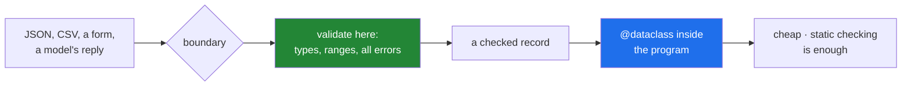

# 2.5 — A dataclass is not a validator: what it does not do

## One-line answer

`@dataclass` reads the annotations to find the **field names** and never checks the types, so
`Parcel(pid="seven", grams="heavy")` is built happily — which is fine for data you created and useless for
data that arrived.

---

## The story

The template made the forms consistent, and everybody agreed it was a large improvement.

Then the office started accepting forms sent in from outside — from the depots, from the website, from an
agency that types them up in bulk — and something became obvious that had never mattered before.

The template prints boxes. It does not read them.

A form arriving from the agency with "quite heavy" in the weight box is a perfectly well-formed form. Every
box is in the right place, the headings are correct, and the thing in the weight box is not a weight. The
template has no opinion about that, because its job was the layout.

So the office put a person on the door. Not to lay out forms — that is done — but to look at each one as
it arrives and refuse the ones whose boxes do not contain what the headings say.

Two different jobs, and for a year everybody had assumed the first one was doing the second.

---

## The idea in plain language

This part is short, and it is the hinge of the day.

`@dataclass` reads `__annotations__` for one purpose: **to find out which names are fields**
([2.1](2.1-what-dataclass-writes.md)). It uses the names to generate `__init__`, `__repr__` and `__eq__`.
It never looks at what the annotation *says*, because annotations are inert
([1.1](../01-type-hints/1.1-a-hint-is-a-note.md)) and a dataclass has no more power over them than any
other code.

So `grams: int` is not a rule. `Parcel(pid="seven-seven-four-one", grams="heavy")` constructs, prints,
compares and serialises exactly as well as a correct one.

That is not a defect. For data your own program created, the type checker
([1.4](../01-type-hints/1.4-the-type-checker.md)) has already verified the code paths that build it, and a
run-time check would be a cost paid on every construction to re-verify something already known.

It becomes a defect at exactly one place: **the boundary**, where data arrives from outside your program.
JSON from an API, a row from a CSV, a form submission, a model's reply, an environment variable. None of
that has been near your type checker, and all of it is `Any`
([1.2](../01-type-hints/1.2-the-vocabulary.md)) as far as the checker is concerned.

So the shape a real system uses is:

| Where | What to use |
|---|---|
| inside your program, records you built | `@dataclass` — cheap, checked statically |
| at the boundary, data that arrived | something that validates at run time |

You have already seen the do-it-yourself version of the second one: `__post_init__`
([2.4](2.4-post-init.md)) with `isinstance` checks and range checks, and a message per field
([Day 18, 3.3](../../../day-18-exceptions/parts/03-your-own/3.3-the-message-is-an-interface.md)). It works.
It is also about eight lines per field, it has to be kept in step with the annotations by hand, it stops
at the first failure rather than reporting all of them, and it does not convert `"500"` into `500` when the
data came from a form where everything is a string.

That list of four is the argument for the next section. Pydantic
([3.1](../03-pydantic/3.1-the-model-that-refuses.md)) reads the same annotations you already write and
does all four — which is why this day teaches dataclasses first (Principle 2: from scratch before library)
and then hands the job to the library that does it properly.

---

## Why Setu needs it

- **Every model reply from Day 172 onward is text that claims to be JSON.** Nothing about it has been
  checked, and a dataclass would accept `{"confidence": "high"}` for a field annotated `float`.
- **`TriageResult` is the plan's named example** ([3.5](../03-pydantic/3.5-triage-result.md)) precisely
  because it is a boundary object — it is what a model produces, and it is reused from Day 172 to Day 240.
- **Day 16's `read_jsonl` yields `dict[str, Any]`**
  ([Day 16, 2.5](../../../day-16-files-and-context-managers/parts/02-reading-and-writing/2.5-jsonl.md)),
  and every one of those dictionaries is unchecked data from a file.
- **Principle 8 is leakage is the enemy**, and its cousin here is that unvalidated data leaks into places
  it was never checked for — the same failure with a different name.

---

## The mechanism

Three lines, and a `Parcel` that is nonsense:

```python
from dataclasses import dataclass


@dataclass
class Parcel:
    pid: int
    grams: int


p = Parcel("seven-seven-four-one", "heavy")
print("accepted    :", p)
print("annotations :", Parcel.__annotations__)
print("nothing checked anything, exactly like part 1.1")
```

**Line by line:**

- `pid: int` and `grams: int` — two annotations that a reader would call rules.
- `Parcel("seven-seven-four-one", "heavy")` — two strings, and it constructs. The generated `__init__` is
  `self.pid = pid; self.grams = grams` and nothing else
  ([2.1](2.1-what-dataclass-writes.md)).
- `Parcel.__annotations__` — printed to show the annotations are right there, unread by anything at run
  time.

Run on Python 3.12.12 on 2026-09-02:

```
accepted    : Parcel(pid='seven-seven-four-one', grams='heavy')
annotations : {'pid': <class 'int'>, 'grams': <class 'int'>}
nothing checked anything, exactly like part 1.1
```

**The `repr` shows quotes**, which is the only visible clue anything is wrong — and only because `repr`
uses `!r` on the values
([Day 15, 3.2](../../../day-15-constructors-and-dunders/parts/03-the-dunders/3.2-repr-and-str.md)).

Now the do-it-yourself validator, so the cost is concrete:

```python
from dataclasses import dataclass


@dataclass
class Parcel:
    pid: int
    grams: int
    service: str = "standard"

    def __post_init__(self) -> None:
        if not isinstance(self.pid, int):
            raise TypeError(f"pid must be an int, got {type(self.pid).__name__}")
        if not isinstance(self.grams, int):
            raise TypeError(f"grams must be an int, got {type(self.grams).__name__}")
        if self.grams <= 0:
            raise ValueError(f"grams must be positive, got {self.grams}")
        if self.service not in {"standard", "heavy", "overnight"}:
            raise ValueError(f"service must be one of standard/heavy/overnight, got {self.service!r}")


for args in [(7741, 500), ("seven", "heavy"), (7741, -1), (7741, 500, "express")]:
    try:
        print("ok      :", Parcel(*args))
    except (TypeError, ValueError) as error:
        print(f"{type(error).__name__:9}:", error)
```

**Line by line:**

- four checks for three fields, each with a message
  ([Day 18, 3.3](../../../day-18-exceptions/parts/03-your-own/3.3-the-message-is-an-interface.md)) — and
  this is a *small* record.
- `isinstance(self.pid, int)` — the check the annotation implies and does not perform. **Note it has to be
  written out**, so it can drift from the annotation above it and nothing will notice.
- `self.service not in {...}` — a set membership test standing in for what a proper type system would call
  an enumeration.
- `raise TypeError` for the wrong kind, `raise ValueError` for the wrong value
  ([Day 18, 2.2](../../../day-18-exceptions/parts/02-the-hierarchy/2.2-which-built-in-to-raise.md)).
- **It stops at the first failure.** `("seven", "heavy")` has two problems and reports one, so the caller
  fixes it, resubmits, and is told about the next
  ([Day 18, 4.6](../../../day-18-exceptions/parts/04-in-anger/4.6-when-not-to-raise.md)).
- Nothing here converts. `Parcel(7741, "500")` — a string of digits, which is what every web form and CSV
  produces — is rejected rather than accepted as `500`.

```
ok      : Parcel(pid=7741, grams=500, service='standard')
TypeError: pid must be an int, got str
ValueError: grams must be positive, got -1
ValueError: service must be one of standard/heavy/overnight, got 'express'
```

It works, and count what it cost: twelve lines of validation for three fields, duplicated from the
annotations directly above them, reporting one problem at a time and converting nothing.

Where the line is:



---

## When it breaks

**The wrong type travels and fails somewhere unrelated:**

```text
$ uv run python -c "
from dataclasses import dataclass

@dataclass
class Parcel:
    pid: int
    grams: int

def total(parcels: list[Parcel]) -> int:
    return sum(p.grams for p in parcels)

parcels = [Parcel(1, 500), Parcel(2, 'heavy')]
print(total(parcels))
" 2>&1 | tail -3
TypeError: unsupported operand type(s) for +: 'int' and 'str'
```

**What it means.** The bad record was built silently at the boundary and the failure happens in `sum`, in
a function that did nothing wrong, with no mention of parcel 2. This is
[Day 18, 1.1](../../../day-18-exceptions/parts/01-raising-and-catching/1.1-what-raising-does.md)'s "the
error moved away from its cause", produced by a missing check rather than by a bad `return`. **Every
unvalidated boundary produces this shape**, and the distance between the cause and the symptom grows with
the size of the program.

**Validation that drifted from the annotation:**

```text
$ uv run python -c "
from dataclasses import dataclass

@dataclass
class Parcel:
    grams: float
    def __post_init__(self):
        if not isinstance(self.grams, int):
            raise TypeError('grams must be an int')

try:
    Parcel(500.5)
except TypeError as error:
    print('rejected a valid float:', error)
"
rejected a valid float: grams must be an int
```

**What it means.** Somebody widened the annotation to `float` — a reasonable change — and did not touch
the check written three lines below it. Now the annotation and the validation disagree, the checker
believes one and the run time enforces the other, and a legitimate value is refused. **Hand-written
validation is a second copy of the annotation**, and two copies drift
([Day 18, 4.2](../../../day-18-exceptions/parts/04-in-anger/4.2-eafp-and-lbyl.md)).

**Data from a form, where everything is a string:**

```text
$ uv run python -c "
from dataclasses import dataclass

@dataclass
class Parcel:
    pid: int
    grams: int

form = {'pid': '7741', 'grams': '500'}
p = Parcel(**form)
print('built   :', p)
print('and     :', p.grams * 2, '<- string doubling, not arithmetic')
"
built   : Parcel(pid='7741', grams='500')
and     : 500500 <- string doubling, not arithmetic
```

**What it means.** Every value out of a web form, a CSV, a command line and many databases is a string.
The dataclass accepts them, and the first arithmetic produces `500500` instead of `1000` — a plausible-looking
number, not an error. **Converting is part of validating**, and a hand-written `__post_init__` that only
checks types would reject this rather than fix it, which means every caller writes the conversion by hand.

**A nested record, unchecked all the way down:**

```text
$ uv run python -c "
from dataclasses import dataclass

@dataclass
class Address:
    line1: str
    postcode: str

@dataclass
class Parcel:
    pid: int
    to: Address

p = Parcel(1, {'line1': '12 High St', 'postcode': 'BS1'})
print('to is a', type(p.to).__name__, '-', p.to)
print('and     :', p.to.line1 if hasattr(p.to, 'line1') else 'no attribute at all')
"
to is a dict - {'line1': '12 High St', 'postcode': 'BS1'}
and     : no attribute at all
```

**What it means.** The `to` field is annotated `Address` and holds a **dictionary**. Nothing converted it,
nothing complained, and the first `p.to.line1` will be an `AttributeError` far from here. Nested structures
are where hand-written validation becomes genuinely unmanageable: each level needs its own conversion and
its own checks, and every one of them is a place to forget. This is the case Pydantic handles by
construction ([3.1](../03-pydantic/3.1-the-model-that-refuses.md)).

---

## In production

**The professional rule is: dataclasses inside, validation at the edge.** Data your program constructed is
checked by the type checker and needs nothing at run time. Data that arrived is checked once, at the point
it arrives, and after that point it is a real object and everything downstream can trust it. That single
boundary is what keeps the rest of the codebase free of defensive `isinstance` calls.

**What changes at scale is that the boundary is where the incidents happen.** An upstream service renames
a field, a partner sends a number as a string, a model returns `"0.8"` instead of `0.8` — none of that is
a bug in your code, and all of it becomes one at whatever depth your program first does arithmetic on it.
A validated boundary turns every one of those into a single, immediate, well-named rejection with the
field in the message, which is a support ticket instead of an outage.

**The failure that only appears with real data is precisely this, by definition.** Fixtures are built by
hand, in Python, with the right types — so a hand-built `Parcel(1, 500)` in every test proves nothing
about a `Parcel(**row)` in production. The test that would catch it constructs from the *shape the real
source produces*: a dictionary of strings, with a missing key and an extra one.

**The review comment a senior engineer leaves.** *"`Parcel(**payload)` on an untrusted webhook body — the
dataclass will accept whatever is in there, including a dict where `Address` is annotated. Make this a
Pydantic model at the boundary and keep the dataclass for what we build internally."*

**The interview question.** *"Do dataclasses validate types?"* No — they read the annotations only to find
the field names, and the annotations themselves are never checked, so a field annotated `int` accepts a
string. The follow-up is what you do about it, and the answer is the boundary rule: static checking is
enough for data your code constructs, and data that arrives from outside gets validated once, at the edge,
by something that reads the same annotations at run time — which is what Pydantic is. Adding that
hand-written validation is a second copy of the annotation, stops at the first error, and does not
convert, is the argument for using the library rather than writing it.

---

## Check yourself

```bash
uv run python -c "
from dataclasses import dataclass

@dataclass
class Parcel:
    pid: int
    grams: int

form = {'pid': '7741', 'grams': '500'}
p = Parcel(**form)
print('built  :', p)
print('doubled:', p.grams * 2)
print('sum    :', end=' ')
try:
    print(sum([Parcel(1, 500).grams, p.grams]))
except TypeError as error:
    print(type(error).__name__, '-', error)
"
```

Everything constructs and the arithmetic is where it falls over. Say how far the bad value travelled
before anybody noticed.

**Answer out loud, without scrolling up:**

> A dataclass reads your annotations. Say what it reads them *for*, and name the one place in a program
> where that is not enough.

---

**Next:** [3.1 — Pydantic v2: the model that refuses bad data at the door](../03-pydantic/3.1-the-model-that-refuses.md).
