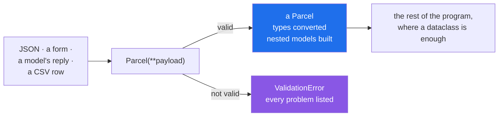

# 3.1 — Pydantic v2: the model that refuses bad data at the door

## One-line answer

A `BaseModel` subclass looks exactly like a dataclass and **reads the same annotations at run time** — so
constructing one either gives you a correct object or raises, and there is no third outcome.

---

## The story

The person the office put on the door turned out to be the best hire they made that year, and for a reason
nobody predicted.

Everybody expected her to catch the obvious rubbish, and she does. What surprised them is the other half
of the job: a form arrives from the agency with **500** typed in the weight box, in a system where every
box is typed as text, and she writes the number down as a number and passes it on. The depot's forms come
in with the address on one line and she splits it into the boxes the office uses.

So the tray behind her contains only forms that are correct **and in the office's own format**. Nobody
downstream ever asks "is this a number or is it text that looks like a number", because by the time it
reaches them it is a number.

She is not checking. She is *converting and* checking, at the one place where the outside becomes the
inside.

---

## The idea in plain language

Pydantic is a library. A model is a class that inherits from `BaseModel` and lists its fields with
annotations — visually almost identical to a dataclass
([2.1](../02-dataclasses/2.1-what-dataclass-writes.md)):

```text
class Parcel(BaseModel):
    pid: int
    grams: int
    service: str = "standard"
```

The difference is what happens at construction. Pydantic reads those annotations **when the class is
defined**, compiles a validator from them, and runs it on every construction. So:

- `Parcel(pid=7741, grams=500)` gives you a `Parcel`.
- `Parcel(pid="7741", grams="500")` also gives you a `Parcel` — **with integers in it**, converted.
- `Parcel(pid="seven", grams=-1)` raises `ValidationError`
  ([3.2](3.2-validationerror.md)), listing **every** problem it found.

Those three lines are the whole reason the library exists, and each is something the dataclass could not
do ([2.5](../02-dataclasses/2.5-not-a-validator.md)).

Four things beyond the basics, all of which you need today.

**`Field()` adds constraints.** `grams: int = Field(gt=0)` is greater-than-zero, checked. `Field` also
carries `default`, `default_factory` (the same idea as
[2.2](../02-dataclasses/2.2-default-factory.md)), `description`, and constraints like `ge`, `le`,
`min_length`, `max_length`, `pattern`.

**Nested models are converted too.** A field annotated `to: Address` accepts a dictionary and builds an
`Address` out of it — recursively, all the way down. That is the case hand-written validation cannot keep
up with ([2.5](../02-dataclasses/2.5-not-a-validator.md)).

**Every failure is reported, not just the first.** A `ValidationError` carries a list, with a location per
problem, so a form can show four messages at once.

**It works from JSON directly.** `Parcel.model_validate_json(text)` parses and validates in one step
([3.4](3.4-model-dump-and-the-boundary.md)), which is the shape every API boundary wants.

**Where it belongs, and where it does not.** At the boundary — anything arriving from outside — a model.
Inside your program, where the type checker has already verified the code
([1.4](../01-type-hints/1.4-the-type-checker.md)), a dataclass is cheaper and enough. Validating the same
record four times as it moves through your own code is cost for no information.

**v1 and v2 are different libraries wearing one name.** `model_validate` and `model_dump` are v2;
`parse_obj` and `dict` were v1, and are removed. Almost every tutorial older than 2023 is v1, and the
methods it uses do not exist. The plan pins **Pydantic v2** for exactly this reason (Part 2), and
`model_` is the prefix to look for when judging whether something you are reading is current.

---

## Why Setu needs it

- **`TriageResult` as a Pydantic model is the plan's named example for `PY-23`** — "the contract reused
  from Day 172 to Day 240" ([3.5](3.5-triage-result.md)).
- **Every model reply from Day 172 is text that claims to be JSON**, and `model_validate_json` is the one
  line between "the model said something" and "we have a result".
- **FastAPI, which the capstone uses (plan Part 2), is built on Pydantic** — request bodies are models, and
  the 422 response a client gets is a `ValidationError` rendered as JSON
  ([3.2](3.2-validationerror.md)).
- **Principle 8 is leakage is the enemy**, and validating at one boundary is what stops unchecked values
  travelling into code that assumed they were checked
  ([2.5](../02-dataclasses/2.5-not-a-validator.md)).

---

## The mechanism

Install it for this project first — this is the day's one new dependency:

```text
uv add pydantic==2.13.5
```

Then the model:

```python
"""The same Parcel, validated at the door."""

from pydantic import BaseModel, Field


class Parcel(BaseModel):
    pid: int
    grams: int = Field(gt=0)
    service: str = "standard"


print("good  :", Parcel(pid=7741, grams=500))
print("strings converted:", Parcel(pid="7741", grams="500"))
print("fields:", list(Parcel.model_fields))
```

**Line by line:**

- `from pydantic import BaseModel, Field` — two names is most of the library's everyday surface.
- `class Parcel(BaseModel):` — **inheritance, not a decorator**. That is the visible difference from
  `@dataclass`; everything else about the class body is the same.
- `pid: int` — an annotation, and now it is a **rule**. This is
  [1.1](../01-type-hints/1.1-a-hint-is-a-note.md)'s "something reads them" arriving at its strongest form.
- `grams: int = Field(gt=0)` — a constraint. `Field(...)` in the default position configures the field
  without giving it a default, the same shape as `dataclasses.field`
  ([2.2](../02-dataclasses/2.2-default-factory.md)).
- `service: str = "standard"` — an ordinary default, no `Field` needed.
- `Parcel(pid=7741, grams=500)` — **keyword arguments.** A `BaseModel`'s constructor is keyword-only,
  which is `kw_only=True` by default ([2.3](../02-dataclasses/2.3-frozen-slots-kw-only.md)) and is the
  right choice for a record built from a payload.
- `Parcel(pid="7741", grams="500")` — strings in. Watch the output: integers out.
- `Parcel.model_fields` — the field definitions, the equivalent of `dataclasses.fields`
  ([2.1](../02-dataclasses/2.1-what-dataclass-writes.md)).

Run on Python 3.12.12 with `pydantic==2.13.5` on 2026-09-02:

```
good  : pid=7741 grams=500 service='standard'
strings converted: pid=7741 grams=500 service='standard'
fields: ['pid', 'grams', 'service']
```

**The second line is the one to stare at.** `"7741"` and `"500"` went in; `7741` and `500` came out, with
no quotes in the `repr`. That is the conversion half of the job
([3.3](3.3-coercion-and-strict.md) is where its limits live), and it is what
[2.5](../02-dataclasses/2.5-not-a-validator.md)'s form-data failure needed.

Now the refusal:

```python
from pydantic import BaseModel, Field, ValidationError


class Parcel(BaseModel):
    pid: int
    grams: int = Field(gt=0)
    service: str = "standard"


try:
    Parcel(pid="seven", grams=-1, service=None)
except ValidationError as error:
    print(error)
```

**Line by line:**

- `Parcel(pid="seven", grams=-1, service=None)` — **three** problems: a string that is not a number, a
  number below the constraint, and `None` where a string was wanted.
- `except ValidationError as error:` — one exception type for every validation failure. It is a
  `ValueError` subclass, so `except ValueError:` catches it too
  ([Day 18, 2.1](../../../day-18-exceptions/parts/02-the-hierarchy/2.1-catching-catches-subclasses.md)).
- `print(error)` — the human-readable form. The machine-readable form is `error.errors()`
  ([3.2](3.2-validationerror.md)).

```
3 validation errors for Parcel
pid
  Input should be a valid integer, unable to parse string as an integer [type=int_parsing, input_value='seven', input_type=str]
    For further information visit https://errors.pydantic.dev/2.13/v/int_parsing
grams
  Input should be greater than 0 [type=greater_than, input_value=-1, input_type=int]
    For further information visit https://errors.pydantic.dev/2.13/v/greater_than
service
  Input should be a valid string [type=string_type, input_value=None, input_type=NoneType]
    For further information visit https://errors.pydantic.dev/2.13/v/string_type
```

**Three problems, reported together**, each with the field name, what was wanted, what arrived, and its
type. Compare with the hand-written version
([2.5](../02-dataclasses/2.5-not-a-validator.md)), which reported one and stopped.

And nesting, which is where the difference becomes structural:

```python
from pydantic import BaseModel, Field


class Address(BaseModel):
    line1: str
    postcode: str


class Parcel(BaseModel):
    pid: int
    grams: int = Field(gt=0)
    to: Address


payload = {"pid": 7741, "grams": 500, "to": {"line1": "12 High St", "postcode": "BS1 4DJ"}}
p = Parcel(**payload)
print("nested built:", p)
print("to is a     :", type(p.to).__name__)
print("attribute   :", p.to.line1)
```

**Line by line:**

- `to: Address` — a model as a field type.
- `payload` — a plain nested **dictionary**, exactly the shape `json.loads` produces
  ([Day 16, 2.5](../../../day-16-files-and-context-managers/parts/02-reading-and-writing/2.5-jsonl.md)).
- `Parcel(**payload)` — the inner dictionary is validated and turned into an `Address`.
- `type(p.to).__name__` — the proof. The dataclass version of this left a `dict` sitting in a field
  annotated `Address` ([2.5](../02-dataclasses/2.5-not-a-validator.md)).

```
nested built: pid=7741 grams=500 to=Address(line1='12 High St', postcode='BS1 4DJ')
to is a     : Address
attribute   : 12 High St
```

Where the model sits:



---

## When it breaks

**Positional arguments:**

```text
$ uv run python -c "
from pydantic import BaseModel

class Parcel(BaseModel):
    pid: int
    grams: int

Parcel(7741, 500)
" 2>&1 | tail -2
TypeError: BaseModel.__init__() takes 1 positional argument but 3 were given
```

**What it means.** A `BaseModel` constructor is keyword-only, always. The message counts `self` as the one
positional argument, exactly as `kw_only=True` on a dataclass does
([2.3](../02-dataclasses/2.3-frozen-slots-kw-only.md)). It is a deliberate choice: models are built from
payloads with named fields, and positional construction of a ten-field record is unreadable anyway.

**A v1 method that no longer exists:**

```text
$ uv run python -c "
from pydantic import BaseModel

class Parcel(BaseModel):
    pid: int

p = Parcel(pid=1)
print(p.dict())
" 2>&1 | tail -3
<string>:8: PydanticDeprecatedSince20: The `dict` method is deprecated; use `model_dump` instead. Deprecated in Pydantic V2.0 to be removed in V3.0. See Pydantic V2 Migration Guide at https://errors.pydantic.dev/2.13/migration/
{'pid': 1}
```

**What it means.** It works, it warns, and in Pydantic v3 it will not exist. `dict()`, `json()`,
`parse_obj()` and `parse_raw()` are Pydantic v1; in v2 they are `model_dump()`, `model_dump_json()`,
`model_validate()` and `model_validate_json()` ([3.4](3.4-model-dump-and-the-boundary.md)). The warning is
easy to miss because the code still produces the right answer — and **a tutorial using them is v1**, so
its advice about validators and configuration will be wrong in ways much harder to spot than a renamed
method. Check for the `model_` prefix before trusting anything you read.

**Extra fields, silently dropped:**

```text
$ uv run python -c "
from pydantic import BaseModel

class Parcel(BaseModel):
    pid: int

p = Parcel(pid=1, grams=500, service='heavy')
print('built:', p)
print('grams?', hasattr(p, 'grams'))
"
built: pid=1
grams? False
```

**What it means. The two extra fields vanished without a word.** That is the default — `extra="ignore"` —
and it is the right behaviour when an upstream API adds fields you do not care about. It is the wrong
behaviour when the extra field is a **typo in your own payload**: `Parcel(pid=1, grms=500)` builds a
`Parcel` with no weight and no complaint. `model_config = ConfigDict(extra="forbid")` makes unknown fields
an error, and it is worth turning on for anything you construct yourself:

```text
1 validation error for Parcel
grms
  Extra inputs are not permitted [type=extra_forbidden, input_value=500, input_type=int]
    For further information visit https://errors.pydantic.dev/2.13/v/extra_forbidden
```

**Validation happening on every hop:**

```python
def price(parcel: Parcel) -> int:
    checked = Parcel.model_validate(parcel.model_dump())
    return checked.grams * 2
```

**Line by line:**

- `parcel: Parcel` — already a validated model. It cannot be invalid; that is what constructing it
  guaranteed.
- `Parcel.model_validate(parcel.model_dump())` — serialise it and validate it again, for nothing.
- the cost is two full passes over the data, per call, in a function whose real work is one multiplication.

**What it means.** Validation is a **boundary** activity. Once a value has crossed the boundary it is
trusted, and re-validating it inside the program buys no information and costs real time — noticeably so
in a loop. If you find yourself re-validating, the question to ask is where the boundary actually is;
usually the answer is that it is further out than the code assumes.

---

## In production

**The professional shape is one model per external interface, at the edge, and plain objects inside.**
The request body is a model, the response is a model, the reply from a provider is a model — and
everything between them is ordinary code working on validated data. That arrangement gives one place per
interface where the rules live, and no defensive checks anywhere else.

**What changes at scale is that the model becomes the schema.** `model_json_schema()` produces a JSON
Schema document from the same annotations, which is what generates API documentation, what a model
provider's structured-output mode is given so the reply is constrained to fit, and what a client library
is generated from. One class definition becomes the validation, the documentation and the wire contract —
which is the reason Pydantic ended up underneath so much of the ecosystem.

**The failure that only appears with real data is the field that was always present.** Every payload in
development has `postcode`, so nobody notices it is not optional; the first partner who omits it gets a
`ValidationError` and a rejected request. That is the **correct** outcome — far better than a `None`
travelling inward — and the work it creates is a decision about what the field really is: required, or
optional with a default ([1.3](../01-type-hints/1.3-optional-and-the-none-you-forgot.md)). A model forces
that decision to be made once, in the class, rather than differently in six places.

**The review comment a senior engineer leaves.** *"This webhook handler does `Payload(**body)` with the
default `extra='ignore'`, so a renamed field upstream silently becomes a missing value with a default
instead of an error. Set `extra='forbid'` on this one — we control both ends — and keep `ignore` on the
third-party callbacks where they add fields without telling us."*

**The interview question.** *"Why Pydantic rather than a dataclass?"* Because a dataclass reads the
annotations only to find field names and never checks them, so anything arriving from outside is
unvalidated ([2.5](../02-dataclasses/2.5-not-a-validator.md)). A Pydantic model reads the same annotations
at run time: it converts where conversion is unambiguous, rejects where it is not, reports **every**
failure rather than the first, and builds nested models out of nested dictionaries. Then the boundary
rule, which is what shows judgement: models at the edges, plain objects inside, because re-validating
data your own program produced costs time and tells you nothing.

---

## Check yourself

```bash
uv add pydantic==2.13.5
uv run python -c "
from pydantic import BaseModel, Field, ValidationError

class Parcel(BaseModel):
    pid: int
    grams: int = Field(gt=0)

print('converted:', Parcel(pid='7741', grams='500'))
try:
    Parcel(pid='seven', grams=0)
except ValidationError as error:
    print('problems :', error.error_count())
    for e in error.errors():
        print('   ', e['loc'], e['type'])
"
```

Two problems from one construction. Now add `service: str` with no default and construct without it.

**Answer out loud, without scrolling up:**

> A dataclass and a `BaseModel` have almost the same class body. Name the three things that happen at
> construction with one and not the other.

---

**Next:** [3.2 — `ValidationError`, and reading its report](3.2-validationerror.md).
