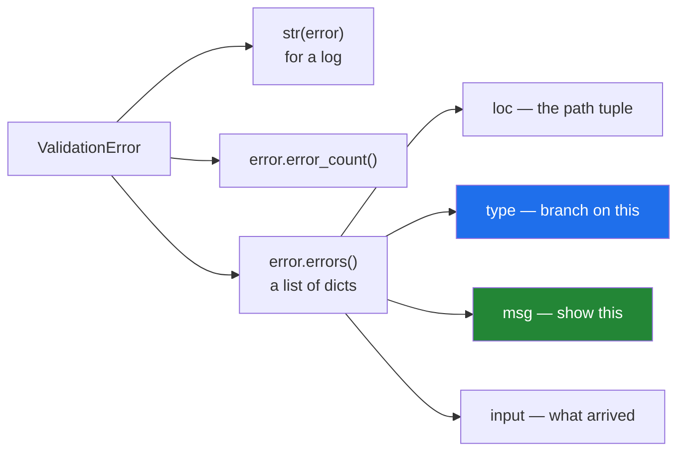

# 3.2 — `ValidationError`, and reading its report

## One-line answer

One `ValidationError` carries **every** problem it found, each with a location, a machine-readable type and
a message — so `error.errors()` is a list a form or an API can turn into four field-level messages at
once.

---

## The story

When a form is refused at the door, the person on the door does not say "no".

She hands back the form with a slip clipped to it, and the slip has a line per problem:

*weight box — expected a number, found "quite heavy"*
*postcode box — empty, and it is required*
*service box — "express" is not one of standard, heavy, overnight*

Three lines, three boxes named. The person fixes all three and comes back once.

The alternative — which the depot's own door used to do — is to stop at the first problem and say "the
weight box is wrong". They fix the weight, walk back, and are told about the postcode. Then again for the
service. Three round trips for one form, and every one of them felt to the person like being told off for
something new.

---

## The idea in plain language

`ValidationError` is the exception Pydantic raises when a model cannot be built
([3.1](3.1-the-model-that-refuses.md)). It is a `ValueError` subclass, so `except ValueError:` catches it
([Day 18, 2.1](../../../day-18-exceptions/parts/02-the-hierarchy/2.1-catching-catches-subclasses.md)) —
and you should catch `ValidationError` by name, because the whole point is what it carries.

It has two faces.

**`str(error)`** is the human one: a heading with the count, then a block per problem. That is what you
print in a script or a log
([Day 18, 4.3](../../../day-18-exceptions/parts/04-in-anger/4.3-logging-exception.md)).

**`error.errors()`** is the machine one: a list of dictionaries, one per problem. Each has:

| Key | What it is |
|---|---|
| `loc` | a **tuple** naming the path to the field — `('to', 'postcode')` for a nested one |
| `type` | a stable machine-readable code, like `int_parsing` or `missing` |
| `msg` | the sentence a person reads |
| `input` | the value that was rejected |
| `url` | a link to that error type's documentation |

`error.error_count()` is the number of them.

**`loc` is the one to understand.** It is a tuple rather than a string because a model can nest
([3.1](3.1-the-model-that-refuses.md)): `('to', 'postcode')` means the `postcode` field of the `to` field.
For a list field it contains the index — `('items', 2, 'grams')` — so a validation failure in the third
element of a list is located precisely. Turning it into something a user reads is
`".".join(str(p) for p in e["loc"])`.

**`type` is what you branch on, never `msg`.** This is
[Day 18, 3.3](../../../day-18-exceptions/parts/03-your-own/3.3-the-message-is-an-interface.md)'s rule,
and Pydantic has done the work for you: the codes are documented and stable, the messages are prose that
gets improved between versions.

The practical shape at a boundary is three lines: catch the `ValidationError`, turn `errors()` into
whatever your interface wants, return it. In a web application that is a 422 response with a list of
field errors — which is exactly what FastAPI does, automatically, because it is built on this.

One thing worth knowing about what it does **not** do: validation stops per field, not overall. If `pid`
fails its type check, Pydantic does not then also run `pid`'s range constraint — there is nothing to range
check. So four fields with two problems each report four problems, not eight.

---

## Why Setu needs it

- **Day 172's model replies will fail validation regularly**, because a model asked for JSON sometimes
  returns prose, a number as a string, or a field it invented. `errors()` is what turns "the reply was
  wrong" into "field `confidence` was `'high'`, expected a float", which is what you put in a retry prompt.
- **`TriageResult` is validated on every call** ([3.5](3.5-triage-result.md)), so this report is the
  day-to-day surface of the whole pipeline from Day 172 onward.
- **The capstone's API returns 422 with field errors** (plan Part 2, FastAPI), and that response body is
  `errors()` serialised.
- **Day 18's rule that the type is the interface**
  ([Day 18, 3.3](../../../day-18-exceptions/parts/03-your-own/3.3-the-message-is-an-interface.md)) is why
  you read `e["type"]` and not `e["msg"]` — the same argument, now about somebody else's library.

---

## The mechanism

A nested model, and a payload with three problems at two levels:

```python
"""Nested models, and the errors() report."""

from pydantic import BaseModel, Field, ValidationError


class Address(BaseModel):
    line1: str
    postcode: str


class Parcel(BaseModel):
    pid: int
    grams: int = Field(gt=0)
    to: Address


bad = {"pid": "x", "grams": -1, "to": {"line1": "12 High St"}}
try:
    Parcel(**bad)
except ValidationError as error:
    print("count :", error.error_count())
    for e in error.errors():
        print(f"  loc={e['loc']!s:24} type={e['type']:16} msg={e['msg']}")
```

**Line by line:**

- `bad` — three problems, deliberately of three different kinds: a string that will not parse as an
  integer, a number below a constraint, and a **missing** field one level down.
- `except ValidationError as error:` — by name, not `except ValueError:`
  ([Day 18, 1.2](../../../day-18-exceptions/parts/01-raising-and-catching/1.2-try-except-and-catching-by-type.md)),
  because the next lines need what this type carries.
- `error.error_count()` — how many. Useful for a log line that says "3 problems" before the detail.
- `for e in error.errors():` — the list. **Each `e` is a plain dictionary**, so this loop is ordinary
  code, not library-specific machinery.
- `e['loc']` — the path tuple. Printed with `!s` so it reads as a tuple rather than a repr of a repr
  ([Day 7, 3.3](../../../day-07-strings/parts/03-formatting/3.3-repr-and-the-debugging-f-string.md)).
- `e['type']` — the stable code. **This is what code branches on.**
- `e['msg']` — the sentence, for a human.

Run on Python 3.12.12 with `pydantic==2.13.5` on 2026-09-02:

```
count : 3
  loc=('pid',)                 type=int_parsing      msg=Input should be a valid integer, unable to parse string as an integer
  loc=('grams',)               type=greater_than     msg=Input should be greater than 0
  loc=('to', 'postcode')       type=missing          msg=Field required
```

**Read the third row.** `('to', 'postcode')` — the failure is inside the nested model, and the path says
exactly where. A hand-written validator would have had to build that path itself, at every level
([2.5](../02-dataclasses/2.5-not-a-validator.md)).

The human form of the same failure, which is what a log gets:

```text
$ uv run python -c "..."
3 validation errors for Parcel
pid
  Input should be a valid integer, unable to parse string as an integer [type=int_parsing, input_value='seven', input_type=str]
    For further information visit https://errors.pydantic.dev/2.13/v/int_parsing
grams
  Input should be greater than 0 [type=greater_than, input_value=-1, input_type=int]
    For further information visit https://errors.pydantic.dev/2.13/v/greater_than
service
  Input should be a valid string [type=string_type, input_value=None, input_type=NoneType]
    For further information visit https://errors.pydantic.dev/2.13/v/string_type
```

Every one of
[Day 18, 3.3](../../../day-18-exceptions/parts/03-your-own/3.3-the-message-is-an-interface.md)'s four
questions is answered per field: what was wrong, what was expected, what it got — `input_value` and
`input_type` — and what to do, via the URL.

Turning it into a boundary response:

```python
from pydantic import BaseModel, Field, ValidationError


class Parcel(BaseModel):
    pid: int
    grams: int = Field(gt=0)


def parse_parcel(payload: dict) -> Parcel | list[dict[str, str]]:
    """Return a Parcel, or a list of field errors a form can display."""
    try:
        return Parcel(**payload)
    except ValidationError as error:
        return [
            {"field": ".".join(str(p) for p in e["loc"]), "problem": e["msg"], "code": e["type"]}
            for e in error.errors()
        ]


print(parse_parcel({"pid": 1, "grams": 500}))
for row in parse_parcel({"pid": "x", "grams": -1}):
    print(row)
```

**Line by line:**

- `-> Parcel | list[dict[str, str]]` — an honest signature saying both outcomes
  ([1.3](../01-type-hints/1.3-optional-and-the-none-you-forgot.md)). In a real application this would be a
  union of two models rather than a bare list, and the principle is the same: the failure is a value here,
  because a form showing errors is an ordinary outcome
  ([Day 18, 4.6](../../../day-18-exceptions/parts/04-in-anger/4.6-when-not-to-raise.md)).
- `".".join(str(p) for p in e["loc"])` — the path tuple flattened for display: `to.postcode`, or
  `items.2.grams` for a list. `str(p)` because list indices are integers.
- `"code": e["type"]` — carried through, so a client can act on it without reading English.
- the two calls — the success path returns a model, the failure path returns three-key dictionaries.

```
pid=1 grams=500
{'field': 'pid', 'problem': 'Input should be a valid integer, unable to parse string as an integer', 'code': 'int_parsing'}
{'field': 'grams', 'problem': 'Input should be greater than 0', 'code': 'greater_than'}
```

What one error carries:



---

## When it breaks

**Catching it and printing only the first problem:**

```text
$ uv run python -c "
from pydantic import BaseModel, ValidationError

class Parcel(BaseModel):
    pid: int
    grams: int
    service: str

try:
    Parcel(pid='x', grams='y', service=None)
except ValidationError as error:
    print('failed:', error.errors()[0]['msg'])
"
failed: Input should be a valid integer, unable to parse string as an integer
```

**What it means.** Three problems found, one reported — the library did the work and the handler threw two
thirds of it away. The user fixes `pid`, resubmits, and is told about `grams`. **The whole advantage of
this exception is the list**, and `errors()[0]` discards it. If only one line is wanted, say how many
there were: `f"{error.error_count()} problems, first: ..."`.

**Branching on the message text:**

```text
$ uv run python -c "
from pydantic import BaseModel, ValidationError

class Parcel(BaseModel):
    grams: int

try:
    Parcel(grams='heavy')
except ValidationError as error:
    e = error.errors()[0]
    print('by message:', 'valid integer' in e['msg'])
    print('by type   :', e['type'] == 'int_parsing')
"
by message: True
by type   : True
```

**What it means.** Both work today. The message is prose that Pydantic improves between releases — it
changed between v1 and v2 and has been reworded since — and the `type` code is documented and stable. This
is [Day 18, 3.3](../../../day-18-exceptions/parts/03-your-own/3.3-the-message-is-an-interface.md)'s rule
applied to a dependency's exception: **branch on `type`, display `msg`**, and an upgrade that improves the
wording will not break you.

**The `loc` treated as a string:**

```text
$ uv run python -c "
from pydantic import BaseModel, ValidationError

class Address(BaseModel):
    postcode: str

class Parcel(BaseModel):
    to: Address

try:
    Parcel(to={})
except ValidationError as error:
    e = error.errors()[0]
    print('loc      :', e['loc'])
    print('as a str :', repr(str(e['loc'])))
    print('joined   :', '.'.join(str(p) for p in e['loc']))
"
loc      : ('to', 'postcode')
as a str : "('to', 'postcode')"
joined   : to.postcode
```

**What it means.** `str(loc)` gives you a Python tuple repr — parentheses, quotes and a comma — which is
what ends up in a user-facing message when somebody forgets that `loc` is a tuple. The join is one line
and is what every real handler does.

**Letting it escape to the top of a web request:**

```python
@app.post("/parcels")
def create(body: dict):
    parcel = Parcel(**body)
    return save(parcel)
```

**Line by line:**

- `body: dict` — unvalidated, so the model is constructed by hand inside the handler.
- `Parcel(**body)` — raises `ValidationError` on bad input, uncaught.
- the framework's default handler turns an uncaught exception into **500 Internal Server Error**.

**What it means.** A client sending a bad field gets "the server broke", which is untrue and unhelpful:
the correct answer is 422 with the field list. Frameworks built on Pydantic do this for you when the model
is in the **signature** — `def create(body: Parcel)` — because then the framework owns the validation and
knows the failure is the client's. Constructing by hand moves the failure inside your handler, where it
looks like a server error.

---

## In production

**The professional shape is that `ValidationError` is caught at the boundary and converted into whatever
that boundary's error format is** — a 422 body, a list of form messages, a rejected-record row with the
field and code. The conversion is one comprehension over `errors()`, written once per interface, and after
it nothing downstream deals with validation at all.

**What changes at scale is that the `type` codes become metrics.** Counting rejections by `type` and `loc`
tells you *which field* upstream keeps getting wrong — `('to', 'postcode')`, `missing`, four thousand
times today — which is a conversation with a partner rather than a mystery. That only works because the
codes are stable strings and the locations are structured; a hand-written validator producing prose gives
you one undifferentiated "rejected" count.

**The failure that only appears with real data is the list index.** A model with a list of nested records
validates fine on every hand-written fixture, and then a real payload has one bad element in a batch of
five hundred. The `loc` is `('items', 317, 'grams')`, and a handler that formatted `loc[0]` reports
"items" — which is true and useless. Formatting the whole path is what makes a rejected batch actionable.

**The review comment a senior engineer leaves.** *"This returns `error.errors()[0]['msg']`, so a client
with four bad fields makes four round trips. Return the whole list, and include `type` — the mobile team
needs to branch on it rather than parsing our English. And join `loc` properly; `('to', 'postcode')` is
being shown to users right now."*

**The interview question.** *"What do you do with a `ValidationError`?"* Catch it at the boundary and read
`errors()`, which is a list of dictionaries — one per problem, each with a `loc` path tuple, a stable
`type` code, a human `msg` and the offending `input`. Turn that into the boundary's error format, all of
them at once, because reporting only the first means the client fixes one thing per round trip. And branch
on `type`, never `msg`, because the messages are prose that changes between versions.

---

## Check yourself

```bash
uv run python -c "
from pydantic import BaseModel, Field, ValidationError

class Address(BaseModel):
    postcode: str

class Parcel(BaseModel):
    pid: int
    grams: int = Field(gt=0)
    to: Address

try:
    Parcel(pid='x', grams=-1, to={})
except ValidationError as error:
    print('count:', error.error_count())
    for e in error.errors():
        print(' ', '.'.join(str(p) for p in e['loc']), '|', e['type'], '|', e['msg'])
"
```

Three problems, one of them two levels down. Say which key you would branch on and which you would show.

**Answer out loud, without scrolling up:**

> Name the four useful keys in one entry of `errors()`, and say why `loc` is a tuple rather than a string.

---

**Next:** [3.3 — coercion: what Pydantic changes without asking, and `strict`](3.3-coercion-and-strict.md).
