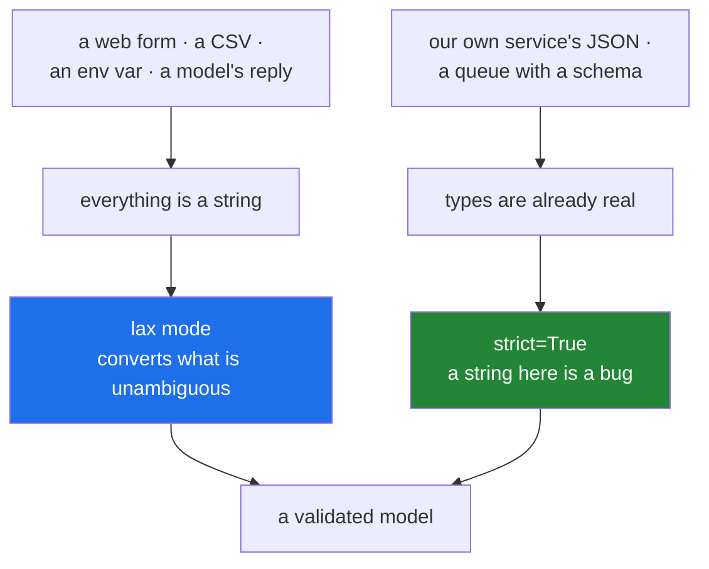

# 3.3 — Coercion: what Pydantic changes without asking, and `strict`

## One-line answer

By default Pydantic **converts** where the conversion is lossless and unambiguous — `"500"` becomes `500`,
`"yes"` becomes `True`, `500.5` is refused — and `strict=True` turns all of that off when the input is
already typed.

---

## The story

The person on the door does two different things, and the second one has a limit.

A form arrives with **500** typed in the weight box. She writes it down as a number, because there is only
one number that could be, and the depot's system has no way to type a number as anything but text. Nobody
would want her to reject it.

A form arrives with **quite heavy**. She refuses it, because there is no number in there and guessing
would be inventing data.

And a form arrives with **500.5**. This is the interesting one. The office's weight box takes whole grams —
the scales report whole grams — so a half is not a rounding to make, it is a sign that the form came from a
system that measures something else. She refuses it, and she is right to: converting it would silently
throw away information, and the person who wrote it needs to know.

Then the office started receiving forms from its own depots, over a system that carries real numbers. She
was told to stop converting for those: if a depot sends text where a number belongs, that is a bug in the
depot's software, and quietly fixing it means nobody ever finds out.

---

## The idea in plain language

Pydantic's default mode is called **lax**, and its rule is: convert when the conversion is unambiguous and
loses nothing; refuse otherwise.

What that means in practice, for the types you will meet:

| Field type | Accepts and converts | Refuses |
|---|---|---|
| `int` | `"500"`, `500.0`, `True` | `"heavy"`, `500.5`, `None` |
| `float` | `"0.5"`, `1`, `True` | `"half"` |
| `bool` | `"yes"`, `"true"`, `"on"`, `1`, `"1"` | `"maybe"`, `2` |
| `str` | nothing else, by default | `500`, `None` |
| `datetime` | an ISO 8601 string, a Unix timestamp | a free-text date |
| a model | a `dict` with the right shape | anything else |

Two rows are worth reading twice.

**`500.5` for an `int` is refused, and `500.0` is accepted.** The rule is losslessness: `500.0` is exactly
`500`, and `500.5` is not, so converting it would discard the half. That is a much better rule than
rounding, and it is the one thing about coercion that surprises people who expected `int()`.

**`str` does not accept a number.** A field annotated `str` given `500` is a `ValidationError`, not
`"500"`. Conversion goes towards the more specific type, not away from it, and this is deliberate: a
number arriving where text was expected is nearly always a mistake somewhere upstream.

**Why any of this at all.** Because most data arrives untyped. A web form, a CSV, a command line, a query
string, many databases and every environment variable give you strings and nothing else
([2.5](../02-dataclasses/2.5-not-a-validator.md)). Without coercion, every boundary would be a wall of
`int(...)` calls, each of which is a place to forget one.

**`strict=True` turns it off**, per model with `model_config = ConfigDict(strict=True)`, or per field with
`Field(strict=True)`. In strict mode `"500"` for an `int` is an error. Use it when the input is **already
typed** — JSON from a service you control, another model's output, a message from a queue with a real
schema — because there, a string where a number belongs is a bug that should be reported rather than
quietly repaired.

The rule to carry: **lax at an untyped boundary, strict at a typed one.** Forms and CSVs are untyped;
your own service's JSON is typed.

One more thing worth knowing: **JSON mode is subtly different from Python mode.** `model_validate_json`
knows the input is JSON, where `true` and `500` already have types, so it applies slightly stricter rules
than `model_validate` on a dictionary you built by hand
([3.4](3.4-model-dump-and-the-boundary.md)). It is rarely the thing that bites, and it is worth knowing
that the two paths are not identical.

---

## Why Setu needs it

- **Model replies are text.** From Day 172 a provider returns a JSON string, and a `confidence` field
  arriving as `"0.8"` rather than `0.8` is common enough that lax mode is the difference between a
  pipeline that works and one that retries constantly.
- **`TriageResult` is validated from a model's output** ([3.5](3.5-triage-result.md)), which is the
  untyped-boundary case exactly.
- **Day 3's configuration comes from environment variables**, which are always strings
  ([Day 3, 1.2](../../../day-03-keys-and-budget/parts/01-secrets/1.2-dotenv-and-os-environ.md)) — so a
  settings model reading `RETRIES=3` wants coercion, not a wall of `int(...)`.
- **Principle 4 is pin everything**, and a `random_state` that silently accepted `"42"` from one source and
  `42` from another is the kind of difference that makes two runs disagree for reasons nobody can find.

---

## The mechanism

The same three payloads through a lax model and a strict one:

```python
"""Coercion: what Pydantic changes without asking, and strict mode."""

from pydantic import BaseModel, ConfigDict, ValidationError


class Lax(BaseModel):
    grams: int
    ready: bool
    ratio: float


class Strict(BaseModel):
    model_config = ConfigDict(strict=True)
    grams: int
    ready: bool
    ratio: float


cases = [
    {"grams": "500", "ready": "yes", "ratio": "0.5"},
    {"grams": 500.0, "ready": 1, "ratio": 1},
    {"grams": 500.5, "ready": True, "ratio": 0.5},
]
for payload in cases:
    for cls in (Lax, Strict):
        try:
            print(f"{cls.__name__:7}", payload, "->", cls(**payload))
        except ValidationError as error:
            first = error.errors()[0]
            print(f"{cls.__name__:7}", payload, "-> REJECTED", first["loc"], first["type"])
    print()
```

**Line by line:**

- two models with **identical fields**, differing only in `model_config`. That is the whole experiment.
- `model_config = ConfigDict(strict=True)` — the v2 way to configure a model. In v1 this was an inner
  `class Config`, which is one of the clearest tells that something you are reading is out of date
  ([3.1](3.1-the-model-that-refuses.md)).
- three payloads: all strings, all wrong-but-lossless types, and one lossy value.
- `first["type"]` rather than the message — the stable code
  ([3.2](3.2-validationerror.md)).

Run on Python 3.12.12 with `pydantic==2.13.5` on 2026-09-02:

```
Lax     {'grams': '500', 'ready': 'yes', 'ratio': '0.5'} -> grams=500 ready=True ratio=0.5
Strict  {'grams': '500', 'ready': 'yes', 'ratio': '0.5'} -> REJECTED ('grams',) int_type

Lax     {'grams': 500.0, 'ready': 1, 'ratio': 1} -> grams=500 ready=True ratio=1.0
Strict  {'grams': 500.0, 'ready': 1, 'ratio': 1} -> REJECTED ('grams',) int_type

Lax     {'grams': 500.5, 'ready': True, 'ratio': 0.5} -> REJECTED ('grams',) int_from_float
Strict  {'grams': 500.5, 'ready': True, 'ratio': 0.5} -> REJECTED ('grams',) int_type
```

Three things to read off it.

**Row one.** Lax converted all three: a string of digits, the word `"yes"`, and a string of a decimal.
Strict refused the first field it reached.

**Row two.** `500.0` became `500` in lax mode — lossless, so allowed — and `1` became `True`. Strict
refused both.

**Row three is the important one.** `500.5` is refused **by lax mode too**, with a distinct code:
`int_from_float`. That is not strictness, it is the losslessness rule, and it is why lax mode is safe to
use at a boundary: it converts representations, never values.

Note also that strict's rejection is always `int_type`, whatever arrived — because in strict mode the
question is only "is this already an `int`", and the answer for a string and for a float is the same kind
of no.

Where each mode belongs:



---

## When it breaks

**`bool` accepting more than you expected:**

```text
$ uv run python -c "
from pydantic import BaseModel, ValidationError

class Flag(BaseModel):
    on: bool

for value in ['yes', 'no', 'true', 'off', '1', '0', 1, 0, 'maybe', 2]:
    try:
        print(f'{value!r:8} ->', Flag(on=value).on)
    except ValidationError:
        print(f'{value!r:8} -> REJECTED')
"
'yes'    -> True
'no'     -> False
'true'   -> True
'off'    -> False
'1'      -> True
'0'      -> False
1        -> True
0        -> False
'maybe'  -> REJECTED
2        -> REJECTED
```

**What it means.** The accepted set is wider than most people guess — `"yes"`, `"off"`, `"1"` — and it
stops exactly where ambiguity starts: `"maybe"` and `2` are refused. That is usually what you want from a
form or an environment variable, and it is a surprise if you assumed only `True`/`False`. **The thing to
check is your own data's conventions**: a source that uses `"Y"` and `"N"` is not covered and needs a
validator.

**A number where a string was annotated:**

```text
$ uv run python -c "
from pydantic import BaseModel, ValidationError

class Parcel(BaseModel):
    reference: str

try:
    Parcel(reference=7741)
except ValidationError as error:
    print(error.errors()[0]['type'], '-', error.errors()[0]['msg'])
"
string_type - Input should be a valid string
```

**What it means.** Coercion is **not** symmetric. `"500"` becomes `500`, and `500` does not become
`"500"`. The reasoning is that a number arriving where text was expected almost always means an upstream
system changed a field's type, and silently stringifying it would hide that. If you genuinely want it,
`coerce_numbers_to_str=True` in `ConfigDict` says so out loud.

**Losing precision that lax mode would have caught:**

```text
$ uv run python -c "
from pydantic import BaseModel, ValidationError

class Parcel(BaseModel):
    grams: int

print('int() would give :', int(500.9))
try:
    Parcel(grams=500.9)
except ValidationError as error:
    print('Pydantic gives   :', error.errors()[0]['type'])
"
int() would give : 500
Pydantic gives   : int_from_float
```

**What it means.** `int(500.9)` is `500` — a silent truncation, and one of the oldest ways to lose data in
a pipeline ([Day 5, 1.2](../../../day-05-operators-and-conditionals/parts/01-operators/1.2-the-two-divisions.md)).
Pydantic refuses instead, and the code `int_from_float` says precisely why. **This is the behaviour to
rely on**: a boundary that would have truncated now reports, and the report names the field.

**Strict mode applied to an untyped source:**

```text
$ uv run python -c "
import os
from pydantic import BaseModel, ConfigDict, ValidationError

os.environ['RETRIES'] = '3'

class Settings(BaseModel):
    model_config = ConfigDict(strict=True)
    retries: int

try:
    Settings(retries=os.environ['RETRIES'])
except ValidationError as error:
    print('strict rejected an env var:', error.errors()[0]['type'])
print('because os.environ values are always', type(os.environ['RETRIES']).__name__)
"
strict rejected an env var: int_type
because os.environ values are always str
```

**What it means.** Strict mode is correct and in the wrong place. Every environment variable is a string —
there is no other option in the operating system — so a strict settings model rejects every numeric
setting, and the fix people reach for is `int(os.environ[...])` at each call site, which is exactly the
wall of conversions that coercion existed to remove. **Strict belongs where the source has real types**,
not everywhere.

**Assuming JSON mode and Python mode behave identically:**

```text
$ uv run python -c "
from pydantic import BaseModel, ValidationError

class Parcel(BaseModel):
    grams: int

print('from a dict:', Parcel.model_validate({'grams': '500'}).grams)
print('from json  :', Parcel.model_validate_json('{\"grams\": \"500\"}').grams)
"
from a dict: 500
from json  : 500
```

**What it means.** Here they agree, and they do not always — JSON mode knows more about what the input
*was*, so some conversions that lax Python mode allows are treated differently. It is rarely the thing
that bites, and it is worth knowing the two paths exist so that "it validated as a dict and not as JSON"
is a sentence you can make sense of rather than a mystery.

---

## In production

**The professional habit is lax at untyped boundaries, strict at typed ones, decided per model and written
in `model_config` where a reader can see it.** The decision is about the *source*, not about taste: if the
thing on the other side cannot express types, coercion is doing necessary work; if it can, coercion is
hiding a bug in it.

**What changes at scale is that coercion becomes a compatibility layer you did not know you had.** A
partner starts sending `"true"` instead of `true`, or an identifier as a number instead of a string, and
your service keeps working — which is either a relief or a problem depending on whether you wanted to
know. Teams that care about the contract turn on `strict=True` for internal traffic precisely so that
drift is reported on the first message rather than absorbed for six months.

**The failure that only appears with real data is the value that coerces to something plausible.** `"0"`
becomes `False` for a `bool` field, which is right — and if the upstream system uses `"0"` to mean "not
set" rather than "false", every unset flag is now an explicit `False` and nothing distinguishes them.
Coercion cannot know your domain's conventions; it only knows the types. The defence is that a field whose
source has conventions gets a validator that states them, rather than relying on the default.

**The review comment a senior engineer leaves.** *"This model is `strict=True` and it reads from
`os.environ`, so every numeric setting is rejected. Drop strict on this one — the source is untyped by
definition. Keep it on `ProviderResponse`, where the JSON comes from our own service and a string in a
float field means their serialiser regressed."*

**The interview question.** *"Does Pydantic convert types?"* Yes, by default, and the rule is
losslessness: `"500"` and `500.0` become `500`, and `500.5` is **refused** rather than truncated, which is
the part people do not expect. Conversion is also asymmetric — a number is not turned into a string —
because that direction usually means an upstream type changed. Then the judgement: `strict=True` turns it
all off, and it belongs where the input already has real types; at a form, a CSV or an environment
variable everything is a string and strict mode rejects perfectly good data.

---

## Check yourself

```bash
uv run python -c "
from pydantic import BaseModel, ValidationError

class Parcel(BaseModel):
    grams: int
    ready: bool

for payload in [
    {'grams': '500', 'ready': 'yes'},
    {'grams': 500.0, 'ready': 1},
    {'grams': 500.5, 'ready': True},
    {'grams': 'heavy', 'ready': 'maybe'},
]:
    try:
        print(payload, '->', Parcel(**payload))
    except ValidationError as error:
        print(payload, '-> REJECTED', [e['type'] for e in error.errors()])
"
```

Two accepted, two refused, and one of the refusals is about losing information rather than about types.
Name it.

**Answer out loud, without scrolling up:**

> Say why `500.0` is accepted for an `int` field and `500.5` is not, and say which kind of data source
> `strict=True` belongs on.

---

**Next:** [3.4 — `model_dump`, `model_validate_json`, and the boundary they belong at](3.4-model-dump-and-the-boundary.md).
