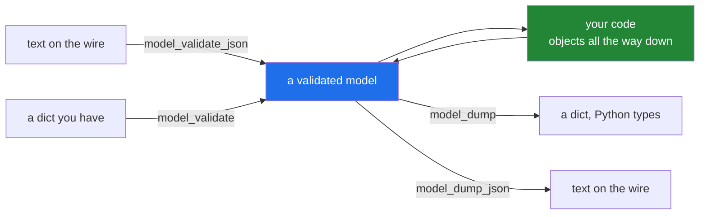

# 3.4 — `model_dump`, `model_validate_json`, and the boundary they belong at

## One-line answer

`model_validate_json` turns text into a checked object in one step and `model_dump_json` turns it back —
so the model is the only place that knows the wire format, and everything inside works on objects.

---

## The story

The door has two directions, and for a while only one of them had a person on it.

Forms coming **in** were checked and converted. Forms going **out** — to the depot, to the customer, to
the agency — were typed up by whoever happened to be sending them, from the office's own records, by hand.

Which produced a slow and infuriating class of problem. The depot's system wants dates as
*year-month-day*; one person wrote them that way and another wrote *day/month/year*, and both were sure
they were following the convention. The customer's copy included the internal reference number, because
it was on the record and nobody had decided it should not be.

So the same person got the outgoing tray as well. One place that knows what the depot's format is, one
place that knows what the customer is allowed to see. The records inside the office stayed exactly as they
were; only the translation moved.

---

## The idea in plain language

A model is a translator, and it works in both directions.

**Coming in**, there are two entry points:

- `Parcel.model_validate(some_dict)` — from a dictionary you already have.
- `Parcel.model_validate_json(text)` — from a **JSON string**, parsed and validated in one call.

Prefer the second when the input is text. It is one step rather than two, and it lets Pydantic apply JSON
mode ([3.3](3.3-coercion-and-strict.md)), which knows more about what the input actually was than
`json.loads` followed by `model_validate` can.

**Going out**, there are two exits:

- `p.model_dump()` — a dictionary. Values stay as Python objects: a `datetime` is still a `datetime`.
- `p.model_dump_json()` — a **JSON string**, with everything serialised properly: that `datetime` becomes
  an ISO 8601 string.

That difference is the one to hold on to. `model_dump()` gives you a dictionary that `json.dumps` may well
refuse, because it still contains `datetime`, `Decimal`, `UUID` and `Enum` objects. `model_dump_json()`
knows how to write every type the model declares, which is why it exists as a separate method rather than
`json.dumps(model_dump())`.

Both dumps take the same two useful arguments:

| Argument | Effect |
|---|---|
| `exclude={"api_key"}` | leave fields out — the outgoing version of `repr=False` ([2.2](../02-dataclasses/2.2-default-factory.md)) |
| `include={"pid", "grams"}` | the opposite: only these |
| `exclude_none=True` | drop fields that are `None` |
| `by_alias=True` | use the wire names rather than the Python ones |

`exclude` is the one that matters for safety: a model holding a token or personal data has an outgoing
shape that is not its internal shape, and saying so once on the dump is better than remembering at every
call site (Principle 11).

**And the round trip should hold.** `Parcel.model_validate_json(p.model_dump_json()) == p` is a property
worth asserting in a test — it catches a field that serialises to something it cannot parse back, which is
the usual symptom of a custom type added without a serialiser.

**Where all four belong: at the edge, once.** Text arrives, `model_validate_json` turns it into an object,
and from there inward everything works on objects. On the way out, `model_dump_json` at the last moment.
Inside, no dictionaries and no JSON — which is the same boundary rule as
[2.5](../02-dataclasses/2.5-not-a-validator.md) and
[3.1](3.1-the-model-that-refuses.md), now stated for both directions.

---

## Why Setu needs it

- **Day 16 chose JSONL as the project's record format**
  ([Day 16, 2.5](../../../day-16-files-and-context-managers/parts/02-reading-and-writing/2.5-jsonl.md)),
  and every line of it is a string that wants `model_validate_json` on the way in and `model_dump_json`
  on the way out.
- **`TriageResult` is what a model returns and what gets stored** ([3.5](3.5-triage-result.md)) — both
  directions, same class.
- **Day 172's provider replies are JSON strings**, and `model_validate_json` is the single line between
  raw text and a usable result.
- **Principle 11 is blast radius**, and `exclude={"api_key"}` on the outgoing dump is where a settings
  object stops leaking into a response body.

---

## The mechanism

One model, both directions, including a type JSON has no idea about:

```python
"""model_dump, model_dump_json, model_validate_json - the boundary in both directions."""

from datetime import datetime

from pydantic import BaseModel


class Address(BaseModel):
    line1: str
    postcode: str


class Parcel(BaseModel):
    pid: int
    grams: int
    booked_at: datetime
    to: Address


text = (
    '{"pid": 7741, "grams": 500, "booked_at": "2026-09-02T09:15:00", '
    '"to": {"line1": "12 High St", "postcode": "BS1 4DJ"}}'
)

p = Parcel.model_validate_json(text)
print("parsed      :", p)
print("booked_at is:", type(p.booked_at).__name__)
print("model_dump      :", p.model_dump())
print("model_dump_json :", p.model_dump_json())
print("round trip equal:", Parcel.model_validate_json(p.model_dump_json()) == p)
```

**Line by line:**

- `booked_at: datetime` — a type JSON cannot represent. This is the field that makes the two dump methods
  differ.
- `Parcel.model_validate_json(text)` — **a classmethod**
  ([Day 15, 1.1](../../../day-15-constructors-and-dunders/parts/01-three-kinds-of-method/1.1-the-method-that-gets-the-class.md)),
  called on the class rather than an instance, because it is building one. One step from text to object.
- `type(p.booked_at).__name__` — proof that the ISO string became a real `datetime`, which is what makes
  arithmetic on it possible downstream.
- `p.model_dump()` — a dictionary. **Look at what `booked_at` is in it.**
- `p.model_dump_json()` — a string, with `booked_at` serialised to ISO 8601 and the nested `Address`
  flattened back into a nested object.
- the round trip — `==` on two models compares field by field, the same as a dataclass
  ([2.1](../02-dataclasses/2.1-what-dataclass-writes.md)).

Run on Python 3.12.12 with `pydantic==2.13.5` on 2026-09-02:

```
parsed      : pid=7741 grams=500 booked_at=datetime.datetime(2026, 9, 2, 9, 15) to=Address(line1='12 High St', postcode='BS1 4DJ')
booked_at is: datetime

model_dump      : {'pid': 7741, 'grams': 500, 'booked_at': datetime.datetime(2026, 9, 2, 9, 15), 'to': {'line1': '12 High St', 'postcode': 'BS1 4DJ'}}

model_dump_json : {"pid":7741,"grams":500,"booked_at":"2026-09-02T09:15:00","to":{"line1":"12 High St","postcode":"BS1 4DJ"}}

round trip equal: True
```

**Compare the two dumps on `booked_at`.** In the dictionary it is `datetime.datetime(2026, 9, 2, 9, 15)`;
in the JSON it is `"2026-09-02T09:15:00"`. The dictionary is for Python code; the string is for the wire.
Note also that `to` became a nested dictionary in one and a nested JSON object in the other — the
recursion goes all the way down in both.

And the failure path, which is the same one call:

```python
from pydantic import BaseModel, ValidationError


class Parcel(BaseModel):
    pid: int
    grams: int
    booked_at: str
    to: dict


try:
    Parcel.model_validate_json('{"pid": "x"}')
except ValidationError as error:
    print("bad json  :", error.error_count(), "problems")
    for e in error.errors():
        print("   ", e["loc"], e["type"])
```

**Line by line:**

- `'{"pid": "x"}'` — valid JSON, invalid `Parcel`: one bad field and three missing ones.
- `except ValidationError` — the same exception as any other validation
  ([3.2](3.2-validationerror.md)). **Malformed JSON also raises `ValidationError`**, not
  `json.JSONDecodeError`, which is worth knowing: one handler covers both "not JSON" and "not a Parcel".

```
bad json  : 4 problems
    ('pid',) int_parsing
    ('grams',) missing
    ('booked_at',) missing
    ('to',) missing
```

The boundary, drawn:



---

## When it breaks

**`json.dumps(model_dump())`, which is the version people write first:**

```text
$ uv run python -c "
import json
from datetime import datetime
from pydantic import BaseModel

class Parcel(BaseModel):
    pid: int
    booked_at: datetime

p = Parcel(pid=1, booked_at='2026-09-02T09:15:00')
try:
    print(json.dumps(p.model_dump()))
except TypeError as error:
    print('json.dumps failed:', error)
print('model_dump_json  :', p.model_dump_json())
"
json.dumps failed: Object of type datetime is not JSON serializable
model_dump_json  : {"pid":1,"booked_at":"2026-09-02T09:15:00"}
```

**What it means.** `model_dump()` produced a perfectly good dictionary containing a `datetime`, and
`json.dumps` has no idea what to do with one. This is the exact reason `model_dump_json` exists: it knows
every type the model declares and how to write it. The workaround people reach for —
`json.dumps(..., default=str)` — turns a `datetime` into a string that may not parse back, breaking the
round trip silently.

**Serialising a secret, three ways:**

```text
$ uv run python -c "
from pydantic import BaseModel, Field, SecretStr

class Remembered(BaseModel):
    provider: str
    api_key: str

class Permanent(BaseModel):
    provider: str
    api_key: str = Field(exclude=True)

class Secret(BaseModel):
    provider: str
    api_key: SecretStr

r = Remembered(provider='groq', api_key='sk-live-abc123')
p = Permanent(provider='groq', api_key='sk-live-abc123')
s = Secret(provider='groq', api_key='sk-live-abc123')
print('remembered, forgot :', r.model_dump_json())
print('permanent          :', p.model_dump_json())
print('secret str, repr   :', s)
print('secret str, dump   :', s.model_dump_json())
print('and the value      :', s.api_key.get_secret_value())
"
remembered, forgot : {"provider":"groq","api_key":"sk-live-abc123"}
permanent          : {"provider":"groq"}
secret str, repr   : provider='groq' api_key=SecretStr('**********')
secret str, dump   : {"provider":"groq","api_key":"**********"}
and the value      : sk-live-abc123
```

**Line by line:**

- `Remembered` — an ordinary `str` field. `model_dump_json(exclude={"api_key"})` at the call site works
  perfectly; the failure is **forgetting it**, at one of the eleven places this object gets serialised.
  The first line is what that looks like.
- `api_key: str = Field(exclude=True)` — the exclusion attached to the **field**, so every dump drops it
  without anybody remembering. One decision, at the definition.
- `api_key: SecretStr` — stronger. The value is masked in the `repr`
  ([Day 18, 3.3](../../../day-18-exceptions/parts/03-your-own/3.3-the-message-is-an-interface.md)) **and**
  in the dump, so it cannot reach a log or a response body by accident, and reading it requires the
  deliberate `get_secret_value()`.

**What it means.** All three "work"; only two of them keep working when somebody adds a twelfth
serialisation site. `Field(exclude=True)` or `SecretStr` moves the protection from the call site to the
class, which is the same argument as `field(repr=False)` on a dataclass
([2.2](../02-dataclasses/2.2-default-factory.md)) and Principle 11's blast radius. **And assert it in a
test regardless** ([Day 18, 4.4](../../../day-18-exceptions/parts/04-in-anger/4.4-pytest-raises.md)): the
assertion is `"sk-" not in payload`, and it costs one line.

**Validating in both directions, twice:**

```python
def handle(text: str) -> str:
    parcel = Parcel.model_validate_json(text)
    checked = Parcel.model_validate(parcel.model_dump())
    return checked.model_dump_json()
```

**Line by line:**

- `model_validate_json(text)` — the boundary. Correct.
- `Parcel.model_validate(parcel.model_dump())` — a full serialise and a full re-validate, of an object
  that was validated one line earlier and cannot have changed.
- three passes over the data where one was needed.

**What it means.** Validation is a boundary activity ([3.1](3.1-the-model-that-refuses.md)), and this is
the same mistake as re-validating inside a function, made visible by the round trip. In a request handler
this is measurable: two extra passes over every payload, on every request.

**Assuming `model_dump()` is JSON-shaped:**

```text
$ uv run python -c "
from datetime import datetime
from pydantic import BaseModel

class Parcel(BaseModel):
    booked_at: datetime

d = Parcel(booked_at='2026-09-02T09:15:00').model_dump()
print('type in the dict:', type(d['booked_at']).__name__)
print('and in JSON mode:', type(Parcel(booked_at='2026-09-02T09:15:00').model_dump(mode='json')['booked_at']).__name__)
"
type in the dict: datetime
and in JSON mode: str
```

**What it means.** `model_dump()` gives Python objects and `model_dump(mode="json")` gives JSON-compatible
ones — a dictionary you *can* hand to `json.dumps`, or to a library that expects plain types. Knowing that
`mode="json"` exists is the answer to "I need a dict, but a serialisable one", which otherwise sends
people to `json.loads(model_dump_json())` and two more passes.

---

## In production

**The professional shape is that the model owns the wire format and nothing else knows it.** One call in,
one call out, both at the edge. Inside, every function takes and returns model objects, so a change to the
wire format — a renamed field, a new date encoding — is a change to one class rather than to every place
that touched a dictionary.

**What changes at scale is that the outgoing shape stops being the internal shape.** The same record has an
internal form, a public API form and a form the analytics pipeline gets, and those differ in which fields
they carry. `exclude`, `include` and field aliases handle that declaratively, which means a new sensitive
field is one decision in one place rather than an audit of every serialisation site. Teams that skip this
end up with hand-built dictionaries scattered through the codebase and no way to answer "does this endpoint
return the customer's email".

**The failure that only appears with real data is the type that does not round-trip.** A custom type — a
money amount, a domain identifier — serialises to something that looks right and parses back as something
subtly different, or not at all. Every fixture round-trips because the fixtures were built from the same
code. The test that catches it is the property assertion above:
`Model.model_validate_json(obj.model_dump_json()) == obj`, run over real records, and it is one of the
highest-value tests in a serialisation layer.

**The review comment a senior engineer leaves.** *"`json.dumps(model.model_dump())` will raise on the
`created_at` field the moment somebody makes it a `datetime` — use `model_dump_json()`, or
`model_dump(mode='json')` if you genuinely need a dict. And this endpoint dumps the whole settings object;
add an explicit `include` so a new field is not published by default."*

**The interview question.** *"How do you get a Pydantic model in and out of JSON?"* `model_validate_json`
in and `model_dump_json` out, both at the boundary, once each. The detail that shows use: `model_dump()`
returns a dictionary of **Python** objects, so it can contain a `datetime` that `json.dumps` refuses —
`model_dump(mode="json")` is the JSON-compatible dictionary, and `model_dump_json()` is the string. And
the property worth testing is the round trip, because a type that serialises to something it cannot parse
back fails silently everywhere except there.

---

## Check yourself

```bash
uv run python -c "
from datetime import datetime
from pydantic import BaseModel

class Parcel(BaseModel):
    pid: int
    booked_at: datetime

p = Parcel.model_validate_json('{\"pid\": 7741, \"booked_at\": \"2026-09-02T09:15:00\"}')
print('dump      :', p.model_dump())
print('dump json :', p.model_dump_json())
print('mode=json :', p.model_dump(mode='json'))
print('round trip:', Parcel.model_validate_json(p.model_dump_json()) == p)
"
```

Three dumps of one object, and only two of them could be handed to `json.dumps`. Say which.

**Answer out loud, without scrolling up:**

> Name the difference between `model_dump()` and `model_dump_json()`, and say which field type makes it
> matter.

---

**Next:** [3.5 — `TriageResult`: the contract reused from Day 172 to Day 240](3.5-triage-result.md).
