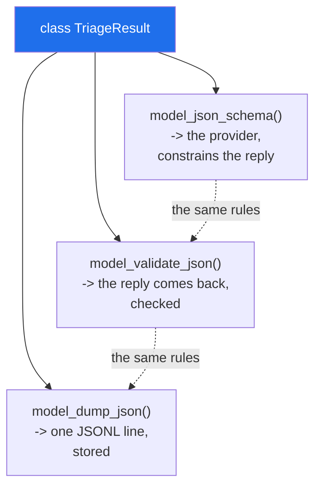

# 3.5 — `TriageResult`: the contract reused from Day 172 to Day 240

## One-line answer

One model class defines what a triage answer **is** — the allowed labels, the confidence range, the reason
length — and that one definition becomes the validator, the schema you hand the model provider, and the
stored record.

---

## The story

The office ended up with one card that mattered more than the rest.

It is the *decision* card. Every parcel that arrives gets one: what happened to it, how sure the person
was, and why. Three boxes, and they are the same three boxes whether the decision was made at the counter,
at the depot, by the night shift or by the agency.

That sameness is not tidiness. It is what lets somebody count last month's decisions. It is what lets the
agency send their decisions in and have them filed alongside everybody else's. It is what makes "show me
every parcel where the person was unsure" a question with an answer.

And the reason it stayed the same for twelve years is that the boxes are printed, and the printed sheet
is the only version. When somebody wanted a fourth box, they had to change the sheet, and changing the
sheet is a decision somebody makes on purpose rather than a habit that drifts.

---

## The idea in plain language

This part is the day's ID made concrete: the plan names **`TriageResult` as a Pydantic model — the
contract reused from Day 172 to Day 240**.

Triage means deciding what a thing is. Given a support ticket, a bug report, an issue: which category does
it belong to, how confident are we, and why. From Day 172 that decision is made by a language model, and
the model returns text. `TriageResult` is what turns that text into something the rest of the system can
rely on.

Four fields, and every one is a decision:

**`label` is an enumeration, not a string.** A `str` field would accept `"urgent"`, `"Bug"`, `"bugs"` and
`"probably a bug"`. A `StrEnum` accepts exactly three values and rejects everything else — and, because it
is a `StrEnum`, it still compares equal to a plain string, so downstream code reads naturally.

**`confidence` is a float with a range.** `Field(ge=0.0, le=1.0)`. Models return `1.5` and `-0.2` more
often than you would expect, and a confidence outside the range is not a number to clamp, it is a sign
the reply is unreliable.

**`reason` has a minimum and a maximum length.** The minimum stops an empty string counting as an
explanation; the maximum stops a model writing four paragraphs into a field that a person will read in a
list.

**`tags` is a list with a default factory.** The same idea as
[2.2](../02-dataclasses/2.2-default-factory.md), spelt the same way, so an absent `tags` is an empty list
rather than a missing field.

Two configuration choices, both deliberate:

**`frozen=True`** — a result is a value, not a thing
([2.3](../02-dataclasses/2.3-frozen-slots-kw-only.md)). Nothing downstream should be adjusting a
confidence score, and freezing it makes that impossible rather than merely discouraged.

**`extra="forbid"`** — a field the model invented is an error, not something to ignore
([3.1](3.1-the-model-that-refuses.md)). When a model returns `{"label": "bug", "certainty": 0.8}` it has
misunderstood the schema, and you want to know rather than to receive a result with a default confidence.

And the piece that makes this pay for itself: **`model_json_schema()`**. The same class produces a JSON
Schema document, and that document is what you hand a provider's structured-output mode so the model is
constrained to produce a matching reply. One definition, three uses: the schema going out, the validation
coming back, and the stored record.

---

## Why Setu needs it

- **It is the plan's named example for `PY-23`**, described as the contract reused from Day 172 to Day
  240 — which is most of the second half of this curriculum.
- **Day 172's router returns one of these per call**, whichever provider answered, so the four providers'
  differing reply shapes become one type at the boundary
  ([Day 18, 3.4](../../../day-18-exceptions/parts/03-your-own/3.4-translate-at-the-boundary.md)).
- **Day 233's eval suite scores these**, and the fact that `label` is an enumeration is what makes
  "accuracy" computable without normalising strings first.
- **Day 240's capstone stores them as JSONL**
  ([Day 16, 2.5](../../../day-16-files-and-context-managers/parts/02-reading-and-writing/2.5-jsonl.md)),
  one `model_dump_json()` per line ([3.4](3.4-model-dump-and-the-boundary.md)).

---

## The mechanism

The class, and a reply going through it:

```python
"""TriageResult - the contract a model must fill in, reused from Day 172 to Day 240."""

from enum import StrEnum

from pydantic import BaseModel, ConfigDict, Field


class Label(StrEnum):
    BUG = "bug"
    FEATURE = "feature"
    QUESTION = "question"


class TriageResult(BaseModel):
    model_config = ConfigDict(frozen=True, extra="forbid")

    label: Label
    confidence: float = Field(ge=0.0, le=1.0)
    reason: str = Field(min_length=1, max_length=280)
    tags: list[str] = Field(default_factory=list)


reply = (
    '{"label": "bug", "confidence": 0.82, "reason": "traceback in the report", "tags": ["crash"]}'
)
r = TriageResult.model_validate_json(reply)
print("parsed    :", r)
print("label is  :", type(r.label).__name__, "and compares as a str:", r.label == "bug")
print("json out  :", r.model_dump_json())
```

**Line by line:**

- `class Label(StrEnum):` — an enumeration whose members are also strings. `StrEnum` arrived in Python
  3.11; before it you would write `class Label(str, Enum)`, which you will see in older code.
- three members, lower-case, matching what a model is asked to produce. **The values are the wire format**,
  so they are chosen for the prompt and the JSON, not for Python style.
- `model_config = ConfigDict(frozen=True, extra="forbid")` — the two decisions, in one line, where a
  reader sees them ([3.1](3.1-the-model-that-refuses.md), [2.3](../02-dataclasses/2.3-frozen-slots-kw-only.md)).
- `label: Label` — the enumeration as a type. Pydantic checks membership.
- `confidence: float = Field(ge=0.0, le=1.0)` — `ge` and `le` are inclusive; `gt`/`lt` are the exclusive
  pair. Confidence of exactly 0 or 1 is meaningful, so inclusive is right here.
- `reason: str = Field(min_length=1, max_length=280)` — **both bounds**. The minimum is the one people
  forget, and it is what stops `""` counting as a reason.
- `tags: list[str] = Field(default_factory=list)` — the mutable-default rule, in Pydantic's spelling
  ([2.2](../02-dataclasses/2.2-default-factory.md)).
- `TriageResult.model_validate_json(reply)` — text to object, one step
  ([3.4](3.4-model-dump-and-the-boundary.md)).
- `r.label == "bug"` — the `StrEnum` payoff: downstream code compares against a plain string and it works.

Run on Python 3.12.12 with `pydantic==2.13.5` on 2026-09-02:

```
parsed    : label=<Label.BUG: 'bug'> confidence=0.82 reason='traceback in the report' tags=['crash']
label is  : Label and compares as a str: True
json out  : {"label":"bug","confidence":0.82,"reason":"traceback in the report","tags":["crash"]}
```

**`label` is a `Label` inside and the string `"bug"` on the wire.** That is the enumeration doing both
jobs at once.

Now the four replies a model actually produces when it is having a bad day:

```python
from pydantic import ValidationError

for bad in [
    '{"label": "urgent", "confidence": 0.8, "reason": "x"}',
    '{"label": "bug", "confidence": 1.5, "reason": "x"}',
    '{"label": "bug", "confidence": "high", "reason": ""}',
    '{"label": "bug", "confidence": 0.8, "reason": "x", "notes": "extra"}',
]:
    try:
        TriageResult.model_validate_json(bad)
        print("accepted:", bad)
    except ValidationError as error:
        print("rejected:", [(".".join(map(str, e["loc"])), e["type"]) for e in error.errors()])
```

**Line by line:**

- the first — a label outside the set. **This is the most common model failure**: it invents a category
  that seems reasonable.
- the second — a confidence above 1. Also common, and a plain `float` field would have accepted it.
- the third — two problems at once, a non-numeric confidence and an empty reason.
- the fourth — a field the model invented, caught only because of `extra="forbid"`.
- `".".join(map(str, e["loc"]))` — the location path flattened
  ([3.2](3.2-validationerror.md)).

```
rejected: [('label', 'enum')]
rejected: [('confidence', 'less_than_equal')]
rejected: [('confidence', 'float_parsing'), ('reason', 'string_too_short')]
rejected: [('notes', 'extra_forbidden')]
```

**Four different codes for four different failures**, each naming its field. That list is what goes into a
retry prompt: telling a model *which field was wrong and why* is far more effective than asking it to try
again.

And the third use of the same class:

```text
$ uv run python -c "import json; print(json.dumps(TriageResult.model_json_schema(), indent=2))"
  "additionalProperties": false,
  "properties": {
    "label": {
      "$ref": "#/$defs/Label"
    },
    "confidence": {
      "maximum": 1.0,
      "minimum": 0.0,
      "title": "Confidence",
      "type": "number"
    },
    "reason": {
      "maxLength": 280,
      "minLength": 1,
      "title": "Reason",
      "type": "string"
    },
    "tags": {
      "items": {
        "type": "string"
      },
      "title": "Tags",
      "type": "array"
    }
  },
  "required": [
    "label",
    "confidence",
    "reason"
  ],
  "title": "TriageResult",
  "type": "object"
}
```

**Every constraint made it into the schema.** `minimum` and `maximum` from the `Field`,
`additionalProperties: false` from `extra="forbid"`, `required` listing the three fields without defaults.
Hand this to a provider's structured-output mode and the model is constrained to produce something that
validates — which is why the same class serving all three roles is worth more than the sum of them.

One class, three jobs:



---

## When it breaks

**A plain `str` label, which accepts anything plausible:**

```text
$ uv run python -c "
from pydantic import BaseModel

class Loose(BaseModel):
    label: str

for value in ['bug', 'Bug', 'bugs', 'probably a bug', 'urgent']:
    print(f'{value!r:18} ->', Loose(label=value).label)
"
'bug'              -> bug
'Bug'              -> Bug
'bugs'             -> bugs
'probably a bug'   -> probably a bug
'urgent'           -> urgent
```

**What it means.** Five different answers to a three-way question, all accepted. Downstream, `label ==
"bug"` is `False` for four of them, so a dashboard counting bugs undercounts and nobody can see why. The
enumeration is one extra class and it converts this whole category of problem into a rejection with a
location.

**A confidence with no range:**

```text
$ uv run python -c "
from pydantic import BaseModel

class Loose(BaseModel):
    confidence: float

for value in [0.8, 1.5, -0.2, 95]:
    print(f'{value!r:6} ->', Loose(confidence=value).confidence)
"
0.8    -> 0.8
1.5    -> 1.5
-0.2   -> -0.2
95     -> 95.0
```

**What it means.** `95` is a model answering in percent, which happens, and it is accepted as a
confidence of ninety-five. Every threshold downstream — "route to a human below 0.5" — is now wrong for
that record, silently, in the direction of *more* confident. `Field(ge=0.0, le=1.0)` turns it into a
rejection naming the field, which a retry can act on.

**`extra="ignore"`, and the field the model renamed:**

```text
$ uv run python -c "
from pydantic import BaseModel, Field

class Loose(BaseModel):
    label: str
    confidence: float = 0.5

r = Loose.model_validate_json('{\"label\": \"bug\", \"certainty\": 0.9}')
print('accepted:', r)
print('and the confidence is the DEFAULT, not the model answer')
"
accepted: label='bug' confidence=0.5
and the confidence is the DEFAULT, not the model answer
```

**What it means.** The model said `certainty` instead of `confidence`. With the default `extra="ignore"`,
that field is dropped and the default fills in — so the record says the model was 50% confident when it
said 90%. **Nothing is logged and nothing raises.** `extra="forbid"` makes it a rejection with the
offending name, which is a retry rather than a wrong number in a dataset.

**A mutable result:**

```text
$ uv run python -c "
from pydantic import BaseModel, ConfigDict, ValidationError

class Frozen(BaseModel):
    model_config = ConfigDict(frozen=True)
    confidence: float

r = Frozen(confidence=0.82)
try:
    r.confidence = 0.99
except ValidationError as error:
    print('refused:', error.errors()[0]['type'])
"
refused: frozen_instance
```

**What it means.** With `frozen=True` this is a rejection; without it, some code somewhere adjusts a
confidence and the stored record no longer reflects what the model said. That matters more than it sounds
for an eval suite: a score computed from adjusted confidences measures the adjustment, not the model
(Principle 7).

**Changing the schema without changing the stored records:**

```python
class TriageResult(BaseModel):
    label: Label
    confidence: float = Field(ge=0.0, le=1.0)
    reason: str
    severity: int  # added today, no default
```

**Line by line:**

- `severity: int` with **no default** — required.
- every record written before today has no `severity`.
- `model_validate_json` on any of them now raises `missing`
  ([3.2](3.2-validationerror.md)).

**What it means.** The contract is reused from Day 172 to Day 240, which means records written on Day 180
must still parse on Day 239. A new required field breaks every one of them. The rule for a long-lived
contract is that **new fields get defaults**, `severity: int = 0` or `severity: int | None = None`
([1.3](../01-type-hints/1.3-optional-and-the-none-you-forgot.md)), and a field is only made required in a
version that also migrates the stored data.

---

## In production

**The professional habit is one model per external contract, with constraints that say what the domain
actually allows, and a version policy for changing it.** The constraints are not decoration: each one is
a failure mode somebody has seen, written down where it will be enforced rather than in a comment nobody
reads.

**What changes at scale is that the model becomes the coordination point between systems that never talk
to each other.** The prompt is generated from the schema, the provider's structured output is constrained
by the schema, the validation uses the schema, the database column types follow from it, and the
dashboard's category list is the enumeration. One class change propagates to all of them; five hand-kept
copies of the same rules do not.

**The failure that only appears with real data is the model's creativity.** A language model asked for one
of three labels will, at some rate, produce a fourth — and at a lower rate produce a confidence of `"very
high"`, an empty reason, or an extra field it thought would be helpful. None of that appears in
development, where the prompts are curated and the sample is small. It appears at volume, and a strict
model turns it from silent data corruption into a measurable rejection rate you can put on a dashboard and
improve.

**The review comment a senior engineer leaves.** *"`label: str` here means we will get `Bug`, `bugs` and
`probably a bug` in the dataset within a week — make it a `StrEnum` and let it reject. And this model is
`extra='ignore'`, so when the provider renames a field we will silently store defaults; forbid extras on
anything we parse from a model reply."*

**The interview question.** *"How do you get structured output from a language model reliably?"* Define
the shape as a Pydantic model with real constraints — an enumeration rather than a string for categories,
a bounded range for scores, length bounds on text — then use `model_json_schema()` to constrain the
provider's output and `model_validate_json` to check what comes back, and put the `errors()` list into the
retry prompt so the model is told which field was wrong. The judgement details: `extra="forbid"` so an
invented or renamed field is a rejection rather than a silent default, `frozen=True` so nothing downstream
edits a result, and new fields always get defaults because stored records outlive the schema.

---

## Check yourself

```bash
uv run python -c "
from enum import StrEnum
from pydantic import BaseModel, ConfigDict, Field, ValidationError

class Label(StrEnum):
    BUG = 'bug'
    FEATURE = 'feature'

class TriageResult(BaseModel):
    model_config = ConfigDict(frozen=True, extra='forbid')
    label: Label
    confidence: float = Field(ge=0.0, le=1.0)
    reason: str = Field(min_length=1)

print('good :', TriageResult.model_validate_json('{\"label\": \"bug\", \"confidence\": 0.8, \"reason\": \"traceback\"}'))
for bad in ['{\"label\": \"urgent\", \"confidence\": 0.8, \"reason\": \"x\"}',
            '{\"label\": \"bug\", \"confidence\": 95, \"reason\": \"\"}']:
    try:
        TriageResult.model_validate_json(bad)
    except ValidationError as error:
        print('bad  :', [(e['loc'][0], e['type']) for e in error.errors()])
"
```

Three rejections across two replies. Say which constraint caught each.

**Answer out loud, without scrolling up:**

> Name the three jobs one `TriageResult` class does, and say what `extra="forbid"` protects you from that
> the default does not.

---

**Next:** [4.1 — waiting is not working: I/O-bound against CPU-bound](../04-concurrency/4.1-waiting-is-not-working.md).
