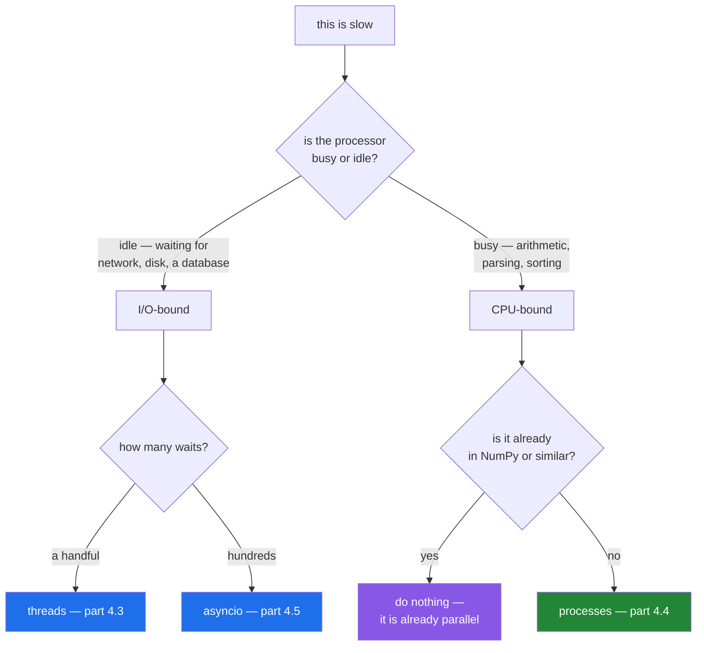

# 4.1 — Waiting is not working: I/O-bound against CPU-bound

## One-line answer

Overlapping only helps when the work is **waiting** — for a network, a disk, a database — because waiting
costs nothing to do several of at once; overlapping arithmetic on one processor helps nothing at all.

---

## The story

The counter has two queues, and they behave completely differently.

The first is people **waiting for the depot to answer**. The clerk rings, the depot puts her on hold, and
she stands there. Eight of those in a row is eight lots of standing there, one after another. If she had
eight phones and eight ears she could be on hold eight times at once and it would take the same time as
being on hold once — because being on hold is not work, it is absence of work.

The second is **counting cash**. Eight tills to count, and she counts them. Eight of those in a row takes
eight times as long as one. Giving her eight calculators changes nothing, because the thing that is busy
is her, and there is one of her.

Somebody suggested hiring seven more people. That works for the counting, obviously, and it is a much
bigger decision than buying phones.

---

## The idea in plain language

Two words for two kinds of slow, and the whole of concurrency depends on telling them apart.

**I/O-bound** — the program is *waiting*. A network request, a database query, reading a file, a model
call. The processor is idle for nearly all of it; the time is spent on something else being slow.

**CPU-bound** — the program is *working*. Arithmetic, sorting, parsing, encoding, training. The processor
is busy the whole time.

The distinction matters because of one fact: **waiting can be overlapped almost for free, and working
cannot.** Twenty requests that each wait a fifth of a second can all be in flight together and finish in
about a fifth of a second. Twenty sums that each take a fifth of a second take four seconds on one
processor, however you arrange them.

So the tool depends on the kind of slow:

| Kind | Tool | Why |
|---|---|---|
| I/O-bound, a handful of waits | **threads** ([4.3](4.3-threads.md)) | each thread waits independently |
| I/O-bound, hundreds or thousands | **asyncio** ([4.5](4.5-asyncio-one-thread.md)) | one thread, no per-wait cost |
| CPU-bound | **processes** ([4.4](4.4-processes.md)) | more processors, genuinely |
| CPU-bound in a library | often **nothing** | NumPy already releases the lock and uses several cores |

That last row is worth saying early. From Day 20, most heavy arithmetic in this plan happens inside NumPy,
pandas or PyTorch, which are written in C and already parallel. Reaching for `multiprocessing` around a
NumPy operation usually makes it slower.

The reason threads cannot speed up arithmetic in Python is the **GIL**, and that is [4.2](4.2-the-gil.md).
This part is the measurement that makes the question worth asking, and the habit that goes with it:
**measure which kind you have before choosing a tool.** A program that is slow for the other reason will
not improve, and you will have added concurrency — which is expensive in bugs — for nothing.

One more term, because the two get used loosely. **Concurrency** is dealing with several things at once —
overlapping, interleaving, taking turns. **Parallelism** is doing several things at the same instant, on
several processors. Threads and asyncio give concurrency; processes give parallelism. Waiting needs the
first; working needs the second.

---

## Why Setu needs it

- **The plan's named example for `PY-24` is exactly this measurement**: 20 HTTP fetches, sequential
  against `asyncio.gather`, timed — "why threads help I/O and not maths"
  ([4.7](4.7-gather-and-twenty-fetches.md)).
- **Every provider call from Day 172 is I/O-bound**, and a router trying four of them one after another
  takes four times as long as trying them together.
- **Day 233's eval suite runs hundreds of model calls**, which is the "hundreds of waits" row: asyncio,
  not threads.
- **From Day 20 the arithmetic moves into NumPy** (plan Part 2), which is the last row — and knowing that
  is what stops you writing a process pool around something that is already parallel.

---

## The mechanism

The same shape twice — eight tasks, eight threads — with the only difference being what the task does:

```python
"""Waiting is not working: the same shape, twice, with threads."""

import time
from concurrent.futures import ThreadPoolExecutor


def waiting(n):
    """Stands in for a network call: the process is idle."""
    time.sleep(0.2)
    return n


def working(n):
    """Stands in for real arithmetic: the process is busy."""
    total = 0
    for i in range(4_000_000):
        total += i % 7
    return total


for name, fn in (("waiting (sleep)", waiting), ("working (arithmetic)", working)):
    start = time.perf_counter()
    [fn(i) for i in range(8)]
    one_at_a_time = time.perf_counter() - start

    start = time.perf_counter()
    with ThreadPoolExecutor(max_workers=8) as pool:
        list(pool.map(fn, range(8)))
    with_threads = time.perf_counter() - start

    print(
        f"{name:22} one at a time {one_at_a_time:5.2f}s   "
        f"8 threads {with_threads:5.2f}s   speed-up {one_at_a_time / with_threads:4.1f}x"
    )
```

**Line by line:**

- `time.sleep(0.2)` — the stand-in for waiting. `sleep` is genuinely idle: the process is not using the
  processor at all, which is exactly what a network call looks like from Python's point of view.
- the loop in `working` — the stand-in for arithmetic. `i % 7` is cheap and there are four million of
  them, so the processor is busy for the whole time and never waits for anything.
- `time.perf_counter()` — the clock to use for measuring durations. It is monotonic and high-resolution;
  `time.time()` can go backwards when the system clock is adjusted.
- `[fn(i) for i in range(8)]` — the baseline: eight tasks, one after another.
- `ThreadPoolExecutor(max_workers=8)` — eight threads, one per task
  ([4.3](4.3-threads.md)). The `with` block waits for all of them
  ([Day 16, 4.1](../../../day-16-files-and-context-managers/parts/04-context-managers/4.1-with-the-block-that-cleans-up.md)).
- `list(pool.map(...))` — **the `list` matters.** `map` returns a lazy iterator
  ([Day 11, 3.2](../../../day-11-iterators-and-generators/parts/03-lambda-and-map/3.2-map-and-filter-are-lazy.md));
  without consuming it you would time the submission rather than the work.
- the ratio — printed rather than described, because the whole point is the number.

Run on Python 3.12.12 on 2026-09-02, on a machine with 4 cores:

```
waiting (sleep)        one at a time  1.60s   8 threads  0.20s   speed-up  7.8x
working (arithmetic)   one at a time  1.32s   8 threads  1.37s   speed-up  1.0x
```

**Two lines, and they are the whole of this section.**

The waiting version went from 1.60s to 0.20s — **eight tasks in the time of one**, because eight threads
can all be idle simultaneously. Not quite 8× because of thread start-up, and close enough.

The working version went from 1.32s to 1.37s — **slightly slower**. Eight threads competed for one
processor and paid for the switching. That is the GIL ([4.2](4.2-the-gil.md)), and it is why the same
tool applied to the wrong kind of slow is worse than nothing.

Which kind is which:



---

## When it breaks

**Threads added to arithmetic, which is the version that gets shipped:**

```text
waiting (sleep)        one at a time  1.60s   8 threads  0.20s   speed-up  7.8x
working (arithmetic)   one at a time  1.32s   8 threads  1.37s   speed-up  1.0x
```

**What it means.** The second row is not "no improvement" — it is a **regression**, and the code is now
concurrent, which means it can have race conditions ([4.3](4.3-threads.md)), is harder to debug, and has
tracebacks from inside a worker thread. Somebody paid all of that cost for a 4% slowdown. **This is the
most common concurrency mistake there is**, and the only defence is measuring first.

**Measuring with the wrong clock:**

```text
$ uv run python -c "
import time
start = time.process_time()
time.sleep(0.5)
print('process_time says:', round(time.process_time() - start, 3), 'seconds')
start = time.perf_counter()
time.sleep(0.5)
print('perf_counter says:', round(time.perf_counter() - start, 3), 'seconds')
"
process_time says: 0.0 seconds
perf_counter says: 0.501 seconds
```

**What it means.** `process_time` measures **processor time used**, and sleeping uses none — so an
I/O-bound program measured with it appears to take no time at all. That is occasionally exactly what you
want (it is how you prove something is I/O-bound), and it is a disaster if you thought you were measuring
elapsed time. `perf_counter` is the wall clock; use it for "how long did this take".

**Measuring a lazy iterator:**

```text
$ uv run python -c "
import time
from concurrent.futures import ThreadPoolExecutor

def waiting(n):
    time.sleep(0.2)
    return n

start = time.perf_counter()
with ThreadPoolExecutor(max_workers=8) as pool:
    results = pool.map(waiting, range(8))
print('before consuming:', round(time.perf_counter() - start, 2), 's')
print('and the results  :', list(results))
"
before consuming: 0.2 s
and the results  : [0, 1, 2, 3, 4, 5, 6, 7]
```

**What it means.** Here the `with` block waits for the pool to finish, so the number is honest — but the
shape is a trap in general: `map` is lazy, and code that submits work and reads the clock **without**
consuming the iterator or leaving the `with` block measures nothing. The same mistake with an unconsumed
generator ([Day 11, 3.2](../../../day-11-iterators-and-generators/parts/03-lambda-and-map/3.2-map-and-filter-are-lazy.md))
produces a delightful "we made it a thousand times faster" that survives until somebody uses the results.

**Assuming a library's work is CPU-bound when it is not:**

```text
$ uv run python -c "
import time
start = time.perf_counter()
cpu = time.process_time()
n = sum(i * i for i in range(3_000_000))
print('wall :', round(time.perf_counter() - start, 2), 's')
print('cpu  :', round(time.process_time() - cpu, 2), 's')
print('ratio:', round((time.process_time() - cpu) / (time.perf_counter() - start), 2))
"
wall : 0.22 s
cpu  : 0.22 s
ratio: 1.0
```

**What it means.** The ratio of processor time to wall time is the diagnostic: **close to 1 means
CPU-bound, close to 0 means waiting.** That is two lines around any slow function, it needs no profiler,
and it answers the only question that decides which tool to reach for. Run it before choosing.

---

## In production

**The professional habit is to measure before adding concurrency, and to measure the ratio rather than
guessing from the code.** A function that looks like arithmetic may spend its time in a database driver; a
function that looks like a network call may spend its time parsing the response. The processor-time to
wall-time ratio takes two lines and settles it, and it is the difference between a change that helps and
one that adds bugs for nothing.

**What changes at scale is that most real systems are I/O-bound and people assume otherwise.** A web
service handling requests, a pipeline reading from a database, an agent calling models — nearly all of the
elapsed time is waiting, which is why the tools that dominate server-side Python are threads and asyncio
rather than process pools. The CPU-bound work that remains has usually already been pushed into a library
written in C, where it is parallel without anybody's help.

**The failure that only appears with real data is the mixed workload.** A task that is I/O-bound on small
inputs — fetch a record, do a little arithmetic — becomes CPU-bound when the records get big, and the
asyncio version that was fast in testing now blocks its own event loop
([4.6](4.6-async-await.md)). The measurement has to be taken on realistic data, and re-taken when the data
changes shape.

**The review comment a senior engineer leaves.** *"This wraps the scoring loop in a `ThreadPoolExecutor`,
and the scoring is pure arithmetic — the GIL means that is at best the same speed and at worst slower,
and now we have shared state across threads. If it really needs to be faster, measure it first; my guess
is the time is in the database call above it, which is where the concurrency belongs."*

**The interview question.** *"When would you use threads in Python?"* When the work is I/O-bound — waiting
for a network, a disk, a database — because several threads can wait at the same time and waiting costs
nothing. Not for CPU-bound work, where the GIL means threads take turns on one processor and you have paid
for concurrency without getting parallelism; that needs processes. The detail that shows you have measured
rather than read: the diagnostic is processor time over wall time, and if it is near 1 the work is
CPU-bound.

---

## Check yourself

```bash
uv run python -c "
import time

def waiting():
    time.sleep(0.3)

def working():
    sum(i * i for i in range(3_000_000))

for name, fn in (('waiting', waiting), ('working', working)):
    wall0, cpu0 = time.perf_counter(), time.process_time()
    fn()
    wall = time.perf_counter() - wall0
    cpu = time.process_time() - cpu0
    print(f'{name}: wall {wall:.2f}s  cpu {cpu:.2f}s  ratio {cpu / wall:.2f}')
"
```

One ratio is near zero and one is near one. Say which tool each of them calls for.

**Answer out loud, without scrolling up:**

> Eight tasks, eight threads, and the program got slightly slower. Say what kind of work that must have
> been, and what you would have reached for instead.

---

**Next:** [4.2 — the GIL, in plain words](4.2-the-gil.md).
