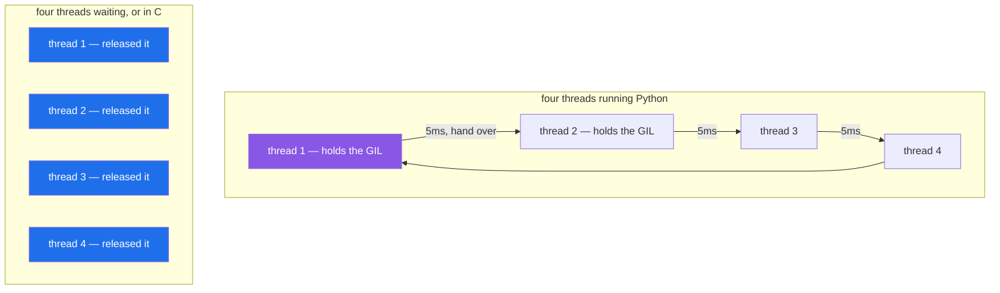

# 4.2 — The GIL, in plain words

## One-line answer

Only one thread may run Python code at a time, because there is a single lock the interpreter hands round
— so threads never make Python arithmetic faster, and they do help everything that lets go of the lock:
waiting, and C libraries.

---

## The story

The counter has four clerks and one till key.

Anything that involves the till — ringing something up, opening the drawer, printing a receipt — needs the
key, and there is one. So whatever else is going on, exactly one clerk is at the till at any moment. The
other three are doing something, or waiting.

Which is fine, because most of what a clerk does is not the till. Being on hold to the depot does not need
the key, so three clerks can be on hold while the fourth rings something up. Carrying parcels to the back
does not need the key.

The one thing four clerks cannot do faster than one is **use the till**. Four tills' worth of ringing up
takes four turns with the one key, however many people are standing there — and the handing-over itself
takes a moment, so four clerks on till work is very slightly slower than one clerk doing it all.

Nobody designed this to be annoying. The single key is why the drawer's contents are never wrong.

---

## The idea in plain language

CPython — the standard Python — has a **Global Interpreter Lock**, universally shortened to **GIL**. It is
one lock, held by whichever thread is currently executing Python bytecode, and a thread must hold it to
run.

So a Python program with eight threads is not running eight things at once. It is running one, and taking
turns. The interpreter forces a hand-over every few milliseconds — `sys.getswitchinterval()` reports it,
and it is 0.005 seconds by default — so the turns are fair, and there is still only one at a time.

**Why it exists.** Reference counting. Every object tracks how many names point at it, and that count is
updated constantly; making each update individually safe for threads would slow single-threaded code down
significantly, which is the code nearly everybody runs. One lock is a trade: simpler, faster for one
thread, and no parallelism for Python-level code.

**When the lock is released** — and this is the useful half:

- **While waiting.** Any I/O — a network read, a file read, `time.sleep` — releases the GIL, so other
  threads run while one waits. This is exactly [4.1](4.1-waiting-is-not-working.md)'s 7.8×.
- **Inside a C extension that says so.** NumPy, `hashlib`, `zlib`, compression, image decoding and most
  serious numerical libraries release the GIL around their heavy loops, so those *do* run in parallel
  across threads.

Which gives the rule you actually use: **the GIL blocks parallelism for Python bytecode, and only for
that.** A program whose heavy work is in NumPy is already parallel; a program whose heavy work is a Python
loop is not, and no amount of threading will change it.

Three things people get wrong about it:

**It is not "Python is single-threaded".** Threads are real operating-system threads, they genuinely
overlap while waiting, and they are the right tool for I/O.

**It does not make threads safe.** Turns are handed over between bytecodes, so a `+= 1` can be interrupted
half way ([4.3](4.3-threads.md)). The GIL protects the interpreter's own bookkeeping, not your data.

**It is CPython's, not Python's.** It is a property of the implementation. And it is being removed:
*PEP 703 — Making the Global Interpreter Lock Optional in CPython* (2023,
<https://peps.python.org/pep-0703/>) added an experimental free-threaded build in Python 3.13. It is
opt-in, most extension modules do not support it yet, and this project is on 3.12 (plan Part 2) — so the
GIL is a fact of life here, and worth knowing it is not forever.

---

## Why Setu needs it

- **It is the answer to the plan's own question for `PY-24`** — "why threads help I/O and not maths"
  ([4.1](4.1-waiting-is-not-working.md)).
- **From Day 20 the arithmetic is NumPy's** (plan Part 2), which releases the lock — so the phase where
  this project does heavy numbers is the phase where the GIL matters least.
- **Every provider call from Day 172 is a wait**, and waiting releases the lock, which is why a thread
  pool over four providers works.
- **Day 233's eval suite is hundreds of waits**, where the question stops being the GIL and becomes the
  per-thread cost ([4.5](4.5-asyncio-one-thread.md)).

---

## The mechanism

Two functions that both keep the processor busy — one in Python, one in a C library — run four at a time:

```python
"""Python arithmetic against a C library, both in threads."""

import hashlib
import sys
import time
from concurrent.futures import ThreadPoolExecutor

DATA = b"x" * 200_000_000


def python_arithmetic(_):
    total = 0
    for i in range(12_000_000):
        total += i % 7
    return total


def c_library(_):
    return hashlib.sha256(DATA).hexdigest()


print("switch interval:", sys.getswitchinterval(), "seconds")
for name, fn in (("python arithmetic", python_arithmetic), ("hashlib (C)      ", c_library)):
    start = time.perf_counter()
    [fn(i) for i in range(4)]
    serial = time.perf_counter() - start
    start = time.perf_counter()
    with ThreadPoolExecutor(max_workers=4) as pool:
        list(pool.map(fn, range(4)))
    threaded = time.perf_counter() - start
    print(f"{name}: serial {serial:5.2f}s   4 threads {threaded:5.2f}s   speed-up {serial / threaded:4.1f}x")
```

**Line by line:**

- `DATA = b"x" * 200_000_000` — two hundred megabytes, built once at the outer level so the hashing has
  something big enough to measure. Note it is `bytes`, not `str`
  ([Day 7, 1.1](../../../day-07-strings/parts/01-text/1.1-a-string-is-code-points.md)); `hashlib` hashes
  bytes.
- `python_arithmetic` — a Python loop. Every one of those twelve million additions is bytecode, and
  bytecode needs the lock.
- `hashlib.sha256(DATA)` — the same amount of "keep the processor busy", except the loop is in C and the
  module **releases the GIL** around it.
- `sys.getswitchinterval()` — how long a thread may hold the lock before being asked to hand it over.
  Printing it makes the mechanism concrete rather than folklore.
- both measured the same way as [4.1](4.1-waiting-is-not-working.md), so the numbers are comparable.

Run on Python 3.12.12 on 2026-09-02, on a machine with 4 cores:

```
switch interval: 0.005 seconds

python arithmetic: serial  1.99s   4 threads  1.99s   speed-up  1.0x
hashlib (C)      : serial  0.49s   4 threads  0.20s   speed-up  2.4x
```

**Two rows, both CPU-bound, and they behave completely differently.**

The Python loop got **no** faster: four threads, one lock, taking turns. The C library got **2.4×**
faster on four cores, because `hashlib` releases the lock while it works, so the four threads really did
run at the same time.

That is the whole of the GIL as a practical matter: **it applies to Python bytecode, and to nothing
else.**

Who holds the key:



The purple box is the only one running Python code. In the second group nobody holds the lock, so all four
progress at once.

---

## When it breaks

**Believing the GIL makes threads safe:**

```text
$ uv run python -c "
import threading, time

balance = 0

def deposit(times):
    global balance
    for _ in range(times):
        current = balance
        time.sleep(0)
        balance = current + 1

threads = [threading.Thread(target=deposit, args=(2_000,)) for _ in range(8)]
for t in threads: t.start()
for t in threads: t.join()
print('expected:', 8 * 2_000)
print('actual  :', balance)
"
expected: 16000
actual  : 2703
```

**What it means.** Thirteen thousand updates lost, **with** the GIL. One thread runs at a time and the
hand-over happens between bytecodes, so a read-modify-write can be interrupted after the read. The GIL
protects the interpreter's reference counts; it protects nothing of yours. [4.3](4.3-threads.md) is this
failure in full, with the fix.

**Reaching for `multiprocessing` around NumPy:**

```text
$ uv run python -c "
import hashlib, time
from concurrent.futures import ThreadPoolExecutor

DATA = b'x' * 200_000_000
start = time.perf_counter()
with ThreadPoolExecutor(max_workers=4) as pool:
    list(pool.map(lambda _: hashlib.sha256(DATA).hexdigest(), range(4)))
print('threads over a C library:', round(time.perf_counter() - start, 2), 's')
"
threads over a C library: 0.19 s
```

**What it means.** Threads already parallelised it, because the library released the lock. A process pool
would have to **copy two hundred megabytes into each worker** ([4.4](4.4-processes.md)), which costs more
than the work. The rule: before adding processes to numerical code, check whether the library already
releases the GIL — NumPy, SciPy, scikit-learn, PyTorch and the compression and hashing modules all do.

**Expecting a lower switch interval to help:**

```text
$ uv run python -c "
import sys, time
from concurrent.futures import ThreadPoolExecutor

def work(_):
    total = 0
    for i in range(6_000_000):
        total += i % 7
    return total

for interval in (0.005, 0.0001):
    sys.setswitchinterval(interval)
    start = time.perf_counter()
    with ThreadPoolExecutor(max_workers=4) as pool:
        list(pool.map(work, range(4)))
    print(f'interval {interval}: {time.perf_counter() - start:.2f}s')
"
interval 0.005: 1.02s
interval 0.0001: 17.56s
```

**What it means.** Seventeen times slower. Handing the lock over fifty times as often does not buy any
parallelism — there is still one lock — and every hand-over costs something, so the cost is all that is
left. `setswitchinterval` is a **fairness** knob, controlling how quickly a waiting thread gets a turn,
not a performance one; turning it down to "make threads faster" is one of the most spectacular ways to
make them slower.

**Assuming free-threaded Python is available here:**

```text
$ uv run python -c "import sys; print('GIL disabled?', getattr(sys, '_is_gil_enabled', lambda: 'not this build')())"
GIL disabled? not this build
```

**What it means.** `sys._is_gil_enabled` exists only on Python 3.13+ free-threaded builds. On 3.12 the
attribute is absent, which is what the fallback prints. Worth knowing the check exists, because articles
about "Python removed the GIL" are describing an opt-in build that most extension modules do not yet
support — and this project pins 3.12 (plan Part 2), so the answer here is always the same.

---

## In production

**The professional habit is to stop thinking about the GIL and start thinking about where the time
goes.** If the time is waiting, threads or asyncio; if it is a Python loop, processes or move the loop
into a library; if it is already in a library, do nothing. The GIL is the explanation for why that table
looks the way it does, and it is not itself a thing you tune.

**What changes at scale is that "move it into a library" becomes the dominant answer.** The Python loop
that is CPU-bound is almost always a loop that NumPy or pandas could do in one call, and rewriting it that
way is usually a bigger win than any amount of parallelism — often a hundredfold rather than fourfold,
because the C loop is also faster per element. From Day 20 this project's arithmetic lives there, and
[Day 6, 4.2](../../../day-06-loops/parts/04-loop-cost/4.2-the-loop-you-should-not-write.md) made the same
point about loops before there was a name for the reason.

**The failure that only appears at scale is the thread pool that quietly serialises.** A service with a
thread pool over a workload that started as I/O-bound — fetch and hand back — grows a parsing or scoring
step, and the pool's throughput stops improving with more threads while the machine shows one core busy.
Nothing errors; it just stops scaling, and the tell is exactly [4.1](4.1-waiting-is-not-working.md)'s
processor-time-over-wall-time ratio creeping towards one.

**The review comment a senior engineer leaves.** *"Bumping `max_workers` from 8 to 32 will not help here —
the time is in the tokenising loop, which is pure Python, so all 32 will queue for the GIL. Either move
the tokenising into the library call above it or use a process pool, and measure before either."*

**The interview question.** *"What is the GIL?"* One lock in CPython that a thread must hold to execute
Python bytecode, so Python-level code never runs in parallel across threads. The two things that matter
practically: it is **released** during I/O and inside C extensions that say so, which is why threads help
network work and why NumPy is already parallel; and it does **not** make your code thread-safe, because
the hand-over happens between bytecodes and a read-modify-write can be interrupted. Adding that it exists
for reference counting, and that PEP 703's free-threaded build makes it optional from 3.13, is the rest.

---

## Check yourself

```bash
uv run python -c "
import hashlib, sys, time
from concurrent.futures import ThreadPoolExecutor

print('switch interval:', sys.getswitchinterval())
DATA = b'x' * 100_000_000

def py(_):
    total = 0
    for i in range(6_000_000):
        total += i % 7
    return total

def c(_):
    return hashlib.sha256(DATA).hexdigest()

for name, fn in (('python', py), ('hashlib', c)):
    t0 = time.perf_counter(); [fn(i) for i in range(4)]; serial = time.perf_counter() - t0
    t0 = time.perf_counter()
    with ThreadPoolExecutor(max_workers=4) as p: list(p.map(fn, range(4)))
    print(f'{name:8}: {serial / (time.perf_counter() - t0):.1f}x with 4 threads')
"
```

Both are CPU-bound and only one speeds up. Say what the other one is holding.

**Answer out loud, without scrolling up:**

> Name the two situations in which a thread releases the GIL, and say what the GIL does **not** protect.

---

**Next:** [4.3 — threads: where they help, and the counter that lost updates](4.3-threads.md).
