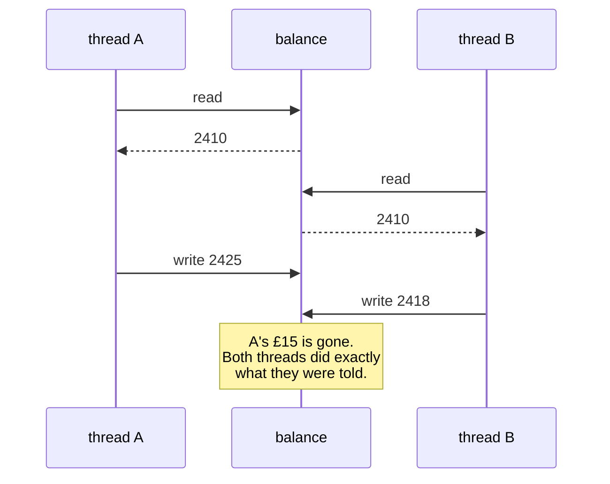

# 4.3 — Threads: where they help, and the counter that lost updates

## One-line answer

Threads share memory, so several of them can wait at once — and any read-modify-write on shared data can
be interrupted half way, which is a bug that usually does not reproduce until it costs you a day.

---

## The story

Four clerks now, and one ledger on the counter with the day's total in it.

Each clerk, on taking money, does three things: reads the total, adds what they took, writes the new total
back. Three separate motions, and the ledger is a single book they all reach for.

For a year nothing went wrong, because the counter was never busy enough for two clerks to be doing it at
the same instant.

Then the Christmas rush. Two clerks read *2,410* within a second of each other. One adds £15 and writes
*2,425*. The other, holding the number she read before that, adds £8 and writes *2,418*.

The £15 is gone. Not misfiled, not miscounted — overwritten. The book says a number that no clerk ever
computed, both clerks did exactly what they were trained to do, and there is no record anywhere of the
transaction that vanished.

The fix, when the manager worked it out, was a wooden tag. You take the tag, you do all three motions, you
put the tag back. Nobody touches the ledger without it.

---

## The idea in plain language

A **thread** is another line of execution inside the same process, sharing the same memory. That sharing
is the point and the danger.

**The point.** Several threads can be waiting at the same time, so eight network calls take about as long
as one ([4.1](4.1-waiting-is-not-working.md)). And because memory is shared, passing data between them is
free — no copying, no serialising.

**The danger.** Two threads reading and writing the same object can interleave, and the interpreter is
allowed to switch between them **between bytecodes** ([4.2](4.2-the-gil.md)). So `total += 1` — which is
one line and three operations: read, add, store — can be interrupted after the read, and the second
thread's write is lost.

That is called a **race condition**: the outcome depends on which thread gets there first, and nothing in
the code says what order to expect.

The fix is a **lock**. `threading.Lock()` is the wooden tag: exactly one thread may hold it, and the rest
wait. Wrap the read-modify-write in `with lock:`
([Day 16, 4.1](../../../day-16-files-and-context-managers/parts/04-context-managers/4.1-with-the-block-that-cleans-up.md))
and the three motions become one indivisible step.

Two things about locks that matter more than the syntax:

**Hold it for as short a time as possible.** Everything inside `with lock:` is single-file, so a slow
operation in there removes the concurrency you were trying to get. Never do I/O while holding a lock if
you can avoid it.

**Two locks taken in different orders is a deadlock.** Thread A holds lock 1 and wants lock 2; thread B
holds lock 2 and wants lock 1; both wait forever, with no error and no traceback. The defence is a rule —
always take them in the same order — and, better, not having two.

And the advice that beats all of it: **do not share mutable state.** A `queue.Queue` is already
thread-safe, so workers taking items from a queue and putting results on another need no locks at all.
Frozen records ([2.3](../02-dataclasses/2.3-frozen-slots-kw-only.md)) can be shared with no lock, because
there is nothing to race on. Most thread bugs are avoided by design rather than fixed by locking.

**How to run them.** `concurrent.futures.ThreadPoolExecutor` rather than `threading.Thread` directly: it
manages the pool, `map` keeps results in order, and — importantly — an exception in a worker is re-raised
when you read the result, rather than disappearing
([Day 18, 2.4](../../../day-18-exceptions/parts/02-the-hierarchy/2.4-re-raising.md)).

---

## Why Setu needs it

- **Day 172's router tries four providers**, which is four waits — the "handful of waits" row from
  [4.1](4.1-waiting-is-not-working.md), and exactly what a thread pool is for.
- **Principle 5's request budget is a shared counter** across those threads, which makes it precisely the
  read-modify-write in this part.
- **Day 42's Supabase project pauses when idle** (plan Part 2.1), so a wake-up retry across several
  connections is I/O-bound work with shared state.
- **`pytest` runs tests in one thread by default**, which is why a race condition survives a green test
  suite and appears in a worker pool — [4.4](4.4-processes.md) and this part are where that gets tested
  deliberately.

---

## The mechanism

The ledger, with the three motions written out so the gap is visible:

```python
"""A read-modify-write with a real gap in the middle."""

import threading
import time

balance = 0


def deposit(times):
    global balance
    for _ in range(times):
        current = balance  # read
        time.sleep(0)  # the gap: this thread yields here
        balance = current + 1  # write


TIMES = 2_000
threads = [threading.Thread(target=deposit, args=(TIMES,)) for _ in range(8)]
for t in threads:
    t.start()
for t in threads:
    t.join()

print("expected:", 8 * TIMES)
print("actual  :", balance)
print("lost    :", 8 * TIMES - balance)
```

**Line by line:**

- `global balance` — the shared state
  ([Day 10, 2.3](../../../day-10-functions/parts/02-scope/2.3-global-and-nonlocal.md)). In real code it
  would be an attribute on an object; a module-level name makes the sharing obvious.
- `current = balance` — **the read.** After this line, this thread is holding a number that may already be
  out of date.
- `time.sleep(0)` — **the gap, made explicit.** `sleep(0)` yields to the scheduler without waiting, which
  widens the window that a real program has anyway — a cache lookup, a log call, an attribute access.
  Without it this bug is very hard to reproduce, which is the whole problem.
- `balance = current + 1` — **the write**, of a number computed from a stale read.
- `threading.Thread(target=..., args=(...))` — the low-level interface. `args` is a **tuple**; a common
  slip is `args=(TIMES)` without the comma, which is not a tuple
  ([Day 8, 1.3](../../../day-08-containers/parts/01-sequences/1.3-a-tuple-is-a-record.md)).
- `t.start()` then `t.join()` in **two separate loops** — start them all, then wait for them all. One loop
  doing both would run them one at a time, which is a classic and silent mistake.

Run on Python 3.12.12 on 2026-09-02, three times:

```
expected: 16000
actual  : 2703
lost    : 13297
---
expected: 16000
actual  : 2264
lost    : 13736
---
expected: 16000
actual  : 2422
lost    : 13578
```

**Thirteen thousand updates lost, and a different number every run.** That non-determinism is the
signature of a race condition: no traceback, no failing assertion, a plausible-looking number that is
wrong by an amount nobody can predict.

Now the tag:

```python
import threading
import time

balance = 0
lock = threading.Lock()


def deposit(times):
    global balance
    for _ in range(times):
        with lock:
            current = balance
            time.sleep(0)
            balance = current + 1
```

**Line by line:**

- `lock = threading.Lock()` — one lock, at module level, shared by every thread. **Two locks would protect
  nothing**; the lock has to be the same object.
- `with lock:` — acquire on entry, release on exit, including if the block raises
  ([Day 16, 4.2](../../../day-16-files-and-context-managers/parts/04-context-managers/4.2-try-finally-is-what-with-is.md)).
  The `try` / `finally` version is `lock.acquire()` … `lock.release()`, and forgetting the release in an
  error path is why `with` is the only form worth writing.
- the three motions **inside** the block — that is what makes them one step. Putting only the write inside
  would fix nothing.

```
expected: 16000
actual  : 16000
lost    : 0
```

And the version that makes this a genuinely hard bug:

```text
$ uv run python -c "
import threading

COUNT = 0

def bump(times):
    global COUNT
    for _ in range(times):
        COUNT += 1

for run in range(3):
    COUNT = 0
    threads = [threading.Thread(target=bump, args=(200_000,)) for _ in range(8)]
    for t in threads: t.start()
    for t in threads: t.join()
    print(f'run {run}: expected 1600000, got {COUNT}')
"
run 0: expected 1600000, got 1600000
run 1: expected 1600000, got 1600000
run 2: expected 1600000, got 1600000
```

**Read that carefully.** The plain `COUNT += 1` version — eight threads, 1.6 million increments, no lock —
came out **exactly right, three times.** The race is still there; the window is just so narrow on this
interpreter and this machine that it did not open. **That is why this bug reaches production**: it passes
review, passes tests, passes a manual check, and then fails on a slower machine, under load, or after
somebody adds a log line inside the loop that widens the window.

The interleaving:



---

## When it breaks

**Holding a lock across I/O:**

```text
$ uv run python -c "
import threading, time
from concurrent.futures import ThreadPoolExecutor

lock = threading.Lock()
total = 0

def fetch_and_add(n):
    global total
    with lock:
        time.sleep(0.2)   # the 'network call', inside the lock
        total += n

start = time.perf_counter()
with ThreadPoolExecutor(max_workers=8) as pool:
    list(pool.map(fetch_and_add, range(8)))
print(f'{time.perf_counter() - start:.2f}s for 8 tasks of 0.2s')
"
1.61s for 8 tasks of 0.2s
```

**What it means.** 1.61 seconds — the sequential time. Eight threads were created, and the lock made them
take turns through the *waiting*, which is the one thing threads were for
([4.1](4.1-waiting-is-not-working.md)). All of the concurrency was given back to buy safety on a `+=`
that takes microseconds. **Do the slow thing outside the lock**, and hold it only for the update.

**Two locks, taken in two orders:**

```python
import threading

a = threading.Lock()
b = threading.Lock()


def first():
    with a:
        with b:
            pass


def second():
    with b:
        with a:
            pass
```

**Line by line:**

- `first` takes `a` then `b`; `second` takes `b` then `a`.
- if both start at the same moment, each holds one and waits for the other.
- **there is no error, no timeout and no traceback** — the program stops, and the only symptom is that it
  never finishes.

**What it means.** A deadlock. It is not shown running here because it would hang, which is exactly the
problem: nothing to catch, nothing to log, and on a rare interleaving it may take weeks to happen. The
rules are: take locks in a fixed global order, hold one at a time, and prefer designs with no shared
mutable state at all.

**An exception in a thread, with the low-level interface:**

```text
$ uv run python -c "
import threading

def boom():
    raise ValueError('worker failed')

t = threading.Thread(target=boom)
t.start()
t.join()
print('the main thread carried on, and the exit code is 0')
" 2>&1 | tail -4
ValueError: worker failed
the main thread carried on, and the exit code is 0
```

**What it means.** The traceback is **printed**, and the program continues and exits successfully. Nothing
raised in the main thread, so nothing could catch it, and in a service that log line is the only trace
that a unit of work vanished. `ThreadPoolExecutor` is better: the exception is stored and **re-raised when
you read the result**, so a `list(pool.map(...))` fails loudly.

**Starting and joining in one loop:**

```text
$ uv run python -c "
import threading, time

def waiting(n):
    time.sleep(0.2)

start = time.perf_counter()
for i in range(8):
    t = threading.Thread(target=waiting, args=(i,))
    t.start()
    t.join()
print(f'{time.perf_counter() - start:.2f}s - one at a time, with the cost of threads')
"
1.61s - one at a time, with the cost of threads
```

**What it means.** `join()` waits for that thread to finish, so starting and joining in the same iteration
runs them **strictly sequentially** — with the added cost of creating eight threads. It looks concurrent,
it reads concurrent, and it is the sequential version. The two-loop shape in the mechanism above is the
fix, and `ThreadPoolExecutor` makes it impossible to get wrong.

---

## In production

**The professional habit is to avoid sharing mutable state rather than to lock it.** Workers take from a
`queue.Queue` and put results on another; records passed between threads are frozen
([2.3](../02-dataclasses/2.3-frozen-slots-kw-only.md)); anything genuinely shared is one small object with
one lock, held for the shortest possible time and never across I/O. Code written that way has no race
conditions to find.

**What changes at scale is that the window opens.** A race with a microsecond window fires roughly never
at ten requests a day and several times an hour at ten thousand a second — and the symptoms are the worst
kind: a counter slightly wrong, a record occasionally missing, a cache entry from another user. They
cannot be reproduced on demand, which is why the effort goes into designs that cannot race rather than
into debugging.

**The failure that only appears with real data is the shared object nobody knew was shared.** A module-level
cache ([Day 17, 1.3](../../../day-17-modules-and-packages/parts/01-the-module/1.3-sys-modules.md)), a
mutable default ([2.2](../02-dataclasses/2.2-default-factory.md)), a class attribute
([Day 12, 1.5](../../../day-12-classes/parts/01-the-blank-form/1.5-the-shared-class-attribute.md)) — all
of them are one object shared by every thread, and none of them looks like shared state at the point of
use. Auditing for those is more productive than auditing for missing locks.

**The review comment a senior engineer leaves.** *"The `with lock:` here wraps the HTTP call as well as
the counter update, so all eight workers serialise on the network — which undoes the pool entirely. Move
the request above the lock and keep only the `+=` inside. And use `ThreadPoolExecutor`; with raw threads
an exception in a worker just prints and the job reports success."*

**The interview question.** *"What is a race condition, and does the GIL prevent them?"* A race is when
the result depends on the interleaving of threads — classically a read-modify-write like `total += 1`,
which is three operations and can be interrupted between them. The GIL does **not** prevent it: it means
one thread runs at a time, and the hand-over happens between bytecodes, so the interleaving still occurs.
The answer that shows experience is what you do about it: a lock around the smallest possible section, and
preferably a design with no shared mutable state — plus the observation that the naive version often
passes every test, because the window is narrow until the machine is busy.

---

## Check yourself

```bash
uv run python -c "
import threading, time

for use_lock in (False, True):
    balance = 0
    lock = threading.Lock()

    def deposit(times):
        global balance
        for _ in range(times):
            if use_lock:
                with lock:
                    current = balance; time.sleep(0); balance = current + 1
            else:
                current = balance; time.sleep(0); balance = current + 1

    threads = [threading.Thread(target=deposit, args=(1000,)) for _ in range(8)]
    for t in threads: t.start()
    for t in threads: t.join()
    print(f'lock={use_lock!s:5} expected 8000, got {balance}')
"
```

One line is right and one is not, and the wrong one is different every run. Say which three operations the
lock made into one.

**Answer out loud, without scrolling up:**

> `total += 1` is one line. Say how many operations it is, where a thread can be interrupted, and why the
> version without a lock often passes its tests.

---

**Next:** [4.4 — processes: a second interpreter, and what it costs to send data](4.4-processes.md).
