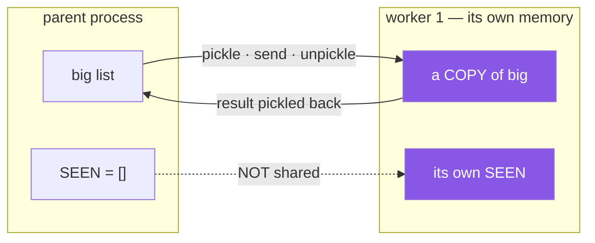

# 4.4 — Processes: a second interpreter, and what it costs to send data

## One-line answer

A process pool starts real extra interpreters, so Python arithmetic finally runs in parallel — and nothing
is shared, so every argument and every result is **pickled and copied**, which is often more expensive
than the work.

---

## The story

The manager's answer to the till problem was to open a second counter.

New room, second till, second key, second clerk. Now two customers really are being served at the same
instant, which no amount of rearranging the first counter could achieve.

The cost showed up in the first week, and it was not the rent.

Every parcel that goes to the second counter has to be **carried** there, and every receipt has to be
carried back. For a small envelope that is nothing. For the pallet of catalogues, the carrying takes
longer than the weighing did, and the second counter finished a minute after the first would have.

And the ledger stopped working. Two counters, two ledgers, and the total is neither of them. Anything the
two rooms need to agree on has to be sent between them on purpose, in writing, and that is a whole
procedure rather than a shared book.

---

## The idea in plain language

A **process** is a whole separate program: its own interpreter, its own memory, its own GIL
([4.2](4.2-the-gil.md)). Four processes on a four-core machine really do run four Python loops at once.

That is the one thing threads cannot give you, and it is the reason process pools exist.

The cost is that **nothing is shared.** Two consequences, both of which decide whether this is worth it.

**Arguments and results are copied.** To send `data` to a worker, Python **pickles** it — serialises it to
bytes — sends the bytes, and unpickles it on the other side. Same for the return value, coming back. For
a small argument that is microseconds; for a large list it can cost more than the computation.

**Module-level state is not shared.** Each worker imports your module fresh
([Day 17, 1.1](../../../day-17-modules-and-packages/parts/01-the-module/1.1-a-module-is-a-file-that-has-already-run.md)),
so a counter, a cache or a connection in the parent is invisible to the children — and their changes are
invisible to the parent. This is a **feature**: there is no shared mutable state, so there are no race
conditions ([4.3](4.3-threads.md)). It is also a surprise the first time.

Two practical requirements that catch everybody.

**Everything you send must be picklable.** A lambda is not
([Day 11, 3.1](../../../day-11-iterators-and-generators/parts/03-lambda-and-map/3.1-lambda-a-function-with-no-name.md)),
a nested function is not, an open file or a database connection is not. Module-level functions are. This
is also why [Day 18, 3.2](../../../day-18-exceptions/parts/03-your-own/3.2-an-exception-that-carries-data.md)
insisted that a custom exception's `args` must replay — an exception raised in a worker has to be pickled
to reach the parent.

**On Windows and macOS, workers `spawn`:** a fresh interpreter that **imports your module**. Anything at
your module's outer level runs again, in every worker, which is why the entry point must be guarded by
`if __name__ == "__main__":`
([Day 17, 1.4](../../../day-17-modules-and-packages/parts/01-the-module/1.4-the-name-that-changes.md)).
Without the guard the workers re-run the code that started the pool, and it forks bombs. On Linux the
default was `fork`, which does not re-import — so this bug is one that appears when the code moves to
another machine.

**When it is worth it.** CPU-bound work, where each task is substantial and the data sent is small
relative to the computation. A rule of thumb: if a task takes less than about a tenth of a second, the
overhead dominates.

**When it is not.** I/O-bound work — threads or asyncio, which are far cheaper. Anything already in NumPy
or a similar library, which releases the GIL and is parallel already
([4.2](4.2-the-gil.md)). And anything where the arguments are large.

---

## Why Setu needs it

- **It is the other half of the plan's `PY-24` question** — "why threads help I/O and not maths". This is
  what does help maths.
- **From Phase 10 there is real preprocessing** — feature engineering over rows, text cleaning
  ([Day 7, 4.1](../../../day-07-strings/parts/04-normalising/4.1-the-title-normaliser.md)) — which is
  Python-level, CPU-bound and embarrassingly parallel.
- **Day 18's exceptions were designed to survive pickling**
  ([Day 18, 3.2](../../../day-18-exceptions/parts/03-your-own/3.2-an-exception-that-carries-data.md)), and
  this is the day that requirement becomes real rather than theoretical.
- **Day 17's `if __name__ == "__main__":` rule**
  ([Day 17, 1.4](../../../day-17-modules-and-packages/parts/01-the-module/1.4-the-name-that-changes.md))
  is a style preference until you start a process pool, at which point it is compulsory.

---

## The mechanism

The same arithmetic, three ways:

```python
"""The same arithmetic, in threads and in processes."""

import time
from concurrent.futures import ProcessPoolExecutor, ThreadPoolExecutor


def working(n):
    total = 0
    for i in range(20_000_000):
        total += i % 7
    return total


def timed(label, run):
    start = time.perf_counter()
    run()
    return time.perf_counter() - start


def main():
    tasks = range(4)
    serial = timed("serial", lambda: [working(i) for i in tasks])

    def with_threads():
        with ThreadPoolExecutor(max_workers=4) as pool:
            list(pool.map(working, tasks))

    def with_processes():
        with ProcessPoolExecutor(max_workers=4) as pool:
            list(pool.map(working, tasks))

    threads = timed("threads", with_threads)
    processes = timed("processes", with_processes)

    print(f"one at a time : {serial:5.2f}s")
    print(f"4 threads     : {threads:5.2f}s  ({serial / threads:4.1f}x)")
    print(f"4 processes   : {processes:5.2f}s  ({serial / processes:4.1f}x)")


if __name__ == "__main__":
    main()
```

**Line by line:**

- `def working(n):` — **at module level**, not nested. That is compulsory: a nested function cannot be
  pickled and the pool cannot send it to a worker.
- `if __name__ == "__main__":` — **compulsory, not optional.** With `spawn`, each worker imports this
  module, and without the guard each of them would call `main()` and start its own pool
  ([Day 17, 1.4](../../../day-17-modules-and-packages/parts/01-the-module/1.4-the-name-that-changes.md)).
- `ProcessPoolExecutor(max_workers=4)` — four workers on a four-core machine. More than the core count
  buys nothing for CPU-bound work and costs memory.
- `pool.map(working, tasks)` — each `n` is pickled, sent, and the return value pickled back. Here the
  argument is one small integer, so the transfer cost is negligible — **which is what makes this example
  favourable**.
- the three timings side by side, so the comparison is a number rather than a claim.

Run on Python 3.12.12 on 2026-09-02, on a machine with 4 cores:

```
one at a time :  3.37s
4 threads     :  3.38s  ( 1.0x)
4 processes   :  1.96s  ( 1.7x)
```

**Threads: no change. Processes: 1.7×.** That is the parallelism threads cannot give, and it is 1.7 rather
than 4 because starting four interpreters on this platform takes a noticeable fraction of a second — a
fixed cost that would matter less on longer work and more on shorter.

Now the thing that is not shared:

```python
"""Processes do not share memory."""

from concurrent.futures import ProcessPoolExecutor, ThreadPoolExecutor

SEEN = []


def remember(n):
    SEEN.append(n)
    return len(SEEN)


def main():
    with ThreadPoolExecutor(max_workers=4) as pool:
        list(pool.map(remember, range(4)))
    print("after threads  , SEEN in the parent:", SEEN)

    SEEN.clear()
    with ProcessPoolExecutor(max_workers=4) as pool:
        sizes = list(pool.map(remember, range(4)))
    print("after processes, SEEN in the parent:", SEEN)
    print("each child saw  :", sizes)


if __name__ == "__main__":
    main()
```

**Line by line:**

- `SEEN = []` at module level — the shared state
  ([Day 17, 1.3](../../../day-17-modules-and-packages/parts/01-the-module/1.3-sys-modules.md)).
- with **threads**, all four appended to the one list the parent can see.
- `SEEN.clear()` — reset, so the second measurement starts from empty.
- with **processes**, each worker appended to **its own copy**, and the parent's list is untouched.
- `sizes` — what each child saw as `len(SEEN)`. Read those numbers carefully.

```
after threads  , SEEN in the parent: [0, 1, 2, 3]
after processes, SEEN in the parent: []
each child saw  : [1, 2, 3, 4]
```

**The parent's list is empty after the process version.** And `sizes` is `[1, 2, 3, 4]` — a worker
process is reused across tasks, so one worker handled several and its own copy grew. Neither number is
wrong; they are answers about four separate memories.

And the cost of sending data:

```python
"""What it costs to send data to a worker process."""

import time
from concurrent.futures import ProcessPoolExecutor, ThreadPoolExecutor


def total(data):
    return sum(data)


def main():
    big = list(range(3_000_000))
    for name, Pool in (("threads  ", ThreadPoolExecutor), ("processes", ProcessPoolExecutor)):
        start = time.perf_counter()
        with Pool(max_workers=4) as pool:
            list(pool.map(total, [big] * 4))
        print(f"{name}: {time.perf_counter() - start:5.2f}s for 4 x sum() over 3M ints")


if __name__ == "__main__":
    main()
```

**Line by line:**

- `big = list(range(3_000_000))` — three million integers, about a hundred megabytes of Python objects.
- `[big] * 4` — the **same list** four times. With threads that is one object, referenced four times; with
  processes it is pickled and copied four times.
- `sum(data)` — the work, which is in C and fast. **The transfer is the expensive part**, which is exactly
  the situation this example exists to show.

```
threads  :  0.08s for 4 x sum() over 3M ints
processes:  1.01s for 4 x sum() over 3M ints
```

**Processes were twelve times slower.** Not because the arithmetic was slow — because a hundred megabytes
had to be serialised, copied and deserialised, four times, to do work that took eighty milliseconds.

What crosses the boundary:



Every purple box was paid for.

---

## When it breaks

**A lambda, which cannot be pickled:**

```text
$ uv run python -c "
from concurrent.futures import ProcessPoolExecutor

def main():
    with ProcessPoolExecutor(max_workers=2) as pool:
        list(pool.map(lambda x: x * 2, range(4)))

if __name__ == '__main__':
    main()
" 2>&1 | tail -3
  File "...\Lib\multiprocessing\reduction.py", line 51, in dumps
    cls(buf, protocol).dump(obj)
AttributeError: Can't get local object 'main.<locals>.<lambda>'
```

**What it means.** The pool has to send the function to the worker, and it does that by **name** —
pickling a function stores its module and qualified name, not its code. A lambda has no name to store, and
neither does a function defined inside another function. The fix is a module-level `def`, or
`functools.partial` over one
([Day 14, 1.1](../../../day-14-decorators/parts/01-functions-as-values/1.1-a-function-is-a-value.md)).
The same restriction applies to the arguments and the return value.

**No `if __name__ == "__main__":` guard.** `noguard.py` is the mechanism's pool with the guard removed:

```text
$ uv run python noguard.py
  File "...\Lib\concurrent\futures\_base.py", line 401, in __get_result
    raise self._exception
concurrent.futures.process.BrokenProcessPool: A process in the process pool was terminated abruptly while the future was running or pending.
```

**What it means.** With `spawn`, each worker imports the parent's module, and that import runs the
module-level code that started the pool
([Day 17, 1.1](../../../day-17-modules-and-packages/parts/01-the-module/1.1-a-module-is-a-file-that-has-already-run.md)) —
so every worker tries to start its own pool, and the children die. What reaches you is
`BrokenProcessPool`, which says a worker was terminated and says nothing about why; the real explanation
is printed by the children, further up the output, as a `RuntimeError` about "bootstrapping phase" that
names the guard as the fix.

**This does not happen on Linux with the default `fork`**, which does not re-import — so it is a bug that
appears when the code moves to a colleague's laptop or into a container, and the error you get is one that
does not mention the cause.

**More workers than cores:**

```text
$ uv run python -c "
import os, time
from concurrent.futures import ProcessPoolExecutor

def work(_):
    total = 0
    for i in range(8_000_000):
        total += i % 7
    return total

def main():
    print('cores:', os.cpu_count())
    for n in (4, 16):
        start = time.perf_counter()
        with ProcessPoolExecutor(max_workers=n) as pool:
            list(pool.map(work, range(8)))
        print(f'{n:2} workers: {time.perf_counter() - start:.2f}s')

if __name__ == '__main__':
    main()
"
cores: 4
 4 workers: 1.55s
16 workers: 1.76s
```

**What it means.** Sixteen workers on four cores is slower, and it also used four times the memory —
each process holds its own interpreter and its own copy of whatever you sent it. For CPU-bound work the
number of workers is the number of cores, `os.cpu_count()`, and more is never better. (For *I/O*-bound
work more workers do help, which is exactly why you would use threads there instead.)

**Expecting to see a worker's global:**

```text
after processes, SEEN in the parent: []
```

**What it means.** Every accumulator, cache, counter and connection you set up in the parent is invisible
to the workers, and everything a worker builds dies with it. Anything shared has to be **returned** —
which is the design the pool wants: a worker takes its input, computes, returns a result, and holds no
state. Code that relies on module-level state works perfectly with threads and silently does nothing with
processes, which is one of the sharper differences between the two.

---

## In production

**The professional habit is to reach for processes only after measuring, and only when the work per task
is large relative to the data sent.** The question is a ratio: seconds of computation against megabytes
of arguments. Big computation and small arguments is what a process pool is for; anything else is better
served by threads, by asyncio, or by moving the loop into a library.

**What changes at scale is that the process pool becomes a job queue.** Beyond one machine's cores, the
same shape — send a task, get a result, share nothing — is what a distributed task queue does, with the
network in place of the pipe. Code written for a process pool ports to one almost unchanged, precisely
because it was already forbidden from sharing state, which is why the discipline is worth keeping even
when it feels restrictive.

**The failure that only appears with real data is the argument that grew.** A pool that was fast when each
task received an identifier becomes slow when somebody passes the whole record instead — the computation
is unchanged and the pickling now dominates. The symptom is a pool that scales worse as the machine gets
bigger, because more workers means more copies. The fix is to send the *smallest thing that identifies the
work* and let the worker load what it needs.

**The review comment a senior engineer leaves.** *"This passes the full DataFrame to every worker, so we
pickle 400MB four times to do 80ms of work — that is why it is slower than the serial version. Send the
row indices and have the worker read its slice, or drop the pool: pandas is already doing this in C."*

**The interview question.** *"When would you use `multiprocessing` over threads?"* For CPU-bound Python
code, because each process has its own interpreter and its own GIL, so they genuinely run in parallel —
threads cannot. The costs that decide whether it is worth it: nothing is shared, so arguments and results
are pickled and copied, which for large data can cost more than the work; module-level state is invisible
between parent and children; and everything sent must be picklable, so no lambdas and no closures. And on
Windows and macOS the workers re-import your module, which is why the entry point needs the
`if __name__ == "__main__":` guard.

---

## Check yourself

```bash
cat > /tmp/pool_probe.py <<'EOF'
import os, time
from concurrent.futures import ProcessPoolExecutor, ThreadPoolExecutor

SEEN = []

def work(n):
    SEEN.append(n)
    total = 0
    for i in range(8_000_000):
        total += i % 7
    return len(SEEN)

def main():
    print("cores:", os.cpu_count())
    for name, Pool in (("threads  ", ThreadPoolExecutor), ("processes", ProcessPoolExecutor)):
        SEEN.clear()
        start = time.perf_counter()
        with Pool(max_workers=4) as pool:
            sizes = list(pool.map(work, range(4)))
        print(f"{name}: {time.perf_counter() - start:.2f}s  parent SEEN={len(SEEN)}  workers saw {sizes}")

if __name__ == "__main__":
    main()
EOF
uv run python /tmp/pool_probe.py
```

```
cores: 4
threads  : 1.36s  parent SEEN=4  workers saw [4, 4, 4, 4]
processes: 0.87s  parent SEEN=0  workers saw [1, 1, 1, 1]
```

The process version is faster **and** its parent list stayed empty. Say why those two facts are the same
fact.

**Answer out loud, without scrolling up:**

> Name the one thing processes give you that threads cannot, and the two costs you pay for it.

---

**Next:** [4.5 — `asyncio`: one thread, a queue of paused functions](4.5-asyncio-one-thread.md).
