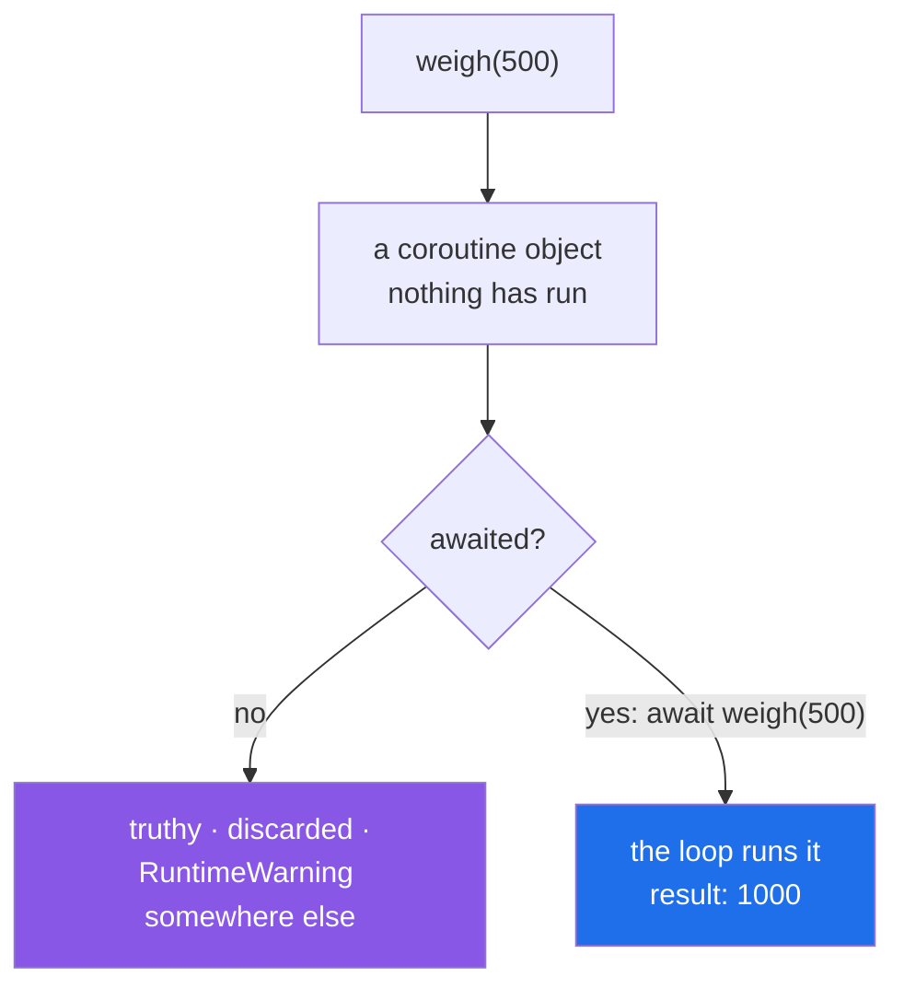

# 4.6 — `async def`, `await`, and the coroutine you forgot to await

## One-line answer

Calling an `async def` function **runs none of it** — it builds a coroutine object — and forgetting the
`await` gives you that object instead of the answer, with a warning that is easy to miss and a value that
is always truthy.

---

## The story

The ticket rail works because a ticket is not the job.

Somebody new arrives, is trained on the rail, and gets it almost right. A customer asks about a parcel;
she writes the ticket and hangs it up.

And that is all she does. She never rang the depot.

The ticket says the right thing. It is on the right rail, in the right order, and it looks exactly like
every other ticket there. What is missing is the phone call it was supposed to represent — so the reply
never comes, the ticket is never taken down, and at the end of the day there is a rail of tickets nobody
could tell apart from work in progress.

Nobody caught it, because the rail looked busy. A rail of tickets *is* what a busy day looks like.

---

## The idea in plain language

Three keywords, and one mistake that accounts for most beginner asyncio bugs.

**`async def` makes a coroutine function.** Calling it does not run the body. It builds a **coroutine
object** — a thing that is ready to run, and has not. This is the same idea as a generator function
([Day 11, 2.1](../../../day-11-iterators-and-generators/parts/02-generators/2.1-yield-the-function-that-pauses.md)):
calling it gives you the object; iterating it runs it.

**`await` runs it, and pauses here until it finishes.** `await weigh(500)` schedules the coroutine, gives
control back to the loop ([4.5](4.5-asyncio-one-thread.md)), and resumes with the result. `await` is
**only legal inside an `async def`** — a `SyntaxError` otherwise.

**`asyncio.run(main())` is the one bridge from ordinary code.** One per program, at the top.

Now the mistake. `result = weigh(500)`, with no `await`:

- `result` is a **coroutine object**, not a number.
- The body never ran, so any side effect it had did not happen.
- `bool(result)` is `True`, so `if result:` passes.
- Python emits `RuntimeWarning: coroutine 'weigh' was never awaited` — which goes to stderr, is not an
  error, and is easy to lose in output.

That combination is what makes it dangerous: the value is truthy, the program continues, and the failure
appears later as a `TypeError` about a coroutine, or as work that simply did not happen
([Day 18, 1.1](../../../day-18-exceptions/parts/01-raising-and-catching/1.1-what-raising-does.md)'s error
that moved away from its cause).

Three habits that prevent it.

**Annotate the return type.** `async def weigh(g: int) -> int:` and a type checker
([1.4](../01-type-hints/1.4-the-type-checker.md)) will tell you that `weigh(500)` is a
`Coroutine[Any, Any, int]` and not an `int`. This is the single most effective defence, and it is one of
the clearest arguments for the first section of this day.

**Turn the warning into an error while developing.** `python -W error::RuntimeWarning` makes the missing
`await` stop the program at the point of the mistake rather than warning about it later.

**Never leave an `async def` without an `await` in it.** A coroutine that awaits nothing is not doing
anything asynchronous, and it is usually [4.5](4.5-asyncio-one-thread.md)'s blocking call in disguise.

One more thing worth knowing now, because it looks like a typo: `async with` and `async for`. They are
the asynchronous forms of `with`
([Day 16, 4.1](../../../day-16-files-and-context-managers/parts/04-context-managers/4.1-with-the-block-that-cleans-up.md))
and `for` ([Day 6, 1.1](../../../day-06-loops/parts/01-iteration/1.1-what-a-for-loop-actually-does.md)),
for context managers and iterators that need to await while setting up or stepping. `async with
httpx.AsyncClient() as client:` is the one you will type most.

---

## Why Setu needs it

- **Every provider client from Day 172 has an async interface**, and every call to one is an `await` that
  can be forgotten.
- **`httpx.AsyncClient` is used with `async with`** ([4.7](4.7-gather-and-twenty-fetches.md)) — the plan's
  pinned client (Part 2), and the plain `with` form is a silent bug there.
- **Day 233's eval suite awaits hundreds of calls**, and one missing `await` in a loop is a case that
  silently scores nothing.
- **Day 19's own type annotations** ([1.1](../01-type-hints/1.1-a-hint-is-a-note.md)) are what let a
  checker catch this, which is why the two halves of this day belong together.

---

## The mechanism

What a call actually produces:

```python
import asyncio


async def weigh(g):
    await asyncio.sleep(0)
    return g * 2


async def main():
    result = weigh(500)
    print("got      :", result)
    print("type     :", type(result).__name__)
    print("truthy?  :", bool(result))
    print("awaited  :", await weigh(500))


asyncio.run(main())
```

**Line by line:**

- `result = weigh(500)` — **no `await`.** This line runs none of `weigh`'s body; it builds an object.
- `print("got      :", result)` — prints the coroutine object, with its name and a memory address. That is
  the tell, and it only helps if somebody is looking at the output.
- `type(result).__name__` — `coroutine`. Not `int`, which the function's `return g * 2` might suggest.
- `bool(result)` — **`True`**, because a coroutine object has no `__bool__` or `__len__`
  ([Day 15, 3.5](../../../day-15-constructors-and-dunders/parts/03-the-dunders/3.5-len-and-bool.md)), so
  it is truthy by default. **`if result:` cannot detect this mistake.**
- `await weigh(500)` — the correct form, for comparison, giving `1000`.

Run on Python 3.12.12 on 2026-09-02:

```
got      : <coroutine object weigh at 0x000002AC72D51900>
type     : coroutine
truthy?  : True
awaited  : 1000
C:\...\Lib\asyncio\events.py:88: RuntimeWarning: coroutine 'weigh' was never awaited
  self._context.run(self._callback, *self._args)
RuntimeWarning: Enable tracemalloc to get the object allocation traceback
```

**Read the warning's location.** It points at `asyncio/events.py`, deep in the standard library — not at
the line that forgot the `await`, because the warning is emitted when the abandoned object is eventually
collected, which is somewhere else entirely. Turning it into an error is what fixes that:

```text
$ uv run python -W error::RuntimeWarning the_script.py
```

Now the two syntax errors, which are the friendly failures:

```text
$ uv run python -c "
async def weigh(g):
    return g

x = await weigh(1)
" 2>&1 | tail -3
  File "<string>", line 5
SyntaxError: 'await' outside function
```

**Line by line:**

- `await weigh(1)` at the outer level of the module.
- `await` is only legal inside an `async def`, so this is caught at **compile** time — before anything
  runs, which makes it the best failure in this document.
- The fix is to put the code in an `async def main()` and call `asyncio.run(main())`.

And the version with no loop at all:

```text
$ uv run python -c "
import asyncio

async def weigh(g):
    return g * 2

print(weigh(500))
" 2>&1 | tail -3
<string>:7: RuntimeWarning: coroutine 'weigh' was never awaited
RuntimeWarning: Enable tracemalloc to get the object allocation traceback
<coroutine object weigh at 0x00000244EE501900>
```

**Here the warning does point at the right line** — line 7 — because there is no event loop and the object
is collected immediately. In a real program with a loop running, it will not.

Called against awaited:



---

## When it breaks

**The missing `await` reaching arithmetic:**

```text
$ uv run python -c "
import asyncio

async def weigh(g):
    return g * 2

async def price(g):
    return weigh(g) / 500

async def main():
    print(await price(500))

asyncio.run(main())
" 2>&1 | tail -3
TypeError: unsupported operand type(s) for /: 'coroutine' and 'int'
```

**What it means.** The type name in the message is the clue: **`coroutine`**. Any error mentioning
`coroutine` where you expected a number, a string or a dictionary is a missing `await`, and the line in
the traceback is where the value was *used*, not where it was created. Reading that as "somewhere above
here, a call to an `async def` has no `await`" is what turns a confusing message into a ten-second fix.

**The truthiness check that cannot help:**

```text
$ uv run python -c "
import asyncio

async def find(pid):
    return None

async def main():
    parcel = find(7741)
    if parcel:
        print('found something!  ...but it is a', type(parcel).__name__)
    else:
        print('not found')

asyncio.run(main())
" 2>&1 | tail -3
  self._context.run(self._callback, *self._args)
RuntimeWarning: Enable tracemalloc to get the object allocation traceback
found something!  ...but it is a coroutine
```

**What it means.** `find` returns `None` for every input, and the `if` says found. A coroutine object is
truthy regardless of what the coroutine would eventually return, so **every guard, every `or` default and
every `if result:` is defeated by a missing `await`**
([Day 5, 2.2](../../../day-05-operators-and-conditionals/parts/02-conditionals/2.2-truthiness.md)). This
is the version that produces wrong behaviour rather than an error.

**`with` where `async with` was needed:**

```text
$ uv run python -c "
import asyncio

class Client:
    async def __aenter__(self):
        return self
    async def __aexit__(self, *exc):
        return False

async def main():
    with Client() as c:
        pass

asyncio.run(main())
" 2>&1 | tail -2
TypeError: 'Client' object does not support the context manager protocol
```

**What it means.** An async context manager defines `__aenter__` and `__aexit__`, not `__enter__` and
`__exit__` ([Day 16, 4.3](../../../day-16-files-and-context-managers/parts/04-context-managers/4.3-enter-and-exit-by-hand.md)),
so a plain `with` finds neither. The message is honest and does not mention `async`, which is the only
unhelpful part. This is the mistake you will make with `httpx.AsyncClient`, once
([4.7](4.7-gather-and-twenty-fetches.md)).

**An `async def` with no `await` in it:**

```text
$ uv run python -c "
import asyncio, time

async def fetch(n):
    time.sleep(0.1)
    return n

async def main():
    start = time.perf_counter()
    await asyncio.gather(*(fetch(i) for i in range(5)))
    print(f'{time.perf_counter() - start:.2f}s for 5 x 0.1s - and nothing overlapped')

asyncio.run(main())
"
0.50s for 5 x 0.1s - and nothing overlapped
```

**What it means.** `async def` with no `await` inside is a function that has been declared asynchronous
and does nothing asynchronous. It runs to completion without ever yielding, so it blocks the loop
([4.5](4.5-asyncio-one-thread.md)) and the concurrency is entirely notional. **A coroutine with no `await`
in its body is a strong smell**, and it is worth grepping for: either it should not be `async`, or it is
calling something blocking that has an async equivalent.

---

## In production

**The professional habit is annotated return types plus a type checker, and `-W error::RuntimeWarning` in
the test run.** Those two together turn a missing `await` from a runtime surprise into a checker finding
and a failing test. Without them the only detection is a warning pointing at the wrong file, and code
review — which is not reliable, because a missing two-letter keyword in a long expression is genuinely
hard to see.

**What changes at scale is that a missing `await` becomes silent work loss.** In a script you notice,
because the answer is wrong. In a service, a handler that forgets to await a "record this event" call
returns 200, the caller is satisfied, and the event was never recorded — for every request, until somebody
notices the numbers are low. That is why the `RuntimeWarning` is worth escalating to an error in CI: it is
the only automatic signal there is.

**The failure that only appears with real data is the one inside a conditional branch.** The awaited call
on the happy path is exercised by every test; the one in the `except` block, or behind
`if record.is_flagged:`, is exercised rarely, and a missing `await` there survives indefinitely. Coverage
that includes the failure branches, and a checker that reads the annotations, are the two things that
find it without waiting for production.

**The review comment a senior engineer leaves.** *"Line 42 calls `audit.record(event)` without awaiting it
— the coroutine is created and dropped, so nothing is recorded and the request still returns 200. Add the
`await`. And can we turn on `filterwarnings = error` for `RuntimeWarning` in the pytest config; this is
the third time."*

**The interview question.** *"What happens if you call an async function without awaiting it?"* You get a
coroutine object and none of the body runs. Three things make that dangerous rather than obvious: the
object is **truthy**, so `if result:` passes; the `RuntimeWarning` is emitted when the object is garbage
collected, so it points somewhere other than the mistake; and the failure surfaces later as a `TypeError`
mentioning `coroutine`, or as work that silently did not happen. The defences are annotated return types
with a type checker, and turning that warning into an error in tests.

---

## Check yourself

```bash
uv run python -c "
import asyncio

async def weigh(g):
    return g * 2

async def main():
    forgotten = weigh(500)
    print('type   :', type(forgotten).__name__)
    print('truthy :', bool(forgotten))
    print('awaited:', await weigh(500))
    await forgotten

asyncio.run(main())
"
```

The last `await forgotten` is there so the object is consumed and no warning fires. Remove it and run
again; then say where the warning claims the problem is.

**Answer out loud, without scrolling up:**

> Name the three things that make a missing `await` hard to spot, and the one annotation that makes a
> checker find it.

---

**Next:** [4.7 — `asyncio.gather`: twenty fetches, timed against twenty in a row](4.7-gather-and-twenty-fetches.md).
