# 4.7 — `asyncio.gather`: twenty fetches, timed against twenty in a row

## One-line answer

`await asyncio.gather(*coros)` starts them all and waits for all of them, returning results **in argument
order** — which turns twenty two-hundred-millisecond fetches from four seconds into about one.

---

## The story

The clerk has twenty parcels to ask the depot about.

Done the obvious way, she rings, waits, hangs up, rings, waits, hangs up — twenty times. Most of that
morning is her holding a telephone and saying nothing.

Done with the rail, she rings all twenty, hangs each ticket up as she goes, and then waits once. The
replies come back over the next few seconds in whatever order the depot gets to them, she takes each
ticket down as it arrives, and when the rail is empty she has twenty answers.

She sorts them back into the order she asked, because the person waiting has a list in that order and
would find any other order confusing.

The morning is now a few seconds. Nothing about the depot changed, and nothing about her changed. She
simply stopped standing still between calls.

---

## The idea in plain language

This is the plan's named example for `PY-24`: **20 HTTP fetches, sequential against `asyncio.gather`,
timed.**

`asyncio.gather(*coroutines)` does three things:

**Starts them all**, as tasks on the loop ([4.5](4.5-asyncio-one-thread.md)).
**Waits for all of them** to finish.
**Returns a list of results in the order the arguments were given** — not the order they completed.

That last point is what makes it usable. The results line up with the inputs, so
`dict(zip(urls, results))` is correct
([Day 6, 1.3](../../../day-06-loops/parts/01-iteration/1.3-enumerate-and-zip.md)) and no reordering is
needed.

The total time is roughly **the longest wait, not the sum** — as long as the work is genuinely waiting
([4.1](4.1-waiting-is-not-working.md)) and nothing blocks the loop
([4.6](4.6-async-await.md)).

Three things about it that matter in practice.

**By default, one failure loses the others.** If any coroutine raises, `gather` re-raises it immediately —
and the remaining tasks keep running, unobserved, with their results and their exceptions discarded.
`return_exceptions=True` changes it: nothing is raised, and the failures come back **as values** in the
result list, in position. That is the shape you want for "fetch twenty, tell me which ones worked".

**It does not cancel siblings on failure.** A `TaskGroup` does ([4.8](4.8-timeouts-and-taskgroup.md)),
and that difference is the main reason to prefer one over the other.

**It does not limit concurrency.** `gather` over ten thousand coroutines starts ten thousand at once,
which will exhaust file handles, or the server, or your rate limit. The limiter is
`asyncio.Semaphore(n)`: acquire before the request, release after, and at most `n` are ever in flight.

For twenty fetches to one host, none of that bites. For a real workload all three do.

**The client matters as much as the loop.** One `httpx.AsyncClient`, reused for all twenty, shares a
connection pool. Twenty separate clients would each open their own connection and throw it away, which is
slower than the sequential version for small requests.

---

## Why Setu needs it

- **It is the plan's named example**, verbatim: twenty fetches, sequential against `gather`, timed —
  and this part is where that number gets produced rather than asserted.
- **Day 172's router calls up to four providers**, and `gather` with `return_exceptions=True` is how it
  asks all of them and sorts out which answered.
- **Day 233's eval suite runs hundreds of cases**, where the semaphore is not optional: a free tier has a
  requests-per-minute limit (plan Part 2.1) and firing four hundred at once is the fastest way to be
  blocked (Principle 5).
- **Principle 5 is zero budget**, which is why this measurement runs against a server started inside the
  same process — the numbers are real and nothing leaves the machine.

---

## The mechanism

A real HTTP benchmark with a real HTTP server, none of it leaving `127.0.0.1`:

```python
"""Twenty HTTP fetches, sequential against asyncio.gather - against a local server.

Nothing leaves this machine: the server is started in this process on 127.0.0.1
(Principle 5 - the request budget stays at zero).
"""

import asyncio
import threading
import time
from http.server import BaseHTTPRequestHandler, ThreadingHTTPServer

import httpx

DELAY = 0.2
N = 20


class Slow(BaseHTTPRequestHandler):
    def do_GET(self):
        time.sleep(DELAY)
        body = b'{"ok": true}'
        self.send_response(200)
        self.send_header("Content-Type", "application/json")
        self.send_header("Content-Length", str(len(body)))
        self.end_headers()
        self.wfile.write(body)

    def log_message(self, *args):
        pass


def serve():
    server = ThreadingHTTPServer(("127.0.0.1", 0), Slow)
    threading.Thread(target=server.serve_forever, daemon=True).start()
    return server, f"http://127.0.0.1:{server.server_port}/"


def sequential(url):
    with httpx.Client() as client:
        return [client.get(url).status_code for _ in range(N)]


async def concurrent(url):
    async with httpx.AsyncClient() as client:
        replies = await asyncio.gather(*(client.get(url) for _ in range(N)))
        return [r.status_code for r in replies]


server, url = serve()

start = time.perf_counter()
codes = sequential(url)
one_after_another = time.perf_counter() - start

start = time.perf_counter()
codes2 = asyncio.run(concurrent(url))
all_at_once = time.perf_counter() - start

server.shutdown()

print(f"{N} fetches, each taking about {DELAY}s on the server")
print(f"  one after another : {one_after_another:5.2f}s   ({len(codes)} replies, all {set(codes)})")
print(f"  asyncio.gather    : {all_at_once:5.2f}s   ({len(codes2)} replies, all {set(codes2)})")
print(f"  speed-up          : {one_after_another / all_at_once:4.1f}x")
```

**Line by line:**

- `ThreadingHTTPServer(("127.0.0.1", 0), Slow)` — **`127.0.0.1`** is the loopback address, so nothing
  reaches a network; **port `0`** asks the operating system for any free port, so the demonstration cannot
  collide with something already running.
- `time.sleep(DELAY)` in the handler — the server is deliberately slow, standing in for a real service.
  `ThreadingHTTPServer` handles each request on its own thread, so it can be slow for twenty clients at
  once ([4.3](4.3-threads.md)).
- `def log_message(self, *args): pass` — silences the per-request log line, which would otherwise bury the
  numbers.
- `threading.Thread(..., daemon=True)` — **`daemon=True`** means the thread does not keep the process
  alive, so the script can exit even if `shutdown` is missed.
- `sequential` with `httpx.Client()` — the blocking client, twenty requests one after another. One
  client, so connection reuse is fair to both sides of the comparison.
- `async with httpx.AsyncClient() as client:` — **`async with`**, not `with`
  ([4.6](4.6-async-await.md)). One client, so all twenty share a connection pool.
- `client.get(url) for _ in range(N)` — a generator of **coroutines**. None of them has run
  ([4.6](4.6-async-await.md)); `gather` is what starts them.
- `await asyncio.gather(*(...))` — the `*` unpacks the generator into twenty arguments
  ([Day 8, 1.4](../../../day-08-containers/parts/01-sequences/1.4-unpacking-and-star-rest.md)).
- `set(codes)` in the output — proof that all twenty really came back, and all with the same status. A
  count alone would not show that half of them failed.
- `server.shutdown()` — stops the server thread. Without it the daemon flag would still let the process
  exit, and being explicit is the habit
  ([Day 16, 4.6](../../../day-16-files-and-context-managers/parts/04-context-managers/4.6-a-connection-that-always-closes.md)).

Run on Python 3.12.12 with `httpx==0.28.1` on 2026-09-02:

```
20 fetches, each taking about 0.2s on the server
  one after another :  4.25s   (20 replies, all {200})
  asyncio.gather    :  0.77s   (20 replies, all {200})
  speed-up          :  5.5x
```

**Four and a quarter seconds against three quarters of one.** Twenty fetches of 0.2s each is 4.0s of
waiting; sequentially you pay all of it, and with `gather` you pay roughly the longest one plus overhead.

It is 5.5× rather than 20× because this server, on this machine, has a limited number of worker threads
and connection set-up costs something. **That is realistic**: a real service has a concurrency limit too,
and the honest lesson is "much faster, not infinitely faster".

What `gather` does with failures:

```python
import asyncio

order = []


async def ok(i):
    await asyncio.sleep(0.3)
    order.append(f"ok {i}")
    return i


async def boom():
    await asyncio.sleep(0.05)
    raise ValueError("parcel 3 failed")


async def main():
    results = await asyncio.gather(ok(1), ok(2), boom(), return_exceptions=True)
    print("results :", [type(r).__name__ if isinstance(r, Exception) else r for r in results])
    print("finished:", order, "<- the siblings ran to completion")


asyncio.run(main())
```

**Line by line:**

- `boom()` fails **early**, at 0.05s, while the two good tasks are still waiting at 0.3s.
- `return_exceptions=True` — **the exception is returned as a value**, in position, rather than raised.
  Without it, `gather` would raise `ValueError` immediately and the two good results would be lost.
- `isinstance(r, Exception)` — how a caller tells a result from a failure
  ([Day 18, 2.1](../../../day-18-exceptions/parts/02-the-hierarchy/2.1-catching-catches-subclasses.md)).
  The position tells you *which* input failed.
- `order` — appended to only by the successful tasks, so it shows whether they were allowed to finish.

```
results : [1, 2, 'ValueError']
finished: ['ok 2', 'ok 1'] <- the siblings ran to completion
```

**Both siblings finished.** `gather` does not cancel anything, so a failure at 0.05s did not stop work
that had 0.25s left to run. Sometimes that is what you want — twenty independent fetches, keep the
nineteen that worked — and sometimes it is waste, which is [4.8](4.8-timeouts-and-taskgroup.md).

The shape:

```mermaid
gantt
    dateFormat X
    axisFormat %Ss
    title 20 fetches of 0.2s
    section one after another
    fetch 1  :0, 200
    fetch 2  :200, 400
    fetch 3  :400, 600
    ...      :600, 4250
    section asyncio.gather
    all 20 in flight :0, 770
```



---

## When it breaks

**A new client per request:**

```text
$ uv run python -c "
import asyncio, httpx, threading, time
from http.server import BaseHTTPRequestHandler, ThreadingHTTPServer

class Slow(BaseHTTPRequestHandler):
    def do_GET(self):
        time.sleep(0.05)
        self.send_response(200); self.send_header('Content-Length', '0'); self.end_headers()
    def log_message(self, *a): pass

server = ThreadingHTTPServer(('127.0.0.1', 0), Slow)
threading.Thread(target=server.serve_forever, daemon=True).start()
url = f'http://127.0.0.1:{server.server_port}/'

async def shared():
    async with httpx.AsyncClient() as c:
        await asyncio.gather(*(c.get(url) for _ in range(20)))

async def per_request():
    async def one():
        async with httpx.AsyncClient() as c:
            return await c.get(url)
    await asyncio.gather(*(one() for _ in range(20)))

for name, fn in (('one shared client', shared), ('a client each   ', per_request)):
    start = time.perf_counter()
    asyncio.run(fn())
    print(f'{name}: {time.perf_counter() - start:.2f}s')
server.shutdown()
"
one shared client: 0.48s
a client each   : 1.24s
```

**What it means.** Two and a half times slower, on **loopback**, where connection set-up is as cheap as it
ever gets. On a real network — where a TLS handshake costs tens of milliseconds — the gap is far larger. One client, reused, shares a
connection pool. **Create the client once**, at the top of your program or as a dependency, and pass it
down; a client per request is one of the most common causes of a service that is mysteriously slow.

**`gather` without `return_exceptions`, losing the good results:**

```text
$ uv run python -c "
import asyncio

async def ok(i):
    await asyncio.sleep(0.1)
    return i

async def boom():
    raise ValueError('one failed')

async def main():
    try:
        results = await asyncio.gather(ok(1), ok(2), boom())
    except ValueError as error:
        print('raised  :', error)
        print('and the two good results are gone')

asyncio.run(main())
"
raised  : one failed
and the two good results are gone
```

**What it means.** `gather` re-raised the first failure and the two successful results were discarded —
they were computed, and there is no way to reach them. For a batch of independent work that is exactly
wrong: nineteen good fetches thrown away because one failed. `return_exceptions=True` keeps them, and the
caller sorts out which is which.

**Ten thousand at once:**

```python
await asyncio.gather(*(fetch(url) for url in ten_thousand_urls))
```

**Line by line:**

- ten thousand coroutines, all started, all opening connections.
- the operating system's open-file limit, the server's connection limit and your rate limit are all
  reached long before the tenth thousandth.
- the failures are `OSError: [Errno 24] Too many open files`, connection resets, or a provider blocking
  you (Principle 5).

**What it means.** `gather` has no throttle. The fix is a semaphore:

```python
sem = asyncio.Semaphore(20)


async def limited(url):
    async with sem:
        return await fetch(url)
```

`async with sem:` waits until fewer than twenty are in flight
([4.6](4.6-async-await.md)), so ten thousand coroutines exist and at most twenty are ever running. **This
is not optional at scale**; it is the difference between fast and blocked.

**Passing coroutines that were already awaited:**

```text
$ uv run python -c "
import asyncio

async def one():
    return 1

async def main():
    c = one()
    await c
    await asyncio.gather(c)

asyncio.run(main())
" 2>&1 | tail -2
RuntimeError: cannot reuse already awaited coroutine
```

**What it means.** A coroutine object runs **once**. Awaiting it twice, or awaiting it and then passing it
to `gather`, is the same mistake as consuming a generator twice
([Day 11, 1.3](../../../day-11-iterators-and-generators/parts/01-iterators/1.3-exhaustion.md)). Build a
new one per use — which is why the mechanism above writes `client.get(url) for _ in range(N)` inside the
`gather` call rather than building a list and reusing it.

---

## In production

**The professional shape is one client, a semaphore, and `return_exceptions=True`.** Those three cover
the three things `gather` does not do for you: connection reuse, concurrency limiting, and keeping the
successes when one input fails. A batch job written without them works in testing on ten items and falls
over on ten thousand.

**What changes at scale is that the limit stops being yours.** Twenty concurrent requests is polite;
two thousand is an attack from the server's point of view, and a free tier will simply refuse
(plan Part 2.1). The number in the semaphore is a negotiation with the other side's documented limit, not
a number you tune upward until something breaks — and on this project it is bounded by a requests-per-minute
allowance you are trying not to spend (Principle 5).

**The failure that only appears with real data is the partial batch.** In testing every fetch succeeds, so
`gather` never raises and `return_exceptions` never matters. In production one URL in five hundred times
out, `gather` raises, the whole batch is abandoned, and the job retries the entire five hundred — spending
the quota five hundred times to recover from one failure. That is a design decision that has to be made
before it happens.

**The review comment a senior engineer leaves.** *"`gather` over the whole page list with no semaphore —
that is 3,000 concurrent connections the first time somebody runs it on the full corpus, and we will be
rate-limited within a second. Wrap the fetch in a `Semaphore(20)`, and use `return_exceptions=True` so one
bad URL does not throw away 2,999 good pages."*

**The interview question.** *"How do you make twenty HTTP calls concurrently?"* `asyncio.gather` over
twenty coroutines from a single shared `AsyncClient`, which takes roughly the longest one rather than the
sum. The three details that show you have run it at scale: results come back in **argument order**, not
completion order; a failure re-raises immediately and discards the other results unless you pass
`return_exceptions=True`; and `gather` does not limit concurrency, so anything beyond a small batch needs
a `Semaphore` or you will exhaust file handles and your rate limit.

---

## Check yourself

```bash
uv run python -c "
import asyncio, time

async def wait(i):
    await asyncio.sleep(0.2)
    return i

async def main():
    start = time.perf_counter()
    [await wait(i) for i in range(10)]
    print(f'awaited one at a time : {time.perf_counter() - start:.2f}s')
    start = time.perf_counter()
    results = await asyncio.gather(*(wait(i) for i in range(10)))
    print(f'asyncio.gather        : {time.perf_counter() - start:.2f}s  results {results}')

asyncio.run(main())
"
```

The first line is ten waits and the second is one. Say what the list comprehension in the first did wrong,
given that every call was correctly awaited.

**Answer out loud, without scrolling up:**

> `gather` returns results in argument order. Say what it does when one coroutine raises, and name the two
> things it does not do for you.

---

**Next:** [4.8 — timeouts, cancellation and `TaskGroup`](4.8-timeouts-and-taskgroup.md).
