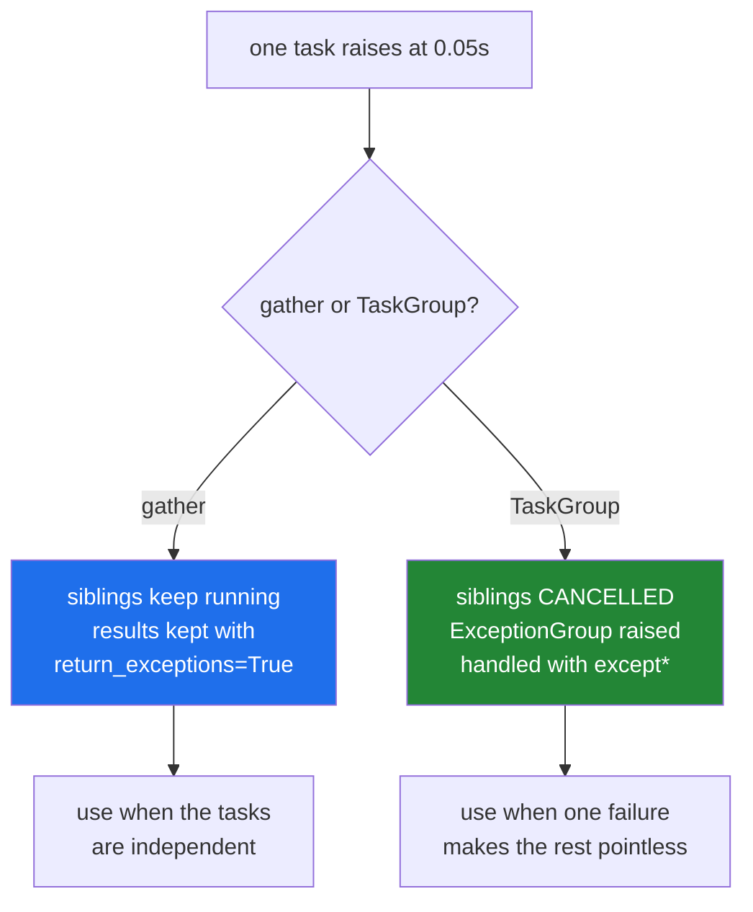

# 4.8 — Timeouts, cancellation and `TaskGroup`

## One-line answer

`asyncio.timeout` cancels what it is waiting on, and `TaskGroup` cancels the **siblings** when one task
fails and reports everything as an `ExceptionGroup` — which is the shape Day 18's `except*` was written
for.

---

## The story

Two things the rail needed before it could be trusted.

**A clock.** A ticket that has been up for ten minutes with no reply is not work in progress; the depot's
line has dropped, or nobody there is picking up. So there is a rule: after ten minutes the ticket comes
down, the customer is told, and — this is the part people forget — **the call is ended**. Leaving the line
open would tie up a phone for the rest of the day.

**A rule about batches.** When one customer brings six parcels for the same delivery and one of the six is
refused, the whole booking is off. Carrying on with the other five wastes the depot's time and produces
five parcels that cannot travel without the sixth. So the moment one is refused, the other five tickets
come down.

And when the manager asks what happened, she is handed **all** the slips at once — the refusal and the
five cancellations — clipped together, rather than being told about the first one and having to ask about
the rest.

---

## The idea in plain language

Three tools, and they build on each other.

**`asyncio.timeout(seconds)`** is an async context manager
([4.6](4.6-async-await.md)) that puts a clock on a block:

```text
async with asyncio.timeout(5):
    result = await slow_thing()
```

If the block has not finished in five seconds, whatever it is awaiting is **cancelled** and `TimeoutError`
is raised. The older form is `asyncio.wait_for(coro, timeout=5)`, which does the same for one coroutine
and raises the same exception. Both are correct; the context manager form covers several awaits in a
block.

**Cancellation is an exception.** The loop throws `asyncio.CancelledError` into the coroutine at its
current `await`, which unwinds it exactly like any other exception
([Day 18, 1.1](../../../day-18-exceptions/parts/01-raising-and-catching/1.1-what-raising-does.md)). So
`finally` blocks run and `async with` cleanups happen — which is how the phone gets hung up.

Two rules follow, and they are the ones people get wrong:

- **Never swallow `CancelledError`.** It inherits from `BaseException`, not `Exception`
  ([Day 18, 1.4](../../../day-18-exceptions/parts/01-raising-and-catching/1.4-the-bare-except.md)), so
  `except Exception:` correctly does not catch it — and a bare `except:` does, which makes a task
  impossible to cancel. If you must catch it for cleanup, **re-raise**
  ([Day 18, 2.4](../../../day-18-exceptions/parts/02-the-hierarchy/2.4-re-raising.md)).
- **Cancellation is cooperative.** It is delivered at an `await`, so a coroutine that is not awaiting —
  because it is in a Python loop ([4.5](4.5-asyncio-one-thread.md)) — cannot be cancelled until it reaches
  one.

**`asyncio.TaskGroup`** is `gather`'s stricter sibling
([4.7](4.7-gather-and-twenty-fetches.md)):

```text
async with asyncio.TaskGroup() as tg:
    tg.create_task(one())
    tg.create_task(two())
```

The `async with` block waits for every task. The difference from `gather` is what happens on failure:
**when one task raises, the others are cancelled**, and the block raises an `ExceptionGroup` containing
everything that went wrong.

That is why Day 18 taught `except*`
([Day 18, 4.5](../../../day-18-exceptions/parts/04-in-anger/4.5-exception-groups.md)) — a `TaskGroup` is
where nearly everybody meets their first `ExceptionGroup`, and a plain `except ValueError:` around one
does not match.

**Which to use.** `TaskGroup` when the tasks belong together and one failing makes the rest pointless —
six parcels in one booking, four sub-queries of one answer. `gather(..., return_exceptions=True)` when
they are independent and you want whatever succeeded — twenty unrelated fetches.

And the rule that makes both usable: **every network call gets a timeout.** A client with no timeout can
wait indefinitely for a server that will never answer, and in a service that is a worker gone forever.
`httpx` has a default timeout; many clients do not.

---

## Why Setu needs it

- **Day 172's router must time out a slow provider** and try the next, which is `asyncio.timeout` around
  each attempt.
- **`ExceptionGroup` was taught on Day 18 for this day**
  ([Day 18, 4.5](../../../day-18-exceptions/parts/04-in-anger/4.5-exception-groups.md)), and this is where
  it arrives from a real source rather than from a hand-built example.
- **Day 233's eval suite runs long**, and a run that hangs on one case with no timeout is a run that never
  reports (Principle 7).
- **A cancelled provider call still counted against the budget** unless the connection is actually closed
  — which is what cancellation's `finally` handling is for (Principle 5).

---

## The mechanism

The clock:

```python
import asyncio


async def slow():
    await asyncio.sleep(1.0)
    return "done"


async def main():
    try:
        async with asyncio.timeout(0.2):
            await slow()
    except TimeoutError:
        print("timed out after 0.2s, and the task was cancelled")

    try:
        print("wait_for:", await asyncio.wait_for(slow(), timeout=0.2))
    except TimeoutError:
        print("wait_for also raises TimeoutError")


asyncio.run(main())
```

**Line by line:**

- `async with asyncio.timeout(0.2):` — **`async with`**, because the timeout has to register with the loop
  and clean up afterwards ([4.6](4.6-async-await.md)).
- `await slow()` inside — one await here, and there could be several; the timeout covers the whole block,
  which is the advantage over `wait_for`.
- `except TimeoutError:` — **the built-in**, not `asyncio.TimeoutError`. Since Python 3.11 they are the
  same class ([Day 18, 2.1](../../../day-18-exceptions/parts/02-the-hierarchy/2.1-catching-catches-subclasses.md)),
  and older code that catches `asyncio.TimeoutError` still works.
- `asyncio.wait_for(slow(), timeout=0.2)` — the older, one-coroutine form. Same behaviour, same exception.

```
timed out after 0.2s, and the task was cancelled
wait_for also raises TimeoutError
```

Now the batch rule:

```python
import asyncio

order = []


async def ok(i):
    await asyncio.sleep(0.3)
    order.append(f"ok {i}")


async def boom():
    await asyncio.sleep(0.05)
    raise ValueError("parcel 3 failed")


async def main():
    try:
        async with asyncio.TaskGroup() as tg:
            tg.create_task(ok(1))
            tg.create_task(ok(2))
            tg.create_task(boom())
    except* ValueError as group:
        print("group  :", [str(e) for e in group.exceptions])
    print("finished:", order, "<- the siblings were cancelled")


asyncio.run(main())
```

**Line by line:**

- `async with asyncio.TaskGroup() as tg:` — the block waits for every task created inside it, so there is
  no `await` on the tasks themselves.
- `tg.create_task(ok(1))` — schedules it. The coroutine starts running as soon as the loop gets control;
  `create_task` is what makes it a task rather than a coroutine object
  ([4.6](4.6-async-await.md)).
- `boom()` fails at 0.05s, while the two `ok` tasks are still waiting at 0.3s.
- `except* ValueError as group:` — **the star form**
  ([Day 18, 4.5](../../../day-18-exceptions/parts/04-in-anger/4.5-exception-groups.md)). A `TaskGroup`
  raises an `ExceptionGroup`, and a plain `except ValueError:` would not match it.
- `group.exceptions` — the members. Always iterate, even when you expect one.
- `order` — appended to only by tasks that *finished*. Read it in the output.

```
group  : ['parcel 3 failed']
finished: [] <- the siblings were cancelled
```

**`order` is empty.** Both `ok` tasks were cancelled at 0.05s, a quarter of a second before they would
have appended. Compare with `gather`, where the same three tasks produced `['ok 2', 'ok 1']`
([4.7](4.7-gather-and-twenty-fetches.md)) — the siblings ran to completion.

That is the whole difference between the two, and it is a design decision rather than a preference:



---

## When it breaks

**A bare `except:` swallowing the cancellation:**

```python
import asyncio


async def stubborn():
    """Bounded so the demonstration ends; a real loop would never stop."""
    for _ in range(6):
        try:
            await asyncio.sleep(0.05)
        except:  # noqa: E722
            print("  refusing to stop")
    return "finished anyway"


async def main():
    task = asyncio.create_task(stubborn())
    await asyncio.sleep(0.12)
    task.cancel()
    print("cancel() called")
    print("task returned:", await task)


asyncio.run(main())
```

**Line by line:**

- `for _ in range(6):` — **bounded on purpose.** The realistic version is `while True:`, and it genuinely
  never stops: the process has to be killed. Six iterations is the same bug, ending.
- `except:` with no type — catches `BaseException`, which includes `CancelledError`
  ([Day 18, 1.4](../../../day-18-exceptions/parts/01-raising-and-catching/1.4-the-bare-except.md)).
- `task.cancel()` — the request. It is delivered as an exception at the current `await`.
- `await task` afterwards — normally this raises `CancelledError`. Watch what it does instead.

```
cancel() called
  refusing to stop
task returned: finished anyway
```

**What it means.** `CancelledError` was delivered, caught by the bare `except:`, discarded, and the loop
carried on to a normal return — so `await task` produced a **value** rather than raising. This is
[Day 18, 1.4](../../../day-18-exceptions/parts/01-raising-and-catching/1.4-the-bare-except.md)'s wedge in
the shutter, in async form. `except Exception:` would not have caught it, because `CancelledError`
inherits from `BaseException`. If you must catch it for cleanup, `raise` afterwards
([Day 18, 2.4](../../../day-18-exceptions/parts/02-the-hierarchy/2.4-re-raising.md)) — and with an
unbounded loop, this program cannot be stopped at all.

**A coroutine that never awaits, so it cannot be cancelled:**

```text
$ uv run python -c "
import asyncio, time

async def crunch():
    total = 0
    for i in range(20_000_000):
        total += i % 7
    return total

async def main():
    start = time.perf_counter()
    try:
        async with asyncio.timeout(0.1):
            await crunch()
    except TimeoutError:
        print('timed out')
    print(f'but it actually took {time.perf_counter() - start:.2f}s')

asyncio.run(main())
"
but it actually took 4.31s
```

**Read what did not print.** `timed out` never appeared, and the block took four seconds instead of a
tenth. The timeout could not fire, because cancellation is delivered **at an `await`** and `crunch` never
reaches one ([4.5](4.5-asyncio-one-thread.md)). A timeout is not a guarantee about wall-clock time; it is
a request that is honoured at the next suspension point. CPU-bound work in a coroutine is uncancellable,
and the fix is `asyncio.to_thread` or a process pool ([4.4](4.4-processes.md)).

**`except ValueError` around a `TaskGroup`:**

```text
$ uv run python -c "
import asyncio

async def boom():
    raise ValueError('failed')

async def main():
    try:
        async with asyncio.TaskGroup() as tg:
            tg.create_task(boom())
    except ValueError:
        print('never printed')

asyncio.run(main())
" 2>&1 | tail -6
  | ExceptionGroup: unhandled errors in a TaskGroup (1 sub-exception)
  +-+---------------- 1 ----------------
    | Traceback (most recent call last):
    |   File "<string>", line 5, in boom
    | ValueError: failed
    +------------------------------------
```

**What it means.** The handler did not match, so the group escaped and printed as a tree-shaped traceback
([Day 18, 4.5](../../../day-18-exceptions/parts/04-in-anger/4.5-exception-groups.md)). An
`ExceptionGroup` containing a `ValueError` **is not** a `ValueError`. The fix is `except*`, and this is
the failure that sends people searching for what the `+---` characters mean.

**Cleanup skipped because the cancellation was not expected:**

```text
$ uv run python -c "
import asyncio

opened = []

async def call(with_finally):
    opened.append('phone')
    if with_finally:
        try:
            await asyncio.sleep(1.0)
        finally:
            opened.remove('phone')
    else:
        await asyncio.sleep(1.0)
        opened.remove('phone')

async def main():
    for with_finally in (False, True):
        opened.clear()
        task = asyncio.create_task(call(with_finally))
        await asyncio.sleep(0.05)
        task.cancel()
        try:
            await task
        except asyncio.CancelledError:
            pass
        print(f'finally={with_finally!s:5} left open: {opened}')

asyncio.run(main())
"
finally=False left open: ['phone']
finally=True  left open: []
```

**What it means.** Without the `finally`, cancellation unwound the coroutine before the cleanup line and
the phone stayed off the hook. This is exactly
[Day 16, 4.2](../../../day-16-files-and-context-managers/parts/04-context-managers/4.2-try-finally-is-what-with-is.md)'s
rule, and cancellation is the path that makes it matter most — because it is the one nobody tests. A
cancelled request that leaves a connection open is how a service runs out of file handles under load.

**No timeout at all:**

```python
async def fetch(url):
    async with httpx.AsyncClient() as client:
        return await client.get(url)
```

**Line by line:**

- `httpx.AsyncClient()` — this one happens to have a sensible default timeout, which is why the plan pins
  it (Part 2).
- many clients, and most hand-written socket code, do **not**. `client.get(url, timeout=None)` disables it
  explicitly, and a surprising amount of code does that to "fix" a flaky endpoint.

**What it means.** A request with no timeout waits for as long as the other side keeps the connection open
— which for a wedged server is indefinitely. One such request holds a worker forever; a few hundred hold
the whole pool, and the service stops responding without a single error in the log. **Every outbound call
gets a timeout**, chosen deliberately, and it is one of the shortest paths from "works fine" to "outage".

---

## In production

**The professional habit is a timeout on every outbound call and a `TaskGroup` wherever tasks are part of
one job.** The timeout is chosen from what the other side promises, not guessed; the `TaskGroup` means a
failure does not leave siblings burning quota on work whose result will be thrown away
(Principle 5).

**What changes at scale is that cancellation becomes routine rather than exceptional.** A client
disconnects, a request times out upstream, a deploy sends `SIGTERM` — all of those cancel work in flight,
many times a minute. Code that only works when it runs to completion leaks a connection, a lock or a
temporary file on each one, and the symptom is a service that degrades over hours and recovers on restart.
Handling cancellation correctly is a `finally` on every resource, and never catching `BaseException`
without re-raising.

**The failure that only appears with real data is the uncancellable task.** A coroutine that awaits on
every path in testing grows one branch that does real work — a large parse, a big sort — and that branch
cannot be cancelled or timed out. It shows up as timeouts that do not fire, requests that outlive their
deadline, and a shutdown that hangs until the orchestrator kills the process. The diagnostic is
[4.1](4.1-waiting-is-not-working.md)'s processor-time ratio inside the handler.

**The review comment a senior engineer leaves.** *"This `TaskGroup` is caught with `except Exception`,
which will not match — a `TaskGroup` raises an `ExceptionGroup`. Use `except*` and log every member. And
the fetch inside has `timeout=None`; put the deadline back, or one slow upstream holds this worker until
the pod is restarted."*

**The interview question.** *"How do you put a timeout on an async operation, and what happens when it
fires?"* `async with asyncio.timeout(n):` around the block, or `asyncio.wait_for` for one coroutine; when
it fires, the operation is **cancelled** — `CancelledError` is thrown in at its current `await` — and
`TimeoutError` is raised to you. The details that matter: cancellation is cooperative, so a coroutine
doing CPU work never reaches an `await` and cannot be timed out; `CancelledError` inherits from
`BaseException`, so a bare `except:` makes a task uncancellable; and cleanup belongs in `finally`, because
cancellation is the path most likely to skip it.

---

## Check yourself

```bash
uv run python -c "
import asyncio

async def ok(i):
    await asyncio.sleep(0.3)
    return i

async def boom():
    await asyncio.sleep(0.05)
    raise ValueError('one failed')

async def main():
    done = await asyncio.gather(ok(1), ok(2), boom(), return_exceptions=True)
    print('gather   :', [type(d).__name__ if isinstance(d, Exception) else d for d in done])
    try:
        async with asyncio.TaskGroup() as tg:
            tg.create_task(ok(1)); tg.create_task(ok(2)); tg.create_task(boom())
    except* ValueError as g:
        print('taskgroup:', len(g.exceptions), 'error, siblings cancelled')

asyncio.run(main())
"
```

Same three tasks, two different outcomes. Say which you would want for twenty unrelated page fetches.

**Answer out loud, without scrolling up:**

> Say what `asyncio.timeout` does to the operation when it fires, and name the one kind of coroutine it
> cannot interrupt.

---

**Next:** [4.9 — choosing: threads, processes, or asyncio](4.9-choosing.md).
