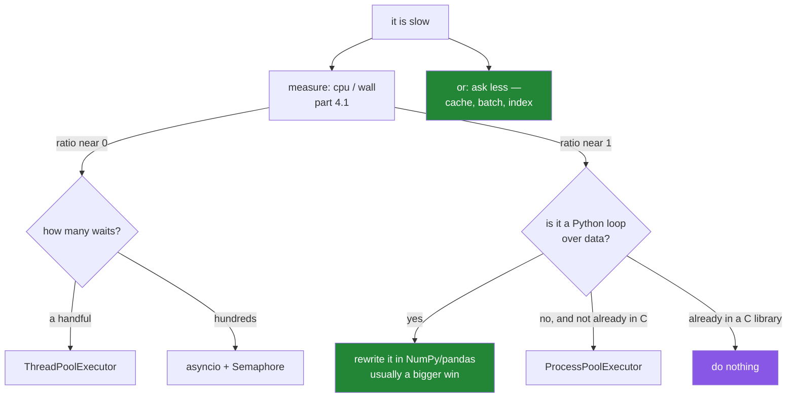

# 4.9 — Choosing: threads, processes, or asyncio

## One-line answer

Measure first; then: **waiting** and a handful of it means threads, **waiting** and hundreds means
asyncio, **working** means processes — and the most common right answer is none of them.

---

## The story

Three things were tried at the counter, in order, and each of them was right once.

The **second clerk** was right for counting cash — two people really do count two tills at once — and it
cost a wage, a till and a second key, and it made the ledger a problem.

The **extra phone** was right for the depot calls. Cheap, and it does nothing for counting.

The **ticket rail** was right when there were forty depot calls, because forty phones is not a plan.

And the fourth thing, which is what actually fixed the morning, was somebody noticing that the depot would
send the whole day's list at eight o'clock if anybody asked. No calls at all. The counter had spent a year
getting better at making forty phone calls, and the answer was one email the night before.

That is the order to think in: **is this call necessary**, before **how do we make forty of them at
once**.

---

## The idea in plain language

This part is the decision, and it is short because the work is in
[4.1](4.1-waiting-is-not-working.md): **measure first**. Processor time over wall time
([4.1](4.1-waiting-is-not-working.md)) tells you which half of the table you are in, and everything else
follows.

| Situation | Reach for | Why |
|---|---|---|
| **waiting**, a handful (up to ~50) | `ThreadPoolExecutor` ([4.3](4.3-threads.md)) | simplest thing that works; any library |
| **waiting**, hundreds or thousands | `asyncio` ([4.5](4.5-asyncio-one-thread.md)) | cheap per wait; needs async libraries |
| **working**, pure Python | `ProcessPoolExecutor` ([4.4](4.4-processes.md)) | real parallelism; pay the copying |
| **working**, already in NumPy or similar | **nothing** | it releases the GIL and is parallel already |
| **working**, a Python loop over data | **rewrite it** in the library | usually a bigger win than parallelism |
| slow because you ask too much | **ask less** | caching, batching, a better query |

The last two rows are where most real wins are, and they come before any of the first four.

A Python loop moved into NumPy or pandas is often a hundredfold faster
([Day 6, 4.2](../../../day-06-loops/parts/04-loop-cost/4.2-the-loop-you-should-not-write.md)), where four
processes give you fourfold at best and cost you copying, start-up and a `if __name__ == "__main__":`
requirement ([4.4](4.4-processes.md)). And a request you do not make is faster than any number of
concurrent requests: one batch endpoint instead of twenty calls, a cache in front of a lookup, an index on
the column.

**The costs, stated plainly**, because "add concurrency" is never free:

- **Threads**: race conditions anywhere ([4.3](4.3-threads.md)), and a traceback from a worker thread
  that does not stop the program.
- **Processes**: everything pickled and copied, no shared state, and start-up cost
  ([4.4](4.4-processes.md)).
- **Asyncio**: the whole codebase becomes async, every library has to support it, and one blocking call
  silently serialises everything ([4.5](4.5-asyncio-one-thread.md)).

All three make failures harder to reproduce and stack traces harder to read. That is the price, and it is
worth paying when the measurement says so and not before.

**Mixing them is normal and has one rule.** An async program that must do CPU work uses
`asyncio.to_thread` for a blocking library call, or a `ProcessPoolExecutor` via
`loop.run_in_executor` for real arithmetic. What it must never do is the CPU work inline
([4.5](4.5-asyncio-one-thread.md)).

---

## Why Setu needs it

- **This is the plan's `PY-24` question answered as a decision** rather than as three separate tools:
  threads help I/O, processes help maths, and knowing which you have is the whole skill.
- **Day 172's router is four waits** — a thread pool, or `gather` if the clients are async.
- **Day 233's eval suite is hundreds of waits** — asyncio, with a semaphore
  ([4.7](4.7-gather-and-twenty-fetches.md)) because the free tiers have limits (Principle 5).
- **From Day 20 the heavy arithmetic is NumPy's** (plan Part 2) — the "do nothing" row, which is the
  answer for most of this curriculum's second half.

---

## The mechanism

The decision, run as a measurement rather than a guess:

```python
"""Which kind of slow is this, and therefore which tool."""

import time


def measure(name, fn):
    wall0, cpu0 = time.perf_counter(), time.process_time()
    fn()
    wall = time.perf_counter() - wall0
    cpu = time.process_time() - cpu0
    ratio = cpu / wall
    if ratio > 0.8:
        verdict = "CPU-bound  -> processes, or move it into a library"
    elif ratio < 0.2:
        verdict = "I/O-bound  -> threads (few) or asyncio (many)"
    else:
        verdict = "mixed      -> measure the parts separately"
    print(f"{name:10} wall {wall:5.2f}s  cpu {cpu:5.2f}s  ratio {ratio:4.2f}  {verdict}")


def waiting():
    time.sleep(0.5)


def working():
    total = 0
    for i in range(3_000_000):
        total += i % 7


def both():
    time.sleep(0.5)
    working()


measure("waiting", waiting)
measure("working", working)
measure("both", both)
```

**Line by line:**

- `time.process_time()` — processor time used by this process. Sleeping uses none
  ([4.1](4.1-waiting-is-not-working.md)), which is what makes the ratio meaningful.
- `time.perf_counter()` — elapsed wall-clock time.
- `ratio = cpu / wall` — **the whole diagnostic.** Near 1 means the processor was busy the whole time;
  near 0 means it was idle.
- the three thresholds — 0.8 and 0.2 are judgement, not physics; anything in between means the work has
  two parts and they should be measured separately rather than wrapped in one tool.
- `both()` — deliberately half and half, because real functions usually are, and the useful answer for
  those is "split it".

Run on Python 3.12.12 on 2026-09-02:

```
waiting    wall  0.50s  cpu  0.00s  ratio 0.00  I/O-bound  -> threads (few) or asyncio (many)
working    wall  0.51s  cpu  0.50s  ratio 0.97  CPU-bound  -> processes, or move it into a library
both       wall  1.04s  cpu  0.53s  ratio 0.51  mixed      -> measure the parts separately
```

**Two lines and a decision.** No profiler, no guessing from the shape of the code, and it works on any
function you can call.

And the mixed case, split:

```python
import asyncio
import time


def crunch(n):
    total = 0
    for i in range(6_000_000):
        total += i % 7
    return total


async def fetch(n):
    await asyncio.sleep(0.25)
    return n


async def inline():
    return [crunch(i) for i in range(4)]


async def offloaded():
    return await asyncio.gather(*(asyncio.to_thread(crunch, i) for i in range(4)))


async def main():
    for name, coro in (("inline    ", inline), ("to_thread ", offloaded)):
        start = time.perf_counter()
        await asyncio.gather(coro(), fetch(1), fetch(2))
        print(f"{name}: {time.perf_counter() - start:.2f}s")


asyncio.run(main())
```

**Line by line:**

- `crunch` is an **ordinary** `def`, not `async` — it is CPU work and has nothing to await
  ([4.6](4.6-async-await.md)).
- `inline()` calls it directly inside a coroutine, which blocks the loop for the whole duration
  ([4.5](4.5-asyncio-one-thread.md)) — so the two `fetch` calls cannot progress.
- `asyncio.to_thread(crunch, i)` — hands it to a worker thread and returns an awaitable, so the loop
  stays free. This works here because the arithmetic is Python and the threads take turns
  ([4.2](4.2-the-gil.md)) — the win is not that the crunching is parallel, it is that **the fetches are no
  longer blocked**.
- both measured against the same two fetches, so the difference is only where `crunch` ran.

```
inline    : 4.63s
to_thread : 4.42s
```

**Almost identical — and read why.** The total is the same because the crunching is CPU-bound Python and
the GIL means threads do not speed it up ([4.2](4.2-the-gil.md)). What changed is not visible in this
number: with `to_thread` the event loop was free the whole time, so the two fetches finished at 0.25s
instead of after the crunching. In a service that is the difference between every other request waiting
four and a half seconds and every other request being served immediately — and if the crunching genuinely needs to be
faster, the answer is a process pool ([4.4](4.4-processes.md)) or NumPy, not either of these.

The decision:



The green boxes are usually the biggest wins and are the ones people try last.

---

## When it breaks

**Concurrency added to something that was not slow for that reason:**

```text
$ uv run python -c "
import time
from concurrent.futures import ThreadPoolExecutor

def work(n):
    total = 0
    for i in range(3_000_000):
        total += i % 7
    return total

t0 = time.perf_counter(); [work(i) for i in range(4)]; serial = time.perf_counter() - t0
t0 = time.perf_counter()
with ThreadPoolExecutor(max_workers=4) as p: list(p.map(work, range(4)))
threaded = time.perf_counter() - t0
print(f'serial {serial:.2f}s  threads {threaded:.2f}s  -> {serial / threaded:.2f}x')
"
serial 2.12s  threads 2.10s  -> 1.01x
```

**What it means.** No faster, and the code is now concurrent — which means it can race
([4.3](4.3-threads.md)), its tracebacks come from worker threads, and every future reader has to reason
about it. All of that was paid for a 1.00× improvement, and it happens because somebody reached for a tool
before measuring.

**The loop that should have been a library call:**

```text
$ uv run python -c "
import time
data = list(range(3_000_000))

t0 = time.perf_counter()
total = 0
for x in data:
    total += x
print(f'python loop : {time.perf_counter() - t0:.3f}s')

t0 = time.perf_counter()
total = sum(data)
print(f'sum()       : {time.perf_counter() - t0:.3f}s')
"
python loop : 0.785s
sum()       : 0.078s
```

**What it means.** Ten times faster, on one core, from deleting a loop
([Day 6, 4.2](../../../day-06-loops/parts/04-loop-cost/4.2-the-loop-you-should-not-write.md)). Four
processes would have given at most four times, and cost pickling
([4.4](4.4-processes.md)). With NumPy the gap is larger still. **Look for this before reaching for
parallelism**, because it is usually both bigger and simpler.

**Asyncio adopted for four calls:**

```python
async def main():
    async with httpx.AsyncClient() as client:
        return await asyncio.gather(*(client.get(u) for u in four_urls))
```

**Line by line:**

- correct, and about as fast as the thread-pool version for four calls.
- the cost is elsewhere: **every function that calls this must now be `async`**, all the way to the entry
  point, and every library in that path must be async-compatible
  ([4.5](4.5-asyncio-one-thread.md)).
- one blocking call anywhere in that chain silently serialises the lot
  ([4.6](4.6-async-await.md)).

**What it means.** For four waits, `ThreadPoolExecutor` gives the same speed with none of that. Asyncio
earns its complexity somewhere in the hundreds, or when the libraries are already async. Choosing it for a
handful is paying an architectural cost for a rounding error.

**Threads and a process pool, together, by accident:**

```text
$ uv run python -c "
import os
print('cores      :', os.cpu_count())
print('4 processes x 8 threads each = 32 workers on', os.cpu_count(), 'cores')
print('every one of them competing for the same', os.cpu_count(), 'processors')
"
cores      : 4
4 processes x 8 threads each = 32 workers on 4 cores
every one of them competing for the same 4 processors
```

**What it means.** Nesting pools multiplies rather than adds, and the usual way it happens is invisible:
a `ProcessPoolExecutor` whose worker calls a library that itself uses threads — NumPy and scikit-learn do,
by default. The result is far more workers than cores, all competing, and it is reliably **slower** than
either level alone. The fix is to pick one level of parallelism and turn the other off, which for the
numerical libraries means an environment variable such as `OMP_NUM_THREADS=1` in the workers.

---

## In production

**The professional habit is: measure, then ask whether the work is necessary, then choose a tool — in that
order.** Most performance work that succeeds is removing work rather than parallelising it: a batch
endpoint, a cache, an index, a vectorised call. Concurrency is what remains after those, and it is the
step with the worst ratio of speed-up to added bugs.

**What changes at scale is that the wrong choice becomes architectural.** Threads and processes are local
decisions you can reverse in an afternoon; asyncio is not — it colours every function above it, so
adopting it "because concurrency" for a workload that needed a thread pool is a decision the codebase
carries for years. The corollary is that it is worth being sure, and being sure means the measurement.

**The failure that only appears with real data is the workload that changed kind.** Something that was
I/O-bound when records were small becomes CPU-bound when they are large, and the tool chosen for the first
shape actively hurts in the second — an async service whose loop is now blocked, a thread pool that no
longer scales. The measurement is not a one-off: it is worth re-taking when the data changes, and the
ratio is cheap enough to log.

**The review comment a senior engineer leaves.** *"Before we make this async — what does `cpu/wall` say?
My guess is it is CPU-bound in the tokeniser, in which case asyncio makes it worse, not better, and the
real fix is the batch API we are not using. If it is I/O-bound, a `ThreadPoolExecutor(8)` is four lines
and does not colour the whole call chain."*

**The interview question.** *"How do you decide between threads, processes and asyncio?"* Measure first —
processor time over wall time — because the answer depends entirely on whether the work is waiting or
working. Waiting: threads for a handful, asyncio for hundreds, where asyncio's advantage is cost per
concurrent wait rather than speed. Working: processes, unless the work is already in a C library that
releases the GIL, in which case nothing. And the answer a senior engineer gives before any of those is
that a Python loop moved into a vectorised call, or a request not made at all, usually beats every
concurrency option and adds no bugs.

---

## Check yourself

```bash
uv run python -c "
import time

def measure(name, fn):
    w0, c0 = time.perf_counter(), time.process_time()
    fn()
    w, c = time.perf_counter() - w0, time.process_time() - c0
    print(f'{name:8} wall {w:.2f}s  cpu {c:.2f}s  ratio {c / w:.2f}')

measure('waiting', lambda: time.sleep(0.4))
measure('working', lambda: sum(i * i for i in range(4_000_000)))
measure('both', lambda: (time.sleep(0.2), sum(i * i for i in range(4_000_000))))
"
```

```
waiting  wall 0.40s  cpu 0.00s  ratio 0.00
working  wall 1.32s  cpu 1.31s  ratio 1.00
both     wall 1.46s  cpu 1.27s  ratio 0.87
```

Three ratios, three different answers. Say which tool each one points at, and what you would do about the
third.

**Answer out loud, without scrolling up:**

> Give the measurement that decides between threads and processes, and name the two answers that are
> usually better than either.

---

**Next:** [5.1 — the gate, read as a list](../05-the-gate/5.1-the-gate-as-a-list.md).
