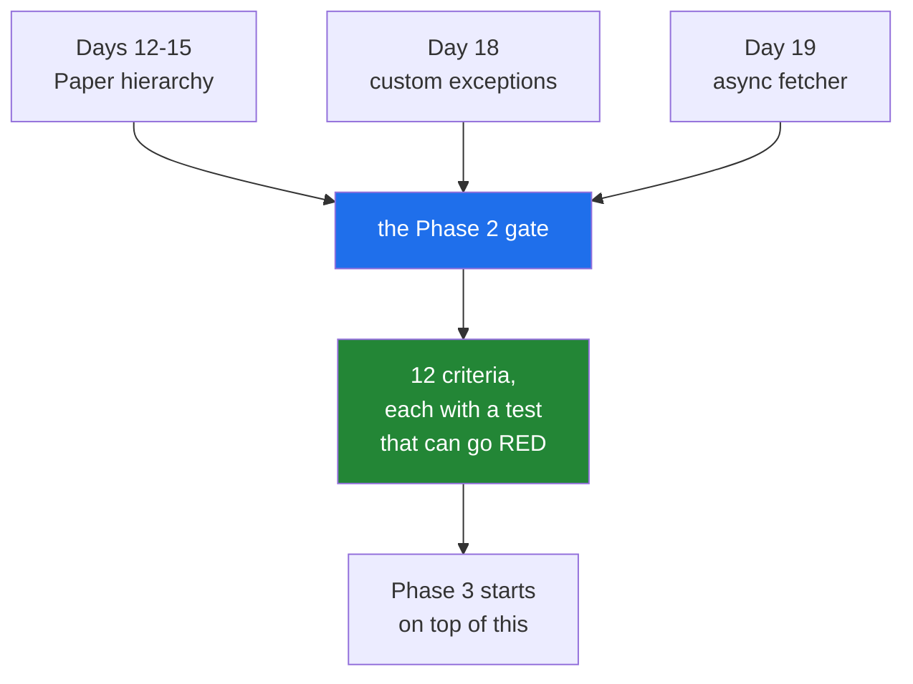

# 5.1 — The Phase 2 gate, read as a list

## One-line answer

Phase 2's gate is one sentence — **a `Paper` class hierarchy, custom exceptions, and an async fetcher,
tested** — and this part turns it into acceptance criteria you can tick, each pointing at the day that
built it.

---

## The story

The branch is inspected once a year, and everybody dreads it until they see the form.

The form is a list. *Is the shutter working? Are the scales calibrated? Is there a fire drill record? Can
somebody show me the refusal procedure?* Twelve lines, each one a thing you either can or cannot
demonstrate, standing there, in five minutes.

What makes it survivable is that nothing on the list is a surprise. Every line is something the branch has
been doing all year — the shutter, the scales, the drills — and the inspection is not new work. It is
somebody asking you to show them, once, the things you already claim to do.

The branches that dread it are the ones where the drill record is written the night before.

---

## The idea in plain language

A **gate day** is different from a lab day. A lab teaches an idea; a gate asks whether the phase's ideas
hold together, and the plan's split for it is **one acceptance criterion per part** (plan Part 11.7).

Phase 2's gate, from the plan's Part 5:

> `Paper` class hierarchy + custom exceptions + async fetcher, tested

Three things and a word. Read as criteria:

**1. A `Paper` class hierarchy.** Days 12 through 15 built it: a class with validated construction
([Day 12, 3.2](../../../day-12-classes/parts/03-the-paper-object/3.2-validation-in-init.md)), a base class
and subclasses ([Day 13, 4.2](../../../day-13-inheritance-and-abstraction/parts/04-abstraction/4.2-the-loader-family.md)),
alternative constructors and properties
([Day 15, 1.2](../../../day-15-constructors-and-dunders/parts/01-three-kinds-of-method/1.2-from-message-the-second-door-in.md)),
and the dunder methods that make it behave like a built-in type
([Day 15, 3.2](../../../day-15-constructors-and-dunders/parts/03-the-dunders/3.2-repr-and-str.md)).

**2. Custom exceptions.** Day 18: one base class per project
([Day 18, 3.1](../../../day-18-exceptions/parts/03-your-own/3.1-one-base-class-per-project.md)),
`RateLimited` carrying its `retry_after`
([Day 18, 3.2](../../../day-18-exceptions/parts/03-your-own/3.2-an-exception-that-carries-data.md)), and
translation at the boundary
([Day 18, 3.4](../../../day-18-exceptions/parts/03-your-own/3.4-translate-at-the-boundary.md)).

**3. An async fetcher.** Today: `gather` with a semaphore
([4.7](../04-concurrency/4.7-gather-and-twenty-fetches.md)), timeouts and cancellation
([4.8](../04-concurrency/4.8-timeouts-and-taskgroup.md)), and the exceptions coming back as values rather
than as a raise.

**4. Tested.** The word that turns the other three from claims into facts (Principle 7), and it is the one
people leave until last. It is [5.3](5.3-testing-async-code.md).

And two things this day adds that the gate sentence does not name, because they were not in the plan when
Phase 2's gate was written: the whole `Paper` hierarchy can now be **typed**
([1.1](../01-type-hints/1.1-a-hint-is-a-note.md)), and anything crossing a boundary can be a
**Pydantic model** rather than a hand-written validator
([2.5](../02-dataclasses/2.5-not-a-validator.md)). Those are improvements to what the gate asks for, not
substitutes for it.

**How to read a gate.** Not as new work — as a demonstration of work already done. Every criterion below
points at the day that built it, and the only genuinely new code today is the fetcher
([5.2](5.2-the-async-fetcher.md)) and its tests. If a criterion cannot be demonstrated, the honest
response is to go back to the day that owns it rather than to write something quickly here
(Principle 1).

---

## Why Setu needs it

- **It is the plan's own gate for Phase 2** (Part 5), and Phase 3 starts on Day 20 with NumPy — a
  different world, where the Python foundations are assumed rather than taught.
- **`src/setu/` at the end of today is what Phase 3 builds on**, so a gap here is a gap under everything
  after it.
- **The fetcher is the shape every provider call takes from Day 172**: concurrency with a limit, a
  timeout, and failures as data.
- **Principle 10 wants a written decision record per phase**, and the criteria below are what that record
  is written against.

---

## The mechanism

The gate as a table, with the day that owns each row:

| # | Criterion | Built on | Demonstrated by |
|---|---|---|---|
| 1 | `Paper` constructs, validates, and refuses bad input | [Day 12, 3.2](../../../day-12-classes/parts/03-the-paper-object/3.2-validation-in-init.md) | `pytest.raises` per rule |
| 2 | A base class with at least two subclasses, and polymorphism | [Day 13, 4.2](../../../day-13-inheritance-and-abstraction/parts/04-abstraction/4.2-the-loader-family.md) | one loop over both, no `isinstance` |
| 3 | `__repr__`, `__eq__`, `__hash__` behave | [Day 15, 3.2](../../../day-15-constructors-and-dunders/parts/03-the-dunders/3.2-repr-and-str.md) | two equal papers dedupe in a `set` |
| 4 | An alternative constructor | [Day 15, 1.2](../../../day-15-constructors-and-dunders/parts/01-three-kinds-of-method/1.2-from-message-the-second-door-in.md) | `Paper.from_row(...)` round trip |
| 5 | One project base exception, everything under it | [Day 18, 3.1](../../../day-18-exceptions/parts/03-your-own/3.1-one-base-class-per-project.md) | `issubclass` per type |
| 6 | `RateLimited` carries `retry_after` and pickles | [Day 18, 3.2](../../../day-18-exceptions/parts/03-your-own/3.2-an-exception-that-carries-data.md) | attribute assertion + round trip |
| 7 | A boundary that leaks no dependency's exception | [Day 18, 3.4](../../../day-18-exceptions/parts/03-your-own/3.4-translate-at-the-boundary.md) | `pytest.raises(OurError)` for both inputs |
| 8 | The fetcher never exceeds its concurrency limit | [4.7](../04-concurrency/4.7-gather-and-twenty-fetches.md) | a recorded peak equals the limit |
| 9 | A slow URL times out and the others survive | [4.8](../04-concurrency/4.8-timeouts-and-taskgroup.md) | one `TimeoutError` among the results |
| 10 | Failures come back as values, not as a raise | [4.7](../04-concurrency/4.7-gather-and-twenty-fetches.md) | `isinstance(result, Exception)` |
| 11 | The run reports what it spent | Principle 5 | a `Budget` in the return value |
| 12 | Every one of the above has a test that can go RED | Principle 7 | break it and watch |

**Line by line, on the rows that are not obvious:**

- **Row 2 says "no `isinstance`"** because that is what makes it polymorphism rather than a switch
  ([Day 13, 2.2](../../../day-13-inheritance-and-abstraction/parts/02-polymorphism/2.2-duck-typing-and-isinstance.md)).
  A loop that asks what type each loader is has a hierarchy and is not using it.
- **Row 3 says "dedupe in a `set`"** because that exercises `__eq__` and `__hash__` together
  ([Day 15, 3.4](../../../day-15-constructors-and-dunders/parts/03-the-dunders/3.4-hash-and-the-broken-set.md)),
  and either one alone passes a weaker test.
- **Row 6 says "and pickles"** because that is the assertion nothing else covers
  ([Day 18, 3.2](../../../day-18-exceptions/parts/03-your-own/3.2-an-exception-that-carries-data.md)), and
  it is the one that matters the day the work moves into a process pool
  ([4.4](../04-concurrency/4.4-processes.md)).
- **Row 8 says "a recorded peak"** rather than "it feels concurrent". A timing assertion is flaky on a
  loaded machine; a counter of how many were in flight is exact
  ([5.2](5.2-the-async-fetcher.md)).
- **Row 11 is Principle 5**, and it is the row that makes this project's concurrency safe to run against a
  free tier: a fetcher that cannot say how many requests it made cannot be trusted with a daily allowance.
- **Row 12 is the one that is checked by breaking things**, not by reading them
  ([Day 18, 4.4](../../../day-18-exceptions/parts/04-in-anger/4.4-pytest-raises.md)).

The one command that demonstrates the lot:

```text
$ uv run python -m pytest -q && ./m depth 19 && ./m check
```

**Line by line:**

- `pytest -q` — every test in the project, including the fifteen days before this one. A gate is about the
  phase, not about today.
- `./m depth 19` — the depth contract over today's parts
  ([Day 0, 3.2](../../../day-00-setup/parts/03-m-script/3.2-the-case-dispatcher.md)).
- `./m check` — lint, format, the lesson blocks, the offline tests and the depth sweep
  ([Day 2, 4.1](../../../day-02-quality-gate/parts/04-the-gate/4.1-what-m-check-actually-runs.md)).
- `&&` between them — each runs only if the last succeeded, so the first failure is the one you see
  ([Day 0, 3.1](../../../day-00-setup/parts/03-m-script/3.1-set-euo-pipefail.md)).

What a gate is made of:



---

## When it breaks

**A criterion that cannot be demonstrated:**

```text
$ uv run python -c "
from setu.paper import Paper
print(len({Paper(title='A', year=2020), Paper(title='A', year=2020)}))
" 2>&1 | tail -2
TypeError: unhashable type: 'Paper'
```

**What it means.** Row 3 fails. `__eq__` was defined and `__hash__` was not, so two equal papers cannot
share a set entry — the exact failure
[Day 15, 3.4](../../../day-15-constructors-and-dunders/parts/03-the-dunders/3.4-hash-and-the-broken-set.md)
described. **The right response is to go back to Day 15**, not to add a `__hash__` here and move on; the
gate found a gap in a day, and the day is where it gets fixed.

**A gate that passes because the tests are weak:**

```python
def test_paper_works():
    p = Paper(title="A", year=2020)
    assert p is not None
```

**Line by line:**

- `Paper(...)` — constructed.
- `assert p is not None` — an assertion that is true for **every** object that constructs
  ([Day 18, 4.4](../../../day-18-exceptions/parts/04-in-anger/4.4-pytest-raises.md)).
- nothing about validation, equality, hashing or the repr.

**What it means.** Green, and it demonstrates nothing. A gate is only as good as the assertions behind it,
which is why row 12 exists: **break each thing on purpose and watch the test go red.** A test that cannot
go red is a comment.

**Writing the criteria today instead of demonstrating them:**

The gate says `Paper` **hierarchy**, and it is possible to write a thin base class and one subclass this
afternoon that satisfies the letter of row 2. It will pass. It will also be a class nobody uses, tested by
a test nobody will read again, and Phase 3 will build on the `Paper` that actually exists rather than the
one written for the inspection. The gate is a check on the phase, and passing it dishonestly checks
nothing (Principle 1).

**Skipping the budget row:**

```text
$ uv run python -c "
import asyncio

async def fetch_all(urls):
    return await asyncio.gather(*(asyncio.sleep(0, url) for url in urls))

print(asyncio.run(fetch_all(['a', 'b', 'c'])))
print('how many requests did that make? nothing recorded it')
"
['a', 'b', 'c']
how many requests did that make? nothing recorded it
```

**What it means.** It works, and there is no answer to "what did that cost". On a free tier with a daily
allowance (plan Part 2.1), a fetcher that does not count is a fetcher you cannot run twice with
confidence — and Principle 5 says every lab states its request budget. Row 11 is not bureaucracy; it is
the thing that makes the rest of the phase runnable.

---

## In production

**The professional equivalent of a gate is a definition of done that somebody else can check.** Not "the
feature works" but a list: these inputs are rejected, this failure mode is handled, this is the observed
throughput, this is what it costs. Written as criteria before the work rather than as a description
after it, so that "done" is a question with an answer.

**What changes at scale is that the gate becomes the interface between teams.** When another team builds
on your phase, what they can rely on is exactly what your criteria say — and anything true by accident is
something that will break when you refactor. That is why a gate is stated as behaviour with tests rather
than as a list of files that exist.

**The failure that only appears later is the criterion that was demonstrated once.** A gate passed in
March and never re-run is a claim about March. Everything on the list above is a `pytest` test for exactly
that reason: it is checked on every push
([Day 2, 5.1](../../../day-02-quality-gate/parts/05-ci/5.1-what-ci-actually-is.md)), so the phase stays
passed rather than having passed.

**The review comment a senior engineer leaves.** *"The acceptance list says 'the fetcher respects its
concurrency limit' and the test asserts elapsed time, which is flaky on CI. Record the peak in-flight
count and assert on that — it is exact, and it will not fail at 3am because the runner was busy."*

**The interview question.** *"How do you know a piece of work is finished?"* By a list of criteria written
as tests that can fail, each tied to a behaviour rather than to a file — inputs rejected, failure modes
handled, limits respected, cost recorded. And the part that separates a checklist from a gate: each
criterion is broken on purpose once, to confirm the test that guards it actually goes red, because a
criterion whose test cannot fail is a sentence rather than a check.

---

## Check yourself

```bash
uv run python -m pytest -q
uv run python scripts/depth_check.py 19
```

Everything green, and the second command reports today's part count. Now open
[`CHECKLIST.md`](../../CHECKLIST.md) and find the twelve criteria from this part in it.

**Answer out loud, without scrolling up:**

> Name the three things Phase 2's gate asks for and the fourth word that turns them into facts, and say
> what you should do when a criterion cannot be demonstrated.

---

**Next:** [5.2 — the async fetcher, and the rate limit it must respect](5.2-the-async-fetcher.md).
