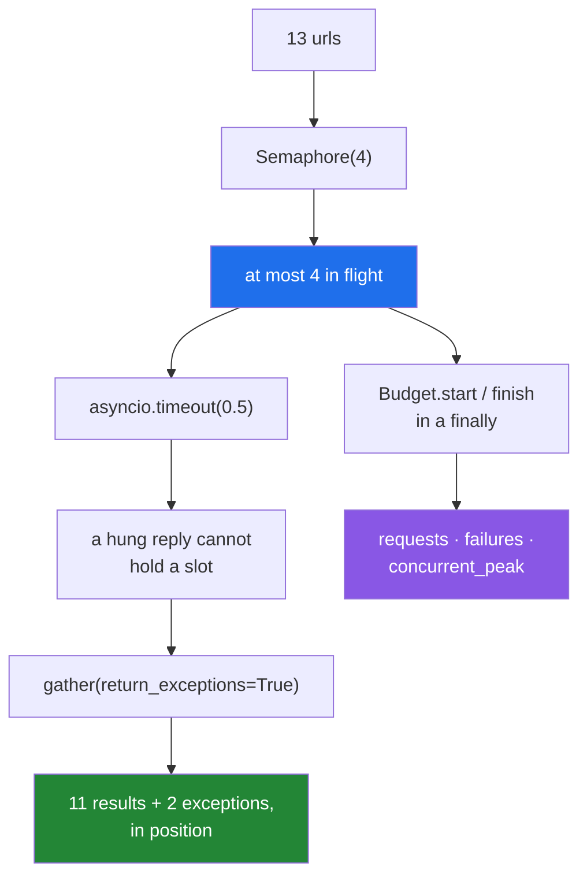

# 5.2 — The async fetcher, and the rate limit it must respect

## One-line answer

The gate's fetcher is four decisions in about thirty lines: **a semaphore** so it never exceeds its limit,
**a timeout** so one slow reply cannot hold it, **`return_exceptions`** so a failure does not lose the
rest, and **a budget** so it can say what it spent.

---

## The story

The rail worked, and the depot rang back to complain.

Forty calls in a minute from one branch had jammed their switchboard, and their supervisor was blunt about
it: four at a time, or we stop answering.

So the rail got a peg board with four hooks. You may have four calls out; the fifth ticket waits until a
hook is free. Everything else about the rail is unchanged, and the depot stopped complaining.

Two more rules were added the same week, both learned the hard way.

A call that has not been answered in thirty seconds is **hung up**, because otherwise it holds a hook
forever and four such calls close the counter.

And at the end of the run, the clerk writes down three numbers: how many calls she made, how many failed,
and the most she had out at once. The first is what the depot will bill for. The third is the number she
promised them.

---

## The idea in plain language

This is the gate's third criterion ([5.1](5.1-the-gate-as-a-list.md)), and every piece of it has appeared
in this day already. What is new is putting them together and noticing that **all four are compulsory**.

**A semaphore, because concurrency has a ceiling.** `asyncio.gather` starts everything at once
([4.7](../04-concurrency/4.7-gather-and-twenty-fetches.md)). `asyncio.Semaphore(4)` inside each task means
at most four are ever in flight — the rest are created, and wait. This is not a performance tuning knob:
it is the number the other side told you (plan Part 2.1), and exceeding it is how a free tier stops
answering (Principle 5).

**A timeout, because a hung request holds a slot.** `async with asyncio.timeout(t)` around the call
([4.8](../04-concurrency/4.8-timeouts-and-taskgroup.md)). Without it, one server that accepts a connection
and never replies holds a semaphore slot indefinitely, and four of those stop the fetcher completely.

**`return_exceptions=True`, because one failure must not lose nineteen results.** Failures come back as
values in position ([4.7](../04-concurrency/4.7-gather-and-twenty-fetches.md)), and the caller sorts them
out with `isinstance`.

**A budget, because Principle 5 says every lab states its request budget.** Requests made, failures, and
the peak number in flight. That last one is the interesting choice: it is how the fetcher **proves** it
respected its limit, and it is an exact number rather than a timing that a busy machine can make lie
([5.3](5.3-testing-async-code.md)).

Two design decisions worth stating, because they are what make it testable.

**The fetcher takes the `get` function as an argument** rather than importing a client. That is dependency
injection in its simplest form: the tests pass a fake `get`
([Day 10, 3.3](../../../day-10-functions/parts/03-the-module/3.3-pure-functions-and-the-seam.md)), and the
whole suite runs offline with a request budget of zero (Principle 5).

**The budget is a dataclass, not a dictionary.** Named fields, a readable `repr`, and equality
([2.1](../02-dataclasses/2.1-what-dataclass-writes.md)) — so a test can assert on `budget.concurrent_peak`
rather than on `budget["peak"]` and find out at the type checker rather than at run time if it is
misspelt ([1.4](../01-type-hints/1.4-the-type-checker.md)).

The one thing this fetcher deliberately does **not** do is retry. Retrying belongs to the caller, who
knows the `retry_after` from the exception
([Day 18, 3.2](../../../day-18-exceptions/parts/03-your-own/3.2-an-exception-that-carries-data.md)) and
knows whether it has budget left. A fetcher that retries on its own can spend a day's allowance without
being asked.

---

## Why Setu needs it

- **It is the gate's third criterion**, and the shape every provider call takes from Day 172 onward.
- **The free tiers have documented limits** (plan Part 2.1) — requests per minute, requests per day — and
  the semaphore is where that number lives in code rather than in somebody's memory.
- **Principle 5 says every lab prints its request count**, which the budget makes automatic rather than a
  thing you remember to do.
- **Day 233's eval suite runs hundreds of these**, where the difference between a limit that is respected
  and one that is not is the difference between a run that finishes and a run that is blocked.

---

## The mechanism

The whole fetcher:

```python
"""An async fetcher that respects a rate limit and reports what it spent."""

from __future__ import annotations

import asyncio
from dataclasses import dataclass, field


@dataclass
class Budget:
    """What one run of the fetcher spent. Principle 5: every lab states its budget."""

    requests: int = 0
    failures: int = 0
    concurrent_peak: int = 0
    _in_flight: int = field(default=0, repr=False)

    def start(self) -> None:
        self.requests += 1
        self._in_flight += 1
        self.concurrent_peak = max(self.concurrent_peak, self._in_flight)

    def finish(self, ok: bool) -> None:
        self._in_flight -= 1
        if not ok:
            self.failures += 1


async def fetch_all(get, urls, *, limit: int = 4, timeout: float = 1.0):
    """Fetch every url with at most `limit` in flight. Returns (results, budget)."""
    sem = asyncio.Semaphore(limit)
    budget = Budget()

    async def one(url):
        async with sem:
            budget.start()
            ok = False
            try:
                async with asyncio.timeout(timeout):
                    reply = await get(url)
                ok = True
                return reply
            finally:
                budget.finish(ok)

    results = await asyncio.gather(*(one(u) for u in urls), return_exceptions=True)
    return results, budget
```

**Line by line:**

- `@dataclass class Budget` — a record, so the generated `__repr__` prints every field and a test can
  compare two ([2.1](../02-dataclasses/2.1-what-dataclass-writes.md)).
- `_in_flight: int = field(default=0, repr=False)` — bookkeeping, kept out of the `repr`
  ([2.2](../02-dataclasses/2.2-default-factory.md)) because it is always zero by the time anybody looks.
  The leading underscore says the same thing to a reader
  ([Day 13, 3.1](../../../day-13-inheritance-and-abstraction/parts/03-encapsulation/3.1-public-protected-private.md)).
- `self.concurrent_peak = max(self.concurrent_peak, self._in_flight)` — the high-water mark. **No lock
  needed**: this is asyncio, one thread, and there is no `await` between the increment and the `max`
  ([4.5](../04-concurrency/4.5-asyncio-one-thread.md)) — so nothing can interleave. In a thread pool this
  would be [4.3](../04-concurrency/4.3-threads.md)'s race condition and would need one.
- `async def fetch_all(get, urls, *, limit=4, timeout=1.0)` — `get` **first and injected**, and the two
  policies keyword-only ([Day 10, 1.5](../../../day-10-functions/parts/01-the-signature/1.5-keyword-only-and-positional-only.md))
  so a call site cannot silently swap them.
- `sem = asyncio.Semaphore(limit)` — created **inside** the function, so each call gets its own and two
  concurrent runs do not share a limit.
- `async def one(url)` — a closure over `sem` and `budget`
  ([Day 10, 2.4](../../../day-10-functions/parts/02-scope/2.4-closures-and-late-binding.md)). Nested
  deliberately: it is not part of the module's surface
  ([Day 17, 4.4](../../../day-17-modules-and-packages/parts/04-the-project/4.4-designing-the-public-surface.md)).
- `async with sem:` — **the ceiling.** Acquire before starting, release on exit including on failure
  ([4.6](../04-concurrency/4.6-async-await.md)).
- `budget.start()` **inside** the semaphore — so the peak counts what is actually in flight rather than
  what is queued.
- `ok = False` before the `try` — the flag the `finally` reads. Set to `True` only after the await
  returns, so any failure path leaves it `False`.
- `async with asyncio.timeout(timeout):` — **inside** the semaphore, so a slow reply cannot hold a slot
  beyond the deadline ([4.8](../04-concurrency/4.8-timeouts-and-taskgroup.md)).
- `finally: budget.finish(ok)` — runs on success, on failure and on **cancellation**
  ([Day 18, 1.3](../../../day-18-exceptions/parts/01-raising-and-catching/1.3-else-and-finally.md),
  [4.8](../04-concurrency/4.8-timeouts-and-taskgroup.md)). Without the `finally`, a timeout would leave
  `_in_flight` permanently high and the peak would be nonsense.
- **Nothing is caught.** The exception travels out of `one` and `gather` turns it into a value
  ([Day 18, 2.4](../../../day-18-exceptions/parts/02-the-hierarchy/2.4-re-raising.md)) — the fetcher never
  swallows.
- `return_exceptions=True` — failures as values, in position
  ([4.7](../04-concurrency/4.7-gather-and-twenty-fetches.md)).
- `return results, budget` — the budget comes back with the answers, so a caller cannot use one without
  seeing the other.

Driven with a fake `get` — thirteen URLs, one that rate-limits, one that hangs:

```python
import asyncio
import time

from fetcher import RateLimited, fetch_all


async def fake_get(url):
    await asyncio.sleep(0.1)
    if url.endswith("9"):
        raise RateLimited("groq", 30.0)
    if url.endswith("slow"):
        await asyncio.sleep(5)
    return f"body of {url}"


async def main():
    urls = [f"https://example.invalid/{i}" for i in range(12)] + ["https://example.invalid/slow"]
    start = time.perf_counter()
    results, budget = await fetch_all(fake_get, urls, limit=4, timeout=0.5)
    elapsed = time.perf_counter() - start
    ok = [r for r in results if isinstance(r, str)]
    bad = [r for r in results if isinstance(r, BaseException)]
    print(f"elapsed   : {elapsed:.2f}s")
    print(f"succeeded : {len(ok)}")
    print(f"failed    : {[type(e).__name__ for e in bad]}")
    print(f"budget    : {budget}")


asyncio.run(main())
```

**Line by line:**

- `example.invalid` — a reserved domain that can never resolve
  (*RFC 2606 — Reserved Top Level DNS Names*, 1999, <https://www.rfc-editor.org/rfc/rfc2606>). Even a
  slip that removed the fake would not reach a network (Principle 5).
- `fake_get` — the injected function. **Nothing here touches a socket**, and the whole demonstration runs
  offline.
- `url.endswith("9")` — one URL in twelve raises, standing in for a provider's 429.
- `url.endswith("slow")` — one waits five seconds, which the 0.5s timeout must cut off.
- `isinstance(r, BaseException)` — **`BaseException`, not `Exception`**: a `TimeoutError` is an
  `Exception`, but `CancelledError` would not be
  ([Day 18, 1.4](../../../day-18-exceptions/parts/01-raising-and-catching/1.4-the-bare-except.md)), and a
  results list should account for everything.
- `print(f"budget    : {budget}")` — the dataclass `repr`, which is why `_in_flight` was hidden.

Run on Python 3.12.12 on 2026-09-02:

```
elapsed   : 0.82s
succeeded : 11
failed    : ['RateLimited', 'TimeoutError']
budget    : Budget(requests=13, failures=2, concurrent_peak=4)
```

**Four things, all of them the point.**

`concurrent_peak=4` — the limit was respected, exactly, and it is a fact rather than an impression.

`failed` names **two different kinds** — the provider refused one and the fetcher cut off another — and
both came back as values while eleven succeeded.

`requests=13` — Principle 5's number, available without anybody remembering to count.

And `elapsed` is 0.82s: thirteen URLs at 0.1s each, four at a time, is about four batches — plus the
half-second the slow one spent before its timeout, overlapping the rest.

What each piece guards:



---

## When it breaks

**No semaphore:**

```text
$ uv run python -c "
import asyncio

peak = in_flight = 0

async def get(url):
    global peak, in_flight
    in_flight += 1
    peak = max(peak, in_flight)
    await asyncio.sleep(0.05)
    in_flight -= 1
    return url

async def main():
    await asyncio.gather(*(get(str(i)) for i in range(200)))
    print('peak in flight:', peak)

asyncio.run(main())
"
peak in flight: 200
```

**What it means.** Two hundred at once. Against a free tier that allows a few tens per minute
(plan Part 2.1) that is the whole minute's allowance in one instant, and the response is a block —
which on some providers lengthens if you keep trying (Principle 5). Against a real server it is a
connection storm. **The semaphore is not a tuning parameter; it is a promise you made.**

**The timeout outside the semaphore:**

```python
async def one(url):
    async with asyncio.timeout(timeout):
        async with sem:
            return await get(url)
```

**Line by line:**

- the timeout now covers **waiting for a slot** as well as the request.
- with two hundred URLs and a limit of four, most tasks wait far longer than the timeout just to start.
- so they time out **before making a request at all**, and the run reports a hundred and ninety timeouts
  against a service that is perfectly healthy.

**What it means.** The order matters: acquire the slot, **then** start the clock. A timeout is a promise
about how long the *other side* may take, not about how long your own queue is.

**No `finally` around the bookkeeping:**

```text
$ uv run python -c "
import asyncio

class B:
    def __init__(self): self.n = 0; self.peak = 0
    def start(self): self.n += 1; self.peak = max(self.peak, self.n)
    def finish(self): self.n -= 1

async def main():
    b = B()
    sem = asyncio.Semaphore(2)
    async def one(i):
        async with sem:
            b.start()
            async with asyncio.timeout(0.05):
                await asyncio.sleep(1 if i < 3 else 0)
            b.finish()          # skipped on the timeout path
    await asyncio.gather(*(one(i) for i in range(6)), return_exceptions=True)
    print('in flight afterwards:', b.n, '| peak:', b.peak)

asyncio.run(main())
"
in flight afterwards: 3 | peak: 4
```

**What it means.** Three requests are still "in flight" after everything finished, and the peak reads 4
against a limit of 2 — both numbers are lies, because the three that timed out never ran their `finish`.
This is [Day 18, 1.3](../../../day-18-exceptions/parts/01-raising-and-catching/1.3-else-and-finally.md)'s
rule in its most consequential form: **cleanup that is not in a `finally` is cleanup that does not happen
on the failure path**, which is the path that matters.

**Retrying inside the fetcher:**

```python
async def one(url):
    for attempt in range(5):
        try:
            return await get(url)
        except RateLimited as error:
            await asyncio.sleep(error.retry_after)
```

**Line by line:**

- five attempts per URL, and a sleep of whatever the provider asked for.
- with two hundred URLs that is up to a thousand requests from one call to `fetch_all`
  (Principle 5).
- `error.retry_after` is 30 seconds, so a batch that hits the limit blocks for two and a half minutes per
  URL, silently, with no way for the caller to stop it.

**What it means.** The fetcher decided to spend the caller's budget. Retrying is a policy that depends on
what else the program intends to do and how much allowance is left, so it belongs to the caller — who has
the exception, and therefore the `retry_after`
([Day 18, 3.2](../../../day-18-exceptions/parts/03-your-own/3.2-an-exception-that-carries-data.md)). A
component that retries on its own is one you cannot budget for.

**Importing the client instead of injecting it:**

```python
import httpx


async def fetch_all(urls, *, limit=4):
    async with httpx.AsyncClient() as client:
        ...
```

**Line by line:**

- `import httpx` at the top — now every test of this function needs either a network or a mocking library.
- the client is created **inside**, so a caller cannot supply one with different timeouts, headers or a
  connection pool it wants to share.

**What it means.** The version in the mechanism takes `get` as an argument, so the tests pass a plain
`async def` and the whole suite runs with a request budget of zero
([5.3](5.3-testing-async-code.md), Principle 5). Injecting the dependency costs one parameter and buys
every test in the next part.

---

## In production

**The professional shape for any concurrent client is: a limit, a deadline, failures as data, and a record
of what was spent.** Those four are not optional extras — each of them is the fix for a specific outage.
No limit is a connection storm; no deadline is a stuck worker; a raise instead of a value is a batch lost
to one bad input; no record is an allowance you cannot budget.

**What changes at scale is that the limit becomes a shared resource.** Four workers each with a limit of
four is a limit of sixteen against a provider that allows eight, and neither worker is wrong. Beyond one
process the semaphore has to move somewhere shared — a token bucket in a cache, a queue with a fixed
number of consumers — and the local semaphore becomes a second line of defence rather than the whole
answer.

**The failure that only appears with real data is the slow tail.** Every URL responds in 50ms in testing,
so the timeout never fires and its interaction with the semaphore is never exercised. In production the
99th percentile is two seconds, a handful of requests sit on slots, and effective concurrency collapses to
one or two while the machine looks idle. The measurement that shows it is the peak in-flight count over
time; the fix is usually a shorter deadline rather than a bigger limit.

**The review comment a senior engineer leaves.** *"The timeout wraps the semaphore acquire, so under load
we report timeouts for requests we never sent — that is why the dashboard says the provider is down when
it is not. Move the `async with sem` outside the timeout. And `budget.finish()` needs to be in a `finally`
or the in-flight count drifts up every time one fails."*

**The interview question.** *"Write me a function that fetches a hundred URLs concurrently."* The answer
they are listening for is not `gather` — it is the four things around it: a `Semaphore` for the limit the
other side published, a timeout **inside** the semaphore so a hung request cannot hold a slot,
`return_exceptions=True` so one failure does not discard ninety-nine results, and bookkeeping in a
`finally` so the counts survive the failure path. Adding that the HTTP client is injected rather than
imported, so the whole thing is testable offline, is what a senior answer sounds like.

---

## Check yourself

```bash
uv run python -c "
import asyncio

async def fetch_all(get, urls, *, limit=4):
    sem = asyncio.Semaphore(limit)
    peak = in_flight = 0
    async def one(url):
        nonlocal peak, in_flight
        async with sem:
            in_flight += 1
            peak = max(peak, in_flight)
            try:
                return await get(url)
            finally:
                in_flight -= 1
    results = await asyncio.gather(*(one(u) for u in urls), return_exceptions=True)
    return results, peak

async def get(url):
    await asyncio.sleep(0.02)
    if url == '3':
        raise ValueError('bad url')
    return url

async def main():
    results, peak = await fetch_all(get, [str(i) for i in range(20)], limit=5)
    print('peak in flight:', peak)
    print('results        :', [type(r).__name__ if isinstance(r, Exception) else r for r in results][:6])

asyncio.run(main())
"
```

```
peak in flight: 5
results        : ['0', '1', '2', 'ValueError', '4', '5']
```

The peak equals the limit exactly, and one result is an exception rather than a raise. Now remove the
`finally` and see what the peak becomes.

**Answer out loud, without scrolling up:**

> Name the four things this fetcher does besides calling `gather`, and say why the timeout goes inside the
> semaphore rather than around it.

---

**Next:** [5.3 — testing async code](5.3-testing-async-code.md), the last document of the day.
