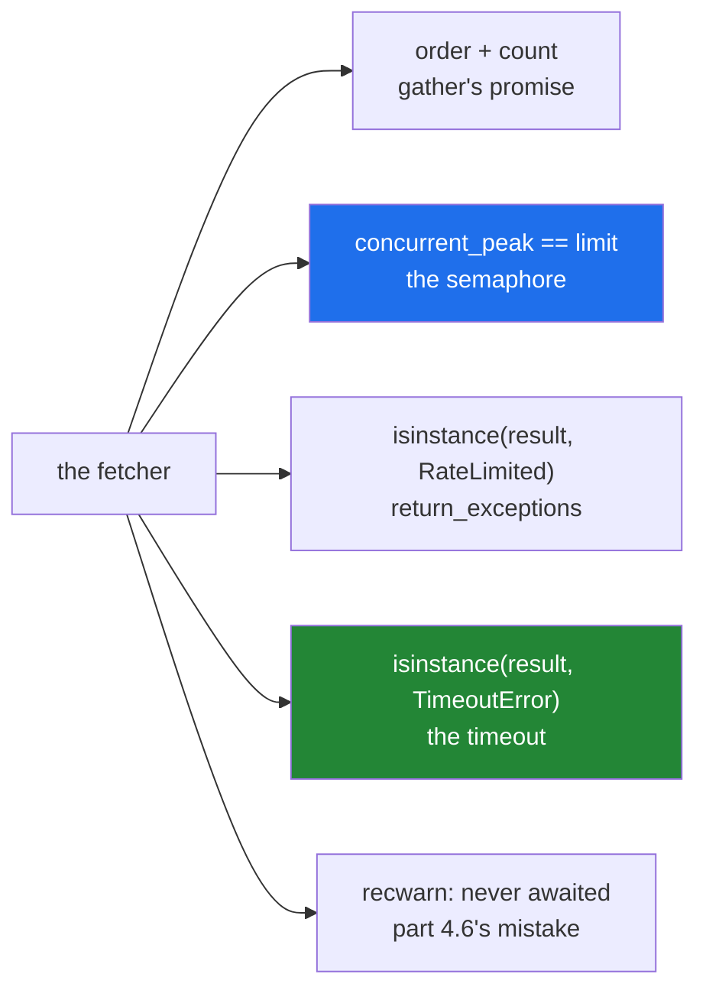

# 5.3 — Testing async code: `asyncio.run`, and the test that never ran

## One-line answer

`pytest` does not run `async def` tests without a plugin, so a plain `def` test that calls
`asyncio.run(...)` is the version that works everywhere — and the assertions to write are about the
**limit, the timeout and the failures**, not about elapsed time.

---

## The story

The inspector's form has one line that catches branches out every year.

*Show me the fire drill working.*

Not the record. Not the poster on the wall. The alarm, sounding, and people leaving. Because a branch can
have a beautiful drill record and a wedged shutter, and the only way to tell is to make it happen.

The other thing she does, which the branches find unfair and which is the whole point: she asks somebody
to **hold a door shut** and checks that the drill still ends with everybody outside. A procedure that only
works when nothing goes wrong is not a procedure.

---

## The idea in plain language

Two problems, and the first one is a trap.

**`pytest` will not run an `async def` test on its own.** There is no event loop, so it cannot call the
coroutine ([4.6](../04-concurrency/4.6-async-await.md)). Depending on the version and configuration you
get a failure saying so, or — with certain settings — a **skip**, which is far worse: a green run with a
test that never executed (Principle 7).

The plugins that fix it — `pytest-asyncio`, `anyio` — are perfectly good, and **this project pins
neither** (plan Part 2), so adding one would be a plan amendment (Principle 14). The version that needs no
plugin is simpler than it sounds:

```text
def test_something():
    result = asyncio.run(the_coroutine())
    assert ...
```

An ordinary `def` test, with `asyncio.run` doing what it does in any program
([4.5](../04-concurrency/4.5-asyncio-one-thread.md)): make a loop, run one coroutine, close the loop. Each
test gets a fresh loop, which is exactly the isolation a test wants.

**The second problem is what to assert.** The tempting assertion is elapsed time — "it took 0.3s, so it
must have been concurrent" — and it is the wrong one: a loaded CI runner makes it fail for reasons that
have nothing to do with the code, and a generous threshold makes it pass for a version that is not
concurrent at all.

Assert on **observable facts** instead:

| Instead of | Assert |
|---|---|
| "it was fast" | the recorded peak in flight equals the limit ([5.2](5.2-the-async-fetcher.md)) |
| "it handled the error" | the result at that position **is** an exception instance |
| "it timed out" | the result is a `TimeoutError`, from a `get` that sleeps far too long |
| "nothing leaked" | the in-flight count is zero afterwards |

Each of those is exact, deterministic, and cannot be made to lie by a busy machine. A timing assertion is
worth having as **one** loose sanity check — "well under the sequential total" — and never as the proof.

Three more things that make an async suite trustworthy.

**Inject the client** ([5.2](5.2-the-async-fetcher.md)). The fake `get` is three lines, needs no mocking
library, and keeps the request budget at zero (Principle 5).

**Test the failure paths, because they are the ones concurrency breaks.** The timeout path, the exception
path, the cancellation path. Those are the branches that skip cleanup
([Day 18, 1.3](../../../day-18-exceptions/parts/01-raising-and-catching/1.3-else-and-finally.md)) and the
ones a happy-path suite never reaches.

**Catch the forgotten `await` mechanically.** `pytest`'s `recwarn` fixture collects warnings, so a test
can assert that a `RuntimeWarning` about "never awaited" was raised — or, better, set
`filterwarnings = error` in `pyproject.toml` so any missing `await` anywhere in the suite fails the run
([4.6](../04-concurrency/4.6-async-await.md)).

---

## Why Setu needs it

- **It is the gate's fourth word** ([5.1](5.1-the-gate-as-a-list.md)) — *tested* — and the one that turns
  the other three criteria from claims into facts (Principle 7).
- **`./m check` runs offline** ([Day 2, 4.1](../../../day-02-quality-gate/parts/04-the-gate/4.1-what-m-check-actually-runs.md)),
  so every async test has to work with a fake `get` and no network.
- **The plan pins no async pytest plugin**, so the `asyncio.run` form is not a workaround here — it is the
  form that runs in this project's CI today.
- **Day 233's eval suite is async**, and it is tested the same way, which is why the pattern is worth
  establishing on the gate day rather than improvising later.

---

## The mechanism

The suite for [5.2](5.2-the-async-fetcher.md)'s fetcher — every test a plain `def`:

```python
"""Testing async code with plain pytest - no plugin needed."""

import asyncio
import time

from fetcher import RateLimited, fetch_all


def test_it_returns_one_result_per_url():
    async def get(url):
        await asyncio.sleep(0)
        return f"body of {url}"

    results, budget = asyncio.run(fetch_all(get, ["a", "b", "c"]))
    assert results == ["body of a", "body of b", "body of c"]
    assert budget.requests == 3


def test_it_never_exceeds_the_limit():
    async def get(url):
        await asyncio.sleep(0.05)
        return url

    _, budget = asyncio.run(fetch_all(get, [str(i) for i in range(20)], limit=4))
    assert budget.concurrent_peak == 4


def test_a_failure_is_returned_not_raised():
    async def get(url):
        if url == "bad":
            raise RateLimited("groq", 30.0)
        return url

    results, budget = asyncio.run(fetch_all(get, ["ok", "bad"]))
    assert results[0] == "ok"
    assert isinstance(results[1], RateLimited)
    assert results[1].retry_after == 30.0
    assert budget.failures == 1


def test_a_slow_url_times_out():
    async def get(url):
        await asyncio.sleep(5)
        return url

    results, _ = asyncio.run(fetch_all(get, ["slow"], timeout=0.1))
    assert isinstance(results[0], TimeoutError)


def test_the_forgotten_await_is_caught(recwarn):
    async def get(url):
        return url

    async def broken():
        fetch_all(get, ["a"])  # no await

    asyncio.run(broken())
    assert any("never awaited" in str(w.message) for w in recwarn)


def test_it_is_concurrent_not_sequential():
    async def get(url):
        await asyncio.sleep(0.1)
        return url

    start = time.perf_counter()
    asyncio.run(fetch_all(get, [str(i) for i in range(8)], limit=8))
    assert time.perf_counter() - start < 0.5
```

**Line by line:**

- `def test_...` — **not `async def`.** Every one of these runs under plain `pytest`, with nothing
  installed.
- `async def get(url):` **inside** each test — the injected fake
  ([5.2](5.2-the-async-fetcher.md)), defined where it is used so each test's fake does exactly one thing.
- `asyncio.run(fetch_all(...))` — one loop per test, created and closed. **Test isolation for free**: no
  loop is shared, so no test can leave a task running for the next one.
- `assert results == [...]` — the **order** assertion. `gather` promises argument order
  ([4.7](../04-concurrency/4.7-gather-and-twenty-fetches.md)), and this is where that promise is checked.
- `assert budget.concurrent_peak == 4` — **the important test in this file.** Exactly four, not "about
  four", not "it felt fast": the fetcher recorded it ([5.2](5.2-the-async-fetcher.md)), so the assertion
  is deterministic on any machine.
- `assert isinstance(results[1], RateLimited)` — the failure as a **value** in position, which is what
  `return_exceptions=True` promised.
- `assert results[1].retry_after == 30.0` — the attribute, not the message
  ([Day 18, 4.4](../../../day-18-exceptions/parts/04-in-anger/4.4-pytest-raises.md)). This is the test
  that fails if somebody reorders the constructor's arguments.
- `await asyncio.sleep(5)` with `timeout=0.1` — a fifty-fold margin, so the timeout test cannot become
  flaky on a slow runner.
- `def test_the_forgotten_await_is_caught(recwarn):` — `recwarn` is a built-in `pytest` fixture that
  collects warnings raised during the test
  ([Day 2, 3.2](../../../day-02-quality-gate/parts/03-pytest/3.2-fixtures-and-tmp-path.md)). This test
  **deliberately** makes the mistake from [4.6](../04-concurrency/4.6-async-await.md) and asserts that
  Python noticed.
- `fetch_all(get, ["a"])  # no await` — the mistake, with a comment so nobody "fixes" it.
- the last test's `< 0.5` — the **one** timing assertion, and deliberately loose: eight sequential fetches
  would be 0.8s, so half a second cannot pass by accident and cannot fail on a slow machine either.

Run on Python 3.12.12 with `pytest==9.1.1` on 2026-09-02:

```text
$ uv run python -m pytest test_fetcher.py -q
......                                                                   [100%]
6 passed in 0.59s
```

What each test guards:



---

## When it breaks

**An `async def` test, with no plugin installed:**

```text
$ uv run python -m pytest test_skipped.py -q
F                                                                        [100%]
================================== FAILURES ===================================
____________________________ test_this_never_runs _____________________________
async def functions are not natively supported.
You need to install a suitable plugin for your async framework, for example:
  - anyio
  - pytest-asyncio
  - pytest-tornasync
  - pytest-trio
  - pytest-twisted
=========================== short test summary info ===========================
FAILED test_skipped.py::test_this_never_runs - Failed: async def functions ar...
1 failed in 0.02s
```

Where the test is two lines that could never pass:

```python
async def test_this_never_runs():
    assert 1 == 2
```

**What it means.** `pytest` 9 fails it loudly and names the plugins, which is the good outcome. **Older
versions warned and skipped**, which meant a green run containing a test with `assert 1 == 2` in it — and
that is the failure worth fearing (Principle 7). Either install a plugin deliberately, or use the
`asyncio.run` form; what you must not do is write `async def` tests and assume they ran.

**Asserting on elapsed time as the proof:**

```text
$ uv run python -c "
import asyncio, time

async def get(url):
    await asyncio.sleep(0.1)
    return url

async def not_concurrent(urls):
    return [await get(u) for u in urls]

start = time.perf_counter()
asyncio.run(not_concurrent([str(i) for i in range(3)]))
print(f'sequential version took {time.perf_counter() - start:.2f}s')
print('a test asserting < 1.0s would pass this happily')
"
sequential version took 0.31s
a test asserting < 1.0s would pass this happily
```

**What it means.** A version with **no concurrency at all** — a list comprehension awaiting one at a time
([4.7](../04-concurrency/4.7-gather-and-twenty-fetches.md)) — passes a generous timing assertion. Make the
threshold tight enough to catch it and it becomes flaky on CI. **A timing assertion cannot distinguish
concurrent from fast**, which is why the peak counter exists.

**A test that shares an event loop:**

```text
$ uv run python -c "
import asyncio

loop = asyncio.new_event_loop()

async def work():
    return 1

print('first :', loop.run_until_complete(work()))
loop.close()
print('second:', loop.run_until_complete(work()))
" 2>&1 | tail -4
    raise RuntimeError('Event loop is closed')
RuntimeError: Event loop is closed
first : 1
sys:1: RuntimeWarning: coroutine 'work' was never awaited
```

**What it means.** A loop created once and shared between tests couples them: one test closing it breaks
every test after, and one test leaving a task pending leaks into the next. `asyncio.run` per test creates
and closes its own, which is why the form in the mechanism has no setup at all. It is also why an async
plugin's loop-scope setting is something to read carefully before changing.

**A test that only covers the happy path:**

```python
def test_fetch_all_works():
    async def get(url):
        return url

    results, _ = asyncio.run(fetch_all(get, ["a", "b"]))
    assert results == ["a", "b"]
```

**Line by line:**

- one fake that never fails, never sleeps, and never times out.
- so the semaphore is never contended, the timeout never fires, and the `finally`
  ([5.2](5.2-the-async-fetcher.md)) is never exercised on a failure path.
- **this test passes for a `fetch_all` with no semaphore, no timeout and no budget** — a plain `gather`
  would satisfy it.

**What it means.** Concurrency bugs live on the paths a happy-path test never reaches: cleanup on
timeout, bookkeeping on failure, the limit under contention. A suite that only proves the good case proves
about a third of the code, and the third that never breaks.

**Forgetting that `recwarn` needs the warning to actually fire:**

```text
$ uv run python -c "
import warnings
warnings.simplefilter('ignore')

import asyncio

async def get(url):
    return url

async def broken():
    get('a')

asyncio.run(broken())
print('no warning printed - and a recwarn assertion would fail here')
"
no warning printed - and a recwarn assertion would fail here
```

**What it means.** A `simplefilter("ignore")` anywhere — in a library, in a `conftest.py`, in
`pyproject.toml` — suppresses the `RuntimeWarning`, and the test that was checking for it fails while the
underlying detection is what actually broke. The robust arrangement is the opposite: `filterwarnings =
error` in the pytest configuration, so a missing `await` **anywhere** in the suite fails the run rather
than needing a test of its own.

---

## In production

**The professional habit is that async code is tested with a fake at the seam and assertions on
observable state, never on the clock.** The seam is the injected client
([5.2](5.2-the-async-fetcher.md)); the observable state is the counters, the result types and the
positions. That combination gives a suite that is deterministic, runs offline, and takes under a second —
which is what makes it run on every push rather than occasionally.

**What changes at scale is that timing tests become the flakiest thing in the suite.** A CI runner shared
with four other jobs makes every threshold a coin flip, and the standard response — widen the threshold —
makes the test meaningless before it makes it stable. Teams that have been through this end up with
exactly the rule above: assert on what the code recorded, not on how long it took.

**The failure that only appears in production is the cleanup path.** The timeout branch, the cancellation
branch, the "the client disconnected" branch — none of them run in a happy-path suite, and all of them run
constantly in a live service ([4.8](../04-concurrency/4.8-timeouts-and-taskgroup.md)). A leaked semaphore
slot or an unclosed connection on those paths shows up as a service that degrades over hours and recovers
on restart, and the test that would have caught it is a fake `get` that sleeps too long.

**The review comment a senior engineer leaves.** *"`test_fetch_all_is_fast` asserts elapsed time under
0.5s — that will fail on a busy runner and it does not actually prove concurrency; a sequential version
with a shorter sleep would pass. Assert `budget.concurrent_peak == limit` instead. And there is no test
for the timeout path, which is the one where the `finally` matters."*

**The interview question.** *"How do you test asynchronous code?"* With a fake at the I/O boundary so
nothing touches a network, and `asyncio.run` inside an ordinary test function if there is no async plugin
— which also gives a fresh event loop per test. Then the part that matters: assert on **observable
state** rather than elapsed time, because a timing assertion is flaky on a shared runner and cannot tell
concurrent from merely fast. And test the failure paths — timeout, exception, cancellation — because those
are where the cleanup lives and a happy-path suite never reaches them.

---

## Check yourself

```bash
uv run python -c "
import asyncio

async def slow(n):
    await asyncio.sleep(n)
    return n

async def both():
    return await asyncio.gather(slow(0.1), slow(0.2))

def test_like_pytest_would():
    results = asyncio.run(both())
    assert results == [0.1, 0.2]
    return 'passed'

print(test_like_pytest_would())
print('two loops, two runs, no shared state:')
print(asyncio.run(slow(0)), asyncio.run(slow(0)))
"
```

```
passed
two loops, two runs, no shared state:
0 0
```

An ordinary function, `asyncio.run` inside it, and a fresh loop each time. Note the `async def both()`
wrapper: `asyncio.run` takes a **coroutine**, and `asyncio.gather` called outside a loop returns a future
rather than one — `ValueError: a coroutine was expected` is what you get without it. Now write the same thing as
`async def test_...` and run it under `pytest`.

**Answer out loud, without scrolling up:**

> Say why a timing assertion is the wrong way to prove a fetcher is concurrent, and name the assertion to
> write instead.

---

**That is the day, and the phase.** Back to the hub: [`LESSON.md`](../../LESSON.md), §5 for the tests that
must be able to fail and §10 for what "done" means for Phase 2.
