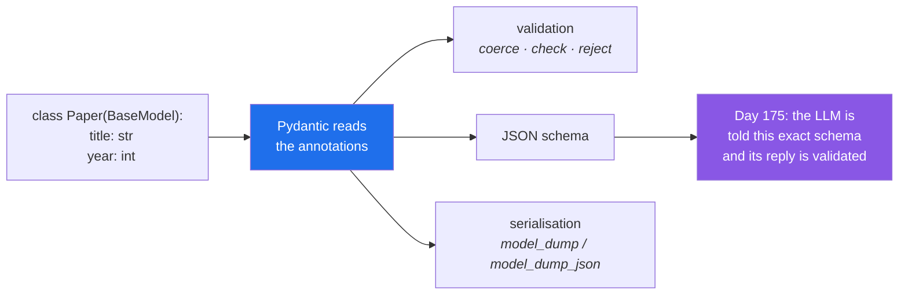

# Day 19 — Typing, dataclasses, Pydantic v2, and concurrency

**Phase 2 gate** · IDs: **PY-23** (typing, dataclasses, Pydantic), **PY-24** (concurrency)

> **Yesterday:** the exception hierarchy.
> **Today:** `Paper` becomes a Pydantic model — the same class you will pass between agents on
> Day 217 and validate LLM output against on Day 175. Then concurrency, measured. **Phase 2 closes.**
> **Tomorrow:** Phase 3 — NumPy.

```bash
./m start 19 && ./m scaffold 19
```

**Time:** 2 hours (gate day). **Request budget:** 0 model calls.

---

## §1 The story

You have been writing `-> str` and `list[int]` since Day 1 and nothing has ever checked them. **Python
annotations are not enforced at runtime.** `def f(x: int) -> str` will happily take a list and return
`None`.

So what are they for? Three things, in ascending order of value:

1. **Documentation that cannot drift**, because it sits in the signature.
2. **A type checker** reads them and finds bugs without running anything.
3. **Libraries read them at runtime** and *do* something with them. That is the big one.

Point three is why today matters. **Pydantic** reads your annotations and generates validation from
them:



That last arrow is the whole reason Pydantic appears on Day 19 of a data-science plan rather than
somewhere in a web-framework tutorial. On **Day 175** you call `with_structured_output(Paper)` and
LangChain turns your annotations into a JSON schema, hands it to a model, and validates the reply.
On **Day 210** an MCP tool schema comes from the same place. On **Day 217** agents pass these objects
to each other instead of free text. Every one of those days is easy *because* today happened.

The second half is **concurrency**, and the one sentence that matters:

> **Threads help when you are waiting. Processes help when you are computing.**

Python's GIL means threads do not speed up arithmetic. But 20 HTTP requests spend 99% of their time
waiting, and waiting parallelises perfectly. You will measure this rather than believe it.

---

## §2 Setup — run this

```bash
uv add "pydantic==2.13.4"
mkdir -p days/day-19/lab
touch days/day-19/lab/typing_demo.py
touch days/day-19/lab/concurrency.py
touch src/setu/schema.py
touch tests/test_schema.py
```

Pin whatever your Day-1 verify run reported. `dataclasses`, `typing`, `asyncio` and
`concurrent.futures` are standard library.

---

## §3 PY-23 — annotations, dataclasses, Pydantic

`days/day-19/lab/typing_demo.py`:

```python
"""PY-23: what annotations are, what dataclasses add, and what Pydantic adds on top."""

from __future__ import annotations

from dataclasses import dataclass, field
from typing import Literal, TypedDict

from pydantic import BaseModel, Field, ValidationError, field_validator


def annotations_are_not_enforced() -> None:
    def double(n: int) -> int:
        return n * 2

    print(f"\n{double(3)=}")
    print(f"{double('ab')=}   <- no error. annotations are metadata, not checks.")
    print(f"{double.__annotations__=}")


def plain_class_vs_dataclass() -> None:
    class Manual:
        def __init__(self, a: int, b: str = "x") -> None:
            self.a, self.b = a, b

    @dataclass
    class Auto:
        a: int
        b: str = "x"
        tags: list[str] = field(default_factory=list)   # NOT `= []`

    print(f"\n{Manual(1)=}          <- no __repr__")
    print(f"{Auto(1)=}   <- __init__, __repr__, __eq__ generated")
    print(f"{Auto(1) == Auto(1)=}   <- value equality for free")

    x, y = Auto(1), Auto(2)
    x.tags.append("safe")
    print(f"{y.tags=}   <- empty: default_factory made a NEW list")


def dataclass_options() -> None:
    @dataclass(frozen=True, slots=True, order=True)
    class Point:
        x: int
        y: int

    p = Point(1, 2)
    print(f"\n{p=} {sorted([Point(2, 0), p])=}")
    try:
        p.x = 5
    except Exception as exc:
        print(f"  frozen: {type(exc).__name__}: {exc}")


def pydantic_validates() -> None:
    class PaperIn(BaseModel):
        paper_id: str = Field(min_length=1)
        title: str = Field(min_length=1)
        year: int = Field(ge=1900, le=2100)
        kind: Literal["preprint", "published"] = "preprint"
        authors: list[str] = Field(default_factory=list)

        @field_validator("title")
        @classmethod
        def strip_title(cls, v: str) -> str:
            return " ".join(v.split())

    ok = PaperIn(paper_id="p1", title="  Attention  Is  All ", year="2017")
    print(f"\n{ok.title=}   <- validator ran")
    print(f"{ok.year=} {type(ok.year).__name__=}   <- '2017' COERCED to int")

    try:
        PaperIn(paper_id="", title="A", year=3000, kind="rumour")
    except ValidationError as exc:
        print(f"\n  {len(exc.errors())} errors, all at once:")
        for err in exc.errors():
            print(f"    {err['loc']}: {err['msg']}")


def serialisation_and_schema() -> None:
    class Small(BaseModel):
        name: str
        score: float = 0.0

    s = Small(name="bert", score=0.87)
    print(f"\n{s.model_dump()=}")
    print(f"{s.model_dump_json()=}")
    print(f"{Small.model_validate({'name': 'gpt', 'score': '0.5'})=}")
    schema = Small.model_json_schema()
    print(f"\njson schema properties: {list(schema['properties'])}")
    print("  ^ this is what LangChain sends to a model on Day 175")


def typeddict_for_loose_data() -> None:
    class Row(TypedDict):
        id: str
        year: int

    row: Row = {"id": "p1", "year": 2017}
    print(f"\n{row=}   <- a plain dict at runtime; the type is checker-only")


if __name__ == "__main__":
    annotations_are_not_enforced()
    plain_class_vs_dataclass()
    dataclass_options()
    pydantic_validates()
    serialisation_and_schema()
    typeddict_for_loose_data()
```

**Line by line:**

- `double("ab")` returns `"abab"` — string repetition. **No error.** Annotations are metadata stored
  in `__annotations__`; nothing checks them unless a tool chooses to.
- `@dataclass` — generates `__init__`, `__repr__` and `__eq__` from the annotations. Day 12 and Day 15
  by hand; today for free. **You wrote them by hand first on purpose** (Principle 2) so you know what
  is being generated.
- `field(default_factory=list)` — **the correct way to default to a mutable.** `tags: list[str] = []`
  in a dataclass is actually a `ValueError` at class-definition time; Python's dataclass machinery
  refuses it, because it is Day 4's bug. Good design.
- `frozen=True` — immutable; assignment raises. `slots=True` — no per-instance `__dict__`, so less
  memory and no typo'd attributes. `order=True` — generates `__lt__` and friends from field order.
- `Field(ge=1900, le=2100)` — constraints declared, not coded. This replaces the hand-written
  validation in Day 15's property setter.
- `year="2017"` becomes `2017` — Pydantic **coerces** where it safely can. This is what makes it right
  for boundary data (a CSV, an API response, an LLM reply) where everything arrives as a string.
- `Literal["preprint", "published"]` — an enumerated type. `kind="rumour"` is rejected by name.
- `@field_validator("title")` with `@classmethod` — a custom rule. **The decorator order matters**:
  `field_validator` outermost. This is Day 14's stacking rule, in production.
- `exc.errors()` — **every** validation failure at once, each with its field location. Compare with
  Day 15's hand-written setter, which raised on the first problem and hid the rest.
- `model_dump()` / `model_dump_json()` / `model_validate()` — Pydantic **v2** names. `.dict()`,
  `.json()` and `parse_obj()` are v1 and are what every pre-2023 tutorial uses. Check `pydantic.VERSION`
  before trusting any example you read.
- `model_json_schema()` — the artifact Days 175, 210 and 217 all consume.
- `TypedDict` — annotations on a plain dict. No runtime validation at all; it is purely for the type
  checker. LangGraph's state schemas on Day 192 are exactly this.

---

## §4 PY-24 — concurrency, measured

`days/day-19/lab/concurrency.py`:

```python
"""PY-24: threads for waiting, processes for computing. Measured, not assumed."""

from __future__ import annotations

import asyncio
import time
from concurrent.futures import ProcessPoolExecutor, ThreadPoolExecutor


def io_bound(n: float = 0.2) -> str:
    time.sleep(n)          # stands in for a network call
    return "done"


def cpu_bound(n: int = 6_000_000) -> int:
    return sum(i * i for i in range(n))


def timed(label: str, fn) -> float:
    start = time.perf_counter()
    fn()
    elapsed = time.perf_counter() - start
    print(f"  {label:<26} {elapsed:.2f}s")
    return elapsed


def io_comparison() -> None:
    print("\n8 io-bound tasks (0.2s each):")
    timed("sequential", lambda: [io_bound() for _ in range(8)])
    timed("ThreadPoolExecutor(8)", lambda: list(ThreadPoolExecutor(8).map(io_bound, [0.2] * 8)))
    print("  -> threads win: waiting parallelises")


def cpu_comparison() -> None:
    print("\n4 cpu-bound tasks:")
    timed("sequential", lambda: [cpu_bound() for _ in range(4)])
    timed("ThreadPoolExecutor(4)", lambda: list(ThreadPoolExecutor(4).map(cpu_bound, [6_000_000] * 4)))
    print("  -> threads do NOT help: the GIL serialises the bytecode")


def process_comparison() -> None:
    print("\n4 cpu-bound tasks, processes:")
    with ProcessPoolExecutor(4) as pool:
        timed("ProcessPoolExecutor(4)", lambda: list(pool.map(cpu_bound, [6_000_000] * 4)))
    print("  -> separate interpreters, separate GILs. Costs process startup + pickling.")


async def async_comparison() -> None:
    async def async_io(n: float = 0.2) -> str:
        await asyncio.sleep(n)
        return "done"

    print("\n8 io-bound tasks, asyncio:")
    start = time.perf_counter()
    await asyncio.gather(*(async_io() for _ in range(8)))
    print(f"  {'asyncio.gather':<26} {time.perf_counter() - start:.2f}s")
    print("  -> one thread, cooperative. Scales to thousands where threads do not.")

    print("\n  the trap:")
    start = time.perf_counter()
    for _ in range(4):
        await async_io()
    print(f"  {'await in a loop':<26} {time.perf_counter() - start:.2f}s  <- sequential!")


if __name__ == "__main__":
    io_comparison()
    cpu_comparison()
    process_comparison()
    asyncio.run(async_comparison())
```

**Line by line:**

- `time.sleep(n)` as a stand-in for I/O — it **releases the GIL**, exactly as a real socket read does.
  That is why the threaded version is genuinely faster and the demo is honest.
- `ThreadPoolExecutor(8).map(...)` — submits all eight and yields results in order. The `list(...)`
  is what forces them to complete.
- The CPU comparison — threads give **no** speedup, and often a slight slowdown from switching
  overhead. **The GIL means one thread executes Python bytecode at a time.** Run it; the numbers are
  more persuasive than the explanation.
- `ProcessPoolExecutor` — separate interpreters, separate GILs, real parallelism. The costs are
  process startup and **pickling**: arguments and results are serialised across the boundary, so
  passing a large DataFrame can cost more than the computation saved.
- `await asyncio.sleep(n)` — yields control back to the event loop. `time.sleep` inside an async
  function would block the entire loop, which is the number-one asyncio bug.
- `asyncio.gather(*(...))` — schedules everything, waits for all. This is the concurrency.
- **The trap at the end:** `for ...: await async_io()` runs *sequentially*. `await` means "wait here".
  Writing `async` does not make anything concurrent — `gather` (or `TaskGroup`) does. People lose
  hours to this.

Run it and write your four numbers into `days/day-19/lab/RESULTS.md`. **Measured beats remembered.**

---

## §5 Build brief — `src/setu/schema.py`

The models the rest of the project passes around. `Paper` moves here; `papers.py` keeps only the
behaviour that is not validation.

```python
"""Pydantic models for Setu. Layer 1: imports errors and text only."""

from __future__ import annotations

from typing import Literal

from pydantic import BaseModel, ConfigDict, Field, field_validator


class Paper(BaseModel):
    """TODO(me): port Day 15's Paper to Pydantic.

    - model_config = ConfigDict(frozen=True, extra="forbid")
    - paper_id: str, min_length 1
    - title: str, min_length 1, whitespace-normalised by a field_validator
    - year: int, ge=1900, le=2100
    - kind: Literal["preprint", "published"] = "preprint"
    - authors: list[str] = Field(default_factory=list)
    - venue: str | None = None
    - keep the `age` property and __str__ from Day 15
    - do NOT hand-write __init__, __eq__, __repr__ - Pydantic generates them
    """


class Chunk(BaseModel):
    """TODO(me): a slice of a document. Day 164's RAG chunker produces these.

    - text: str, min_length 1
    - source_id: str
    - index: int, ge=0
    - char_start / char_end: int, ge=0
    - a model_validator asserting char_end > char_start
    """


class SearchResult(BaseModel):
    """TODO(me): one retrieval hit. Day 166 produces these.

    - chunk: Chunk
    - score: float, ge=0.0, le=1.0
    - retriever: Literal["dense", "bm25", "hybrid"]
    """


def paper_json_schema() -> dict:
    """TODO(me): return Paper.model_json_schema().

    Day 175 hands this exact dict to an LLM. Write the one-line function now so the
    call site never has to know it came from Pydantic.
    """
```

- `extra="forbid"` — **the important config.** By default Pydantic ignores unknown keys. With
  `forbid`, `Paper(titel="x", ...)` raises instead of silently dropping your typo. That is Day 12's
  attribute-typo problem, finally solved.
- `frozen=True` — immutable, and therefore hashable. Day 15's `__hash__` comes free.
- Nested models (`Chunk` inside `SearchResult`) validate recursively — one call checks the whole tree.

---

## §6 The eval that must be able to fail

`tests/test_schema.py`:

```python
import pytest
from pydantic import ValidationError

from setu.schema import Chunk, Paper, SearchResult, paper_json_schema


def test_title_is_normalised():
    assert Paper(paper_id="p1", title="  A   B ", year=2017).title == "A B"


def test_year_is_coerced_from_a_string():
    assert Paper(paper_id="p1", title="A", year="2017").year == 2017


@pytest.mark.parametrize(
    "kwargs",
    [
        {"paper_id": "", "title": "A", "year": 2017},
        {"paper_id": "p1", "title": "  ", "year": 2017},
        {"paper_id": "p1", "title": "A", "year": 1899},
        {"paper_id": "p1", "title": "A", "year": 2101},
        {"paper_id": "p1", "title": "A", "year": 2017, "kind": "rumour"},
    ],
)
def test_invalid_input_is_rejected(kwargs):
    with pytest.raises(ValidationError):
        Paper(**kwargs)


def test_a_typo_is_rejected_not_ignored():
    with pytest.raises(ValidationError):
        Paper(paper_id="p1", titel="A", year=2017)


def test_all_errors_are_reported_at_once():
    with pytest.raises(ValidationError) as info:
        Paper(paper_id="", title="", year=3000)
    assert len(info.value.errors()) >= 3, "Pydantic should report every failure, not the first"


def test_model_is_frozen_and_hashable():
    paper = Paper(paper_id="p1", title="A", year=2017)
    with pytest.raises(ValidationError):
        paper.year = 2020
    assert len({paper, Paper(paper_id="p1", title="A", year=2017)}) == 1


def test_authors_default_is_not_shared():
    a = Paper(paper_id="p1", title="A", year=2017)
    b = Paper(paper_id="p2", title="B", year=2018)
    assert a.authors is not b.authors


def test_round_trip_through_json():
    paper = Paper(paper_id="p1", title="A", year=2017, authors=["X"])
    assert Paper.model_validate_json(paper.model_dump_json()) == paper


def test_json_schema_has_the_fields_an_llm_needs():
    schema = paper_json_schema()
    assert set(schema["properties"]) >= {"paper_id", "title", "year", "kind"}
    assert "required" in schema


def test_chunk_rejects_a_backwards_span():
    with pytest.raises(ValidationError):
        Chunk(text="hi", source_id="p1", index=0, char_start=10, char_end=5)


def test_nested_models_validate_recursively():
    with pytest.raises(ValidationError):
        SearchResult(
            chunk={"text": "", "source_id": "p1", "index": 0, "char_start": 0, "char_end": 1},
            score=0.5,
            retriever="dense",
        )


def test_score_is_bounded():
    chunk = Chunk(text="hi", source_id="p1", index=0, char_start=0, char_end=2)
    with pytest.raises(ValidationError):
        SearchResult(chunk=chunk, score=1.5, retriever="dense")
```

**Line by line:**

- `test_a_typo_is_rejected_not_ignored` — **the day's real assessment.** Without
  `extra="forbid"`, `titel="A"` is silently dropped, `title` is missing, and you would get a
  *different* error — or, if `title` had a default, no error at all and an empty title downstream.
  Remove `extra="forbid"` and read what this test says.
- `test_all_errors_are_reported_at_once` — the concrete advantage over hand-written validation. Day 15's
  property setter raised on the first problem; this reports three.
- `test_model_is_frozen_and_hashable` — note that a frozen Pydantic model raises `ValidationError` on
  assignment, not `AttributeError` as a frozen dataclass does. Small difference, worth knowing.
- `test_authors_default_is_not_shared` — `is not`, checking object identity. Day 4's rule, verified
  against a library rather than your own code.
- `test_round_trip_through_json` — serialise, parse, compare. This is the contract Day 217's agents
  depend on when they pass objects through a message queue.
- `test_nested_models_validate_recursively` — a **dict** is passed for `chunk`, and the invalid inner
  `text=""` must still be caught. One validation call, whole tree.

```bash
uv run python -m pytest tests/test_schema.py -v
uv run python -m pytest -q
```

---

## §7 Request budget

| Resource | Spent today |
|---|---|
| LLM calls | **0** |
| Network | one `uv add` resolution |

---

## §8 Traps

- **Expecting annotations to check anything.** They do not. A checker or Pydantic must read them.
- **Pydantic v1 method names.** `.dict()`, `.json()`, `parse_obj()` are v1. v2 is `model_dump()`,
  `model_dump_json()`, `model_validate()`. Most tutorials online are still v1.
- **Omitting `extra="forbid"`.** Typo'd keys vanish silently.
- **`= []` as a dataclass or model default.** Use `field(default_factory=list)` / `Field(default_factory=list)`.
- **`@field_validator` under `@classmethod`.** Wrong order; `field_validator` goes outermost.
- **Threads for CPU work.** The GIL. Use processes.
- **Processes for tiny tasks.** Startup and pickling cost more than the work.
- **`time.sleep` inside an `async` function.** Blocks the whole event loop.
- **`for x in xs: await f(x)`.** Sequential. Use `asyncio.gather` or a `TaskGroup`.
- **Passing a huge object to a process pool.** It gets pickled both ways.

---

## §9 Verify before you code

Written **2026-08-21**. Pydantic moves; check before trusting any example:

- <https://docs.pydantic.dev/latest/migration/> — the v1→v2 method-name table.
- <https://docs.pydantic.dev/latest/concepts/fields/> — `Field` constraints.
- <https://docs.pydantic.dev/latest/concepts/validators/> — `field_validator` / `model_validator`
  and the required `@classmethod`.
- <https://docs.python.org/3/library/asyncio-task.html> — `gather`, `TaskGroup`.
- <https://docs.python.org/3/library/concurrent.futures.html> — the two executors.

---

## §10 Say it in an interview

> "Annotations aren't enforced at runtime — but Pydantic reads them and generates validation,
> serialisation and a JSON schema from the same declaration. That's why the models are the backbone:
> the schema I hand to an LLM for structured output is generated from the class the rest of the code
> already uses, so the model's reply is validated against the exact same contract. The config I always
> set is `extra='forbid'`, because Pydantic's default is to ignore unknown keys, which means a typo'd
> field name silently disappears. On concurrency: threads for waiting, processes for computing. I
> measured it rather than assuming — eight sleeping tasks go eight times faster on threads, four
> arithmetic tasks go slightly *slower*, because the GIL serialises bytecode."

---

## §11 Done when — **Phase 2 gate**

Tick [`CHECKLIST.md`](CHECKLIST.md), then:

```bash
./m check
./m done 19
./m status
```

**Gate criteria:** `Paper` is a frozen, `extra="forbid"` Pydantic model with a JSON schema · the
exception hierarchy is in `errors.py` and used everywhere · the package is layered with the
no-upward-imports test green · file writes are atomic · every module imports cleanly in a fresh
subprocess · the concurrency numbers are recorded from **your** machine.

Phase 3 starts tomorrow: NumPy, and the arrays everything after Day 20 is built on.
