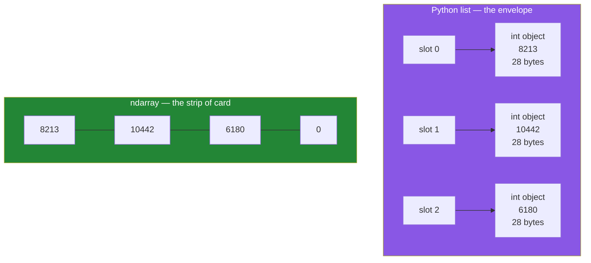

# 1.1 — A list of numbers is a list of boxes; an array is one long box

## One-line answer

A Python list of numbers stores **pointers to seven separate number objects**, while a NumPy
`ndarray` stores **the seven numbers themselves, end to end, in one block of memory** — and almost
everything else about NumPy follows from that one difference.

---

## The story

Somebody keeps a note on their phone of how many steps they walked each day.

Last week it read:

```text
Mon 8213
Tue 10442
Wed 6180
Thu 0
Fri 12007
Sat 9631
Sun 7204
```

Thursday is a zero because the phone spent the day on the kitchen charger. That happens, and the
zero is real — the phone genuinely counted nothing — so it stays in the note.

Now picture two ways of keeping that note on paper.

The first way: seven sticky notes, one number written on each, dropped into an envelope. To read
Friday's number you tip the envelope out and hunt for the fifth sticky note. Each note can hold
anything — a number, a word, a drawing — because a sticky note does not care what you write on it.

The second way: one strip of card, ruled into seven equal cells, one number per cell. To read
Friday's number you count four cells along and look. You cannot draw a picture in a cell, because a
cell is exactly wide enough for a number of a fixed size and nothing else.

The envelope is more forgiving. The strip of card is faster to read and takes far less room in the
drawer. Neither is better in general. They are different objects, and the rest of this day is about
what you get for choosing the strip.

---

## The idea in plain language

You already know the envelope. A **list** in Python is a growable row of slots, and each slot holds
the memory address of an object that lives somewhere else. You met exactly this on
[Day 8, 1.1](../../../day-08-containers/parts/01-sequences/1.1-a-list-is-a-dynamic-array.md), where
a list was described as a dynamic array of pointers. The number `8213` is a full Python object with
its own header, its own reference count and its own type, sitting at its own address. The list holds
only the address.

An **array**, in the NumPy sense, is the strip of card. The full name of the type is `ndarray`,
short for *n-dimensional array*. It is two things joined together:

1. **One contiguous block of memory** — a single run of bytes with no gaps, holding the raw numbers
   themselves rather than addresses of numbers.
2. **A small description of how to read that block** — how many numbers there are, how they are
   arranged into rows and columns, and how many bytes each one takes.

The word **contiguous** just means "with nothing in between". The seven step counts sit one after
another, 8 bytes each, 56 bytes in total, and no other object is anywhere in the middle.

Three consequences fall straight out of that, and they are the reason NumPy exists.

**Every element must be the same kind of thing.** A cell in the strip is a fixed width, so every
cell holds the same width of number. That shared kind is called the **dtype**, short for *data
type*, and it is the subject of [section 2](../02-dtypes/2.1-a-dtype-is-a-promise.md). A list can
hold an integer next to a string next to a dictionary. An array cannot, and does not want to.

**Finding element number four is arithmetic, not searching.** If the block starts at some address
and each number is 8 bytes wide, element four sits at *start + 4 × 8*. One multiplication, one
addition, done. That is [1.3](1.3-one-block-and-strides.md).

**Whole-array operations can run in compiled code.** The numbers are already laid out the way a C
loop wants them, so `arr.sum()` hands the whole block to compiled code that adds them without ever
building a Python object. A Python `for` loop over a list has to fetch, unbox and re-box a Python
object on every single iteration — the cost you measured on
[Day 6, 4.2](../../../day-06-loops/parts/04-loop-cost/4.2-the-loop-you-should-not-write.md). That is
[1.4](1.4-a-million-floats-measured.md), where the numbers stop being an argument and become a
measurement.

One term to retire before it confuses you. People say "NumPy array", "`ndarray`" and plain "array"
for the same thing. Python's standard library also ships an `array` module, which is a different and
much smaller thing that nobody in data work uses. In this curriculum, **array always means
`numpy.ndarray`**.

---

## Why Setu needs it

- **Almost every day from here to Day 240 sits on top of an `ndarray`.** A pandas column holds one.
  A scikit-learn model is fitted on one. A PyTorch tensor is the same idea with a gradient bolted
  on. An embedding from `sentence-transformers` on Day 155 arrives as one.
- **The Phase 3 gate is "a vectorised stats module beating a loop by ≥50×"**, and the reason a 50×
  gap exists at all is the difference described in this part.
- **Day 130 reshapes a flat buffer of 784 numbers into a 28 × 28 image.** That move is only cheap
  because the 784 numbers are already one block, so reshaping changes nothing but the description.
- **Day 162's retriever scores a query against thousands of stored vectors** with one matrix
  multiply. A list of lists cannot be multiplied; a block of floats can.

---

## The mechanism

Build the week both ways, then ask each one what it is.

```python
import sys

import numpy as np

steps = [8213, 10442, 6180, 0, 12007, 9631, 7204]
week = np.array(steps)

print("the list      :", steps)
print("the array     :", week)
print("type(steps)   :", type(steps))
print("type(week)    :", type(week))
print("week.nbytes   :", week.nbytes)
print("list overhead :", sys.getsizeof(steps))
print("one int object:", sys.getsizeof(steps[0]))
print("list total    :", sys.getsizeof(steps) + sum(sys.getsizeof(s) for s in steps))
```

**Line by line:**

- `import numpy as np` — `np` is not a personal preference, it is the name the whole ecosystem
  writes. Every error message, every documentation page and every colleague's code uses it, so
  importing it as anything else makes your code harder to read for no gain.
- `steps = [...]` — an ordinary Python list, exactly as the note on the phone reads.
- `np.array(steps)` — the conversion. It walks the list once, works out a dtype that fits every
  element ([3.1](../03-creating/3.1-np-array-and-what-it-infers.md)), allocates one block big enough
  for seven of them, and copies the numbers in. **It copies.** The list and the array share nothing
  afterwards.
- `week.nbytes` — the size of the block in bytes, and nothing else. Not the size of the Python
  object wrapping it; the payload.
- `sys.getsizeof(steps)` — the size of the *list object*, which is a header plus seven pointers. It
  deliberately does **not** count the objects pointed at, which is why the next two lines add them
  up by hand.
- `sum(sys.getsizeof(s) for s in steps)` — a generator expression
  ([Day 9, 2.3](../../../day-09-comprehensions/parts/02-dict-set-gen/2.3-the-generator-expression.md))
  so nothing intermediate is built. Each of those seven integers is a separate 28-byte object.

Run on numpy 2.5.2 and Python 3.12.12 on 2026-09-02:

```text
the list      : [8213, 10442, 6180, 0, 12007, 9631, 7204]
the array     : [ 8213 10442  6180     0 12007  9631  7204]
type(steps)   : <class 'list'>
type(week)    : <class 'numpy.ndarray'>
week.nbytes   : 56
list overhead : 120
one int object: 28
list total    : 316
```

Read the two printed rows again. The list prints with commas, because it is a row of separate
things. The array prints without them, because it is one thing — and NumPy lines the numbers up in
columns, which is a quiet hint that it thinks of them as a block rather than a sequence.

**56 bytes against 316.** Seven numbers, the same seven numbers, and the array uses under a fifth of
the memory. The gap is not the numbers. It is the seven times twenty-eight bytes of object header
that the list is obliged to carry.

The same fact as a picture:



The list picture has arrows in it. The array picture does not, and that absence is the whole idea.

Now the part only an array can do — arithmetic on the whole thing at once:

```python
import numpy as np

steps = [8213, 10442, 6180, 0, 12007, 9631, 7204]
week = np.array(steps)

print("array * 2 :", week * 2)
print("list  * 2 :", steps * 2)
```

**Line by line:**

- `week * 2` — NumPy defines `__mul__` on `ndarray`
  ([Day 5, 1.1](../../../day-05-operators-and-conditionals/parts/01-operators/1.1-an-operator-is-a-method-call.md)
  is where operators became method calls) to mean *multiply every element*. This is called an
  **elementwise** operation, and it is the habit the whole of Phase 3 is teaching.
- `steps * 2` — the list's `__mul__` means something completely different: *repeat the sequence*.
  Same operator, same syntax, two unrelated results. Nothing warns you, because both are correct for
  their own type.

```text
array * 2 : [16426 20884 12360     0 24014 19262 14408]
list  * 2 : [8213, 10442, 6180, 0, 12007, 9631, 7204, 8213, 10442, 6180, 0, 12007, 9631, 7204]
```

That is the most common shock of a first NumPy week: `* 2` doubled one and duplicated the other.

---

## When it breaks

**The rows are not the same length:**

```text
$ uv run python -c "
import numpy as np
np.array([[1, 2], [3]])
" 2>&1 | tail -3
ValueError: setting an array element with a sequence. The requested array has an inhomogeneous shape after 1 dimensions. The detected shape was (2,) + inhomogeneous part.
```

**What it means.** *Inhomogeneous* is NumPy's word for "not all the same shape". A block of memory
ruled into cells has to be a rectangle: every row the same length, every cell the same width. Two
rows of lengths 2 and 1 do not make a rectangle, so there is no block to allocate. The fix is to pad
the short row, to keep a list of arrays instead of an array of rows, or — most often — to notice
that the data really is ragged and a rectangle was the wrong idea. Older NumPy versions accepted
this and quietly built an array of Python objects. 2.x refuses, which is a kindness.

**A string sneaks in and silently converts everything:**

```text
$ uv run python -c "
import numpy as np
a = np.array([8213, 'rest'])
print(a, a.dtype)
print(a + 1)
" 2>&1 | tail -5
['8213' 'rest'] <U21
Traceback (most recent call last):
  File "<string>", line 5, in <module>
numpy._core._exceptions._UFuncNoLoopError: ufunc 'add' did not contain a loop with signature matching types (dtype('<U21'), dtype('int64')) -> None
```

**What it means.** One cell has to fit every element, and the only kind of cell that fits both
`8213` and `'rest'` is text. So `8213` became the string `'8213'`, silently, at construction time.
`<U21` reads as "little-endian Unicode text, up to 21 characters". The array looks fine until you
try arithmetic, and then the error is about `add` rather than about the string you put in three
hundred lines earlier. **This is the argument for passing `dtype=` explicitly whenever the data came
from outside your program**, which is [2.1](../02-dtypes/2.1-a-dtype-is-a-promise.md).

**`len()` tells you less than you think:**

```text
$ uv run python -c "
import numpy as np
grid = np.zeros((3, 4))
print('len   :', len(grid))
print('size  :', grid.size)
print('shape :', grid.shape)
"
len   : 3
size  : 12
shape : (3, 4)
```

**What it means.** `len()` on an array returns the length of the **first axis only** — three rows —
not the number of elements. Twelve numbers are in there. Every habit built on `len()` for lists
gives a half-answer for arrays, and `.size` and `.shape` are what you want instead
([1.2](1.2-shape-dtype-and-the-rest.md)).

---

## In production

**What a professional writes instead of the teaching version.** In real code you almost never build
an array from a Python list. The list is the slow path: it means the numbers already exist as Python
objects, so you have already paid the cost the array was meant to avoid. Real arrays arrive from
`np.load`, from `pd.read_parquet(...).to_numpy()`, from a model's `.encode()`, or from
`np.frombuffer` over bytes off a socket. `np.array([...])` in production code is usually a test
fixture, a small constant, or a smell.

**What changes at scale.** At seven numbers the gap is 56 bytes against 316 and nobody cares. At 50
million float readings the list is roughly 1.6 GB and the array is 400 MB, and that difference
decides whether the job runs on the machine you have. Worse than the total is the *scatter*: the
list's numbers are spread across the heap wherever the allocator happened to put them, so summing
them means 50 million cache misses. The array's numbers are consecutive, so the processor's
prefetcher sees the pattern and pulls the next cache line in before it is asked for. The memory
number is the one people quote. The cache behaviour is the one that actually produces the 50× in the
Phase 3 gate.

**The failure that only appears with real data.** A CSV column of counts with one empty cell in row
400 000. Every value parses as text, and unless a dtype is stated the resulting array is `<U21`
strings — and everything downstream still appears to work, because comparison and sorting are
defined for strings. The mean is what finally fails, days later, and the traceback points at the
mean. The defence is to state the dtype at the boundary and let construction fail loudly on row
400 000. That is the same discipline Pydantic applies to JSON on
[Day 19, 3.1](../../../day-19-typing-dataclasses-and-concurrency/parts/03-pydantic/3.1-the-model-that-refuses.md).

**The review comment a senior engineer leaves.** *"You are calling `np.array(rows)` inside the loop,
so every iteration allocates a new block and copies everything again. Build the list once and
convert once outside the loop — or better, allocate with `np.empty(n)` up front and assign into
it."*

**The interview question.** *"Why is a NumPy array faster than a Python list?"* The weak answer is
"because it is written in C". The real answer has two halves and both are about memory. First,
layout: the array is one contiguous block of raw values, so an operation over it is a tight compiled
loop with no per-element Python object to unbox, and the values arrive in cache lines the processor
can predict. Second, dispatch: the list pays a type check and a method lookup per element, while the
array pays them once for the whole block. The follow-up is usually *"when is a list better?"*, and
the honest answer is when the data is ragged, mixed-type, or grown by appending — because an array
cannot grow in place at all.

---

## Check yourself

```bash
uv run python -c "
import sys
import numpy as np
steps = [8213, 10442, 6180, 0, 12007, 9631, 7204]
week = np.array(steps)
print('array bytes:', week.nbytes)
print('list bytes :', sys.getsizeof(steps) + sum(sys.getsizeof(s) for s in steps))
print('array * 2  :', week * 2)
print('list  * 2  :', len(steps * 2), 'elements')
"
```

Four lines, and the last two use the same operator to mean two different things.

**Answer out loud, without scrolling up:**

> An array stores the numbers themselves and a list stores addresses of number objects. Name the one
> restriction that buys, and say what `len()` returns for an array of shape `(3, 4)`.

---

**Next:** [1.2 — `shape`, `ndim`, `size`, `dtype`, `itemsize`, `nbytes`](1.2-shape-dtype-and-the-rest.md).
