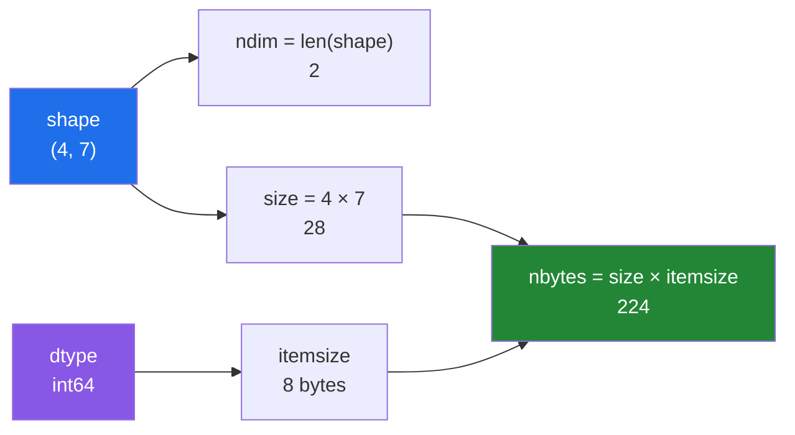

# 1.2 — `shape`, `ndim`, `size`, `dtype`, `itemsize`, `nbytes` — the six questions

## One-line answer

An array answers six questions about itself without touching a single number, and printing all six
is the first thing to do whenever an array surprises you.

---

## The story

The strip of card with the seven step counts on it gets stuck to the fridge, next to a second strip
somebody else made.

The second one is a grid: four rows, one per week, seven cells across, one per day. Twenty-eight
numbers.

Somebody looking at the fridge from across the kitchen can tell the two apart without reading a
single number. One is a line. The other is a block. They can count the rows and the columns, they
can see the cells are all the same width, and from that alone they can say how much card was used.

None of that required knowing what any of the numbers were.

That is the useful bit. When something goes wrong with a pile of numbers, the first question is
almost never "what are the numbers". It is "how many are there, and how are they arranged".

---

## The idea in plain language

Every `ndarray` carries a small set of facts about itself, separate from the numbers. They are plain
attributes — you read them with a dot, and reading one costs nothing, because the answer is already
stored.

Six matter, and they come in two groups of three.

**The arrangement.**

- **`shape`** — a tuple giving the length of each axis. `(7,)` is a line of seven. `(4, 7)` is four
  rows of seven. The tuple's own length is how many axes there are. An **axis** is one direction you
  can move in: axis 0 goes down the rows, axis 1 goes across the columns. Shape is the single most
  useful attribute in NumPy and the one you will print a thousand times.
- **`ndim`** — how many axes, which is just `len(shape)`. One for a line, two for a table, three for
  a stack of tables.
- **`size`** — how many numbers in total, which is every entry of `shape` multiplied together.
  `(4, 7)` has size 28.

**The storage.**

- **`dtype`** — what kind of number each cell holds. `int64` is a whole number in 8 bytes; `float64`
  is a decimal number in 8 bytes. Section 2 is entirely about this.
- **`itemsize`** — how many bytes one cell takes. 8 for `int64`, 4 for `float32`, 1 for `bool`.
- **`nbytes`** — how many bytes the whole block takes, which is always `size × itemsize`.

Two notes that save confusion later.

**The trailing comma in `(7,)` is not a typo.** In Python, `(7)` is just the number seven in
brackets; the comma is what makes it a one-element tuple. So a one-dimensional array of length seven
has `shape == (7,)`, and you will see that comma in error messages constantly.

**`(7,)` and `(7, 1)` and `(1, 7)` are three different shapes** holding the same seven numbers.
Which one you have decides whether an operation works, and getting them confused is the single most
common NumPy bug. Day 22 has a whole part on it
([Day 22, 1.4](../../../day-22-broadcasting-and-shape/parts/01-broadcasting/1.4-keepdims-and-the-column.md)).
For today, just notice that shape is not the same as count.

There is a seventh attribute you will meet later, `strides`, and it is
[1.3](1.3-one-block-and-strides.md). It is the one that explains *why* reshaping is free.

---

## Why Setu needs it

- **`print(x.shape)` is the debugging tool of the next 220 days.** When a scikit-learn `fit` refuses
  on Day 60, when a matrix multiply refuses on Day 24, when a PyTorch layer refuses on Day 118 — the
  first line of the diagnosis is always the shapes.
- **Day 130's MNIST move is `(784,) → (28, 28)`**, and it is a shape change and nothing else. The
  784 numbers do not move.
- **Day 155's embeddings arrive with shape `(n_documents, 384)`**, and knowing which axis is which
  is the difference between averaging over documents and averaging over dimensions — two answers
  that both run and only one of which means anything.
- **`nbytes` is your memory budget check** on Day 25 and again on Day 226, where "will this fit"
  becomes a real question rather than a rhetorical one.

---

## The mechanism

Ask both fridge strips all six questions.

```python
import numpy as np

week = np.array([8213, 10442, 6180, 0, 12007, 9631, 7204])
month = np.array(
    [
        [8213, 10442, 6180, 0, 12007, 9631, 7204],
        [7788, 9120, 11345, 8402, 6733, 14210, 5096],
        [9004, 8765, 7621, 10188, 9950, 8317, 11002],
        [6540, 12488, 9873, 7106, 8899, 10540, 9218],
    ]
)

for name, arr in [("week", week), ("month", month)]:
    print(
        f"{name:6} shape={arr.shape!s:8} ndim={arr.ndim} size={arr.size:3} "
        f"dtype={arr.dtype!s:7} itemsize={arr.itemsize} nbytes={arr.nbytes}"
    )
```

**Line by line:**

- `month = np.array([[...], [...], ...])` — a list of four equal-length lists becomes a
  two-dimensional array. Equal length is compulsory; unequal is the `inhomogeneous shape` error from
  [1.1](1.1-a-list-of-boxes.md).
- `for name, arr in [...]` — tuple unpacking in a `for` target
  ([Day 8, 1.4](../../../day-08-containers/parts/01-sequences/1.4-unpacking-and-star-rest.md)), so
  one loop body serves both arrays.
- `{arr.shape!s:8}` — the `!s` conversion applies `str()` before the format spec
  ([Day 7, 3.2](../../../day-07-strings/parts/03-formatting/3.2-the-format-spec.md)). Without it,
  the `:8` width would be applied to a tuple, and a tuple does not accept a width spec.
- `arr.dtype!s` — same reason. `dtype` is an object, not a string, and `!s` is what makes `:7`
  legal.
- Note that **none of these six reads a single element.** They are all stored on the array object,
  so the whole line costs the same whether the array holds seven numbers or seven billion.

```text
week   shape=(7,)     ndim=1 size=  7 dtype=int64   itemsize=8 nbytes=56
month  shape=(4, 7)   ndim=2 size= 28 dtype=int64   itemsize=8 nbytes=224
```

`4 × 7 = 28`, and `28 × 8 = 224`. The arithmetic always closes, which is worth checking the first
few times because it makes the model concrete.

Now the three shapes that hold seven numbers:

```python
import numpy as np

week = np.array([8213, 10442, 6180, 0, 12007, 9631, 7204])

flat = week
column = week.reshape(7, 1)
row = week.reshape(1, 7)

for name, arr in [("flat", flat), ("column", column), ("row", row)]:
    print(f"{name:7} shape={arr.shape!s:8} ndim={arr.ndim} size={arr.size}")
```

**Line by line:**

- `week.reshape(7, 1)` — same 56 bytes, described as seven rows of one. Nothing is copied
  ([Day 22, 2.1](../../../day-22-broadcasting-and-shape/parts/02-reshape/2.1-same-block-new-shape.md)
  is the full story).
- `week.reshape(1, 7)` — same 56 bytes, described as one row of seven.
- All three have `size == 7`, and all three have different `shape`. **Size is what you have; shape is
  what NumPy thinks you meant.** Almost every broadcasting surprise on Day 22 is these three being
  confused for each other.

```text
flat    shape=(7,)     ndim=1 size=7
column  shape=(7, 1)   ndim=2 size=7
row     shape=(1, 7)   ndim=2 size=7
```

How the six relate:



Two independent facts — the arrangement and the cell width — and everything else is multiplication.

---

## When it breaks

**A shape you thought was a length:**

```text
$ uv run python -c "
import numpy as np
month = np.zeros((4, 7))
print('len(month)  :', len(month))
print('month.size  :', month.size)
print('sum of len  :', sum(len(row) for row in month))
"
len(month)  : 4
month.size  : 28
sum of len  : 28
```

**What it means.** `len()` gives the first axis, 4. If you wrote `for i in range(len(month))` and
expected to visit 28 numbers, you visited 4 rows. This is not an error, which is what makes it
dangerous: the loop runs, produces a number, and the number is wrong.

**A shape mismatch, reported by shape:**

```text
$ uv run python -c "
import numpy as np
np.array([1, 2, 3]) + np.array([1, 2])
" 2>&1 | tail -2
ValueError: operands could not be broadcast together with shapes (3,) (2,)
```

**What it means.** NumPy prints the two shapes and nothing else, because the shapes are the whole
story. Reading this error is a skill: **the fix is always to change one of the two printed tuples**,
either by reshaping, by selecting a subset, or by discovering that you loaded the wrong file. The
rule that decides which pairs are legal is
[Day 22, 1.2](../../../day-22-broadcasting-and-shape/parts/01-broadcasting/1.2-the-rule-in-three-lines.md).

**A reshape that cannot work, reported by size:**

```text
$ uv run python -c "
import numpy as np
np.zeros((2, 3)).reshape(4, 2)
" 2>&1 | tail -2
ValueError: cannot reshape array of size 6 into shape (4,2)
```

**What it means.** Reshaping cannot invent or discard numbers, so `size` must stay the same, and
`4 × 2 = 8 ≠ 6`. The error names the size and the requested shape, so the arithmetic is right there.
When this fires in real code the usual cause is a batch that was not full — 6 rows arrived where 8
were expected — and the honest fix is upstream, not a different reshape.

**A dtype that quietly became `object`:**

```text
$ uv run python -c "
import numpy as np
a = np.array([1, 2, None])
print(a.dtype, a.nbytes, a.itemsize)
"
object 24 8
```

**What it means.** `None` is not a number, so NumPy fell back to `dtype=object` — an array of
pointers to Python objects, which is a list wearing an array's clothes. `itemsize` is 8 because each
cell is a pointer. Every speed advantage from [1.1](1.1-a-list-of-boxes.md) is gone, silently.
**Seeing `dtype=object` on numeric data always means something upstream produced a non-number**, and
the fix belongs there. For a genuinely missing value the answer is `np.nan` in a float array
([2.3](../02-dtypes/2.3-floats-nan-and-precision.md)).

---

## In production

**What a professional writes instead of the teaching version.** They do not print six attributes;
they print one line, always the same, and they put it behind a debug flag rather than deleting it:

```python
import numpy as np


def describe(name: str, arr: np.ndarray) -> str:
    """One line that answers every question worth asking before a shape bug."""
    return (
        f"{name}: shape={arr.shape} dtype={arr.dtype} "
        f"nbytes={arr.nbytes:,} finite={np.isfinite(arr).all() if arr.dtype.kind == 'f' else 'n/a'}"
    )
```

**Line by line:**

- `name: str, arr: np.ndarray` — annotated, because
  [Day 19, 1.4](../../../day-19-typing-dataclasses-and-concurrency/parts/01-type-hints/1.4-the-type-checker.md)
  made the checker part of the gate, and `np.ndarray` is the type every one of these functions takes.
- `f"{arr.nbytes:,}"` — thousands separators, so `400000000` reads as `400,000,000`. At the point
  where `nbytes` matters you are reading nine-digit numbers, and the comma is the difference between
  noticing and not.
- `arr.dtype.kind == 'f'` — `kind` is a single character describing the family: `'f'` float, `'i'`
  signed integer, `'u'` unsigned, `'b'` bool, `'U'` text, `'O'` object. Checking the family is more
  robust than comparing against `np.float64`, because it catches `float32` too.
- `np.isfinite(arr).all()` — the check that catches a `NaN` or an infinity that crept in. It is
  guarded by the `kind` test because `isfinite` refuses on integer arrays with a `TypeError`, and a
  debug helper that raises is worse than no debug helper.

**What changes at scale.** The six attributes stay free — that is the point of storing them — but
the *checks* built on them do not. `np.isfinite(arr).all()` reads every element, so on a 400 MB
array it is a real memory scan and not something to leave in a hot loop. The production habit is:
shape and dtype anywhere, element-touching checks at boundaries only.

**The failure that only appears with real data.** A pipeline that works all week on `(1000, 384)`
embeddings and then receives a single document. `model.encode(["one text"])` returns `(1, 384)`, but
`model.encode("one text")` returns `(384,)` — and every downstream operation that indexed `[i, :]`
now raises `IndexError: too many indices`. The batch of one is the classic shape bug, and it is
found by asserting the shape at the boundary rather than by reading the traceback.

**The review comment a senior engineer leaves.** *"This function takes `arr` and assumes it is 2-D.
Add `assert arr.ndim == 2, arr.shape` at the top. It costs nothing and it turns a confusing
`IndexError` forty lines down into a message that names the actual problem."*

**The interview question.** *"What is the difference between an array of shape `(7,)` and one of
shape `(7, 1)`?"* They hold the same seven numbers and the same 56 bytes, and `reshape` converts
between them without copying. The difference is `ndim`, and it decides how broadcasting pairs them
with something else: `(7,)` against `(7,)` is elementwise, but `(7, 1)` against `(7,)` produces a
`(7, 7)` grid. The follow-up is *"where does a `(n, 1)` come from by accident?"* — and the answer is
almost always a reduction with `keepdims=True`, or a single-column selection written as `arr[:, [0]]`
instead of `arr[:, 0]`.

---

## Check yourself

```bash
uv run python -c "
import numpy as np
month = np.array([[8213, 10442, 6180, 0, 12007, 9631, 7204]] * 4)
print('shape   :', month.shape)
print('ndim    :', month.ndim)
print('size    :', month.size)
print('dtype   :', month.dtype)
print('itemsize:', month.itemsize)
print('nbytes  :', month.nbytes)
print('check   :', month.size * month.itemsize == month.nbytes)
"
```

The last line must print `True`. If you can predict `nbytes` before running it, this part has
landed.

**Answer out loud, without scrolling up:**

> Give the `shape`, `ndim` and `size` of an array holding twelve numbers arranged as three rows of
> four — and say which of the three attributes would change if you reshaped it to `(12, 1)`.

---

**Next:** [1.3 — one block, and the arithmetic that finds an element](1.3-one-block-and-strides.md).
