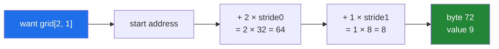

# 1.3 — One block, and the arithmetic that finds an element

## One-line answer

An array knows how many bytes to jump to move one step along each axis — that number is called a
**stride** — so finding any element is a multiplication and an addition, and rearranging an array
usually means changing the strides rather than moving the data.

---

## The story

Back to the fridge, and the grid of four weeks by seven days.

Somebody wants Wednesday of week three. They do not read every cell until they find it. They count
two rows down, two cells across, and put their finger on it. Two moves, done, and the size of the
grid made no difference — a grid of a hundred rows would have taken exactly the same two moves.

Now here is the bit that matters, and it is easy to miss because it feels too obvious to say.

To count two rows down, they had to know how wide a row is. Seven cells. If the grid had been laid
out five cells wide, "two rows down" would have meant a different distance across the card.

The width of a row is not written anywhere on the card. It is something the reader carries in their
head, and it is the only thing that turns "row three, column three" into "this exact spot".

Take the same card and read it sideways — treat each column as a week and each row as a day — and
you have not changed a single number. You have changed the two distances you step by. That is
transposing, and it costs nothing, because nothing moved.

---

## The idea in plain language

An array is one flat run of bytes plus a description of how to read it
([1.1](1.1-a-list-of-boxes.md)). [1.2](1.2-shape-dtype-and-the-rest.md) covered most of that
description. This part covers the last piece, and it is the one that explains why so many NumPy
operations are free.

A **stride** is the number of **bytes** you move forward to take one step along one axis. There is
one stride per axis, and they live in the tuple `arr.strides`.

For the flat week of seven `int64` values, each number is 8 bytes wide, so stepping one day along
means stepping 8 bytes. `strides` is `(8,)`.

For the four-by-seven month, there are two axes and so two strides. Stepping one column across is
8 bytes, the width of one number. Stepping one row down is 7 × 8 = 56 bytes, because you must skip
the whole of the current row. `strides` is `(56, 8)`.

With shape and strides in hand, finding an element is one formula and no searching at all:

> **address of `arr[i, j]` = start + i × stride0 + j × stride1**

That is why `arr[3000000]` and `arr[2]` take the same amount of time. Neither one looks; both
compute.

Three things follow, and they are the reason this part exists.

**Rearranging can be free.** Transposing the month means swapping the two strides, from `(56, 8)` to
`(8, 56)`. Ask for element `[i, j]` of the transposed array and the formula reaches the byte that
was `[j, i]` before. No number moved. The same trick makes reshaping free
([Day 22, 2.1](../../../day-22-broadcasting-and-shape/parts/02-reshape/2.1-same-block-new-shape.md))
and makes a slice a **view** rather than a copy
([Day 21, 2.1](../../../day-21-indexing-and-views/parts/02-the-view-trap/2.1-a-slice-does-not-copy.md)).

**Two arrays can share one block.** If a second array is created with the same start address and
different strides, both of them describe the same bytes. Write through one and the other changes.
That is the single most surprising behaviour in NumPy and the whole subject of Day 21's section 2.

**Contiguous is a property, not a guarantee.** An array whose strides walk the block straight
through with no gaps and no jumping backwards is called **C-contiguous** — "C" because it is the
order the C language lays a two-dimensional array out in, rows first. An array made by transposing
is not C-contiguous, even though its data is. Some operations are much faster on contiguous data,
which is
[Day 22, 3.3](../../../day-22-broadcasting-and-shape/parts/03-transpose/3.3-contiguity-and-the-speed-you-lose.md).

One warning about vocabulary, because it catches everybody once. **Strides are in bytes, not in
elements.** A stride of 8 on an `int64` array means one element; a stride of 8 on a `float32` array
would mean two.

---

## Why Setu needs it

- **Day 21's entire second section is the consequence of this part.** A slice shares the block, and
  a reader who does not know about strides cannot understand why writing to a slice changed the
  original.
- **Day 22's reshape, transpose and `ravel` are all stride edits**, which is why they are instant on
  arrays too big to copy.
- **Day 55's train/test split hands a *view* of the data to the scaler.** If the scaler writes in
  place, it writes into the parent, and the test set is now scaled with training statistics. That is
  the leak Principle 8 exists for, and it is made of strides.
- **Day 130's images are `(60000, 28, 28)`**, and every operation on them is fast or slow depending
  on whether the last axis is the contiguous one.

---

## The mechanism

Ask both fridge strips what their strides are.

```python
import numpy as np

week = np.array([8213, 10442, 6180, 0, 12007, 9631, 7204])
grid = np.arange(12).reshape(3, 4)

print("week.shape    :", week.shape)
print("week.strides  :", week.strides)
print()
print("grid:")
print(grid)
print("grid.shape    :", grid.shape)
print("grid.strides  :", grid.strides)
print("grid.T.strides:", grid.T.strides)
print("grid.T C-contiguous:", grid.T.flags["C_CONTIGUOUS"])
print("grid.T F-contiguous:", grid.T.flags["F_CONTIGUOUS"])
```

**Line by line:**

- `np.arange(12)` — the whole numbers 0 to 11 as an array
  ([3.3](../03-creating/3.3-arange-and-the-float-step.md)). Using 0–11 rather than step counts here
  is deliberate: the value in each cell *is* its position in the block, so the strides can be read
  off the printed grid.
- `.reshape(3, 4)` — three rows of four. No data moves; only the shape and strides change.
- `grid.strides` — expect `(32, 8)`. Eight bytes to step one column; four columns of eight bytes,
  so 32, to step one row.
- `grid.T` — the transpose, an attribute rather than a method call. It builds a new array object
  that points at **the same block** with the two strides swapped.
- `grid.T.flags["C_CONTIGUOUS"]` — `flags` is a small record of layout facts. `C_CONTIGUOUS` means
  the elements run straight through the block in row-major order; `F_CONTIGUOUS` means they do so in
  column-major order, which is the convention Fortran uses. **The transpose of a C-contiguous array
  is F-contiguous**, which is the same fact stated twice.

```text
week.shape    : (7,)
week.strides  : (8,)

grid:
[[ 0  1  2  3]
 [ 4  5  6  7]
 [ 8  9 10 11]]
grid.shape    : (3, 4)
grid.strides  : (32, 8)
grid.T.strides: (8, 32)
grid.T C-contiguous: False
grid.T F-contiguous: True
```

Now prove the block really is one run of bytes and nothing else:

```python
import numpy as np

week = np.array([8213, 10442, 6180, 0, 12007, 9631, 7204])

raw = week.tobytes()
print("total bytes  :", len(raw))
print("first 16     :", raw[:16])
print("bytes 0..7   ->", int.from_bytes(raw[0:8], "little"))
print("bytes 8..15  ->", int.from_bytes(raw[8:16], "little"))
print("bytes 32..39 ->", int.from_bytes(raw[32:40], "little"))
```

**Line by line:**

- `week.tobytes()` — a copy of the block as a plain `bytes` object. This is the actual payload,
  with no NumPy wrapper around it.
- `raw[:16]` — the first two numbers. They print as escape sequences because most of these bytes are
  not printable characters, which is itself the point: this is a number, stored as bytes, not text.
- `int.from_bytes(raw[0:8], "little")` — decode the first 8 bytes back into an integer.
  `"little"` means **little-endian**: the least significant byte comes first, which is what x86 and
  ARM machines do. Getting this wrong on data from another machine is a real class of bug, and it is
  why `.npy` files record the byte order.
- `raw[32:40]` — element four. `4 × 8 = 32`, which is the stride formula done by hand. The value
  that comes back should be Friday's `12007`.

```text
total bytes  : 56
first 16     : b'\x15 \x00\x00\x00\x00\x00\x00\xca(\x00\x00\x00\x00\x00\x00'
bytes 0..7   -> 8213
bytes 8..15  -> 10442
bytes 32..39 -> 12007
```

`b'\x15 '` is `0x15` followed by a space, and the space is the byte `0x20` printed as a character
because it happens to be printable. `0x2015` is 8213. The bytes are exactly what the model says they
are.

The address formula, drawn:



No loop anywhere in that diagram. That is the whole point.

---

## When it breaks

**A slice shares the block, and writing to it changes the parent:**

```text
$ uv run python -c "
import numpy as np
week = np.array([8213, 10442, 6180, 0, 12007, 9631, 7204])
weekend = week[5:]
weekend[0] = 99999
print('weekend:', weekend)
print('week   :', week)
print('shared :', np.shares_memory(week, weekend))
"
weekend: [99999  7204]
week   : [ 8213 10442  6180     0 12007 99999  7204]
shared : True
```

**What it means.** `week[5:]` did not copy. It built a second description — same block, start
offset by 5 × 8 = 40 bytes, length 2 — and both objects now read and write the same memory. There is
no error here at all, which is exactly why it costs people an evening. Day 21's
[2.1](../../../day-21-indexing-and-views/parts/02-the-view-trap/2.1-a-slice-does-not-copy.md) is the
full treatment, including how to ask an array whether it owns its data.

**An operation that has to copy, silently:**

```text
$ uv run python -c "
import numpy as np
grid = np.arange(12).reshape(3, 4)
t = grid.T
print('t strides    :', t.strides)
print('t ravel base :', t.ravel().base is None)
print('grid ravel   :', grid.ravel().base is None)
"
t strides    : (8, 32)
t ravel base : True
grid ravel   : False
```

**What it means.** `.base is None` means "this array owns its data" — nothing was shared, so a copy
happened. Flattening the C-contiguous `grid` is free, because the elements are already in that order
in the block. Flattening the transpose is **not** free, because reading it in row-major order jumps
around the block, and a flat array must be contiguous. NumPy copies without saying so. On a 4 GB
array that silent copy is an out-of-memory kill, and the tool for spotting it is exactly this check.

**Reading `strides` as elements instead of bytes:**

```text
$ uv run python -c "
import numpy as np
print('int64  :', np.zeros(5, dtype=np.int64).strides)
print('float32:', np.zeros(5, dtype=np.float32).strides)
print('int8   :', np.zeros(5, dtype=np.int8).strides)
"
int64  : (8,)
float32: (4,)
int8   : (1,)
```

**What it means.** All three arrays hold five numbers in a line, and all three have completely
different strides, because a stride is a byte count. Anybody who reads `(8,)` as "eight elements" or
`(1,)` as "one gap" will build a wrong mental model and then be baffled by
`np.lib.stride_tricks.as_strided`. The rule is one sentence: **strides are bytes**.

---

## In production

**What a professional writes instead of the teaching version.** They almost never write strides.
They *read* them, in exactly two situations: when an operation is unexpectedly slow, and when memory
went up after an operation that was supposed to be free. The diagnostic is three lines —
`arr.strides`, `arr.flags`, and `arr.base is None` — and it answers "did that copy?" definitively.

Writing strides by hand is possible with `np.lib.stride_tricks.as_strided`
(<https://numpy.org/doc/stable/reference/generated/numpy.lib.stride_tricks.as_strided.html>), and the
documentation's own warning is the right attitude: it does no bounds checking at all, so a wrong
stride reads memory that is not yours and either returns nonsense or crashes the interpreter. The
safe wrapper for the one case people actually want — a sliding window — is
`np.lib.stride_tricks.sliding_window_view`, and that is what belongs in real code.

**What changes at scale.** Stride-only operations stay free no matter how large the array, and that
is the whole reason they matter. Transposing a 40 GB memory-mapped array is instant. But the
operations that *follow* a transpose are not: a sum along a non-contiguous axis reads one number per
cache line and throws away the other seven, so it can be several times slower than the same sum on
contiguous data. The professional habit is to check contiguity before a hot loop and to call
`np.ascontiguousarray` deliberately when the copy is worth paying for — once, not repeatedly.

**The failure that only appears with real data.** A memory-mapped array from `np.load(...,
mmap_mode="r")`, transposed and then flattened inside a helper. On the test fixture of 100 rows the
copy is invisible. On the real 30 GB file the flatten materialises the whole thing in RAM and the
process is killed by the kernel with no Python traceback at all — just `Killed`. Nothing in the code
says "copy"; the only clue is that `.T.ravel()` cannot be a view.

**The review comment a senior engineer leaves.** *"`features.T.reshape(-1)` here forces a full copy
because the transpose is not contiguous. Either use `features.reshape(-1, order='F')`, which does
the same thing without pretending it is free, or restructure so the data is stored in the order you
read it."*

**The interview question.** *"How does NumPy find `arr[i, j]` without searching?"* It stores one
stride per axis — the byte distance of a single step along that axis — and computes
*start + i × stride0 + j × stride1*. The follow-up is the interesting one: *"so what does transpose
actually do?"* It swaps the strides and the shape, touching no data, which is why it is free and why
the result is no longer C-contiguous. A strong answer adds the consequence: two arrays can describe
the same block, so a slice is a view, and writing through it changes the original.

---

## Check yourself

```bash
uv run python -c "
import numpy as np
grid = np.arange(12).reshape(3, 4)
print('strides  :', grid.strides)
print('grid[2,1]:', grid[2, 1])
raw = grid.tobytes()
offset = 2 * grid.strides[0] + 1 * grid.strides[1]
print('by hand  :', int.from_bytes(raw[offset:offset + 8], 'little'))
"
```

The last two lines must print the same number. You just did NumPy's indexing by hand.

**Answer out loud, without scrolling up:**

> A `float32` array of shape `(10, 5)` — give both strides in bytes, and say what they become after
> `.T`.

---

**Next:** [1.4 — a million floats: memory and speed, measured](1.4-a-million-floats-measured.md).
