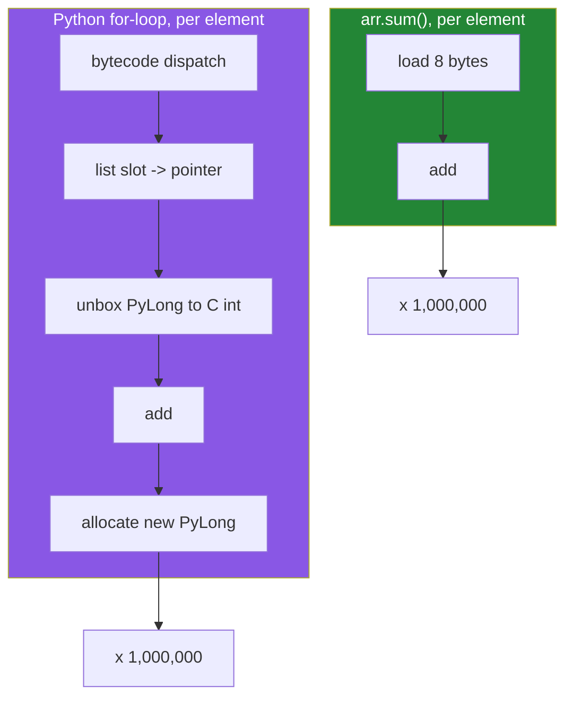

# 1.4 — A million numbers: memory and speed, measured rather than claimed

## One-line answer

On this machine today, a million step counts take **4.5× less memory** as an array than as a list,
and summing them is **roughly 100× faster** than a hand-written `for` loop — but only about **14×**
faster than the built-in `sum`, and knowing which comparison you are making is the difference
between an honest benchmark and a sales pitch.

---

## The story

The phone has been counting steps for a while now. Not one week — nearly three thousand days, and
the app records a count every couple of minutes rather than once a day. A million numbers.

Somebody wants the total.

They write the obvious loop: start at zero, add each number, keep going. It finishes. It takes long
enough that they notice it, and then they wonder whether that was normal or whether they did
something silly.

This is the honest position most people are in. They have heard that arrays are faster. They have
never seen the gap with their own eyes, on their own machine, so they cannot tell whether it is
worth changing anything.

The only cure is to measure. And the only measurement worth trusting is the one where you also
measure the *good* version of the slow way — because "my loop against their optimised routine" is a
comparison that flatters everybody and teaches nobody.

---

## The idea in plain language

Two claims get made about arrays, and both are true, and both are routinely exaggerated.

**The memory claim.** A Python list of a million integers holds a million pointers, eight bytes
each, plus a million separate integer objects of twenty-eight bytes each. That is roughly 36 MB. The
same numbers as an `int64` array are 8 MB, because there are no objects and no pointers — only the
numbers. The ratio is about 4.5×, and it is **not** the "100× smaller" figure that sometimes gets
repeated. Where the ratio does get dramatic is with small dtypes: the same million counts as `int16`
are 2 MB, which is 18× smaller, and choosing that dtype is [2.2](../02-dtypes/2.2-integers-and-the-silent-wrap.md).

**The speed claim.** This one depends entirely on what you compare against, and there are three
honest comparisons, not one:

- **Against a hand-written `for` loop that accumulates** — the array wins by roughly two orders of
  magnitude, measured below at anywhere from 83× to 152× depending on the run. Every iteration of
  that loop does a bytecode dispatch, a slot lookup, an unbox, an add, and a re-box, and a million of
  those add up.
- **Against the built-in `sum()`** — the array wins by roughly 14×. `sum()` is a C loop too, so the
  bytecode dispatch is gone; what remains is that it still handles one Python object at a time, while
  the array's loop handles raw 8-byte integers with no object at all.
- **Against a well-written comprehension for an elementwise transform** — the array wins by roughly
  20–25×, which is smaller than people expect and still completely decisive.

The word for what the array is doing is **vectorised**: one Python-level call that hands the whole
block to a compiled loop. The word for what the `for` loop is doing is nothing special — it is just
Python, doing what Python does, one object at a time. You measured the per-iteration cost of that on
[Day 6, 4.2](../../../day-06-loops/parts/04-loop-cost/4.2-the-loop-you-should-not-write.md); this
part is that same cost, multiplied by a million and set against the alternative.

One measurement rule before the code. **Use `time.perf_counter`, not `time.time`.**
`perf_counter` is a monotonic high-resolution clock intended for measuring intervals; `time.time` is
the wall clock, which can jump backwards when the machine syncs with a time server. For anything
under a second that difference is the whole measurement.

---

## Why Setu needs it

- **The Phase 3 gate is a stats module that beats a loop by at least 50×.** This part is where you
  find out that the number is achievable, and what you have to compare against for it to be an
  honest claim.
- **Day 25 builds that module**, and its test asserts a ratio. A test that asserts a ratio needs a
  measurement method that does not wobble, which is what `perf_counter` and a warm-up are for.
- **Day 130's training loop touches 60 000 images per epoch.** A per-element Python loop anywhere
  inside it turns a two-minute epoch into an afternoon, and the habit of noticing that starts here.
- **Day 226 sizes a database and an index.** `nbytes` × rows is the arithmetic, and this part is
  where you learn to do it before provisioning rather than after.

---

## The mechanism

Memory first, because it needs no timing at all and cannot be got wrong.

```python
import sys

import numpy as np

N = 1_000_000
rng = np.random.default_rng(20)
arr = rng.integers(0, 20_000, size=N)
lst = arr.tolist()

array_bytes = arr.nbytes
list_bytes = sys.getsizeof(lst) + sum(sys.getsizeof(x) for x in lst)
print(f"ndarray : {array_bytes:>12,} bytes")
print(f"list    : {list_bytes:>12,} bytes")
print(f"ratio   : {list_bytes / array_bytes:>12.1f}x")
```

**Line by line:**

- `np.random.default_rng(20)` — a seeded generator, so this run and yours produce identical numbers.
  The seed is not decoration; Principle 4 says never accept a framework default, and an unseeded
  benchmark is a benchmark you cannot repeat. Full treatment in
  [4.1](../04-random/4.1-default-rng-the-generator.md).
- `rng.integers(0, 20_000, size=N)` — a million plausible step counts. Integers rather than floats
  because that is what the story has, and because it makes the `int16` argument in section 2 concrete.
- `arr.tolist()` — converts to a real Python list of real Python `int` objects. **This is the
  expensive line in the whole script**, and it is here on purpose: turning an array into a list is
  what you are trying to avoid, so it is worth feeling the cost once.
- `sys.getsizeof(lst) + sum(...)` — the list object plus every integer it points at, as in
  [1.1](1.1-a-list-of-boxes.md). Note that `sum(sys.getsizeof(x) for x in lst)` slightly
  **over**-counts, because CPython shares one object for small integers. At this range almost none
  are shared, so the figure is close.
- `{...:>12,}` — right-aligned in twelve columns with thousands separators. Nine-digit byte counts
  are unreadable without the commas.

```text
ndarray :    8,000,000 bytes
list    :   36,000,056 bytes
ratio   :          4.5x
```

Eight megabytes against thirty-six. Now the timing, with all three comparisons in one script so
nobody can pick the flattering one:

```python
import time

import numpy as np

N = 1_000_000
arr = np.random.default_rng(20).integers(0, 20_000, size=N)
lst = arr.tolist()


def timed(label, fn):
    start = time.perf_counter()
    result = fn()
    elapsed = time.perf_counter() - start
    print(f"{label:<28} {elapsed * 1000:>8.1f} ms")
    return elapsed, result


t_builtin, _ = timed("sum(lst)", lambda: sum(lst))
t_comp, _ = timed("[x * 0.00075 for x in lst]", lambda: [x * 0.00075 for x in lst])
t_mul, _ = timed("arr * 0.00075", lambda: arr * 0.00075)
t_mean_py, m1 = timed("mean by hand, python", lambda: sum(lst) / len(lst))
t_mean_np, m2 = timed("arr.mean()", lambda: arr.mean())
print()
print(f"scale speedup : {t_comp / t_mul:.0f}x")
print(f"mean  speedup : {t_mean_py / t_mean_np:.0f}x")
print(f"means agree   : {abs(m1 - m2) < 1e-9}")
```

**Line by line:**

- `def timed(label, fn)` — one helper, so every measurement is taken the same way. A benchmark where
  each case is timed by slightly different code is a benchmark of the timing code.
- `time.perf_counter()` — the monotonic interval clock, as argued above.
- `lambda: sum(lst)` — the work is wrapped in a zero-argument function
  ([Day 11, 3.1](../../../day-11-iterators-and-generators/parts/03-lambda-and-map/3.1-lambda-a-function-with-no-name.md))
  so that `timed` decides when it runs. Passing `sum(lst)` directly would run it *before* the timer
  started, and the measurement would be of nothing.
- `[x * 0.00075 for x in lst]` — steps to kilometres, roughly, for every element. A comprehension
  rather than an `append` loop, because comparing against the *good* Python version is the whole
  point ([Day 9, 1.1](../../../day-09-comprehensions/parts/01-list-comprehensions/1.1-the-loop-and-the-comprehension.md)).
- `arr * 0.00075` — the same transform, vectorised. One Python call, one compiled loop, one new
  block of a million floats.
- `abs(m1 - m2) < 1e-9` — **never compare floats with `==`**. The two means are computed by
  different summation orders, so they can differ in the last bit. This is
  [2.3](../02-dtypes/2.3-floats-nan-and-precision.md), and the habit starts now.

Run on numpy 2.5.2 and Python 3.12.12 on 2026-09-02:

```text
sum(lst)                          7.7 ms
[x * 0.00075 for x in lst]       61.5 ms
arr * 0.00075                     2.4 ms
mean by hand, python              6.6 ms
arr.mean()                        0.9 ms

scale speedup : 26x
mean  speedup : 8x
means agree   : True
```

And the comparison people usually quote — the hand-written accumulating loop:

```python
import time

import numpy as np

arr = np.random.default_rng(20).integers(0, 20_000, size=1_000_000)
lst = arr.tolist()

start = time.perf_counter()
total_py = 0
for value in lst:
    total_py += value
loop_seconds = time.perf_counter() - start

start = time.perf_counter()
total_np = arr.sum()
numpy_seconds = time.perf_counter() - start

print(f"for loop : {loop_seconds * 1000:>8.1f} ms -> {total_py}")
print(f"arr.sum(): {numpy_seconds * 1000:>8.1f} ms -> {total_np}")
print(f"speedup  : {loop_seconds / numpy_seconds:>8.0f}x")
```

**Line by line:**

- `total_py = 0` then `total_py += value` — the loop everybody writes first. Each iteration creates a
  new integer object, because Python integers are immutable
  ([Day 4, 1.3](../../../day-04-objects/parts/01-objects/1.3-numbers-and-bool.md)), so a million
  iterations means a million short-lived objects for the garbage collector to deal with.
- `arr.sum()` — one call. Inside it, a compiled loop over 8 MB of raw integers, with pairwise
  summation for accuracy and no Python object anywhere.
- **Both totals are printed**, and they must match. A benchmark that does not check its answers is
  timing the wrong thing surprisingly often.

```text
for loop :     69.0 ms -> 10006922554
arr.sum():      0.5 ms -> 10006922554
speedup  :      128x
```

Three separate runs of that script gave 128×, 113× and 130×, and the loop below — five measurements
inside one process — spread from 83× to 152×. **Quote a range, never a single figure**, because a
benchmark that reports a precise number for a quantity that moves by half between runs is lying
about its own precision.

Where the time actually goes:



Five steps against two, and three of the five involve the Python object system. That ratio is the
125×.

---

## When it breaks

**The benchmark that measures the wrong thing:**

```text
$ uv run python -c "
import time
import numpy as np
lst = list(range(1_000_000))
start = time.perf_counter()
total = np.array(lst).sum()
print('numpy including conversion:', round((time.perf_counter() - start) * 1000, 1), 'ms')
arr = np.array(lst)
start = time.perf_counter()
total = arr.sum()
print('numpy on an existing array:', round((time.perf_counter() - start) * 1000, 1), 'ms')
"
numpy including conversion: 38.3 ms
numpy on an existing array: 0.6 ms
```

**What it means.** `np.array(lst)` has to walk a million Python objects and unbox each one, so it
costs more than the sum it enables. **Converting to an array to do one operation is a loss.** The
array pays off when the data arrives as an array and stays one for many operations. This is the most
common way a first NumPy rewrite comes out slower than the code it replaced, and the fix is to move
the conversion to the boundary — read the file straight into an array — rather than to abandon
NumPy.

**One run is not a measurement:**

```text
$ uv run python -c "
import time
import numpy as np
arr = np.random.default_rng(20).integers(0, 20_000, size=1_000_000)
lst = arr.tolist()
for run in range(5):
    start = time.perf_counter()
    total = 0
    for value in lst:
        total += value
    loop = time.perf_counter() - start
    start = time.perf_counter()
    arr.sum()
    fast = time.perf_counter() - start
    print(f'run {run}: loop {loop * 1000:6.1f} ms  sum {fast * 1000:5.2f} ms  ratio {loop / fast:5.0f}x')
"
run 0: loop   62.1 ms  sum  0.53 ms  ratio   116x
run 1: loop   62.6 ms  sum  0.75 ms  ratio    83x
run 2: loop   79.2 ms  sum  0.52 ms  ratio   152x
run 3: loop   62.8 ms  sum  0.53 ms  ratio   118x
run 4: loop   63.2 ms  sum  0.53 ms  ratio   120x
```

**What it means.** Same process, same data, same five lines of work — and the ratio ranges from 83×
to 152×. Run 1 had a slow `sum` and run 2 had a slow loop, and neither had anything to do with
NumPy: the operating system scheduled something else, or the processor changed clock speed, or the
garbage collector ran. **A single timing tells you almost nothing.** Repeat it, and report the
minimum or the median with the spread. For a real benchmark the right tool is `timeit`, which does
the repetition for you.

**Memory measured with the wrong function:**

```text
$ uv run python -c "
import sys
import numpy as np
lst = list(range(1_000_000))
print('getsizeof(list) alone:', sys.getsizeof(lst))
print('plus its elements    :', sys.getsizeof(lst) + sum(sys.getsizeof(x) for x in lst))
print('ndarray nbytes       :', np.array(lst).nbytes)
print('getsizeof(ndarray)   :', sys.getsizeof(np.array(lst)))
"
getsizeof(list) alone: 8000056
plus its elements    : 36000056
ndarray nbytes       : 8000000
getsizeof(ndarray)   : 8000112
```

**What it means.** `sys.getsizeof` on a list reports only the pointer table, so quoting 8 000 056
against 8 000 000 makes the two look identical and the whole memory argument disappears. It is a
shallow measurement by design, and it is wrong for anything that owns other objects — you have to
add the elements yourself, which is the second line. Note that `sys.getsizeof` on the array is
honest, because an array genuinely does own its block: 8 000 112 is `nbytes` plus a 112-byte Python
header.

---

## In production

**What a professional writes instead of the teaching version.** Nobody hand-rolls `perf_counter`
loops for a real decision. They use `timeit` for microbenchmarks, which handles warm-up and
repetition:

```python
import timeit

setup = "import numpy as np; arr = np.random.default_rng(20).integers(0, 20_000, size=1_000_000)"
best = min(timeit.repeat("arr.sum()", setup=setup, repeat=5, number=10))
print(f"best of 5 x 10 : {best / 10 * 1000:.2f} ms per call")
```

**Line by line:**

- `setup=` — a string executed once per repeat and **not** timed, so the array construction stays
  out of the measurement.
- `number=10` — ten calls per timing, so a sub-millisecond operation is measured against a clock
  that can resolve it.
- `repeat=5` — five independent timings.
- `min(...)` — the minimum, not the mean. Interference from other processes can only ever make a
  timing *longer*, so the smallest one is the closest to the true cost. Reporting the mean of a
  benchmark reports how busy your laptop was.
- `best / 10` — undo the `number=10` to get per-call.

```text
best of 5 x 10 : 0.46 ms per call
```

**What changes at scale.** Two things stop being free. First, the 4.5× memory ratio becomes the
whole problem rather than a nice fact: at 500 million values the list is 18 GB and the array is 4 GB,
and one of those numbers fits on a normal machine. Second, a vectorised operation allocates a whole
new array for its result, so `a * 2 + b * 3` builds two temporaries the size of the input. At small
sizes that is invisible; at 4 GB it is three times your memory budget, and the answer is in-place
operators (`a *= 2`) or `out=` parameters. That trade-off — vectorised but memory-hungry against
looped but frugal — is a real engineering decision, and Day 25 makes it explicitly.

**The failure that only appears with real data.** A rewrite that is beautifully vectorised and
slower in production, because the data arrives as a list of dictionaries from a JSON API and the
code converts to an array inside the request handler. The conversion is 39 ms and the computation is
0.5 ms. Benchmarks on a pre-built array showed 128×; the service got slower. The measurement was
right and the boundary was wrong.

**The review comment a senior engineer leaves.** *"This benchmark reports `128x` from a single run
with no warm-up, and it compares against a hand-written accumulator rather than `sum()`. Against
`sum()` it is about 14×, which is still worth doing. Please quote the honest number — someone will
check."*

**The interview question.** *"How much faster is NumPy than a Python loop?"* The right response is
to refuse the question as asked, politely: it depends on what you compare against and on what the
operation is. For a sum of a million integers on my machine it is roughly 100× against a
hand-written accumulating loop — with real run-to-run spread from about 85× to 150× — about 14×
against the built-in `sum`, and about 25× for an elementwise multiply against a list comprehension. Then the substance: the gap comes from removing per-element Python
object work and from contiguous memory the processor can prefetch, and it disappears entirely if you
have to convert a list to an array first. An interviewer asking this is checking whether you have
actually measured anything, and a confident single number is the wrong answer.

---

## Check yourself

```bash
uv run python -c "
import time
import numpy as np
arr = np.random.default_rng(20).integers(0, 20_000, size=1_000_000)
lst = arr.tolist()
arr.sum()
start = time.perf_counter(); s1 = sum(lst); t1 = time.perf_counter() - start
start = time.perf_counter(); s2 = arr.sum(); t2 = time.perf_counter() - start
print('sum(lst) :', round(t1 * 1000, 1), 'ms')
print('arr.sum():', round(t2 * 1000, 1), 'ms')
print('ratio    :', round(t1 / t2), 'x')
print('agree    :', s1 == s2)
"
```

Note the bare `arr.sum()` before the timers: that is the warm-up. Run the whole thing four or five
times and watch the ratio move — that spread is the real answer, not any one line of it.

**Answer out loud, without scrolling up:**

> Give three different honest speedup numbers for the same array, and say what each one is compared
> against. Then say the one situation in which converting a list to an array makes the program
> slower.

---

**Next:** [2.1 — a dtype is a promise about every element](../02-dtypes/2.1-a-dtype-is-a-promise.md).
