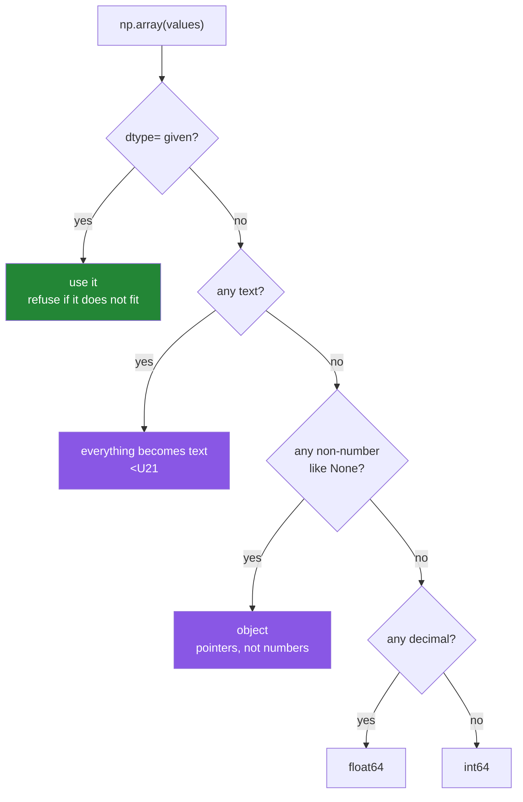

# 2.1 — A dtype is a promise about every element

## One-line answer

Every array carries exactly one `dtype`, which fixes what each cell holds and how many bytes it
takes, and NumPy will guess one for you from your data — which is convenient right up to the moment
it guesses wrong.

---

## The story

The step counts get typed into a spreadsheet, one number per cell in column B.

Somebody sets the column format to "Number, 0 decimal places". Every cell in the column now behaves
the same way: 8213 shows as 8213, and if anybody types 8213.6 it shows as 8214. The setting is on
the column, not on any one cell, and it applies to cells that do not exist yet.

Later, one row gets the word `rest` typed into it, for the day the phone stayed home.

The spreadsheet does not refuse. It quietly changes what the whole column is. Now everything in it
is text — and the sum at the bottom, which had been working all week, shows zero.

Nobody was told. The column just stopped being a column of numbers, because one cell could not be
one.

---

## The idea in plain language

A **dtype** — short for *data type* — is the single description that applies to every cell in an
array. It answers two questions at once:

- **What kind of thing is in a cell?** A whole number, a decimal number, a true/false, a fixed-width
  piece of text.
- **How many bytes wide is a cell?** 8 for `int64`, 4 for `float32`, 1 for `bool`.

That is the whole idea. The name usually says both parts: `int64` is "signed whole number, 64 bits";
`float32` is "decimal number, 32 bits". Sixty-four bits is eight bytes, because a byte is eight
bits.

The families you will meet in this curriculum are short enough to list:

| Family | Names | What it holds |
|---|---|---|
| signed integer | `int8`, `int16`, `int32`, `int64` | whole numbers, positive or negative |
| unsigned integer | `uint8`, `uint16`, `uint32`, `uint64` | whole numbers, zero or positive only |
| floating point | `float16`, `float32`, `float64` | decimal numbers, approximately |
| boolean | `bool` | `True` or `False`, one byte each |
| text | `<U21` and friends | fixed-width Unicode text |
| object | `object` | pointers to Python objects — an array pretending to be a list |

`int64` and `float64` are the defaults on every platform this curriculum targets, and 64-bit is
almost always the right choice until memory becomes the constraint.

**Why one dtype for the whole array, and not one per cell?** Because of
[1.1](../01-the-block/1.1-a-list-of-boxes.md). The array is one block of memory ruled into equal
cells. A cell cannot be 8 bytes here and 4 bytes there, or the address arithmetic in
[1.3](../01-the-block/1.3-one-block-and-strides.md) would not work. The single dtype is the price of
the single block, and the speed in [1.4](../01-the-block/1.4-a-million-floats-measured.md) is what
it buys.

**Where the dtype comes from.** Two ways, and the difference between them is the whole of this
part.

- **You state it**: `np.array(steps, dtype=np.int32)`. NumPy uses it, and refuses if the data does
  not fit.
- **NumPy infers it**: `np.array(steps)`. NumPy looks at the values and picks the narrowest type
  that holds all of them, following its own promotion rules. On a list of whole numbers it picks
  `int64`. Add one decimal and it picks `float64`. Add one string and it picks text — and *every
  number becomes text*, silently, which is the spreadsheet in the story.

Inference is right most of the time, which is exactly what makes it dangerous. It is right on your
test fixture and wrong on row 400 000 of the real file.

One more term, because it appears in error messages. A **NumPy scalar** is a single value pulled out
of an array — `week[0]` gives you a `np.int64`, not a Python `int`. It looks and prints like a
number, it does arithmetic like a number, and it carries its dtype with it. That last property is
why [2.5](2.5-nep-50-and-the-python-number.md) exists.

---

## Why Setu needs it

- **Day 27 reads CSV, JSON, Parquet and SQL, typed at read time.** "Typed at read time" means
  stating the dtype at the boundary instead of letting the reader guess, and the reason is in this
  part.
- **Day 130 stores 60 000 images.** As `float64` that is 376 MB; as the `uint8` they actually are, it
  is 47 MB. Same pictures, one eighth the memory, and the choice is a dtype.
- **Day 155's embeddings come back as `float32`**, and quietly promoting them to `float64` doubles
  a vector index for no gain in answer quality.
- **Principle 4 says never accept a framework default.** A dtype NumPy guessed for you is a
  framework default. Stating it is the same discipline as pinning a version.

---

## The mechanism

Watch inference make five different decisions on five nearly identical lists.

```python
import numpy as np

cases = [
    ("whole numbers    ", [8213, 10442, 6180]),
    ("one decimal      ", [8213, 10442.5, 6180]),
    ("one string       ", [8213, 10442, "rest"]),
    ("true and false   ", [True, False, True]),
    ("a bool and an int", [True, 3]),
    ("a None           ", [8213, 10442, None]),
]

for label, values in cases:
    arr = np.array(values)
    print(f"{label} -> dtype={arr.dtype!s:9} itemsize={arr.itemsize:2}  {arr}")
```

**Line by line:**

- `cases = [...]` — a list of `(label, values)` tuples so one loop covers all six, rather than six
  near-identical prints. The labels are padded to the same width in the source so the output lines
  up without a format spec doing the work.
- `np.array(values)` — **no `dtype=`**. This is the inference path, and the point of the
  demonstration.
- `arr.dtype!s:9` — `!s` first, then the width, for the reason given in
  [1.2](../01-the-block/1.2-shape-dtype-and-the-rest.md): a dtype object does not accept a width
  spec directly.
- `arr.itemsize` — printed alongside, because the width is half of what a dtype *is* and it is easy
  to read the name and forget the bytes.

```text
whole numbers     -> dtype=int64     itemsize= 8  [ 8213 10442  6180]
one decimal       -> dtype=float64   itemsize= 8  [ 8213.  10442.5  6180. ]
one string        -> dtype=<U21      itemsize=84  ['8213' '10442' 'rest']
true and false    -> dtype=bool      itemsize= 1  [ True False  True]
a bool and an int -> dtype=int64     itemsize= 8  [1 3]
a None            -> dtype=object    itemsize= 8  [8213 10442 None]
```

Read the third and sixth lines slowly, because those are the two that ruin afternoons.

**`<U21`, itemsize 84.** One string in the list turned three numbers into text. `<U21` means
"little-endian Unicode, up to 21 characters", and 21 characters at 4 bytes each is 84 bytes per
cell. A column of numbers that was 8 bytes per value is now 84, and it cannot be added up.

**`object`, itemsize 8.** One `None` turned the array into a row of pointers — a list wearing an
array's clothes, with every speed advantage from
[1.4](../01-the-block/1.4-a-million-floats-measured.md) gone.

Now the other path: state the dtype and let it refuse.

```python
import numpy as np

steps = [8213, 10442, 6180, 0, 12007, 9631, 7204]

stated = np.array(steps, dtype=np.int32)
print("stated   :", stated.dtype, stated.nbytes, "bytes")

inferred = np.array(steps)
print("inferred :", inferred.dtype, inferred.nbytes, "bytes")

print("kind     :", stated.dtype.kind)
print("name     :", stated.dtype.name)
print("range    :", np.iinfo(np.int32).min, "to", np.iinfo(np.int32).max)
print("equal?   :", np.array_equal(stated, inferred))
```

**Line by line:**

- `dtype=np.int32` — half the width of the default, and plenty for step counts. This is the choice
  Principle 4 asks you to make on purpose rather than inherit.
- `np.int32` rather than the string `"int32"` — both work, and both are common. The class is
  slightly better because a typo in it is a `NameError` at once, while a typo in `"in32"` is a
  `TypeError` from deeper inside NumPy.
- `stated.dtype.kind` — one character naming the family: `'i'` signed integer, `'u'` unsigned,
  `'f'` float, `'b'` bool, `'U'` text, `'O'` object. Checking `kind` is how you write code that
  works for `float32` and `float64` alike.
- `np.iinfo(np.int32)` — the limits of an **i**nteger dtype. The float equivalent is `np.finfo`.
  These two functions are how you answer "will my data fit" without looking anything up.
- `np.array_equal(stated, inferred)` — elementwise comparison reduced to one answer. Note it
  compares *values*, not dtypes, so it is `True` here despite the different widths.

```text
stated   : int32 28 bytes
inferred : int64 56 bytes
kind     : i
name     : int32
range    : -2147483648 to 2147483647
equal?   : True
```

Same seven numbers, half the memory, and nothing lost — because step counts are nowhere near two
billion.

The decision, drawn:



The two purple boxes are the ones nobody wants and everybody hits.

---

## When it breaks

**A stated dtype that the data does not fit:**

```text
$ uv run python -c "
import numpy as np
np.array(['8213', 'rest'], dtype=np.int64)
" 2>&1 | tail -2
ValueError: invalid literal for int() with base 10: 'rest'
```

**What it means.** This is the good failure. You said the column is integers, one value is not, and
you found out at construction instead of at the sum three modules later. The message even names the
offending value. **Compare this with the silent `<U21` from the inference path**: same data, same
mistake, and stating the dtype turned an afternoon of confusion into one line.

**Text that looks numeric and is not:**

```text
$ uv run python -c "
import numpy as np
a = np.array(['8213', '9000', 'rest'])
print(a.dtype)
print(a.mean())
" 2>&1 | tail -3
<U4
TypeError: the resolved dtypes are not compatible with add.reduce. Resolved (dtype('<U4'), dtype('<U4'), dtype('<U8'))
```

**What it means.** The array is text, so `mean` tries to add strings together and cannot. `add.reduce`
is the internal name for "add everything up"; the three dtypes in the message are the two inputs and
the proposed output. The message is about arithmetic, and the bug is about parsing, and those are
three hundred lines apart. The fix is at the reader:
`np.array(rows, dtype=np.int64)` or `np.loadtxt(..., dtype=np.int64)`.

**An `object` array that silently works:**

```text
$ uv run python -c "
import numpy as np
a = np.array([8213, 10442, None], dtype=object)
print('dtype :', a.dtype)
print('sum   :', a[:2].sum())
print('all   :', a.sum())
" 2>&1 | tail -3
dtype : object
sum   : 18655
TypeError: unsupported operand type(s) for +: 'int' and 'NoneType'
```

**What it means.** `object` arrays *do* support arithmetic — by calling Python's `+` on each pair of
objects, one at a time, at Python speed. So `a[:2].sum()` works, and the code passes review, and
then a `None` arrives in production and it stops. An `object` array is a list with extra steps. **If
you find one holding numbers, the question is always what upstream produced a non-number**, and the
answer for a genuinely missing value is `np.nan` in a float array
([2.3](2.3-floats-nan-and-precision.md)).

**The wrong dtype, no error at all:**

```text
$ uv run python -c "
import numpy as np
counts = np.array([8213.7, 10442.2, 6180.9], dtype=np.int64)
print(counts)
print('total  :', counts.sum())
print('honest :', np.array([8213.7, 10442.2, 6180.9]).sum())
"
[ 8213 10442  6180]
total  : 24835
honest : 24836.800000000003
```

**What it means.** Stating `int64` on decimal data **truncates towards zero** — it does not round —
and says nothing. `8213.7` became `8213`. Over three values the total is off by two; over a million
it is off by roughly half a million. This is the one case where stating a dtype is worse than
inferring one, and the defence is to round on purpose (`np.rint(x).astype(np.int64)`) so the
intention is in the code.

---

## In production

**What a professional writes instead of the teaching version.** They state the dtype at every
boundary where data enters the program, and nowhere else. Inside a computation, letting NumPy
promote is correct and readable. At the edge — a file, a socket, an API response, a database cursor
— the dtype is part of the contract, exactly as a Pydantic model is the contract for JSON on
[Day 19, 3.4](../../../day-19-typing-dataclasses-and-concurrency/parts/03-pydantic/3.4-model-dump-and-the-boundary.md).
The habit reads like this:

```python
import numpy as np

STEP_DTYPE = np.int32


def load_steps(rows: list[str]) -> np.ndarray:
    """Parse one column of daily step counts, refusing anything that is not one."""
    arr = np.array(rows, dtype=STEP_DTYPE)
    if arr.min() < 0:
        raise ValueError(f"negative step count in input: {arr.min()}")
    return arr
```

**Line by line:**

- `STEP_DTYPE = np.int32` — a module-level constant, so the choice is written down once and every
  reader and every test refers to the same name. Changing your mind is one edit.
- `rows: list[str]` and `-> np.ndarray` — annotated, so the type checker from
  [Day 19, 1.4](../../../day-19-typing-dataclasses-and-concurrency/parts/01-type-hints/1.4-the-type-checker.md)
  reads them.
- `np.array(rows, dtype=STEP_DTYPE)` — the parse and the type check in one call. A row that is not
  an integer raises `ValueError` here, at the boundary, with the bad value in the message.
- `if arr.min() < 0: raise ValueError(...)` — the dtype cannot express "must be positive", so the
  domain rule is a separate check. `ValueError` is the right class because the value is wrong rather
  than the type ([Day 18, 2.2](../../../day-18-exceptions/parts/02-the-hierarchy/2.2-which-built-in-to-raise.md)).
- The f-string puts the actual offending number in the message, because
  [Day 18, 3.3](../../../day-18-exceptions/parts/03-your-own/3.3-the-message-is-an-interface.md)
  argued that a message without the value is a message that costs somebody a debugging session.

**What changes at scale.** The dtype stops being a correctness question and becomes the budget. A
column of 500 million counts is 4 GB as `int64`, 2 GB as `int32` and 1 GB as `int16` — and the third
of those fits in a laptop's RAM while the first does not. The same arithmetic decides cloud cost, how
much of a dataset fits in a GPU's memory on Day 118, and how large a vector index can be on Day 158.
Professionals size their dtypes deliberately at that point, and check the range with `np.iinfo`
before they do.

**The failure that only appears with real data.** A loader that infers dtypes works for eleven
months, and then one sensor writes the literal string `NA` into a numeric column for a single hour.
Every subsequent array from that file is `<U21`. The pipeline does not crash — comparison, sorting
and equality all work on text — so the bad data flows all the way into a model, where it becomes
one-hot encoded categories with 400 000 levels. The failure is a memory error in a completely
different module, days later.

**The review comment a senior engineer leaves.** *"`np.array(values)` here infers the dtype from
whatever came back from the API. Pass `dtype=np.float32` and let it raise on the first bad row —
we would rather fail at ingest than discover an `object` array in the feature store."*

**The interview question.** *"What is a dtype, and what happens if you do not specify one?"* A dtype
is the single element type and element width that applies to the whole array, and it exists because
the array is one contiguous block with fixed-size cells. If you do not specify one, NumPy infers it
from the data by finding a type that every value fits in. The important follow-up is what "fits in"
means at the edges: one float makes the whole array float, one string makes the whole array text
without warning, and one `None` makes it `object`, which silently gives up every performance
property people chose NumPy for. The senior answer adds where to state it — at the boundary, once —
and why: an error at ingest is worth ten at inference.

---

## Check yourself

```bash
uv run python -c "
import numpy as np
print(np.array([1, 2, 3]).dtype)
print(np.array([1, 2, 3.0]).dtype)
print(np.array([1, 2, '3']).dtype)
print(np.array([1, 2, None]).dtype)
print(np.array([1, 2, 3], dtype=np.int16).nbytes, 'bytes as int16')
print(np.iinfo(np.int16).max, 'is the largest int16')
"
```

Four inference results and one stated one. Predict all five before running it.

**Answer out loud, without scrolling up:**

> Why can an array have only one dtype? Then say what `np.array([1, 2, 'rest'])` gives you, and why
> that is worse than an error.

---

**Next:** [2.2 — integer widths, and the wrap that says nothing](2.2-integers-and-the-silent-wrap.md).
