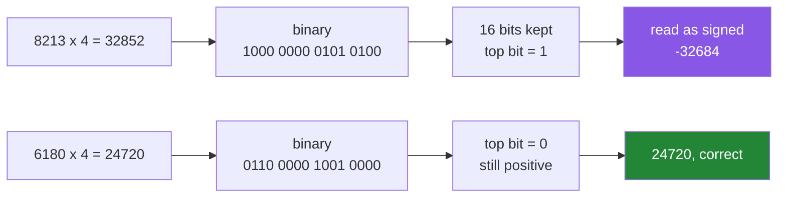

# 2.2 — Integer widths, and the wrap that says nothing

## One-line answer

A Python `int` grows to hold any number, but an `int16` cell holds exactly sixteen bits, so a value
that is too big **wraps round to a negative number without an error, a warning or any sign at all**.

---

## The story

The old car had a five-digit odometer.

At 99 999 miles it went round to 00000. Not to 100 000, because there was no sixth wheel to turn.
The car had done a hundred thousand miles and the dial said zero.

Nobody who saw the dial could tell. There was no little flag that came up, no different colour, no
asterisk. A car with 3 000 miles on it and a car with 103 000 miles on it showed the same three
digits, and the only way to know which one you were looking at was to know something the dial could
not tell you.

Sellers knew this. Buyers learned it the hard way.

That is exactly what happens to a whole number in a fixed-width cell. Not something like it — that,
precisely.

---

## The idea in plain language

A Python `int` is unusual among programming languages: it has no maximum. Ask for
`2 ** 1000` and Python allocates however many bytes it needs and gives you the right answer. You saw
this on [Day 4, 1.3](../../../day-04-objects/parts/01-objects/1.3-numbers-and-bool.md).

A NumPy integer is the ordinary kind. It has a fixed number of bits, decided by its dtype, and that
fixes the largest and smallest number it can hold.

**Signed** integers use one bit to record the sign, so they split their range around zero:

| dtype | bits | smallest | largest |
|---|---|---|---|
| `int8` | 8 | −128 | 127 |
| `int16` | 16 | −32 768 | 32 767 |
| `int32` | 32 | −2 147 483 648 | 2 147 483 647 |
| `int64` | 64 | −9 223 372 036 854 775 808 | 9 223 372 036 854 775 807 |

**Unsigned** integers spend that bit on magnitude instead, so they go twice as high and never below
zero: `uint8` is 0 to 255, `uint16` is 0 to 65 535.

When a calculation produces a number outside the range, the extra bits are simply discarded. What
comes back is the low bits of the true answer, read as a signed number — which for a value just over
the top is a large negative one. That is the odometer, and the technical name is **wraparound** or
**integer overflow**.

Here is the part that matters, stated as plainly as it can be:

> **NumPy does not raise an error when an array calculation overflows. It does not print a warning
> either. You get a wrong number, and everything downstream keeps working.**

There is one exception, and it is worth knowing precisely because the inconsistency confuses people.
Arithmetic between two **NumPy scalars** — single values, not arrays — does emit a `RuntimeWarning`.
Arithmetic on arrays does not. The reason is cost: checking every element of a 400 MB array for
overflow would slow every operation down for the benefit of the rare case, so NumPy chose speed and
put the responsibility on you.

Two habits follow, and they are the whole practical content of this part.

**Choose the width from the range of the data, not from the size of the values you have today.**
Step counts are around 10 000 and `int16` goes to 32 767, so `int16` looks fine. It is fine for
storage. It is not fine for arithmetic, because four times a step count overflows and a week's total
would too.

**Use `np.iinfo` rather than remembering.** `np.iinfo(np.int16).max` is 32 767, and looking it up in
code is both more reliable than memory and self-documenting to the next reader.

---

## Why Setu needs it

- **Day 130's images are `uint8`**, values 0 to 255, and the first thing every tutorial does is
  scale them to 0–1. Doing that scaling *before* converting to float is the classic overflow bug,
  and it produces a picture that looks like static.
- **Day 25's stats module sums a large array.** Summing `int32` counts across ten million rows can
  exceed two billion, and the result is negative. The defence is `arr.sum(dtype=np.int64)`.
- **Day 226 sizes a Postgres schema.** `smallint`, `integer` and `bigint` are `int16`, `int32` and
  `int64` under different names, and the same range arithmetic decides the column type.
- **Any counter that only ever goes up** — tokens used, requests served, rows ingested — is an
  overflow waiting for a long enough uptime.

---

## The mechanism

The ranges first, read from NumPy rather than from memory.

```python
import numpy as np

for name in ["int8", "int16", "int32", "int64", "uint8", "uint16"]:
    info = np.iinfo(np.dtype(name))
    print(f"{name:<7} {info.bits:>3} bits  {info.min:>21,} .. {info.max:>21,}")
```

**Line by line:**

- `np.dtype(name)` — turns the string `"int16"` into a dtype object. `np.iinfo` accepts either, but
  going through `np.dtype` is what lets the loop take plain strings.
- `np.iinfo(...)` — **i**nteger info. It carries `.bits`, `.min` and `.max`. The float equivalent is
  `np.finfo`, and calling `iinfo` on a float dtype raises, which is a useful accident: it stops you
  asking an integer question about a float column.
- `{info.min:>21,}` — right-aligned in 21 columns with thousands separators, because the `int64`
  limits are nineteen digits long and unreadable without them.

```text
int8      8 bits                   -128 ..                   127
int16    16 bits                -32,768 ..                32,767
int32    32 bits         -2,147,483,648 ..         2,147,483,647
int64    64 bits  -9,223,372,036,854,775,808 .. 9,223,372,036,854,775,807
uint8     8 bits                      0 ..                   255
uint16   16 bits                      0 ..                65,535
```

Now the wrap, on the week of step counts:

```python
import numpy as np

steps = [8213, 10442, 6180, 0, 12007, 9631, 7204]
small = np.array(steps, dtype=np.int16)

print("small          :", small)
print("small.sum()    :", small.sum(), small.sum().dtype)
print("small * 4      :", small * 4)
print("(small*4).dtype:", (small * 4).dtype)
print()
print("8213 * 4       =", 8213 * 4, "  which is over 32767")
print("wraps to       =", 8213 * 4 - 65536)
```

**Line by line:**

- `dtype=np.int16` — every value fits, so construction succeeds. Nothing here is wrong yet.
- `small.sum()` — **this one is safe**, and the reason is worth knowing: reductions like `sum`,
  `prod` and `cumsum` promote narrow integer types to the platform default before accumulating, so
  `small.sum()` comes back as `int64`. NumPy protects you here and nowhere else.
- `small * 4` — **this one is not safe.** An elementwise operation keeps the dtype of its input
  ([2.5](2.5-nep-50-and-the-python-number.md) is the rule that decides this), so the result is
  `int16` and every product over 32 767 wraps.
- `8213 * 4 - 65536` — the arithmetic of the wrap done by hand. 65 536 is 2¹⁶, the number of
  distinct values a 16-bit cell can hold, so wrapping means subtracting one full turn of the
  odometer.

```text
small          : [ 8213 10442  6180     0 12007  9631  7204]
small.sum()    : 53677 int64
small * 4      : [-32684 -23768  24720      0 -17508 -27012  28816]
(small*4).dtype: int16

8213 * 4       = 32852   which is over 32767
wraps to       = -32684
```

**Four of the seven answers are negative.** Nobody walked a negative number of steps. There was no
error, no warning, and the printed array looks like a perfectly ordinary array of numbers. The only
signal is that they are wrong, and only a human who knows what step counts look like can see that.

Note the third value, `24720`: `6180 × 4` is `24720`, which fits, so it is correct. **An overflow
does not corrupt the whole array — only the elements that crossed the line.** That is worse, not
better, because a partly-wrong array passes every "does it look right" glance.

What the odometer is doing, in bits:



The top bit is the sign bit. Cross into it and the number reads as negative. That is all overflow
is.

And the memory this width actually buys:

```python
import numpy as np

steps = [8213, 10442, 6180, 0, 12007, 9631, 7204]
for name in ["int16", "int32", "int64"]:
    arr = np.array(steps, dtype=np.dtype(name))
    million = arr.itemsize * 1_000_000 / 1e6
    print(f"{name:<6} nbytes={arr.nbytes:>3}   1M values = {million:.0f} MB")
```

**Line by line:**

- `arr.itemsize * 1_000_000` — bytes per cell times a million cells. This is the number that decides
  whether a dataset fits, and it is worth being able to do in your head.
- `/ 1e6` — to megabytes. Using 1e6 rather than 1 048 576 is the convention disk manufacturers and
  cloud pricing use, and mixing the two is its own small source of confusion.

```text
int16  nbytes= 14   1M values = 2 MB
int32  nbytes= 28   1M values = 4 MB
int64  nbytes= 56   1M values = 8 MB
```

Four times smaller for `int16` than `int64`. **That is the temptation, and this part is the price
tag on it.**

---

## When it breaks

**A Python integer too large for the array's dtype — this one *is* caught:**

```text
$ uv run python -c "
import numpy as np
np.array([1, 2, 3], dtype=np.int8) + 1000
" 2>&1 | tail -2
OverflowError: Python integer 1000 out of bounds for int8
```

**What it means.** Since NumPy 2.0, a **Python** integer combined with an array is required to fit
in that array's dtype, and `1000` does not fit in an `int8`. This is a genuinely new safety net, and
it is the one place overflow is loud. Note carefully what it does **not** cover: `arr * 4` where
every element then overflows is still silent, because `4` fits in an `int8` perfectly well. The rule
being applied here is NEP 50, and it is [2.5](2.5-nep-50-and-the-python-number.md).

**Two NumPy scalars — a warning, but only a warning:**

```text
$ uv run python -c "
import numpy as np
print(np.int8(127) + np.int8(1))
" 2>&1 | tail -3
<string>:3: RuntimeWarning: overflow encountered in scalar add
-128
```

**What it means.** 127 plus 1 is −128. The warning is printed on stderr and the program continues,
so in a script whose output nobody reads it may as well not exist. Two things are worth doing about
this: turn warnings into errors during development with
`np.seterr(over="raise")`, and remember that this warning appears for **scalars only**. The same
addition on two one-element arrays is silent.

**An unsigned dtype going below zero:**

```text
$ uv run python -c "
import numpy as np
u = np.array([0, 5, 250], dtype=np.uint8)
print('u      :', u)
print('u - 10 :', u - 10)
"
u      : [  0   5 250]
u - 10 : [246 251 240]
```

**What it means.** `0 - 10` in `uint8` is `246`, because the odometer runs the other way too. This
is the single most common image-processing bug there is: subtract a background from a `uint8`
photograph and every pixel that should have gone dark comes back nearly white. The fix is to convert
to a signed or float dtype **before** the subtraction, not after.

**A sum that fits until it does not:**

```text
$ uv run python -c "
import numpy as np
big = np.full(1_000_000, 3000, dtype=np.int32)
print('default sum :', big.sum())
print('forced int32:', big.sum(dtype=np.int32))
"
default sum : 3000000000
forced int32: -1294967296
```

**What it means.** Three billion overflows `int32`, whose ceiling is about 2.1 billion. NumPy's
default reduction promotes to `int64` and gets it right; forcing `dtype=np.int32` to "save memory"
on the accumulator gets it catastrophically wrong. **The accumulator's dtype is a separate decision
from the array's dtype**, and the safe direction is always wider.

---

## In production

**What a professional writes instead of the teaching version.** They pick the width once, in a named
constant, with the range written down beside it as a comment — and then they add a check that the
choice is still valid, because the check is what survives the data changing:

```python
import numpy as np

STEP_DTYPE = np.int32  # daily counts, worst realistic case ~200_000; int16 tops out at 32_767


def as_steps(values: list[int]) -> np.ndarray:
    """Cast to the project's step dtype, refusing anything the width cannot hold."""
    limits = np.iinfo(STEP_DTYPE)
    arr = np.asarray(values, dtype=np.int64)
    if arr.min() < limits.min or arr.max() > limits.max:
        raise ValueError(f"values span {arr.min()}..{arr.max()}, outside {limits.dtype}")
    return arr.astype(STEP_DTYPE)
```

**Line by line:**

- `STEP_DTYPE = np.int32` with the reasoning in a comment — the comment is the important half. A
  bare `np.int32` tells the next reader nothing about whether it was chosen or inherited.
- `np.asarray(values, dtype=np.int64)` — deliberately wide first. Checking the range *after* casting
  to the narrow type would be checking the wrapped numbers, which always pass.
- `limits = np.iinfo(STEP_DTYPE)` — the bounds come from the dtype, so changing `STEP_DTYPE` changes
  the check automatically. Hard-coding `32767` here would be a second place to forget.
- `raise ValueError(...)` — the value is out of range, so `ValueError` is the right class
  ([Day 18, 2.2](../../../day-18-exceptions/parts/02-the-hierarchy/2.2-which-built-in-to-raise.md)),
  and the message names the actual span so nobody has to reproduce it.
- `arr.astype(STEP_DTYPE)` — the narrowing cast, reached only when it is known to be safe. `astype`
  is [2.4](2.4-astype-and-the-copy.md).

**What changes at scale.** Two opposite pressures meet. Narrow dtypes are how a 40 GB dataset
becomes a 10 GB one, and at that size the saving is the difference between a job that runs and a job
that does not — so the pressure to use `int16` and `uint8` is real and correct. But every arithmetic
step on narrow data is an overflow candidate, and at a billion rows you will not eyeball the result.
The professional resolution is: **store narrow, compute wide.** Keep the column as `int16` on disk
and in memory, and pass `dtype=np.int64` to the reductions and cast up before the multiplications.

**The failure that only appears with real data.** A metrics table stores per-request token counts as
`int16` because nothing had ever exceeded 4 000. A batch job then multiplies by a price-per-thousand
factor held as an integer, and the products wrap. The dashboard shows negative spend for exactly the
customers with the largest usage — the ones most likely to notice — and every test passed, because
the fixtures were small.

**The review comment a senior engineer leaves.** *"`counts.sum()` is safe here because reductions
promote to `int64` on their own, but `counts * PRICE_PER_THOUSAND` two lines down is not — an
elementwise multiply keeps the `int32`, and our largest accounts cross two billion. Cast the column
before the multiply, not after."*

**The interview question.** *"What happens when a NumPy integer operation overflows?"* It wraps
around silently — no exception, no warning for array operations — because checking every element
would cost more than the bug does on average. The follow-up separates people who have been bitten
from people who have read about it: *"is anything checked?"* Yes, two narrow things. Since NumPy 2.0
a Python integer that does not fit the array's dtype raises `OverflowError`, and arithmetic between
two NumPy scalars emits a `RuntimeWarning`. Neither covers the common case of an array operation
whose *result* is too big. The practical answer is store narrow, compute wide, and pass an explicit
`dtype=` to reductions.

---

## Check yourself

```bash
uv run python -c "
import numpy as np
small = np.array([8213, 10442, 6180], dtype=np.int16)
print('max int16 :', np.iinfo(np.int16).max)
print('x 4       :', small * 4)
print('sum       :', small.sum(), small.sum().dtype)
print('safe x 4  :', small.astype(np.int64) * 4)
"
```

Line two is wrong, line three is right and line four is right. Say why line three escaped.

**Answer out loud, without scrolling up:**

> An `int16` array of step counts multiplied by four gives negative numbers. Explain what happened
> in one sentence, then name the two situations where NumPy *does* tell you about an overflow.

---

**Next:** [2.3 — floats, `NaN`, and the precision you cannot get back](2.3-floats-nan-and-precision.md).
