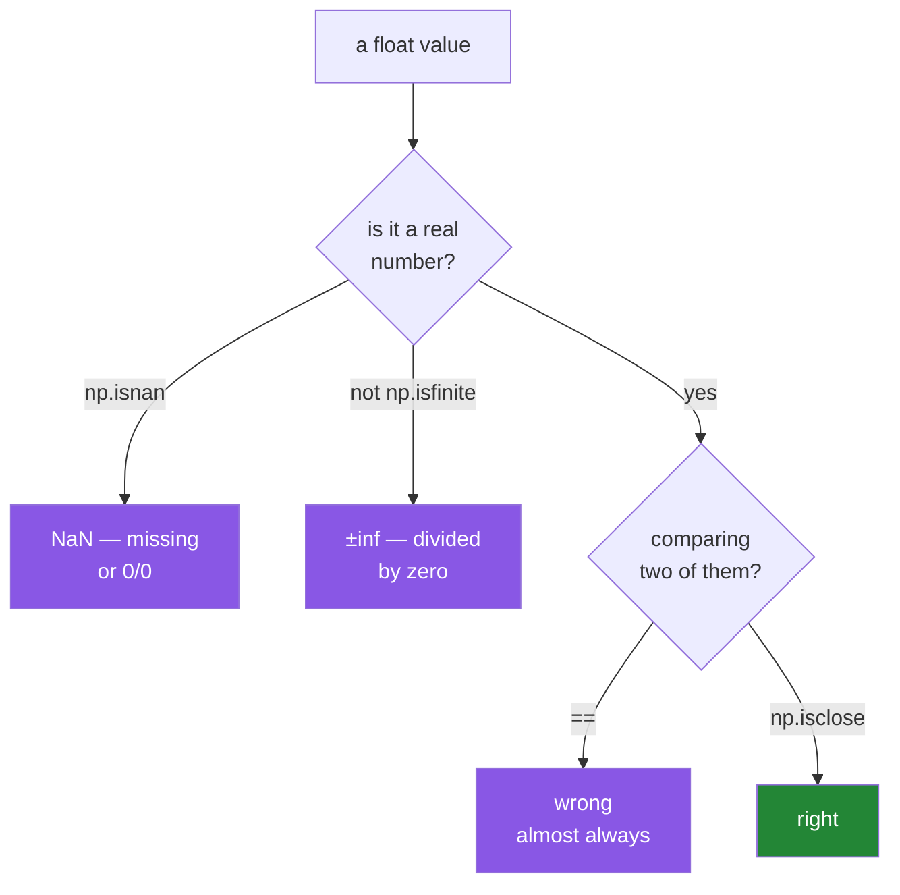

# 2.3 — Floats, `NaN`, and the precision you cannot get back

## One-line answer

A float stores an approximation of a decimal number in a fixed number of bits, `NaN` is the value
that means "there is no number here", and both facts mean you compare floats with `np.isclose` and
you count missing values before you average anything.

---

## The story

Somebody adds a column to the step-count note: how far they walked, in kilometres.

They work it out from the steps, and they write the numbers down as the phone gives them: 6.16,
7.83, 4.64, and so on. Sensible numbers with two decimal places.

Then Thursday. The phone was on the charger, so there is nothing to convert. They cannot write 0,
because zero kilometres would be a claim — it would say the person stayed still all day, which is
not what happened. Nobody knows what happened. The phone was in the kitchen.

So they leave the cell blank.

Now the trouble starts, and it is entirely ordinary. Somebody wants the weekly average. Do you add
up six numbers and divide by six, or add up six and divide by seven? Those give different answers,
and only one of them is right, and which one is right depends on what the blank means.

A blank is not a small number. It is not a zero. It is the absence of a number, and the whole point
of this part is that a column of numbers needs a way to say that out loud.

---

## The idea in plain language

Two separate ideas share this part because they share one dtype. Both are about a float column
holding something other than an exact number.

**First: a float is an approximation, always.**

A `float64` stores a number in 64 bits: one for the sign, eleven for an exponent, and fifty-two for
the digits. That is roughly 15 to 17 decimal digits of precision, and it is a *fixed* budget. Any
number needing more digits than the budget allows is stored as the nearest number that fits.

The famous example is `0.1`. In binary, one tenth is a repeating fraction, exactly as one third is a
repeating decimal. It cannot be written exactly in any finite number of binary digits, so what gets
stored is the closest 64-bit value — which is very slightly more than 0.1. Add it to a similarly
inexact 0.2 and the result is `0.30000000000000004`, not `0.3`.

Floats behave this way because of the *IEEE Standard for Floating-Point Arithmetic* (IEEE 754-2019,
DOI 10.1109/IEEESTD.2019.8766229), which fixes how a fraction is stored in binary — and one tenth is
not one of the fractions binary can store exactly. This is not a NumPy quirk and not a Python quirk.
It is arithmetic on every processor you will ever use.

The consequence is a rule with no exceptions: **never compare floats with `==`**. Compare with
`np.isclose` for a pair, or `np.allclose` for two arrays, both of which ask "are these within a
tolerance" instead of "are these bit-identical".

**Second: `NaN` is a float that means "no number".**

`NaN` stands for *not a number*, and it is a genuine value of a float dtype — a specific bit pattern
that IEEE 754 reserves for the answer to questions like `0.0 / 0.0`. NumPy spells it `np.nan`.

It has one property that surprises everybody exactly once: **`NaN` is not equal to itself.**
`np.nan == np.nan` is `False`. That is deliberate. `NaN` means "unknown", and two unknowns are not
known to be equal. So you cannot find missing values with `arr == np.nan`; you use `np.isnan(arr)`,
which asks about the bit pattern rather than about equality.

The second property is that **`NaN` spreads**. Any arithmetic involving a `NaN` produces a `NaN`, so
one missing value in seven turns `arr.mean()` into `nan`. That is a feature: an average that quietly
ignored a hole would be a lie, and the `nan` is the array telling you a decision is required. The
functions that make the decision for you are the `nan`-prefixed ones — `np.nanmean`, `np.nansum`,
`np.nanstd` — which skip the holes.

Two things `NaN` is *not*, because both confusions are common:

- **`NaN` is not infinity.** `np.inf` is what `1.0 / 0.0` gives, and it is an ordinary orderable
  value: `np.inf > 5` is `True`. `np.isfinite` catches both `NaN` and infinities; `np.isnan` catches
  only `NaN`.
- **`NaN` cannot live in an integer array.** There is no bit pattern for it in `int64`. A column of
  counts with a hole in it **must** be float, or must carry a separate mask. This is the single most
  common reason a count column arrives as `float64` when you expected integers.

---

## Why Setu needs it

- **Day 26 meets pandas, whose whole missing-data story is built on `NaN`** — and whose newer
  nullable integer dtypes exist precisely because of the "`NaN` cannot live in an integer array"
  problem above.
- **Day 44's imputer replaces missing values**, and Principle 8 says the split comes before the
  imputer. You cannot reason about that until you can count the holes.
- **Every test in Phase 3 onwards compares floats**, and every one of them uses
  `np.testing.assert_allclose` rather than `==`. A test that compares computed floats with `==`
  passes on your machine and fails on the CI runner.
- **Day 155's embeddings are `float32`.** Knowing that `float32` carries about 7 decimal digits, not
  16, is what stops you chasing a "bug" that is just the dtype.

---

## The mechanism

The three float widths, read from NumPy:

```python
import numpy as np

for name in ["float16", "float32", "float64"]:
    info = np.finfo(np.dtype(name))
    print(
        f"{name:<8} {info.bits:>3} bits  max={info.max:<12.4g} "
        f"eps={info.eps:<12.4g} digits~{info.precision}"
    )
```

**Line by line:**

- `np.finfo` — **f**loat info, the counterpart of `np.iinfo` from
  [2.2](2.2-integers-and-the-silent-wrap.md). Calling `finfo` on an integer dtype raises, which is
  the same useful accident in reverse.
- `info.eps` — **machine epsilon**: the smallest number you can add to 1.0 and get something other
  than 1.0. It is the practical measure of "how fine is the grid this dtype can represent", and it is
  the number to reach for when choosing a comparison tolerance.
- `info.precision` — how many decimal digits are reliable. Six for `float32`, fifteen for `float64`.
- `{info.max:<12.4g}` — the `g` format picks scientific notation for very large numbers
  ([Day 7, 3.2](../../../day-07-strings/parts/03-formatting/3.2-the-format-spec.md)), which is the
  only readable way to print 1.8 × 10³⁰⁸.

```text
float16   16 bits  max=6.55e+04     eps=0.0009766    digits~3
float32   32 bits  max=3.403e+38    eps=1.192e-07    digits~6
float64   64 bits  max=1.798e+308   eps=2.22e-16     digits~15
```

Now the week with a hole in it:

```python
import numpy as np

steps = np.array([8213, 10442, 6180, np.nan, 12007, 9631, 7204])

print("with a gap   :", steps)
print("dtype        :", steps.dtype)
print("steps.mean() :", steps.mean())
print("np.nanmean   :", np.nanmean(steps))
print("np.isnan     :", np.isnan(steps))
print("nan == nan   :", np.nan == np.nan)
print("count real   :", np.count_nonzero(~np.isnan(steps)))
print("all finite   :", np.isfinite(steps).all())
```

**Line by line:**

- `np.nan` in a list of integers — **the dtype becomes `float64` automatically**, because there is no
  `NaN` in `int64`. Note the printed values now have trailing dots: `8213.` rather than `8213`. That
  dot is the array telling you the column changed type.
- `steps.mean()` — `nan`. Six real values and one hole, and the answer is the hole. This is correct
  behaviour, not a bug: NumPy is refusing to guess what the missing Thursday should count as.
- `np.nanmean(steps)` — `8946.17`, which is the six real values divided by six. **You have now made
  a decision**: Thursday is excluded rather than treated as zero. If Thursday should count as zero,
  the right code is `np.nan_to_num(steps).mean()`, which gives a different and equally defensible
  answer. The point is that the code says which one you meant.
- `np.isnan(steps)` — a boolean array, one `True` per hole. This is how you find them, and it is the
  foundation of every masking operation on
  [Day 21, 3.1](../../../day-21-indexing-and-views/parts/03-boolean-masks/3.1-a-comparison-makes-an-array.md).
- `np.nan == np.nan` — `False`. Read that line twice. It is why `arr == np.nan` finds nothing at all
  and silently returns an all-`False` mask instead of an error.
- `np.count_nonzero(~np.isnan(steps))` — `~` is elementwise "not"
  ([Day 5, 1.5](../../../day-05-operators-and-conditionals/parts/01-operators/1.5-bitwise-and-the-mask.md)),
  so this counts the values that are real. **Print this number before you trust any average.**
- `np.isfinite(steps).all()` — catches `NaN` *and* infinities in one check, which is the one-line
  data sanity test worth putting at every boundary.

```text
with a gap   : [ 8213. 10442.  6180.    nan 12007.  9631.  7204.]
dtype        : float64
steps.mean() : nan
np.nanmean   : 8946.166666666666
np.isnan     : [False False False  True False False False]
nan == nan   : False
count real   : 6
all finite   : False
```

And the comparison rule:

```python
import numpy as np

print("0.1 + 0.2   :", 0.1 + 0.2)
print("== 0.3      :", 0.1 + 0.2 == 0.3)
print("np.isclose  :", np.isclose(0.1 + 0.2, 0.3))
print("np.allclose :", np.allclose([0.1 + 0.2], [0.3]))
```

**Line by line:**

- `0.1 + 0.2` prints `0.30000000000000004` — seventeen digits, the last of which is the error. Python
  prints the shortest string that round-trips back to the same 64-bit value, so those extra digits
  are not a display artefact. They are in the number.
- `== 0.3` — `False`, and this is the line that breaks tests.
- `np.isclose(a, b)` — `True` within a relative tolerance of 1e-5 and an absolute tolerance of 1e-8
  by default. **Those defaults are generous**, and for a test you should state them:
  `np.isclose(a, b, rtol=1e-9)`.
- `np.allclose(a, b)` — the same question reduced to one answer for whole arrays. For tests,
  `np.testing.assert_allclose` is better still, because when it fails it prints which elements
  differ and by how much.

```text
0.1 + 0.2   : 0.30000000000000004
== 0.3      : False
np.isclose  : True
np.allclose : True
```

Which check to reach for:



---

## When it breaks

**Looking for `NaN` with `==`:**

```text
$ uv run python -c "
import numpy as np
steps = np.array([8213.0, np.nan, 6180.0])
print('arr == np.nan :', steps == np.nan)
print('np.isnan      :', np.isnan(steps))
"
arr == np.nan : [False False False]
np.isnan      : [False  True False]
```

**What it means.** No error. An all-`False` mask, which means a filter written this way silently
keeps everything and a "drop the missing rows" step silently drops nothing. This is the most
expensive `NaN` mistake there is, precisely because it produces no symptom until the numbers are
wrong somewhere else. **`np.isnan` is the only correct test.**

**Dividing by zero, twice, two different answers:**

```text
$ uv run python -c "
import numpy as np
print('1/0 :', np.array([1.0]) / np.array([0.0]))
print('0/0 :', np.array([0.0]) / np.array([0.0]))
" 2>&1
<string>:3: RuntimeWarning: divide by zero encountered in divide
<string>:4: RuntimeWarning: invalid value encountered in divide
1/0 : [inf]
0/0 : [nan]
```

**What it means.** Float division by zero does not raise `ZeroDivisionError` the way Python's does
([Day 5, 1.2](../../../day-05-operators-and-conditionals/parts/01-operators/1.2-the-two-divisions.md)).
It warns once and produces `inf` or `nan`, and the program continues. Two different results for two
different questions: one over zero has a sign and a magnitude that runs away, zero over zero has no
answer at all. Both then spread through everything downstream. To make these fatal during
development, use `np.seterr(divide="raise", invalid="raise")`.

**`float32` running out of digits:**

```text
$ uv run python -c "
import numpy as np
print('float32 16777216 + 1:', np.float32(16_777_216) + np.float32(1))
print('float64 16777216 + 1:', np.float64(16_777_216) + np.float64(1))
print('2**24               :', 2**24)
"
float32 16777216 + 1: 1.6777216e+07
float64 16777216 + 1: 16777217.0
2**24               : 16777216
```

**What it means.** `float32` has 24 bits of significand, so above 2²⁴ = 16 777 216 the gap between
representable numbers is larger than 1 and adding one changes nothing at all. No warning. A counter
stored as `float32` simply stops counting at 16.7 million, which is a real failure mode for anything
tracking events over a long period. The lesson generalises: **a float dtype has a range where it can
no longer represent consecutive whole numbers**, and `float64` hits the same wall at 2⁵³.

**A test that passes locally and fails in CI:**

```text
$ uv run python -c "
import numpy as np
computed = np.array([0.1, 0.2]).sum()
print('computed  :', repr(computed))
print('== 0.3    :', computed == 0.3)
print('isclose   :', np.isclose(computed, 0.3))
"
computed  : np.float64(0.30000000000000004)
== 0.3    : False
isclose   : True
```

**What it means.** The summation order NumPy uses can differ between machines, between array sizes
and between NumPy builds, because pairwise summation splits the work differently. So `== 0.3` is not
merely wrong here — it is *unpredictably* wrong, passing on one machine and failing on another. Every
float assertion in this project uses `np.testing.assert_allclose`, and the eval this day ends with
([5.2](../05-the-module/5.2-the-test-that-can-go-red.md)) is the first place it is compulsory — the
test that can go RED from
[Day 2, 3.1](../../../day-02-quality-gate/parts/03-pytest/3.1-the-test-that-can-go-red.md), now with
a tolerance on it.

---

## In production

**What a professional writes instead of the teaching version.** They never let a `NaN` travel
silently. Missing values are counted, reported and then handled by an explicit decision, at a
boundary, once:

```python
import numpy as np


def clean_distances(km: np.ndarray, *, max_km: float = 100.0) -> tuple[np.ndarray, int]:
    """Return the usable values and how many were dropped, so the caller can log both."""
    if km.dtype.kind != "f":
        raise TypeError(f"expected a float array, got {km.dtype}")
    usable = np.isfinite(km) & (km >= 0) & (km <= max_km)
    return km[usable], int((~usable).sum())
```

**Line by line:**

- `*, max_km: float = 100.0` — keyword-only with a default
  ([Day 10, 1.5](../../../day-10-functions/parts/01-the-signature/1.5-keyword-only-and-positional-only.md)),
  so a caller cannot pass it by accident and every call site that does pass it reads as
  `max_km=200.0`.
- `km.dtype.kind != "f"` — the family check from [2.1](2.1-a-dtype-is-a-promise.md). An integer array
  cannot hold `NaN`, so being handed one means the caller's assumption is already wrong, and
  `TypeError` says so at the door.
- `np.isfinite(km)` — catches `NaN` **and** `±inf` in one call. Using `~np.isnan(km)` here would let
  an infinity through, and an infinity in a mean is just as destructive.
- `& (km >= 0) & (km <= max_km)` — the domain rules alongside the finiteness rule, combined with `&`
  rather than `and`, because `and` on two arrays raises
  ([Day 21, 3.3](../../../day-21-indexing-and-views/parts/03-boolean-masks/3.3-and-or-not-and-why-and-raises.md)).
- `return km[usable], int((~usable).sum())` — **the count is returned, not discarded.** A cleaner
  that silently drops rows is how a pipeline loses 40% of its data without anybody noticing; a
  cleaner that hands back the number gives the caller something to log and something to alert on.
- `int(...)` — converts the `np.int64` to a plain Python `int`, because the count is going into a log
  line or a JSON payload and `np.int64` is not JSON-serialisable.

**What changes at scale.** Three things. First, `np.isnan` over a 4 GB array is a full memory scan
producing a 500 MB boolean array, so it belongs at boundaries and not inside loops. Second, choosing
`float32` halves memory and is correct for almost all machine-learning work — but it also halves your
digits, and a sum of ten million `float32` values accumulates visible error unless you pass
`dtype=np.float64` to the reduction. Third, `NaN` handling stops being a detail and becomes a policy:
which columns may have holes, what a hole means for each, and who is told when the rate changes.
That policy belongs in a data contract, not scattered through the code.

**The failure that only appears with real data.** A model trains fine for weeks and then produces
`nan` for every prediction. One `NaN` entered through a feature that is a ratio, on the day a
denominator was zero for the first time. It propagated through the gradients, and by the end of a
single batch every weight in the network was `nan`. The traceback points nowhere useful, because
nothing raised. The defence is an assertion at the boundary — `assert np.isfinite(features).all()` —
which costs a scan and saves a day.

**The review comment a senior engineer leaves.** *"`assert result == expected` on a float will pass
on your laptop and fail on the runner, because pairwise summation splits differently for different
array sizes. Use `np.testing.assert_allclose(result, expected, rtol=1e-9)` and state the tolerance
you actually need."*

**The interview question.** *"Why is `0.1 + 0.2 != 0.3`, and what do you do about it?"* Because IEEE
754 stores numbers in binary with a fixed budget of bits, and one tenth is a repeating fraction in
binary, so what is stored is the nearest representable value. The errors are tiny and they
accumulate. In practice you never compare floats with `==`; you use a tolerance, and you state it
rather than accepting a default. The follow-up is usually about `NaN`: it is not equal to itself, so
you find it with `np.isnan` rather than `==`, it propagates through arithmetic on purpose, and it
cannot exist in an integer array — which is why a count column with holes in it arrives as `float64`.

---

## Check yourself

```bash
uv run python -c "
import numpy as np
steps = np.array([8213, 10442, 6180, np.nan, 12007, 9631, 7204])
print('dtype     :', steps.dtype)
print('mean      :', steps.mean())
print('nanmean   :', np.nanmean(steps))
print('==nan mask:', (steps == np.nan).sum(), 'found')
print('isnan mask:', np.isnan(steps).sum(), 'found')
"
```

The last two lines look like they ask the same question. They do not.

**Answer out loud, without scrolling up:**

> Why does adding one `np.nan` to a list of integers change the array's dtype? Then say what
> `arr == np.nan` returns and why that is worse than an error.

---

**Next:** [2.4 — `astype`, and the copy it always makes](2.4-astype-and-the-copy.md).
