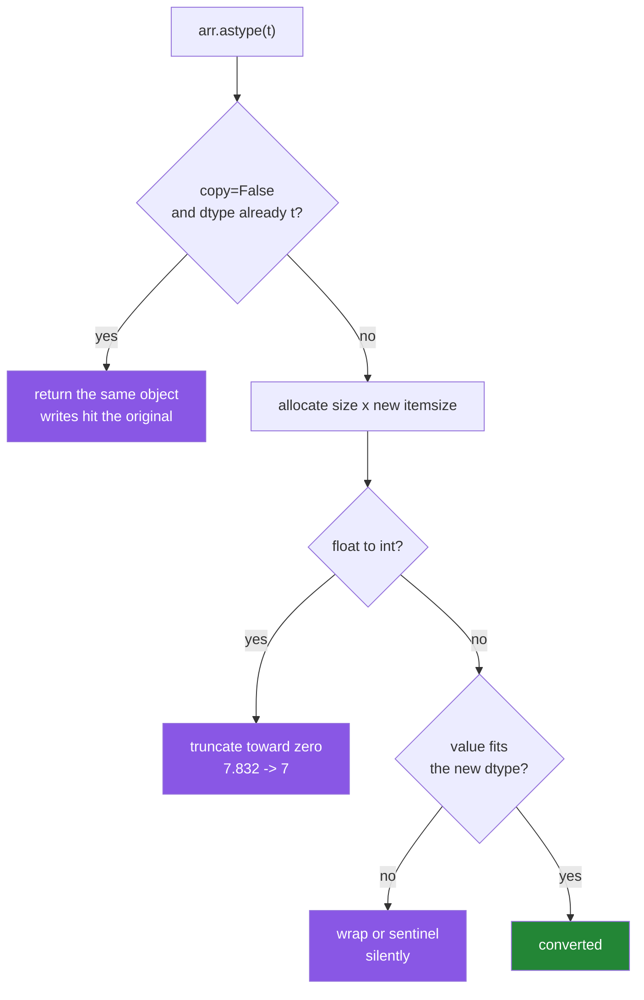

# 2.4 — `astype` — changing the promise, and the copy it makes

## One-line answer

`arr.astype(dtype)` builds **a whole new array** with the same values in a different type, it
**truncates rather than rounds** when going from float to integer, and by default it copies even
when the dtype is unchanged.

---

## The story

The step counts are written in a notebook in pen. Somebody wants them in kilometres instead.

They cannot change what is on the page. Pen does not lift. So they take a fresh sheet, work down the
column, convert each number, and write the result next to it. Two sheets now exist, both correct,
both taking up room in the drawer.

Halfway down they hit a decision nobody warned them about. 7.832 kilometres. The new column is
supposed to be whole kilometres. Do they write 7 or 8?

They write 7, because they are working left to right and they simply stop at the decimal point. It
is not a decision so much as a habit. Nobody notices, and the total at the bottom of the new sheet
comes out short by four kilometres over the week.

The second sheet is the copy. The 7 instead of the 8 is the truncation. Both are in this part, and
the second one is the one that costs money.

---

## The idea in plain language

`astype` is the method that changes an array's dtype. `week.astype(np.float64)` reads every value,
converts it, and puts the results in a **new block of memory**. The original is untouched.

Three facts, and the whole part is these three.

**It copies by default.** Even `week.astype(np.int64)` on an array that is already `int64` allocates
a fresh block and copies the bytes. That is deliberate — a method that sometimes returns a view and
sometimes a copy would be a permanent source of bugs
([Day 21, 2.1](../../../day-21-indexing-and-views/parts/02-the-view-trap/2.1-a-slice-does-not-copy.md)
is why). If you genuinely want "convert only if needed", pass `copy=False`, and then you get the
original object back when the dtype already matches. Be careful with that: the result then *might*
be the same array, so writing to it might change the original.

**Float to integer truncates towards zero.** `7.832` becomes `7`; `-7.832` becomes `-7`. This is
not rounding, it is dropping everything after the point. If you want rounding, say so:
`np.rint(x).astype(np.int64)`. `np.rint` rounds half to even — 0.5 goes to 0 and 1.5 goes to 2 —
which is the IEEE 754 default and what almost every numeric library does, precisely because always
rounding halves upward introduces a bias.

**It does not check whether the values fit.** `astype` is a *cast*, and a cast does what you told it
to. Values that do not fit the new dtype wrap, exactly as in
[2.2](2.2-integers-and-the-silent-wrap.md), or become a garbage sentinel. There is a safety
mechanism — the `casting=` argument — and it is off by default.

The `casting=` values, in the order you will use them:

| `casting=` | Allows |
|---|---|
| `"no"` | nothing; the dtype must already match |
| `"equiv"` | only a byte-order change |
| `"safe"` | only conversions that cannot lose information (`int32` → `int64`, `int32` → `float64`) |
| `"same_kind"` | safe casts, plus narrowing within one family (`int64` → `int32`, `float64` → `float32`) |
| `"unsafe"` | anything at all — **the default for `astype`** |

`np.can_cast(from, to)` answers the same question without doing the work, and it is what you call
when you want to *decide* rather than *attempt*.

One naming note that trips people up. `arr.astype(t)` always copies; `np.asarray(x, dtype=t)` copies
only if it has to. When you are converting an input you did not create, `np.asarray` is usually the
right call, because handing it something that is already the right array is free.

---

## Why Setu needs it

- **Day 130's images arrive as `uint8` and must become `float32` before training.** That single
  `astype` is the most-executed line in the whole vision pipeline, and it multiplies memory by four.
- **Day 44's scaler outputs `float64` from integer features**, and Principle 8's leakage rule means
  the cast happens after the split, not before.
- **Day 155's embeddings are `float32`**, and a careless `astype(np.float64)` on the way into a
  vector store doubles the index for no benefit.
- **Day 27 reads typed columns**, and every "this CSV column is really an integer" fix is either a
  `dtype=` at read time or an `astype` immediately after.

---

## The mechanism

Convert the week to kilometres and back, and watch the truncation.

```python
import numpy as np

steps = np.array([8213, 10442, 6180, 0, 12007, 9631, 7204])
km = steps.astype(np.float64) * 0.00075

print("km            :", np.round(km, 3))
print("km.dtype      :", km.dtype)
print("km.astype(int):", km.astype(np.int64), "  <- truncated")
print("np.rint then  :", np.rint(km).astype(np.int64), "  <- rounded")
```

**Line by line:**

- `steps.astype(np.float64)` — a new 56-byte block holding the same seven values as decimals. The
  cast comes **before** the multiply on purpose: `steps * 0.00075` would work too, because NumPy
  promotes for the multiply, but writing the cast makes the type change visible at the point it
  happens rather than hidden inside an operator.
- `* 0.00075` — roughly a metre and a third per step, which is an ordinary stride.
- `np.round(km, 3)` — for display only. Rounding for printing and rounding for storage are different
  acts, and mixing them up is how a display decision becomes a data decision.
- `km.astype(np.int64)` — the truncation. `7.832` becomes `7`.
- `np.rint(km).astype(np.int64)` — round first, then cast. `7.832` becomes `8`. **Two lines, two
  different answers, and neither one warns you about the other.**

```text
km            : [6.16  7.832 4.635 0.    9.005 7.223 5.403]
km.dtype      : float64
km.astype(int): [6 7 4 0 9 7 5]   <- truncated
np.rint then  : [6 8 5 0 9 7 5]   <- rounded
```

Two of the seven differ. Over a week that is two kilometres; over a year of a real pipeline it is a
systematic downward bias, which is worse than a random error because it never cancels out.

Now the copying:

```python
import numpy as np

steps = np.array([8213, 10442, 6180, 0, 12007, 9631, 7204])

print("shares memory :", np.shares_memory(steps, steps.astype(np.int64)))
print("copy=False    :", steps.astype(np.int64, copy=False) is steps)
print("copy=False fp :", steps.astype(np.float64, copy=False) is steps)
print("nbytes before :", steps.nbytes, " after float64:", steps.astype(np.float64).nbytes)
```

**Line by line:**

- `np.shares_memory(a, b)` — does any byte of `a` overlap any byte of `b`? `False` here, so
  `astype(np.int64)` on an `int64` array genuinely allocated and copied 56 bytes it did not need to.
- `steps.astype(np.int64, copy=False) is steps` — `True`. With `copy=False` and a matching dtype you
  get the *same object* back, not a copy. **That means writing to the result writes to the
  original**, which is exactly the trap `copy=True` exists to avoid.
- `steps.astype(np.float64, copy=False) is steps` — `False`. The dtype differs, so a copy is
  unavoidable and `copy=False` was simply ignored. `copy=False` is a permission, not an instruction.
- The two `nbytes` are both 56 here, because `int64` and `float64` are both 8 bytes. Try it with
  `np.float32` and the second number halves — the memory arithmetic of a cast is always
  `size × new itemsize`.

```text
shares memory : False
copy=False    : True
copy=False fp : False
nbytes before : 56  after float64: 56
```

And the safety mechanism that is off by default:

```python
import numpy as np

steps = np.array([8213, 10442, 6180, 0, 12007, 9631, 7204])
km = steps * 0.00075

for label, source, target in [
    ("int64 -> int8   ", steps, np.int8),
    ("float64 -> int64", km, np.int64),
]:
    try:
        source.astype(target, casting="safe")
        print(f"{label}: allowed")
    except TypeError as error:
        print(f"{label}: refused - {error}")

print("can_cast i64->f64 :", np.can_cast(np.int64, np.float64))
print("can_cast i64->i32 :", np.can_cast(np.int64, np.int32))
print("can_cast i32->i64 :", np.can_cast(np.int32, np.int64))
```

**Line by line:**

- `casting="safe"` — refuse anything that could lose information. This is what you want on the
  boundary of a pipeline, where a narrowing cast is a bug rather than an optimisation.
- `except TypeError as error` — `astype` raises `TypeError` for a casting-rule violation, not
  `ValueError`, because the complaint is about types
  ([Day 18, 2.2](../../../day-18-exceptions/parts/02-the-hierarchy/2.2-which-built-in-to-raise.md)).
- `np.can_cast(np.int64, np.float64)` — `True`, which is worth a second look. `float64` cannot hold
  every `int64` exactly above 2⁵³, but NumPy's casting table calls it safe anyway, because the
  *range* is covered even where the *precision* is not. **"Safe" means no overflow, not no rounding.**
- `np.can_cast(np.int64, np.int32)` — `False`, and `np.can_cast(np.int32, np.int64)` — `True`.
  Widening is safe, narrowing is not, and the direction is the whole rule.

```text
int64 -> int8   : refused - Cannot cast array data from dtype('int64') to dtype('int8') according to the rule 'safe'
float64 -> int64: refused - Cannot cast array data from dtype('float64') to dtype('int64') according to the rule 'safe'
can_cast i64->f64 : True
can_cast i64->i32 : False
can_cast i32->i64 : True
```

The decision `astype` makes:



Three purple boxes on one method. That is why this part exists.

---

## When it breaks

**`NaN` cast to an integer:**

```text
$ uv run python -c "
import numpy as np
holes = np.array([8213.0, np.nan, 6180.0])
print(holes.astype(np.int64))
" 2>&1
<string>:4: RuntimeWarning: invalid value encountered in cast
[                8213 -9223372036854775808                 6180]
```

**What it means.** There is no `NaN` in `int64`
([2.3](2.3-floats-nan-and-precision.md)), so the cast produces the most negative `int64` there is.
The warning goes to stderr and the program continues with a value that is nine quintillion below
zero sitting in the middle of a step-count column. Any sum, mean or maximum computed after this is
nonsense. **Handle the holes before you narrow the dtype**, never after.

**Text that will not parse:**

```text
$ uv run python -c "
import numpy as np
np.array(['8213', 'rest']).astype(np.int64)
" 2>&1 | tail -2
ValueError: invalid literal for int() with base 10: np.str_('rest')
```

**What it means.** This is the good failure — it names the value that broke. Note the `np.str_(...)`
wrapper: the element came out of a NumPy text array, so it is a NumPy string scalar rather than a
Python `str`. That is cosmetic here, and it is the same message Python's own `int()` gives.

**A narrowing cast that wraps, with no warning at all:**

```text
$ uv run python -c "
import numpy as np
big = np.array([100, 200, 300, 40000], dtype=np.int64)
print('as int16:', big.astype(np.int16))
print('as uint8:', big.astype(np.uint8))
"
as int16: [   100    200    300 -25536]
as uint8: [100 200  44  64]
```

**What it means.** Nothing raised, nothing warned. `40000` in `int16` is `-25536`, and in `uint8`
both `300` and `40000` are unrecognisable. This is the odometer from
[2.2](2.2-integers-and-the-silent-wrap.md), reached through `astype` instead of through arithmetic.
`astype` defaults to `casting="unsafe"` precisely so that deliberate narrowing works without
ceremony — which means the ceremony is yours to add. Either pass `casting="same_kind"` and let it
refuse the impossible, or check the range with `np.iinfo` first.

**`copy=False` handing back the original:**

```text
$ uv run python -c "
import numpy as np
original = np.array([8213, 10442, 6180])
same = original.astype(np.int64, copy=False)
same[0] = 0
print('same     :', same)
print('original :', original)
print('is       :', same is original)
"
same     : [    0 10442  6180]
original : [    0 10442  6180]
is       : True
```

**What it means.** `copy=False` said "do not copy if you do not have to", the dtype already matched,
so nothing was copied and `same` **is** `original`. Writing to one wrote to both. This is a
perfectly reasonable optimisation that becomes a bug the moment a function uses `copy=False` and
then modifies the result, because the caller's array changes underneath them. The rule is: use
`copy=False` when you are only going to read, and never when you are going to write.

---

## In production

**What a professional writes instead of the teaching version.** They separate the three decisions —
round or truncate, does it fit, and do I need a copy — instead of letting one `astype` make all
three silently:

```python
import numpy as np


def to_whole_km(km: np.ndarray, *, dtype: np.dtype = np.dtype(np.int32)) -> np.ndarray:
    """Round distances to whole kilometres, refusing values the target dtype cannot hold."""
    if not np.isfinite(km).all():
        raise ValueError(f"{np.count_nonzero(~np.isfinite(km))} non-finite values in input")
    rounded = np.rint(km)
    limits = np.iinfo(dtype)
    if rounded.min() < limits.min or rounded.max() > limits.max:
        raise ValueError(f"rounded values span {rounded.min()}..{rounded.max()}, outside {dtype}")
    return rounded.astype(dtype)
```

**Line by line:**

- `np.isfinite(km).all()` — the `NaN` and infinity check happens **first**, because both of them
  produce sentinel garbage rather than an error when cast, and the error message here is far more
  useful than `-9223372036854775808` appearing in a report.
- `np.count_nonzero(~np.isfinite(km))` — the message says *how many*, so the caller knows whether
  this is one bad row or a broken upstream feed.
- `np.rint(km)` — the rounding decision, on its own line, where a reader can see it and disagree with
  it. Truncation hidden inside an `astype` is a decision nobody made.
- `limits = np.iinfo(dtype)` and the range check — the "does it fit" decision, also on its own line,
  and driven by the dtype so it stays correct if the default changes.
- `rounded.astype(dtype)` — the cast, reached only when both other decisions have been made and both
  passed. By this point the cast cannot surprise anybody.
- `dtype: np.dtype = np.dtype(np.int32)` — a real `np.dtype` object as the default rather than the
  `np.int32` class, so `np.iinfo(dtype)` and the f-string both behave predictably.

**What changes at scale.** `astype` is one of the few NumPy operations that is *always* O(n) in both
time and memory, so at scale it stops being free. Casting a 4 GB `float64` array to `float32`
briefly needs 6 GB, because the source and the destination both exist while the copy runs. On a
machine with 8 GB that is the difference between working and being killed. The mitigations are real
engineering: cast in chunks, cast at read time so the wide version never exists, or use
`np.ndarray.view` when you genuinely want to reinterpret the same bytes rather than convert them.

There is a second scale effect that catches machine-learning work specifically. Casting `uint8`
images to `float32` multiplies memory by four, and doing it for the whole dataset up front is the
default in every tutorial. In production it is done per batch, inside the data loader, so only the
batch is ever wide.

**The failure that only appears with real data.** A feature pipeline casts a count column to `int32`
to save space. It runs for a year. Then one account generates 2.4 billion events in a month, the
value wraps to a negative number, and the model — which has never seen a negative count — produces a
confident nonsense prediction rather than an error. Nothing in the logs mentions a cast.

**The review comment a senior engineer leaves.** *"`predictions.astype(int)` here truncates, so 0.99
becomes 0. If you want the nearest whole number, use `np.rint(...).astype(...)`, and if these are
class labels you should be using `argmax` rather than casting a probability at all."*

**The interview question.** *"What does `astype` do that `np.asarray` does not?"* `astype` always
allocates a new array and copies, unless you pass `copy=False` and the dtype already matches;
`np.asarray` copies only when it must. The follow-up that separates the careful from the casual:
*"what happens casting `float64` to `int64`?"* It truncates towards zero, it does not round, and it
does not check that the value fits — `NaN` becomes the most negative `int64` with only a
`RuntimeWarning`. The professional answer names the fix: round explicitly with `np.rint`, check
finiteness first, and pass `casting="same_kind"` at boundaries where a narrowing cast would be a
bug.

---

## Check yourself

```bash
uv run python -c "
import numpy as np
km = np.array([6.16, 7.832, 4.635, 0.0, 9.005])
print('truncated:', km.astype(np.int64))
print('rounded  :', np.rint(km).astype(np.int64))
print('copied?  :', np.shares_memory(km, km.astype(np.float64)))
print('same obj?:', km.astype(np.float64, copy=False) is km)
"
```

Lines one and two differ on two of five values. Say which two, and why, before you look.

**Answer out loud, without scrolling up:**

> `arr.astype(np.int64)` on `[7.832]` gives `7`. Say what to write instead if you wanted `8`, and
> name the one situation in which `astype` does not copy.

---

**Next:** [2.5 — NEP 50: what a Python number does to an array's dtype](2.5-nep-50-and-the-python-number.md).
