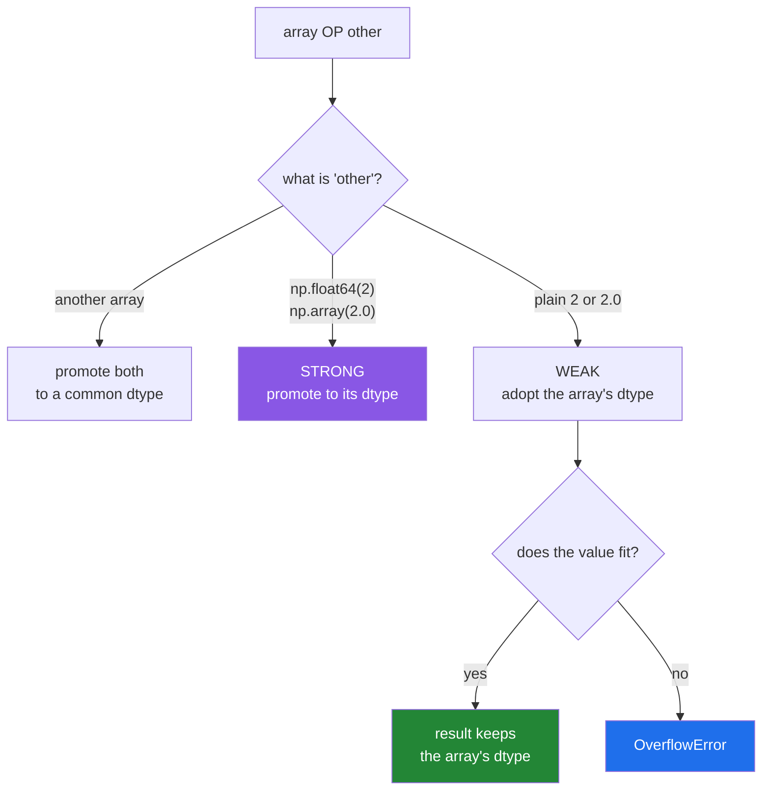

# 2.5 — NEP 50 — what a plain Python number does to an array's dtype

## One-line answer

Since NumPy 2.0, a plain Python number in an expression **takes the dtype of the array it meets**
rather than pushing the array to a wider type — so `float32_array * 2.0` stays `float32`, and
`int8_array + 1000` raises instead of quietly becoming `int64`.

---

## The story

Two people are filling in the same paper form together.

The form has boxes ruled for four digits. One of them writes the numbers in; the other reads values
out loud from a list.

The reader says "one thousand". The writer puts 1000 in the box, and it fits.

The reader says "one hundred and twenty thousand". Now there is a decision. Under the old habit, the
writer would quietly fetch a bigger form — one with six-digit boxes — copy everything across, and
carry on. The form has changed size and nobody said so out loud. Every box on it is now wider, and
the folder it lives in no longer closes.

Under the new habit, the writer stops and says: "that will not fit in this form." Then the two of
them decide together — a bigger form on purpose, or a different number.

Nothing about the numbers changed. What changed is who is allowed to silently resize the form.

---

## The idea in plain language

Every time NumPy combines two things in an arithmetic expression, it has to decide what dtype the
answer is. That decision is called **type promotion**.

When both sides are arrays, the rule is uncontroversial and has never changed: pick a dtype that can
hold both. `int32` and `int64` give `int64`; `int32` and `float32` give `float64`.

The argument was always about the other case: an array on one side and a **plain Python number** on
the other. `week * 2`. What should `2` count as?

**The old rule, before NumPy 2.0**, treated the Python `2` as if it were an array of one element,
worked out what dtype that would need, and promoted. It also had a special case called
value-based casting: it looked at the *value*, so `2` counted as a small integer but `1000` counted
as a bigger one, and the result dtype could change depending on how large the literal was. This
produced results people found impossible to predict — most famously, `float32_array + 1.0` came back
as `float64`, silently doubling memory on the most common operation in machine learning.

**The new rule, NEP 50, in NumPy 2.0 and after**, is one sentence: a plain Python `int`, `float`,
`bool` or `complex` is **weak**. It has no dtype of its own and it adopts the array's. So:

- `float32_array * 2.0` → `float32`. The `2.0` becomes a `float32`.
- `int16_array + 1` → `int16`. The `1` becomes an `int16`.
- `int8_array + 1000` → **`OverflowError`**, because `1000` cannot become an `int8`, and NumPy would
  rather say so than silently widen your array.

A NumPy scalar is different. `np.float64(2.0)` is **strong** — it carries a dtype, so
`float32_array * np.float64(2.0)` really does promote to `float64`. That is the escape hatch: when
you want promotion, write it, and the promotion is then visible in the code.

The change is described in *NEP 50 — Promotion rules for Python scalars* (2021,
<https://numpy.org/neps/nep-0050-scalar-promotion.html>), which sets out both the old value-based
behaviour and the replacement. The practical summary is two lines: **the array decides the dtype,
and a literal that does not fit is an error rather than a promotion.**

Why this matters more than it sounds. Under the old rule, a `float32` pipeline could be quietly
converted to `float64` by a single stray `* 1.0`, doubling memory and halving throughput, with
nothing in the code to point at. Under the new rule that cannot happen — and the failure that
replaces it, `OverflowError`, is loud and names the value.

---

## Why Setu needs it

- **Almost every tutorial and answer written before 2024 assumes the old rule.** When code you copy
  behaves differently from what its author described, this is usually why, and knowing the name
  "NEP 50" is what makes it searchable.
- **Day 118's PyTorch tensors are `float32`.** The habit of keeping a pipeline in one float width
  starts here, and NEP 50 is what makes it hold.
- **Day 155's embeddings are `float32` and there are hundreds of thousands of them.** A silent
  promotion to `float64` doubles a vector index; the new rule is the thing that stops it.
- **Principle 4 — never accept a framework default.** NEP 50 turns a silent default into either your
  stated dtype or an error, which is exactly the trade Principle 4 asks for.

---

## The mechanism

Start with the case that used to surprise everybody.

```python
import numpy as np

f32 = np.array([1.5, 2.5], dtype=np.float32)

print("f32.dtype              :", f32.dtype)
print("(f32 * 2.0).dtype      :", (f32 * 2.0).dtype)
print("(f32 * np.float64(2)).dtype:", (f32 * np.float64(2)).dtype)
print("(f32 * np.array(2.0)).dtype:", (f32 * np.array(2.0)).dtype)
```

**Line by line:**

- `f32 * 2.0` — `2.0` is a plain Python float, so it is **weak**: it adopts `float32` and the result
  is `float32`. Under NumPy 1.x this line produced `float64`, and that single difference is the most
  common reason a script behaves differently on 2.x.
- `np.float64(2)` — a NumPy scalar, which is **strong**. It carries `float64`, so the result is
  `float64`. This is how you ask for promotion deliberately.
- `np.array(2.0)` — a zero-dimensional array, also strong, also `float64`. Worth knowing because it
  is what `np.mean(...)` and friends hand back, so a mean multiplied into a `float32` array does
  promote.

```text
f32.dtype              : float32
(f32 * 2.0).dtype      : float32
(f32 * np.float64(2)).dtype: float64
(f32 * np.array(2.0)).dtype: float64
```

Now the integer side, on the week of steps:

```python
import numpy as np

small = np.array([8213, 10442, 6180], dtype=np.int16)

print("small.dtype       :", small.dtype)
print("(small + 1).dtype :", (small + 1).dtype)
print("(small * 2).dtype :", (small * 2).dtype)
print("(small / 2).dtype :", (small / 2).dtype)
print("(small + np.int64(1)).dtype:", (small + np.int64(1)).dtype)
```

**Line by line:**

- `small + 1` — the `1` becomes an `int16`, and the result stays `int16`. **The narrow dtype
  survives**, which is the whole point of choosing it.
- `small * 2` — likewise `int16`. Note this means the overflow risk from
  [2.2](2.2-integers-and-the-silent-wrap.md) is *preserved* by NEP 50, not fixed by it. NEP 50 makes
  the dtype predictable; it does not make narrow arithmetic safe.
- `small / 2` — `float64`. **True division always produces a float**
  ([Day 5, 1.2](../../../day-05-operators-and-conditionals/parts/01-operators/1.2-the-two-divisions.md)),
  and NumPy's default float is `float64` regardless of how narrow the integer input was. This is the
  one place a narrow integer pipeline widens without asking.
- `small + np.int64(1)` — strong scalar, so `int64`. The escape hatch again.

```text
small.dtype       : int16
(small + 1).dtype : int16
(small * 2).dtype : int16
(small / 2).dtype : float64
(small + np.int64(1)).dtype: int64
```

And the new refusal:

```python
import numpy as np

tiny = np.array([100, 27, 1], dtype=np.int8)

print("tiny + 1  :", tiny + 1)
try:
    print("tiny + 1000:", tiny + 1000)
except OverflowError as error:
    print("tiny + 1000: OverflowError -", error)
```

**Line by line:**

- `tiny + 1` — `1` fits in an `int8`, so it becomes one and the result is `int8`. Note `100 + 1 = 101`
  is fine; the *result* overflowing is a separate question that NEP 50 does not police.
- `tiny + 1000` — `1000` does not fit in an `int8`. Under the old rule the array would have been
  promoted to something wider. Under NEP 50 this is an `OverflowError`, and the message names both
  the value and the dtype.
- `except OverflowError` — the specific class, not a bare `except`
  ([Day 18, 1.4](../../../day-18-exceptions/parts/01-raising-and-catching/1.4-the-bare-except.md)).
  `OverflowError` is a built-in, and catching it here is only for the demonstration; in real code you
  would fix the dtype rather than catch this.

```text
tiny + 1  : [101  28   2]
tiny + 1000: OverflowError - Python integer 1000 out of bounds for int8
```

The decision, as a diagram:



The blue box is an error, and it is the good outcome. The old rule had no blue box, which is why
memory used to double without anybody noticing.

---

## When it breaks

**The `OverflowError` in full:**

```text
$ uv run python -c "
import numpy as np
counts = np.array([1, 2, 3], dtype=np.int8)
print(counts + 1000)
" 2>&1 | tail -2
OverflowError: Python integer 1000 out of bounds for int8
```

**What it means.** The literal `1000` cannot be represented as an `int8`, and NumPy refuses to widen
your array behind your back. The two fixes are both one word: widen the array on purpose
(`counts.astype(np.int32) + 1000`) or make the scalar strong
(`counts + np.int32(1000)`, which promotes the result to `int32`). Which one is right depends on
whether you wanted the *column* to be wider or only this *expression*.

**Old code that assumed the old rule:**

```text
$ uv run python -c "
import numpy as np
embeddings = np.zeros((3, 4), dtype=np.float32)
scaled = embeddings * 1.0
print('dtype :', scaled.dtype)
print('nbytes:', scaled.nbytes, 'vs', embeddings.nbytes)
"
dtype : float32
nbytes: 48 vs 48
```

**What it means.** On NumPy 1.x this printed `float64` and `96 vs 48` — the array silently doubled.
Plenty of code was written *against* that behaviour: someone noticed their pipeline was `float64`,
assumed it was meant to be, and wrote downstream code that depends on the extra precision. That code
now behaves differently. **The symptom is not an error; it is slightly different numbers**, which is
the hardest kind of change to track down. If a numerical result moved when you upgraded, NEP 50 is
the first thing to check.

**A NumPy scalar hiding inside an expression:**

```text
$ uv run python -c "
import numpy as np
f32 = np.arange(6, dtype=np.float32)
print('minus a python float :', (f32 - 2.5).dtype)
print('minus its own mean   :', (f32 - f32.mean()).dtype)
print('type of f32.mean()   :', type(f32.mean()))
"
minus a python float : float32
minus its own mean   : float32
type of f32.mean()   : <class 'numpy.float32'>
```

**What it means.** `f32.mean()` returns a **`np.float32`** scalar, not a Python float, so subtracting
it keeps `float32`. That is the desirable outcome and it is worth knowing *why*: the mean of a
`float32` array is computed as `float32`, so the strong scalar it hands back carries the same width.
Had the array been `float64` and the code mixed the two, the result would widen. The general lesson
is that **a NumPy scalar is strong, and NumPy scalars come out of every reduction**, so the strong
path is more common in real code than the weak one.

**`np.seterr` does not help here:**

```text
$ uv run python -c "
import numpy as np
np.seterr(over='raise')
small = np.array([30000, 30000], dtype=np.int16)
print(small + small)
" 2>&1 | tail -2
[-5536 -5536]
```

**What it means.** `np.seterr(over="raise")` controls **floating-point** error states, and integer
overflow in an array operation is not one of them — it goes through a different path entirely and
stays silent. So NEP 50's `OverflowError` covers the literal that does not fit, and nothing at all
covers two `int16` values whose sum does not fit. **The only defence for that case is choosing the
dtype wide enough**, which is [2.2](2.2-integers-and-the-silent-wrap.md).

---

## In production

**What a professional writes instead of the teaching version.** They pin the working dtype in one
place and then never write a bare literal in a hot expression — not because the literal is wrong,
but because writing the dtype makes the intent reviewable:

```python
import numpy as np

WORK_DTYPE = np.float32


def normalise(vectors: np.ndarray, *, eps: float = 1e-8) -> np.ndarray:
    """Scale each row to unit length, staying in the array's own float width throughout."""
    if vectors.dtype != WORK_DTYPE:
        raise TypeError(f"expected {WORK_DTYPE.__name__}, got {vectors.dtype}")
    lengths = np.sqrt((vectors * vectors).sum(axis=1, keepdims=True))
    return vectors / np.maximum(lengths, WORK_DTYPE(eps))
```

**Line by line:**

- `WORK_DTYPE = np.float32` — the pipeline's width, named once. Every check and every scalar refers
  to it, so changing the whole pipeline to `float64` is a single edit.
- `if vectors.dtype != WORK_DTYPE: raise TypeError(...)` — the assumption is checked at the door
  rather than hoped for. Under NEP 50 an unexpected `float64` input would sail through every line
  below and produce `float64` output, doubling the index it feeds.
- `(vectors * vectors).sum(axis=1, keepdims=True)` — the squared length of each row.
  `keepdims=True` keeps the result shaped `(n, 1)` so the division broadcasts down the rows
  ([Day 22, 1.4](../../../day-22-broadcasting-and-shape/parts/01-broadcasting/1.4-keepdims-and-the-column.md)).
- `np.maximum(lengths, WORK_DTYPE(eps))` — a floor under the divisor so a zero-length row does not
  produce `inf`. **`WORK_DTYPE(eps)` rather than the bare `eps`** is the NEP 50 point of the whole
  function: `eps` is a Python float and would be weak, which is fine here — but writing the cast
  states the width, and it is the line a reviewer checks when the output dtype is wrong.
- `np.maximum`, not `max` — `max` is Python's built-in and would compare the array as a whole
  ([Day 21, 3.3](../../../day-21-indexing-and-views/parts/03-boolean-masks/3.3-and-or-not-and-why-and-raises.md)
  is the same class of mistake).

**What changes at scale.** The whole of NEP 50 is a scale story. At 100 vectors, a stray promotion to
`float64` costs nothing and nobody notices. At 500 000 vectors of 384 dimensions it is 768 MB
instead of 384 MB, it halves the number that fit in a GPU's memory on Day 118, and it roughly halves
throughput because twice as many bytes cross the memory bus for the same arithmetic. The old rule
made that happen by accident from a single `* 1.0`; the new rule makes it happen only when somebody
writes it down.

**The failure that only appears with real data.** A recommendation service upgraded from NumPy 1.26
to 2.x and its latency improved by a third overnight, with no code change. Nobody could explain it
for a week. The cause was a `* 1.0` in a scoring function that had been silently promoting a
`float32` embedding matrix to `float64` on every request. The "bug" had been in production for two
years and looked like a performance mystery, not a dtype mistake.

**The review comment a senior engineer leaves.** *"This is `float32` on the way in and `float64` on
the way out. Find the promotion — my guess is the `np.float64` constant on line 30 — and either make
it weak or make the widening deliberate and documented."*

**The interview question.** *"What changed about type promotion in NumPy 2?"* Python scalars became
weak: a plain `int` or `float` in an expression adopts the array's dtype instead of promoting it, so
`float32_array * 2.0` stays `float32`. Value-based casting is gone, so the result dtype no longer
depends on how large the literal happens to be, and a literal that does not fit the array's dtype
raises `OverflowError` rather than widening the array. NumPy scalars such as `np.float64(2)` remain
strong and still promote, which is the deliberate escape hatch. The follow-up worth pre-empting is
*"why did they change it?"* — because a single stray literal could double a `float32` pipeline's
memory with nothing in the code to point at, and predictability was judged worth the breakage.

---

## Check yourself

```bash
uv run python -c "
import numpy as np
f32 = np.array([1.5, 2.5], dtype=np.float32)
i16 = np.array([100, 200], dtype=np.int16)
print('f32 * 2.0        ->', (f32 * 2.0).dtype)
print('f32 * np.float64(2) ->', (f32 * np.float64(2)).dtype)
print('i16 + 1          ->', (i16 + 1).dtype)
print('i16 / 2          ->', (i16 / 2).dtype)
"
```

Four lines, three different answers. Predict them before running, then say which one is division's
doing rather than NEP 50's.

**Answer out loud, without scrolling up:**

> What dtype does `np.float32_array + 1.0` produce in NumPy 2, and what did it produce in NumPy 1?
> Then say how you would ask for the old behaviour on purpose.

---

**Next:** [2.6 — the names that were removed in NumPy 2.0](2.6-the-names-that-were-removed.md).
