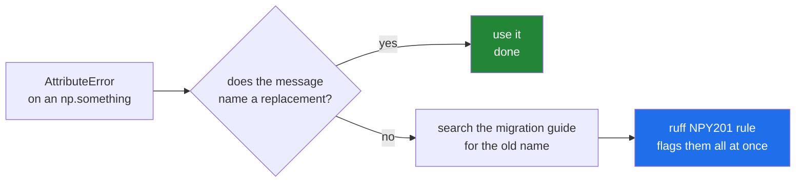

# 2.6 — The names that were removed in NumPy 2.0, and what to write instead

## One-line answer

NumPy 2.0 deleted about a hundred aliases — `np.float_`, `np.NaN`, `np.in1d`, `np.row_stack` and
others — so most code and most tutorials written before 2024 will raise `AttributeError` on this
project, and half of those errors tell you the replacement in the message.

---

## The story

Somebody moves into a flat where the previous tenant left a drawer of keys, all labelled.

`Front`, `Back`, `Front (spare)`, `Front door`, `FRONT`, `f. door`, `Front — new lock`.

Seven labels. Three actual doors. Nobody remembers which spare is a spare of what, and two of the
keys do not fit anything any more because a lock was changed in 2019.

The new tenant does the obvious thing: works out which keys open which doors, keeps one key per
door, labels those three clearly, and throws the rest away.

A week later a friend comes round who used to live there. They ask for "the f. door key" and there
is no such thing in the drawer any more. The door still opens. The key still exists. The name they
learned is gone.

That is exactly what NumPy 2.0 did, and this part is the drawer.

---

## The idea in plain language

NumPy is over twenty years old. Over that time the top-level `numpy` namespace collected hundreds of
names, many of which were duplicates of each other: `np.float_` and `np.float64` were the same type;
`np.alltrue` and `np.all` were the same function; `np.round_` and `np.round` were the same call.

Every duplicate is a cost. A newcomer has to work out which of three names to use. Documentation has
to mention them all. Autocomplete lists thirty things where three would do.

NumPy 2.0, released in June 2024, removed roughly a hundred of these. The reasoning and the full
list are in the *NumPy 2.0 migration guide*
(<https://numpy.org/doc/stable/numpy_2_0_migration_guide.html>). Nothing about what NumPy *does*
changed in these removals; only what things are called.

Two things make this practical rather than trivia.

**Almost every tutorial you will find predates it.** Search results, question-and-answer sites,
books, and code in other people's repositories were overwhelmingly written between 2015 and 2023.
When you paste a snippet and get `AttributeError: module 'numpy' has no attribute 'in1d'`, you have
not made a mistake — the snippet is simply older than your NumPy.

**Half the errors are helpful and half are not.** For names NumPy expected people to miss, it kept a
custom message that says exactly what to use:

```text
AttributeError: `np.float_` was removed in the NumPy 2.0 release. Use `np.float64` instead.
```

For the rest you get the plain Python message, which tells you nothing:

```text
AttributeError: module 'numpy' has no attribute 'in1d'
```

The ones worth carrying in your head are these:

| Removed | Write instead | Why the old one existed |
|---|---|---|
| `np.float_` | `np.float64` | a "default float" alias |
| `np.complex_` | `np.complex128` | same idea |
| `np.unicode_`, `np.string_` | `np.str_`, `np.bytes_` | Python-2-era naming |
| `np.NaN`, `np.NAN` | `np.nan` | three spellings of one value |
| `np.Inf`, `np.Infinity`, `np.PINF` | `np.inf` | four spellings of one value |
| `np.in1d` | `np.isin` | `isin` handles any shape |
| `np.row_stack` | `np.vstack` | a second name for one function |
| `np.alltrue`, `np.sometrue` | `np.all`, `np.any` | pre-2000 spellings |
| `np.product`, `np.cumproduct` | `np.prod`, `np.cumprod` | long-form duplicates |
| `np.round_` | `np.round` | the trailing underscore was a name clash workaround |
| `np.trapz` | `np.trapezoid` | a spelling correction |
| `np.msort` | `np.sort(a, axis=0)` | a one-line convenience |
| `np.float128` | `np.longdouble` | the width was never actually 128 on most platforms |

A short rule covers most of it: **the survivor is the shorter, lowercase, non-underscored name**, and
a dtype is named for its width. `np.nan` not `np.NaN`; `np.all` not `np.alltrue`; `np.float64` not
`np.float_`.

One thing that did **not** change, and is worth saying because people assume it did: `np.int_`,
`np.float64`, `np.bool_` and friends as *dtype* names are all still there. `np.bool` also came
*back* in 2.0 as an alias for `np.bool_`, after having been removed in 1.24. The removals were about
duplicate aliases, not about the type system.

---

## Why Setu needs it

- **This project pins `numpy==2.5.2`** (Principle 4), so every removed name is genuinely gone here,
  and you will meet these errors from the first snippet you paste.
- **Principle 2 says build from scratch before reaching for a library**, which means reading a lot
  of other people's code to see how they did it. Most of that code is older than NumPy 2.
- **Day 130 and Day 155 borrow patterns from model documentation**, much of which still writes
  `np.float_` in examples.
- **Principle 14 says stop and amend the plan when reality has changed.** A removed name is exactly
  that kind of change, in miniature: the fix is to write the current name, not to pin an old NumPy.

---

## The mechanism

Ask NumPy directly which of the old names still exist.

```python
import numpy as np

names = [
    "float_",
    "complex_",
    "unicode_",
    "NaN",
    "Inf",
    "in1d",
    "row_stack",
    "alltrue",
    "product",
    "round_",
    "trapz",
    "float128",
]
for name in names:
    status = "present" if hasattr(np, name) else "GONE"
    print(f"np.{name:<10} {status}")
```

**Line by line:**

- `hasattr(np, name)` — asks whether the module has that attribute, without raising if it does not.
  This is the "look before you leap" style
  ([Day 18, 4.2](../../../day-18-exceptions/parts/04-in-anger/4.2-eafp-and-lbyl.md)), and it is the
  right one here because the answer itself is what we want, not the value.
- `np` is a module, and a module is an object with attributes
  ([Day 17, 1.1](../../../day-17-modules-and-packages/parts/01-the-module/1.1-a-module-is-a-file-that-has-already-run.md)),
  so `np.float_` is an ordinary attribute lookup and its failure is an ordinary `AttributeError`.
- The list is written one name per line rather than packed onto one, because it is a reference table
  as much as it is code, and a reader will scan it.

```text
np.float_     GONE
np.complex_   GONE
np.unicode_   GONE
np.NaN        GONE
np.Inf        GONE
np.in1d       GONE
np.row_stack  GONE
np.alltrue    GONE
np.product    GONE
np.round_     GONE
np.trapz      GONE
np.float128   GONE
```

Twelve for twelve. Now the two kinds of error message:

```python
import numpy as np

for name in ["float_", "NaN", "alltrue", "round_", "in1d", "row_stack", "product", "trapz"]:
    try:
        getattr(np, name)
        print(f"{name:<12} -> present")
    except AttributeError as error:
        print(f"{name:<12} -> {error}")
```

**Line by line:**

- `getattr(np, name)` — the dynamic form of `np.<name>`, needed because the name is in a variable.
  Unlike `hasattr`, it raises, which is what lets us print the message.
- `except AttributeError as error` — the specific class, and the message is what the demonstration is
  about ([Day 18, 1.5](../../../day-18-exceptions/parts/01-raising-and-catching/1.5-the-exception-object.md)).
- The alignment is deliberate: the point of the output is that the right-hand column is two very
  different kinds of text.

```text
float_       -> `np.float_` was removed in the NumPy 2.0 release. Use `np.float64` instead.
NaN          -> `np.NaN` was removed in the NumPy 2.0 release. Use `np.nan` instead.
alltrue      -> `np.alltrue` was removed in the NumPy 2.0 release. Use `np.all` instead.
round_       -> `np.round_` was removed in the NumPy 2.0 release. Use `np.round` instead.
in1d         -> module 'numpy' has no attribute 'in1d'
row_stack    -> module 'numpy' has no attribute 'row_stack'
product      -> module 'numpy' has no attribute 'product'
trapz        -> module 'numpy' has no attribute 'trapz'
```

**The top four tell you the answer. The bottom four do not.** When you get one of the bottom kind,
the migration guide is the place to look, and the search that works is the old name plus "numpy 2".

And the replacements, doing the same work:

```python
import numpy as np

steps = np.array([8213, 10442, 6180, 0, 12007, 9631, 7204])
rest_days = np.array([0, 5000])

print("np.isin      :", np.isin(steps, rest_days))
print("np.vstack    :", np.vstack([steps[:3], steps[3:6]]))
print("np.all       :", np.all(steps >= 0))
print("np.any       :", np.any(steps == 0))
print("np.prod      :", np.prod([2, 3, 4]))
print("np.round     :", np.round(np.array([7.832, 4.635]), 1))
print("np.nan       :", np.nan, "| np.inf:", np.inf)
print("np.float64   :", np.float64, "| np.str_:", np.str_)
```

**Line by line:**

- `np.isin(steps, rest_days)` — the replacement for `in1d`. It answers "is each element of the first
  array present in the second", and unlike `in1d` it keeps the input's shape, so it works on a 2-D
  table directly.
- `np.vstack([...])` — the replacement for `row_stack`; they were literally the same function under
  two names. Stacking is
  [Day 22, 4.2](../../../day-22-broadcasting-and-shape/parts/04-joining-and-splitting/4.2-stack-versus-concatenate.md).
- `np.all(steps >= 0)` and `np.any(steps == 0)` — the comparison produces a boolean array
  ([Day 21, 3.1](../../../day-21-indexing-and-views/parts/03-boolean-masks/3.1-a-comparison-makes-an-array.md))
  and `all`/`any` reduce it to one answer. These replace `alltrue` and `sometrue`.
- `np.round(..., 1)` — one decimal place. The old `np.round_` existed only to avoid clashing with a
  method name, and that clash stopped mattering long ago.
- `np.nan`, `np.inf`, `np.float64`, `np.str_` — the survivors. Lowercase, short, unambiguous.

```text
np.isin      : [False False False  True False False False]
np.vstack    : [[ 8213 10442  6180]
 [    0 12007  9631]]
np.all       : True
np.any       : True
np.prod      : 24
np.round     : [7.8 4.6]
np.nan       : nan | np.inf: inf
np.float64   : <class 'numpy.float64'> | np.str_: <class 'numpy.str_'>
```

The upgrade path:



---

## When it breaks

**A tutorial snippet, pasted:**

```text
$ uv run python -c "
import numpy as np
mask = np.in1d([1, 2, 3], [2, 3])
print(mask)
" 2>&1 | tail -2
AttributeError: module 'numpy' has no attribute 'in1d'
```

**What it means.** The snippet is older than your NumPy. Nothing is wrong with your install and
nothing is wrong with your import. `np.isin` does the same job with the same arguments, and it also
preserves the input shape, which `in1d` flattened. **Do not pin an older NumPy to make a snippet
run.** That trades one afternoon's convenience for a permanently out-of-date project, and it
contradicts Principle 4's whole reason for existing.

**A dtype alias inside somebody else's library:**

```text
$ uv run python -c "
import numpy as np
np.float_
" 2>&1 | tail -2
AttributeError: `np.float_` was removed in the NumPy 2.0 release. Use `np.float64` instead.
```

**What it means.** This one is polite: it names the replacement. When the offending line is inside a
*dependency* rather than your own code, the fix is not to edit site-packages — it is to upgrade that
dependency to a version that supports NumPy 2, and if none exists, to note the constraint in
`docs/CHANGELOG_PLAN_DS.md` and raise it as a plan amendment
([Day 1, 4.2](../../../day-01-pins/parts/04-drift/4.2-drift-and-the-amendment-protocol.md)).

**A name that moved rather than disappeared:**

```text
$ uv run python -c "
import numpy as np
print(np.trapezoid([1, 2, 3]))
print(np.linalg.norm([3, 4]))
print(np.strings.upper(np.array(['mon', 'tue'])))
"
4.0
5.0
['MON' 'TUE']
```

**What it means.** Not every rename is a deletion. `np.trapz` became `np.trapezoid` — a spelling
correction, same function. Several string functions moved from `np.char` to the new `np.strings`
namespace. And plenty of things that feel like they should be top-level have always lived in a
submodule: `np.linalg`, `np.random`, `np.fft`. When a name is missing, "was it renamed" and "did it
move" are two different questions, and the migration guide answers both.

**A method that was removed while the function survived:**

```text
$ uv run python -c "
import numpy as np
a = np.array([8213, 10442, 6180])
print('np.ptp(a)      :', np.ptp(a))
a.ptp()
" 2>&1 | tail -3
np.ptp(a)      : 4262
AttributeError: 'numpy.ndarray' object has no attribute 'ptp'
```

**What it means.** `ptp` — peak to peak, the largest value minus the smallest — still exists as
`np.ptp(a)`. What 2.0 removed is the *method* form, `a.ptp()`, as part of trimming the array object's
own surface. So a missing name is three questions, not one: was it renamed, did it move to a
submodule, or did it stop being a method while remaining a function? The migration guide separates
them, and searching for the old spelling plus "numpy 2" is what finds the answer quickly.

Removal is also the end of a process rather than the start of one. Names spend a release or two
emitting a `DeprecationWarning` first — which Python hides by default, so nobody sees it. Running
the test suite with `-W error::DeprecationWarning` once per upgrade turns those invisible warnings
into failures you can fix *before* the next major version deletes the name.

---

## In production

**What a professional writes instead of the teaching version.** They do not check names by hand at
all. `ruff` — already this project's linter
([Day 2, 1.2](../../../day-02-quality-gate/parts/01-linting/1.2-choosing-rule-families.md)) — has a
rule family called `NPY` whose `NPY201` rule flags every NumPy-2 removal and, where one exists,
offers the replacement as an automatic fix. Turning it on is two lines in `pyproject.toml`:

```toml
[tool.ruff.lint]
select = ["E", "F", "I", "UP", "B", "SIM", "NPY"]
```

Running `uv run ruff check --select NPY201 .` over a codebase then finds every occurrence in one
pass, which is a completely different activity from discovering them one `AttributeError` at a time
over three weeks.

**What changes at scale.** On a small project you fix these as you meet them. On a codebase of a
hundred modules with a dozen NumPy-dependent dependencies, a major-version upgrade is a project:
you run the linter to find your own occurrences, you check every dependency's declared NumPy
support, and you discover that one abandoned library pins `numpy<2` and blocks everything. That last
case is the real cost of a major upgrade, and it is why teams read the migration guide *before*
scheduling the work rather than after.

**The failure that only appears with real data.** Not all of these are import-time errors. A name
used only inside a rarely-taken branch — an error handler, a fallback path, a monthly report — will
import fine, pass every test, and raise `AttributeError` at three in the morning on the one code
path nobody exercised. Static analysis catches those and testing does not, which is the strongest
argument for the linter rule over "we will find them as we go".

**The review comment a senior engineer leaves.** *"`np.float_` on line 12 — that has been gone since
NumPy 2.0. Use `np.float64`. Also please add `NPY` to the ruff `select` list so the linter catches
the next one instead of a user."*

**The interview question.** *"You paste a NumPy snippet from an answer online and get
`AttributeError: module 'numpy' has no attribute 'in1d'`. What is going on?"* The snippet predates
NumPy 2.0, which removed about a hundred duplicate aliases from the top-level namespace; `in1d`
became `isin`. The follow-up is the one that matters: *"how would you find the rest of them?"* Not by
running the code until it breaks — by enabling ruff's `NPY201` rule, which flags every removal
statically, and by reading the migration guide for the renames that are not simple aliases. Adding
that the right response is never to pin `numpy<2` shows you have thought about the cost of doing so.

---

## Check yourself

```bash
uv run python -c "
import numpy as np
for name in ['float_', 'NaN', 'in1d', 'alltrue', 'row_stack', 'trapz']:
    try:
        getattr(np, name)
        print(f'{name:<10} present')
    except AttributeError as error:
        print(f'{name:<10} {error}')
"
```

Six names, six failures, and only three of the messages help. Name the replacement for each of the
three that do not.

**Answer out loud, without scrolling up:**

> Give the NumPy 2 replacement for `np.float_`, `np.NaN`, `np.in1d` and `np.row_stack` — and say what
> you would turn on so a linter finds these instead of a user.

---

**Next:** [3.1 — `np.array`, and what it works out for you](../03-creating/3.1-np-array-and-what-it-infers.md).
