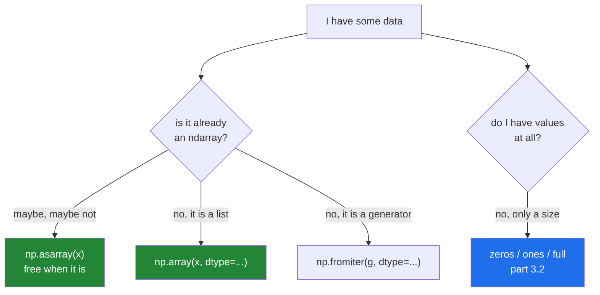

# 3.1 — `np.array` — from data you already have

## One-line answer

`np.array(x)` copies whatever sequence you hand it into a new block of memory, working out the shape
from how deeply the sequences nest and the dtype from the values — and `np.asarray` is the version
that skips the copy when there is nothing to do.

---

## The story

Somebody has the step counts on three sticky notes stuck to a monitor, one per week, seven numbers
on each.

They want them on one sheet of squared paper, as a proper grid.

The job is mechanical. Count the notes: three. Count the numbers on the first note: seven. Rule a
grid three rows by seven columns. Copy the numbers in, left to right, top to bottom.

Two things can go wrong, and both do.

The second note has only six numbers on it, because one day's entry never got written down. The grid
cannot be ruled — three by seven needs twenty-one numbers and there are twenty.

And on the third note, one entry says `rest` instead of a number. Now the grid is not a grid of
numbers any more. It is a grid of *something*, and the total at the bottom cannot be worked out.

The person doing the copying finds both problems immediately, because you cannot rule a ragged grid
and you cannot add up a word. That is the useful property: the copying is where the trouble surfaces.

---

## The idea in plain language

`np.array` is the door most data comes through. You give it something sequence-shaped, and it gives
you back an `ndarray`.

It makes two decisions and one copy.

**The shape decision** comes from nesting depth. A flat list of seven numbers becomes shape `(7,)`.
A list of three lists of seven becomes `(3, 7)`. A list of two lists of three lists of four becomes
`(2, 3, 4)`. NumPy descends until it stops finding sequences, and every level has to be rectangular
— all the inner lists the same length — or there is no block to allocate
([1.1](../01-the-block/1.1-a-list-of-boxes.md)).

**The dtype decision** comes from the values, exactly as in
[2.1](../02-dtypes/2.1-a-dtype-is-a-promise.md), unless you pass `dtype=` and take the decision
yourself.

**The copy always happens.** `np.array` allocates a new block and fills it. Change the original list
afterwards and the array does not notice, which is usually what you want.

Then there is the family around it, and knowing which is which saves a lot of confusion:

| Call | What it does |
|---|---|
| `np.array(x)` | always copies |
| `np.array(x, copy=False)` | in NumPy 2, **raises** if a copy would be needed — it is now a demand, not a hint |
| `np.asarray(x)` | copies only if `x` is not already a suitable array |
| `np.asarray(x, dtype=t)` | copies only if the dtype differs too |
| `np.fromiter(gen, dtype=t)` | builds from any iterable, including a generator, without a list first |

`np.asarray` is the one to reach for at the top of a function that accepts "an array or something
array-like", because handing it a real array of the right dtype costs nothing at all. That idiom —
`x = np.asarray(x)` on the first line — is everywhere in real NumPy code.

One NumPy 2 change worth knowing now, because it breaks old snippets. `copy=False` used to mean
"avoid a copy if you can". It now means "**never** copy — raise if you would have to". The old
meaning lives in `np.asarray`. This is described in the *NumPy 2.0 migration guide*
(<https://numpy.org/doc/stable/numpy_2_0_migration_guide.html>).

---

## Why Setu needs it

- **Every dataset in Phase 4 onwards enters through a conversion like this**, whether you write it
  or pandas writes it for you.
- **Day 27's typed reads are `dtype=` at the door**, and the argument for that is here.
- **Day 155 receives embeddings as a list of lists from a model** and turns them into one `(n, 384)`
  array. The ragged-input error in this part is the one you meet when one document failed to encode.
- **`np.asarray` at the top of a function is the pattern the whole `src/setu/` numeric layer uses**
  from Day 25 on, so that callers can pass lists in tests and arrays in production.

---

## The mechanism

Shape comes from nesting.

```python
import numpy as np

flat = np.array([8213, 10442, 6180, 0, 12007, 9631, 7204])
weeks = np.array(
    [
        [8213, 10442, 6180, 0, 12007, 9631, 7204],
        [7788, 9120, 11345, 8402, 6733, 14210, 5096],
        [9004, 8765, 7621, 10188, 9950, 8317, 11002],
    ]
)
cube = np.array([[[1, 2], [3, 4]], [[5, 6], [7, 8]]])

for name, arr in [("flat", flat), ("weeks", weeks), ("cube", cube)]:
    print(f"{name:6} shape={arr.shape!s:10} ndim={arr.ndim} dtype={arr.dtype}")
```

**Line by line:**

- `flat` — one level of nesting, so one axis. Shape `(7,)`.
- `weeks` — a list of three lists of seven, so two axes and shape `(3, 7)`. **The outer list becomes
  axis 0.** That is worth saying out loud, because it is the rule that decides whether your rows are
  weeks or days, and getting it backwards is a whole afternoon.
- `cube` — three levels, shape `(2, 2, 2)`. NumPy keeps descending as long as it finds sequences.
- The loop prints all three the same way, so the only thing that varies in the output is what
  actually varies.

```text
flat   shape=(7,)       ndim=1 dtype=int64
weeks  shape=(3, 7)     ndim=2 dtype=int64
cube   shape=(2, 2, 2)  ndim=3 dtype=int64
```

Now the copy, and the three ways of asking for one:

```python
import numpy as np

steps = [8213, 10442, 6180]
first = np.array(steps)
steps[0] = 0
print("list changed :", steps)
print("array did not:", first)

existing = np.array([1.0, 2.0, 3.0])
print("asarray same object :", np.asarray(existing) is existing)
print("array   same object :", np.array(existing) is existing)
print("asarray other dtype :", np.asarray(existing, dtype=np.float32) is existing)
```

**Line by line:**

- `steps[0] = 0` after the array was built — the array keeps `8213`, because `np.array` copied the
  values out. The list and the array are unconnected from the moment the call returns.
- `np.asarray(existing) is existing` — `True`. It is already an `ndarray` of a suitable dtype, so
  there is nothing to do and you get the same object back. **Zero cost**, which is why this is the
  idiom for accepting flexible input.
- `np.array(existing) is existing` — `False`. `np.array` copies unconditionally, so a function that
  calls it on every input pays for a full copy of arrays that were already fine.
- `np.asarray(existing, dtype=np.float32) is existing` — `False`. The dtype differs, so a copy is
  required and `asarray` makes one. `asarray` avoids *unnecessary* copies, not all of them.

```text
list changed : [0, 10442, 6180]
array did not: [ 8213 10442  6180]
asarray same object : True
array   same object : False
asarray other dtype : False
```

And building from something that is not a list at all:

```python
import numpy as np

squares = np.fromiter((n * n for n in range(7)), dtype=np.int64)
print("from a generator :", squares)

from_range = np.array(range(7))
print("from a range     :", from_range)

from_tuple = np.array((8213, 10442, 6180))
print("from a tuple     :", from_tuple)

from_str = np.array(list("mon"))
print("from characters  :", from_str, from_str.dtype)
```

**Line by line:**

- `np.fromiter(gen, dtype=...)` — consumes any iterable one item at a time
  ([Day 11, 1.1](../../../day-11-iterators-and-generators/parts/01-iterators/1.1-iterable-and-iterator.md))
  and fills an array directly. **`dtype=` is compulsory here**, because a generator cannot be
  inspected in advance without consuming it. Pass `count=` too when you know the length and NumPy
  will allocate once instead of growing.
- `np.array(range(7))` — a `range` is a sequence with a known length, so `np.array` handles it
  directly. This is the readable way to get 0 to 6, though `np.arange(7)`
  ([3.3](3.3-arange-and-the-float-step.md)) is the idiomatic one.
- `np.array((8213, ...))` — a tuple works exactly like a list. The brackets in `np.array([...])` are
  not special syntax; they are just a list literal being passed as an argument.
- `np.array(list("mon"))` — three one-character strings, so the dtype is `<U1`. Note that
  `np.array("mon")` without the `list` gives a **zero-dimensional** array holding one string, which
  is almost never what anybody wants.

```text
from a generator : [ 0  1  4  9 16 25 36]
from a range     : [0 1 2 3 4 5 6]
from a tuple     : [ 8213 10442  6180]
from characters  : ['m' 'o' 'n'] <U1
```

Which door to use:



The blue box is the next part: when you have a shape but no numbers yet.

---

## When it breaks

**A ragged input:**

```text
$ uv run python -c "
import numpy as np
np.array([[1, 2, 3], [4, 5]])
" 2>&1 | tail -2
ValueError: setting an array element with a sequence. The requested array has an inhomogeneous shape after 1 dimensions. The detected shape was (2,) + inhomogeneous part.
```

**What it means.** The rows are different lengths, so no rectangle exists. Read `(2,) +
inhomogeneous part` as "I got as far as two rows and then the lengths disagreed". In real code this
almost always means one item in a batch failed upstream and returned a short result — so the fix is
to find *which* one, not to pad it. A quick diagnosis is
`print({len(row) for row in rows})`: if that set has more than one element, you have your answer.

**`copy=False` in NumPy 2:**

```text
$ uv run python -c "
import numpy as np
np.array([1, 2, 3], copy=False)
" 2>&1 | tail -2
ValueError: Unable to avoid copy while creating an array as requested.
If using `np.array(obj, copy=False)` replace it with `np.asarray(obj)` to allow a copy when needed (no behavior change in NumPy 1.x).
For more details, see https://numpy.org/devdocs/numpy_2_0_migration_guide.html#adapting-to-changes-in-the-copy-keyword.
```

**What it means.** This is the change described above, and the message is unusually good: it names
the replacement. A list is not an array, so a copy is unavoidable, and `copy=False` now *demands*
that no copy happen. Every pre-2024 snippet that wrote `np.array(x, copy=False)` meaning "avoid a
copy if you can" now fails, and `np.asarray(x)` is the direct replacement.

**A single string, which is not what you meant:**

```text
$ uv run python -c "
import numpy as np
a = np.array('monday')
print(a, a.shape, a.ndim, a.dtype)
print(len(a))
" 2>&1 | tail -3
monday () 0 <U6
TypeError: len() of unsized object
```

**What it means.** A string is a sequence of characters, but NumPy treats it as one scalar value, so
you get a **zero-dimensional** array — shape `()`, no axes at all. It is not empty; it holds one
thing, and there is no axis to index along, which is why `len()` fails. Zero-dimensional arrays are
real and occasionally useful, and they are almost always an accident. `np.array(["monday"])` gives
shape `(1,)`, which is what people mean.

**Something that is not sequence-shaped at all:**

```text
$ uv run python -c "
import numpy as np
a = np.array({'mon': 8213, 'tue': 10442})
print(a, a.shape, a.dtype)
"
{'mon': 8213, 'tue': 10442} () object
```

**What it means.** No error. A dictionary is not a sequence NumPy knows how to unpack, so it wrapped
it as a single `object` — a zero-dimensional array containing one dict. Everything downstream will
behave oddly and nothing will say why. **If you meant the values, write
`np.array(list(d.values()))`; if you meant the keys, say so.** The general lesson is that
`np.array` almost never refuses an input, so a surprising `dtype=object` with `shape=()` means it
did not understand what you gave it.

---

## In production

**What a professional writes instead of the teaching version.** They start numeric functions with
`np.asarray`, so the function accepts lists in tests and arrays in the hot path without a copy:

```python
import numpy as np

Steps = np.ndarray


def weekly_totals(daily: np.typing.ArrayLike, *, days: int = 7) -> Steps:
    """Sum whole weeks of daily counts, accepting a list or an array without copying twice."""
    arr = np.asarray(daily, dtype=np.int64)
    if arr.ndim != 1:
        raise ValueError(f"expected one dimension of daily counts, got shape {arr.shape}")
    whole = arr.size // days
    if whole == 0:
        raise ValueError(f"need at least {days} days, got {arr.size}")
    return arr[: whole * days].reshape(whole, days).sum(axis=1)
```

**Line by line:**

- `np.typing.ArrayLike` — the annotation for "anything `np.asarray` accepts": a list, a tuple, an
  array, a scalar. Writing `list[int]` here would be a lie, because the function accepts more than
  that, and a wrong hint is worse than none
  ([Day 19, 1.1](../../../day-19-typing-dataclasses-and-concurrency/parts/01-type-hints/1.1-a-hint-is-a-note.md)).
- `np.asarray(daily, dtype=np.int64)` — one line that accepts anything array-like, states the dtype,
  and copies only when it must. **This is the idiom.** Every numeric helper in this project's
  `src/setu/` starts with it from Day 25 onward.
- `if arr.ndim != 1: raise ValueError(...)` — the shape assumption, checked at the door with the
  actual shape in the message. Without it, a `(4, 7)` input would reshape into something plausible
  and wrong.
- `arr.size // days` — floor division
  ([Day 5, 1.2](../../../day-05-operators-and-conditionals/parts/01-operators/1.2-the-two-divisions.md)),
  because a partial week is not a week.
- `arr[: whole * days]` — drop the leftover days rather than pad them. Padding would invent data;
  dropping is visible in the returned length.
- `.reshape(whole, days).sum(axis=1)` — the whole computation, with no loop.
  `axis=1` sums across each row ([Day 22, 2.1](../../../day-22-broadcasting-and-shape/parts/02-reshape/2.1-same-block-new-shape.md)
  is reshape in full).

**What changes at scale.** `np.array` on a list is O(n) in time and memory and involves unboxing
every Python object, which is the 38 ms measured in
[1.4](../01-the-block/1.4-a-million-floats-measured.md). At scale the goal is to never build the
list at all: read straight into an array with `np.loadtxt`, `np.frombuffer`, `pd.read_parquet` or a
model's own batched output. When you genuinely must accumulate, `np.fromiter` with `count=` set
allocates once, while `np.array(list(gen))` builds a full Python list first and then copies it —
twice the peak memory for the same result.

**The failure that only appears with real data.** A service builds a `(batch, 384)` array from a
list of embeddings returned by a model. It works for months. Then one document is empty, the model
returns `[]` for it, and `np.array(embeddings)` raises the inhomogeneous-shape error — in a request
handler, as a 500, with a message about array shapes that says nothing about documents. The fix is a
length check before the conversion, and the lesson is that this call is a validation boundary
whether you treat it as one or not.

**The review comment a senior engineer leaves.** *"`np.array(x)` at the top of this function copies
even when the caller already passed a `float32` array, and it is called once per row. Use
`np.asarray(x, dtype=np.float32)` — same behaviour for lists, free for arrays."*

**The interview question.** *"What is the difference between `np.array` and `np.asarray`?"*
`np.array` always makes a copy; `np.asarray` returns the input unchanged when it is already an
`ndarray` of a compatible dtype, and copies otherwise. You use `asarray` at function boundaries so
that callers can pass anything array-like without paying for a copy they do not need. The NumPy 2
detail worth adding is that `np.array(x, copy=False)` no longer means "avoid a copy" — it now raises
if a copy would be required, so old code written that way has to move to `np.asarray`.

---

## Check yourself

```bash
uv run python -c "
import numpy as np
a = np.array([[1, 2, 3], [4, 5, 6]])
print('shape  :', a.shape)
existing = np.array([1.0, 2.0])
print('asarray:', np.asarray(existing) is existing)
print('array  :', np.array(existing) is existing)
print('gen    :', np.fromiter((n * n for n in range(5)), dtype=np.int64))
"
```

Two of those lines answer the same question differently. Say which, and why the difference matters
in a function called a thousand times.

**Answer out loud, without scrolling up:**

> Where does `np.array` get the shape from, and where does it get the dtype from? Then say what
> `np.array([[1, 2], [3]])` does and why.

---

**Next:** [3.2 — `zeros`, `ones`, `full`, and the `empty` that is not empty](3.2-zeros-ones-full-and-empty.md).
