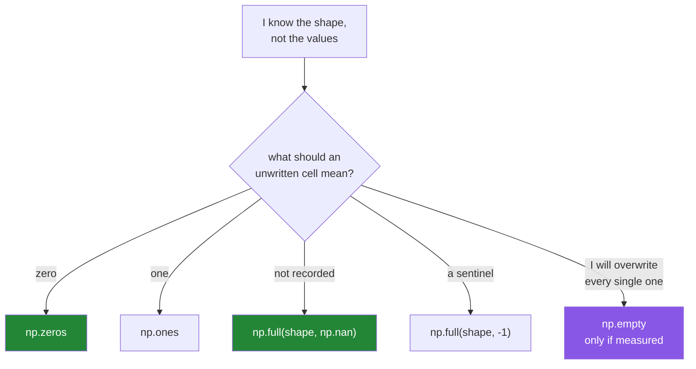

# 3.2 — `zeros`, `ones`, `full` — and the `empty` that is not empty

## One-line answer

When you know the shape but not the values yet, `np.zeros`, `np.ones` and `np.full` allocate a block
and fill it — while `np.empty` allocates and **does not fill it**, so it hands you whatever bytes
happened to be lying in that memory.

---

## The story

Somebody is going to write down step counts for the next four weeks, so they rule out a grid: four
rows, seven columns, twenty-eight boxes.

There are three sensible things to do with an empty grid.

Write a zero in every box, so that a box you have not filled in yet reads as zero. That is tidy and
it is also a small lie — a zero looks exactly like a real day when the phone stayed home.

Write nothing, leaving the boxes blank. Now you can tell a real zero from a day that has not been
recorded, but you have to remember to check.

Or write a dash in every box, so a box that still has a dash in it is obviously not filled in yet.

Now imagine a fourth option: the person grabs a sheet of paper out of the recycling bin. It has a
grid on it already, ruled to the right size — and it also has last month's numbers still written on
it, faintly, in pencil. They start filling in the boxes they care about and leave the rest.

Two weeks later somebody reads the sheet and cannot tell which numbers are this month's and which
are the ghosts. Every box has a number in it. All of them look equally real.

That fourth sheet is `np.empty`.

---

## The idea in plain language

Every one of these functions takes a **shape** and gives you an array of that shape. They differ in
what is in it and in how much work that takes.

- **`np.zeros(shape)`** — every element is 0. The most common one by far.
- **`np.ones(shape)`** — every element is 1. Useful as a starting point for multiplication, and for
  making a column of ones in linear algebra on Day 24.
- **`np.full(shape, value)`** — every element is whatever you say. This is how you get an array of
  `-1` sentinels, or of `np.nan` to mean "not recorded yet".
- **`np.empty(shape)`** — a block of the right size, **not initialised**. The contents are whatever
  those bytes held before.

The shape argument is a single number for one axis (`np.zeros(7)`) or a tuple for more
(`np.zeros((4, 7))`). **The double brackets are compulsory** for more than one axis, and forgetting
them is the most common typo in the whole library — `np.zeros(4, 7)` reads the `7` as the dtype and
fails with a confusing message.

The default dtype for all four is **`float64`**, not integer. `np.zeros(7)` gives `[0. 0. 0. ...]`
with dots. If you want integer zeros, say `np.zeros(7, dtype=np.int64)`. This surprises people
because "zero" feels like an integer, and the reason is that these functions exist mostly to
pre-allocate space for computed results, which are usually floats.

**Why `np.empty` exists.** Filling a block with zeros costs a pass over the memory. If you are about
to overwrite every element anyway, that pass is pure waste. On a 4 GB array it is a real fraction of
a second and a real amount of memory bandwidth. So `np.empty` is the "I promise to fill this myself"
version.

**Why `np.empty` is dangerous.** The promise is not checked. If you fill 999 of 1000 elements, the
one you missed contains a leftover value that looks exactly like a real number — and it might be
`1.8e308`, or a denormal, or a value from a previous run of your own program. Nothing warns you. The
name does not help: `np.empty` sounds like it produces an empty array, and it does not. It produces
a full array of arbitrary numbers.

The rule that keeps you out of trouble: **use `np.zeros` unless you have measured that the fill
matters, and then use `np.empty` only where the very next lines assign every element.**

---

## Why Setu needs it

- **Pre-allocating and assigning into a result is the standard alternative to growing a list**, and
  it is what makes the Phase 3 gate's stats module fast on Day 25.
- **Day 44's imputer needs a "not recorded" marker**, and `np.full(shape, np.nan)` is how you build
  one that is distinguishable from a real zero.
- **Day 130's one-hot label matrix is `np.zeros((n, 10))` with one 1 per row** — the canonical use of
  `zeros` as a canvas.
- **Day 24's design matrix has a column of ones for the intercept**, built with `np.ones`.

---

## The mechanism

The four functions, side by side.

```python
import numpy as np

print("zeros(7)        :", np.zeros(7))
print("zeros(7).dtype  :", np.zeros(7).dtype)
print("zeros int       :", np.zeros(7, dtype=np.int64))
print("ones((2, 3))    :", np.ones((2, 3)).tolist())
print("full(7, 8000)   :", np.full(7, 8000))
print("full nan        :", np.full(3, np.nan))
```

**Line by line:**

- `np.zeros(7)` — one axis of seven. Note the printed dots: `0.` not `0`, because the dtype is
  `float64`.
- `np.zeros(7, dtype=np.int64)` — integer zeros, and the dots disappear. Being deliberate about this
  is Principle 4 again; the float default is a framework default like any other.
- `np.ones((2, 3))` — **note the inner brackets.** `(2, 3)` is one argument, a tuple, meaning two
  rows of three.
- `.tolist()` — converts to nested Python lists so the two rows print on one line here. In real code
  you would print the array and read it over two lines.
- `np.full(7, 8000)` — every element 8000, and the dtype is inferred from the fill value, so this one
  is `int64` rather than `float64`.
- `np.full(3, np.nan)` — the "not recorded" canvas. This is `float64` because `np.nan` is a float, and
  it cannot be anything else ([2.3](../02-dtypes/2.3-floats-nan-and-precision.md)).

```text
zeros(7)        : [0. 0. 0. 0. 0. 0. 0.]
zeros(7).dtype  : float64
zeros int       : [0 0 0 0 0 0 0]
ones((2, 3))    : [[1.0, 1.0, 1.0], [1.0, 1.0, 1.0]]
full(7, 8000)   : [8000 8000 8000 8000 8000 8000 8000]
full nan        : [nan nan nan]
```

Now `np.empty`, with something allocated and released just before it:

```python
import numpy as np

old = np.arange(100_000, dtype=np.float64) * 1.5
print("old[:6]              :", old[:6])
del old

reused = np.empty(100_000)
print("np.empty(100_000)[:6]:", reused[:6])
print("any value over 1e6?  :", bool((reused > 1e6).any()))
```

**Line by line:**

- `np.arange(100_000, dtype=np.float64) * 1.5` — allocates 800 KB and fills it with real numbers.
  **The size matters for the demonstration**: NumPy keeps a small cache of tiny blocks, so
  `np.empty(6)` on a fresh interpreter usually prints zeros and looks perfectly safe. That is the
  most misleading thing about it.
- `del old` — releases the block. It goes back to the allocator, which keeps it for reuse rather than
  handing it to the operating system.
- `np.empty(100_000)` — asks for the same size, very likely gets the same block back, and does not
  clear it.
- `(reused > 1e6).any()` — a cheap sanity question over the whole array. It is `False` here, but on
  another run it can be `True`, and that is exactly the problem: **the answer depends on what your
  process happened to be doing a moment earlier.**

```text
old[:6]              : [0.  1.5 3.  4.5 6.  7.5]
np.empty(100_000)[:6]: [1.35516937e-311 1.35522613e-311 2.00000000e+000 3.00000000e+000
 4.00000000e+000 5.00000000e+000]
any value over 1e6?  : False
```

**The exact numbers on your machine will be different, and they will be different again on the next
run.** Look at what is there anyway: the third to sixth values are `2.0`, `3.0`, `4.0`, `5.0` —
recognisably the `np.arange` from before the multiply, still lying in the recycled block. The first
two are around `1e-311`, which are denormals, meaning "bytes that were never a float at all". None
of it is a step count, and if the next line of your program had been `reused.sum()` it would have
produced a number with no complaint.

And the pattern `np.empty` exists for:

```python
import numpy as np

rng = np.random.default_rng(20)
weeks = rng.integers(5000, 15000, size=(4, 7))

totals = np.empty(weeks.shape[0], dtype=np.int64)
for i in range(weeks.shape[0]):
    totals[i] = weeks[i].sum()

print("weeks.shape :", weeks.shape)
print("totals      :", totals)
print("check       :", np.array_equal(totals, weeks.sum(axis=1)))
```

**Line by line:**

- `np.empty(weeks.shape[0], dtype=np.int64)` — space for four totals, uninitialised. Safe **only
  because** the loop below assigns all four.
- `for i in range(weeks.shape[0])` — one iteration per row. This loop is here to show the
  pre-allocate pattern; in real code you would write the last line instead and skip the loop
  entirely.
- `totals[i] = weeks[i].sum()` — assignment into an existing slot. No allocation, no list growth.
  Compare this with `totals.append(...)` on a Python list, which reallocates as it grows
  ([Day 8, 1.1](../../../day-08-containers/parts/01-sequences/1.1-a-list-is-a-dynamic-array.md)).
- `np.array_equal(totals, weeks.sum(axis=1))` — **the pre-allocated loop checked against the
  vectorised one-liner.** Whenever you write a loop over an array, write the vectorised version too
  and assert they agree; the loop is then a temporary scaffold rather than a permanent liability.

```text
weeks.shape : (4, 7)
totals      : [66607 52223 86943 64467]
check       : True
```

Which one to reach for:



---

## When it breaks

**The missing inner brackets:**

```text
$ uv run python -c "
import numpy as np
np.zeros(4, 7)
" 2>&1 | tail -2
TypeError: Cannot interpret '7' as a data type
```

**What it means.** `np.zeros(shape, dtype=...)` takes the dtype second, so `7` was read as a dtype
and is not one. The message never mentions shape, which is why this one costs five minutes the first
time. The fix is `np.zeros((4, 7))` — the shape is **one** argument, and for more than one axis it
is a tuple.

**`np.empty` used without filling everything:**

```text
$ uv run python -c "
import numpy as np
scratch = np.arange(500, dtype=np.float64) * 3.7
del scratch
out = np.empty(5)
for i in range(4):
    out[i] = i * 100
print(out)
print('sum:', out.sum())
"
[  0. 100. 200. 300.   0.]
sum: 600.0
```

**What it means.** The loop stopped at index 3, so index 4 kept whatever was in that memory — here a
zero, so the sum came out right. **That luck is the danger.** The value in slot four is not
guaranteed to be anything: on another run it can be a denormal, a leftover from an earlier array, or
`1.8e308`, and then the sum is `inf` and the bug looks like an overflow in the arithmetic rather
than an off-by-one in the loop. With `np.zeros` a wrong `range` bound leaves a visible `0.0` every
time; with `np.empty` it leaves a lottery ticket.

**Forgetting the dtype default:**

```text
$ uv run python -c "
import numpy as np
counts = np.zeros(3)
counts[0] = 8213
print(counts, counts.dtype)
print('as an index:', [0] * 3)
try:
    [10, 20, 30][counts[0]]
except TypeError as error:
    print('TypeError:', error)
"
[8213.    0.    0.] float64
as an index: [0, 0, 0]
TypeError: list indices must be integers or slices, not numpy.float64
```

**What it means.** `np.zeros(3)` is `float64`, so `counts[0]` is `8213.0` and cannot index a Python
list. Inside NumPy the same mistake bites differently: a float array used as an index raises
`IndexError: arrays used as indices must be of integer (or boolean) type`. Whenever an array will
hold counts, positions or labels, pass `dtype=np.int64` at creation.

**A shape with a negative or wrong-typed entry:**

```text
$ uv run python -c "
import numpy as np
np.zeros((4, -1))
" 2>&1 | tail -2
ValueError: negative dimensions are not allowed
```

**What it means.** `-1` means "work this out for me" in `reshape`
([Day 22, 2.2](../../../day-22-broadcasting-and-shape/parts/02-reshape/2.2-minus-one.md)), and
people carry that habit across. It has no meaning in a *creation* call, because there is nothing to
infer it from — no existing size to divide. The fix is to compute the number yourself before the
call.

---

## In production

**What a professional writes instead of the teaching version.** They pre-allocate with `zeros` and a
stated dtype, they write the fill value's *meaning* into a constant, and they use `_like` variants
so a result always matches its input:

```python
import numpy as np

NOT_RECORDED = np.nan


def blank_month(weeks: int = 4, days: int = 7) -> np.ndarray:
    """A month-shaped grid where every cell is visibly not filled in yet."""
    return np.full((weeks, days), NOT_RECORDED, dtype=np.float64)


def running_totals(weeks: np.ndarray) -> np.ndarray:
    """Row totals, in a buffer that already has the right shape and dtype."""
    out = np.zeros(weeks.shape[0], dtype=np.int64)
    np.sum(weeks, axis=1, out=out)
    return out
```

**Line by line:**

- `NOT_RECORDED = np.nan` — the name is the point. `np.full(shape, np.nan)` scattered through a
  codebase says *what*; a constant called `NOT_RECORDED` says *why*, and a reader never has to
  wonder whether that particular `nan` was deliberate.
- `np.full((weeks, days), NOT_RECORDED, dtype=np.float64)` — the dtype is stated even though `np.nan`
  would force `float64` anyway, because stating it survives somebody later changing the sentinel to
  `-1`.
- `out = np.zeros(weeks.shape[0], dtype=np.int64)` — `zeros` rather than `empty`, because the saving
  from `empty` on four elements is nothing and the risk is real. `empty` earns its place at a
  million elements in a loop, not here.
- `np.sum(weeks, axis=1, out=out)` — **the `out=` parameter**, which writes the result into an array
  you already own instead of allocating a new one. This is the real reason to pre-allocate: in a loop
  that runs ten thousand times, `out=` is the difference between ten thousand allocations and one.
  Most NumPy reductions and ufuncs accept it.
- `weeks.shape[0]` rather than `len(weeks)` — both give four, and `shape[0]` says which axis is meant
  ([1.2](../01-the-block/1.2-shape-dtype-and-the-rest.md)).

**What changes at scale.** Three things. First, `np.zeros` on a very large array is nearly free on
Linux and macOS even though it "fills" — the operating system hands over pages that are already
zero and only makes them real when you touch them, so `np.zeros((100_000, 10_000))` returns
instantly and uses almost no memory until written. That makes the usual `zeros`-versus-`empty`
argument weaker than it sounds for large allocations. Second, `np.full` has no such trick: it must
actually write the value, so `np.full(shape, np.nan)` on a 4 GB array really does cost a full pass.
Third, pre-allocating plus `out=` is the single most effective memory optimisation in numeric Python,
because it turns per-iteration allocation into zero allocation.

**The failure that only appears with real data.** A batch processor allocates its output buffer with
`np.empty(batch_size)` and fills it in a loop over incoming records. For two years every batch is
full. Then a truncated file produces a batch of 900 records into a 1000-slot buffer, and the last
hundred slots contain whatever the previous batch left there. The output is not obviously wrong — it
is a hundred *plausible* values from ten minutes ago — so no alarm fires, and the numbers are simply
untrue.

**The review comment a senior engineer leaves.** *"`np.empty` here and then a loop with a `continue`
in it — that `continue` skips the assignment, so those slots keep garbage. Either use `np.zeros`,
or use `np.full(n, np.nan)` so a skipped slot is visible downstream."*

**The interview question.** *"When would you use `np.empty` instead of `np.zeros`?"* Only when the
very next code assigns every element and you have measured that the initialisation cost matters,
because `np.empty` returns uninitialised memory whose contents are arbitrary — often zeros on a
fresh process, which is exactly what makes it look safe in testing. The strong follow-up is to
mention that on Linux and macOS large `np.zeros` allocations are already nearly free thanks to
lazy zero pages, so the optimisation is smaller than people assume, and that the real win from
pre-allocating is being able to pass `out=` to avoid allocation inside a loop.

---

## Check yourself

```bash
uv run python -c "
import numpy as np
print('zeros dtype:', np.zeros(3).dtype)
print('full  dtype:', np.full(3, 8000).dtype)
old = np.arange(100_000, dtype=np.float64) * 2.5
del old
print('empty      :', np.empty(100_000)[:4])
"
```

The first two lines differ, and the reason is not the shape. The third line prints whatever was in
that memory, so run it two or three times and watch it change.

**Answer out loud, without scrolling up:**

> What dtype does `np.zeros(7)` produce, and why is that surprising? Then say the one condition
> under which `np.empty` is safe.

---

**Next:** [3.3 — `arange`, and the float step that misses](3.3-arange-and-the-float-step.md).
