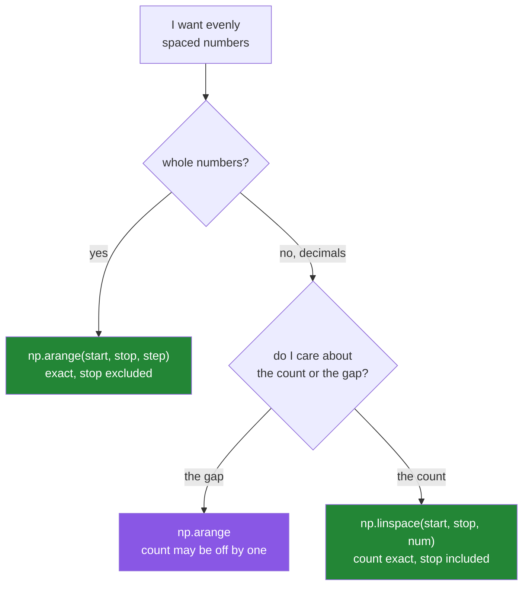

# 3.3 — `arange` — a range you can do arithmetic on, and the float step that misses

## One-line answer

`np.arange(start, stop, step)` is `range` that produces an array and accepts decimal steps — and
with a decimal step the number of elements you get is **not** reliably what the arithmetic says,
because the stop is compared against values that drift.

---

## The story

Somebody is marking up a chart for the step data. They want tick marks along the bottom, every 0.1
of a kilometre, from 0 up to but not including 1.

They count it out in their head: 0, 0.1, 0.2, and so on to 0.9. Ten marks. Easy.

Then they change their mind and want the marks to go up to 0.7 instead. Same reasoning: 0 to 0.6,
seven marks.

They write a little loop to do it, and it gives them seven marks. Fine. The last one is even
labelled 0.6, so it all looks right. Then a later step asks the program whether that last mark is
0.6, and the program says no.

The mark is not 0.6. It is 0.6000000000000001, which is what you get from six steps of a number
that is not exactly 0.1 ([2.3](../02-dtypes/2.3-floats-nan-and-precision.md)). The label rounded it
for display, so the screen said one thing and the stored number was another.

That is the difficult kind of wrong: the output looks correct, and the comparison does not agree
with the output.

---

## The idea in plain language

`np.arange` is the array version of Python's `range`, which you met on
[Day 6, 1.2](../../../day-06-loops/parts/01-iteration/1.2-range-is-lazy.md).

It takes the same three arguments in the same order:

- `np.arange(stop)` — 0 up to but not including `stop`.
- `np.arange(start, stop)` — `start` up to but not including `stop`.
- `np.arange(start, stop, step)` — the same, in jumps of `step`.

**The stop is always excluded**, exactly as in `range`. `np.arange(7)` gives 0 to 6.

Two differences from `range` matter.

**It builds the whole array at once.** `range(1_000_000)` is a lazy object that produces numbers as
you ask for them and uses a few dozen bytes. `np.arange(1_000_000)` allocates 8 MB immediately. That
is the trade: you get something you can do arithmetic on, and you pay for it up front.

**It accepts a decimal step, and this is where the trouble lives.** `range` refuses a float step
outright. `np.arange` accepts one, and then has to decide how many elements to produce.

Here is what it actually does. Rather than adding the step repeatedly and checking, NumPy computes
the length in one go:

> **length = ceil((stop − start) / step)**

and then fills in `start + i × step` for each `i`. That is better than repeated addition, because
the drift does not compound. But the *length* is still computed from a division of inexact numbers,
so it can come out one larger or one smaller than you expected — and the values themselves are still
`start + i × step`, which is exact only when the step is exactly representable.

The practical consequences, in order of how often they bite:

1. **The count can be off by one.** `np.arange(0, 1.1, 0.1)` gives eleven elements, ending at 1.0 —
   which includes the stop value that `arange` promised to exclude.
2. **The values are not what they print as.** `np.arange(0, 0.7, 0.1)` displays a tidy
   `[0. 0.1 0.2 0.3 0.4 0.5 0.6]` and its last element is actually `0.6000000000000001`.
3. **A comparison against a value you can see in the output fails.** `arr[-1] == 0.6` is `False`.

The rule that avoids all three: **use `arange` for whole numbers and `linspace` for decimals.**
`np.linspace(start, stop, count)` asks how many points you want rather than how far apart they are,
so the count is exact by construction. That is [3.4](3.4-linspace.md), and it is the answer to this
part's problem.

The NumPy documentation says this itself, in as many words: for non-integer steps, `linspace` is
usually better (<https://numpy.org/doc/stable/reference/generated/numpy.arange.html>).

---

## Why Setu needs it

- **`np.arange(n)` is how you make an index array**, and index arrays are how Day 21's fancy
  indexing selects rows
  ([Day 21, 4.1](../../../day-21-indexing-and-views/parts/04-fancy-indexing/4.1-a-list-of-positions.md)).
- **Day 22's reshape examples all start from `np.arange`**, because when each value equals its own
  position, the effect of a reshape is readable straight off the printed array.
- **Day 45's learning-rate and threshold sweeps are ranges of decimals**, and every one of them
  should be a `linspace`. This part is why.
- **Day 130's train loop uses `np.arange(n_samples)` and shuffles it** to get batch indices without
  touching the data.

---

## The mechanism

Integer steps first, where everything behaves.

```python
import numpy as np

print("arange(7)         :", np.arange(7))
print("arange(1, 8)      :", np.arange(1, 8))
print("arange(0, 20, 5)  :", np.arange(0, 20, 5))
print("arange(10, 0, -2) :", np.arange(10, 0, -2))
print("dtype             :", np.arange(7).dtype)
print("arange(7.0).dtype :", np.arange(7.0).dtype)
```

**Line by line:**

- `np.arange(7)` — one argument means `stop`, and `start` defaults to 0. Seven values, 0 to 6.
- `np.arange(1, 8)` — two arguments are `start` and `stop`. Also seven values, 1 to 7. The stop is
  excluded, so `8` is not there.
- `np.arange(0, 20, 5)` — `[0, 5, 10, 15]`. `20` is excluded, which catches people who expect five
  values.
- `np.arange(10, 0, -2)` — a negative step counts down. `0` is still excluded, so it stops at 2.
- `np.arange(7).dtype` is `int64` and `np.arange(7.0).dtype` is `float64` — **the dtype comes from
  the arguments**, so a stray decimal point changes the type of the whole array.

```text
arange(7)         : [0 1 2 3 4 5 6]
arange(1, 8)      : [1 2 3 4 5 6 7]
arange(0, 20, 5)  : [ 0  5 10 15]
arange(10, 0, -2) : [10  8  6  4  2]
dtype             : int64
arange(7.0).dtype : float64
```

Now the decimal step, with the length formula checked by hand:

```python
import math

import numpy as np

for stop in (1.0, 1.1, 0.3, 0.7):
    values = np.arange(0, stop, 0.1)
    predicted = math.ceil((stop - 0) / 0.1)
    print(
        f"arange(0, {stop}, 0.1) -> len {len(values):2}  predicted {predicted:2}  last {values[-1]!r}"
    )
```

**Line by line:**

- `math.ceil((stop - 0) / 0.1)` — NumPy's own length formula, written out. Printing it beside the
  actual length is what makes the surprise legible rather than mysterious.
- `values[-1]!r` — `repr` rather than `str`, because `str` rounds for display and would hide the
  very digits this demonstration is about
  ([Day 7, 3.3](../../../day-07-strings/parts/03-formatting/3.3-repr-and-the-debugging-f-string.md)).
- The loop covers four stops on purpose: two that behave and two that do not, so the lesson is "this
  is unpredictable" rather than "this is always broken".

```text
arange(0, 1.0, 0.1) -> len 10  predicted 10  last np.float64(0.9)
arange(0, 1.1, 0.1) -> len 11  predicted 11  last np.float64(1.0)
arange(0, 0.3, 0.1) -> len  3  predicted  3  last np.float64(0.2)
arange(0, 0.7, 0.1) -> len  7  predicted  7  last np.float64(0.6000000000000001)
```

Three things in that output are worth stopping on.

**Line two ends at 1.0**, and `1.1` was the stop. `arange` excludes the stop — but `1.1 / 0.1` in
floating point is very slightly more than 11, so `ceil` gives 11 rather than 12, and the eleventh
value is `0 + 10 × 0.1 = 1.0`. The endpoint you thought you had excluded is in the array. Somebody
plotting this gets an extra tick.

**Line four ends at `0.6000000000000001`**, which is `6 × 0.1` computed in binary. It is not equal to
`0.6`, so `values[-1] == 0.6` is `False` and any code branching on that comparison takes the wrong
branch.

**The predicted length matched every time here**, which is honest and important: the formula is not
random. But it depends on a division of inexact numbers, so with other steps it comes out one over
or one under, and there is no way to tell by looking.

The fix, side by side:

```python
import numpy as np

by_step = np.arange(0, 0.7, 0.1)
by_count = np.linspace(0, 0.6, 7)

print("arange  :", by_step)
print("linspace:", by_count)
print("arange  reprs :", [repr(float(x)) for x in by_step])
print("arange  last == 0.6 :", by_step[-1] == 0.6)
print("linspace last == 0.6 :", by_count[-1] == 0.6)
print("same values?         :", np.allclose(by_step, by_count))
```

**Line by line:**

- `np.arange(0, 0.7, 0.1)` — "steps of 0.1, stopping before 0.7". The count is derived.
- `np.linspace(0, 0.6, 7)` — "seven points from 0 to 0.6, inclusive". The count is stated, so it
  cannot be wrong, and NumPy computes each value from the endpoints rather than from repeated
  stepping ([3.4](3.4-linspace.md)).
- `[repr(float(x)) for x in by_step]` — **this line is the point of the whole demonstration.**
  Printing an array shows NumPy's rounded display; `repr` of each value shows what is actually
  stored. The two disagree, and only one of them is what `==` compares.
- `by_count[-1] == 0.6` — `True`. `linspace` guarantees the last element is exactly the stop you
  asked for, because it assigns it rather than computing it.
- `np.allclose(by_step, by_count)` — `True`. The two arrays hold the same numbers to within
  tolerance; two of them differ, and only in the final bit.

```text
arange  : [0.  0.1 0.2 0.3 0.4 0.5 0.6]
linspace: [0.  0.1 0.2 0.3 0.4 0.5 0.6]
arange  reprs : ['0.0', '0.1', '0.2', '0.30000000000000004', '0.4', '0.5', '0.6000000000000001']
arange  last == 0.6 : False
linspace last == 0.6 : True
same values?         : True
```

**The two printed arrays are identical and the two arrays are not.** NumPy's display rounds to the
shortest form that looks sensible, so `0.6000000000000001` prints as `0.6`. This is the worst
possible combination: the array looks exactly right, and `== 0.6` is `False`. The `repr` line is how
you see through it, and it is the first thing to run when a comparison against a value you can
clearly see in the output keeps failing.

How the two decide:



---

## When it breaks

**An empty array, silently:**

```text
$ uv run python -c "
import numpy as np
a = np.arange(10, 0)
print('values:', a)
print('shape :', a.shape)
print('mean  :', a.mean())
" 2>&1 | tail -5
.venv/Lib/site-packages/numpy/_core/_methods.py:142: RuntimeWarning: invalid value encountered in scalar divide
  ret = ret.dtype.type(ret / rcount)
values: []
shape : (0,)
mean  : nan
```

**What it means.** `start=10`, `stop=0`, and the default step is `+1`, so there is nothing between 10
and 0 going upwards. `arange` returns an **empty array** rather than raising, and the mean of nothing
is `nan` with a `RuntimeWarning`. Empty arrays are legal and useful, so NumPy will not complain — but
a downstream `arr[0]` will raise `IndexError` in a completely different function. **When a loop
mysteriously does nothing, check whether its range came out empty.**

**A step of zero:**

```text
$ uv run python -c "
import numpy as np
np.arange(0, 5, 0)
" 2>&1 | tail -2
ZeroDivisionError: division by zero
```

**What it means.** The length formula divides by the step, so a step of zero is a division by zero.
The error names the arithmetic rather than the argument, which is unhelpful the first time. It
usually happens when the step is computed — `(stop - start) / n` where `n` came out wrong — rather
than typed.

**Memory, all at once:**

```text
$ uv run python -c "
import numpy as np
big = np.arange(50_000_000)
print('nbytes:', f'{big.nbytes:,}')
print('range :', 'a range object is 48 bytes regardless of length')
"
nbytes: 400,000,000
range : a range object is 48 bytes regardless of length
```

**What it means.** 400 MB, allocated immediately, for something a `for` loop would have consumed
lazily. `np.arange` is not a `range` — it materialises. When you only need to *iterate*, `range` is
free; when you need to *compute with* the numbers, `arange` is the right tool and the memory is the
price. The middle case — iterate in chunks — is what `np.arange(0, n, chunk)` is for.

**A value you can see in the output that `==` cannot find:**

```text
$ uv run python -c "
import numpy as np
grid = np.arange(0, 0.7, 0.1)
print('printed :', grid)
print('== 0.3  :', bool((grid == 0.3).any()))
print('== 0.6  :', bool((grid == 0.6).any()))
print('isclose :', bool(np.isclose(grid, 0.6).any()))
"
printed : [0.  0.1 0.2 0.3 0.4 0.5 0.6]
== 0.3  : False
== 0.6  : False
isclose : True
```

**What it means.** `0.3` and `0.6` are both right there in the printed array, and neither can be
found by equality, because what is stored is `0.30000000000000004` and `0.6000000000000001`.
Meanwhile `0.1`, `0.2`, `0.4` and `0.5` *are* findable, because those particular multiples happened
to land exactly. So a membership test on this array succeeds for four values and fails for two, with
no pattern a reader could guess. **Membership testing on a computed float array is a mistake**, full
stop. Use `np.isclose(arr, target).any()`, or work in integers and scale at the end.

---

## In production

**What a professional writes instead of the teaching version.** They use `arange` for indices and
`linspace` for measurements, and when a decimal grid really must come from a step, they build it in
integers and scale once at the end:

```python
import numpy as np


def decimal_grid(start: float, stop: float, step: float) -> np.ndarray:
    """Evenly spaced decimals with an exact count and an exact endpoint."""
    count = round((stop - start) / step) + 1
    if count < 1:
        raise ValueError(f"no points between {start} and {stop} with step {step}")
    return np.linspace(start, start + (count - 1) * step, count)
```

**Line by line:**

- `round(...)` rather than `math.ceil(...)` — `round` snaps to the nearest whole number, so a
  division that lands on `6.999999999999999` becomes 7 rather than 7 by luck or 6 by bad luck. This
  single substitution removes most off-by-one surprises.
- `+ 1` — because a grid from 0 to 0.6 in steps of 0.1 has **seven** points, not six. Fence posts,
  not fence panels, and it is the most common off-by-one in this whole area.
- `if count < 1: raise ValueError(...)` — an empty grid is almost always a caller mistake rather than
  a legitimate request, and the message repeats all three arguments so the caller does not have to
  reproduce it
  ([Day 18, 3.3](../../../day-18-exceptions/parts/03-your-own/3.3-the-message-is-an-interface.md)).
- `np.linspace(start, start + (count - 1) * step, count)` — the endpoint is computed once, from the
  count, and `linspace` then guarantees the array ends exactly there. No value is reached by
  repeated addition.

**What changes at scale.** Two things. First, `arange` on a large range allocates the whole thing,
so `np.arange(2_000_000_000)` is a 16 GB request that fails or swaps — and the fix is not a bigger
machine, it is chunking with `np.arange(0, n, chunk_size)` and processing a slice at a time. Second,
the off-by-one becomes invisible: at seven elements you can count them, and at two million you
cannot, so a `linspace` grid that is one element short shows up as a shape mismatch four functions
downstream. Production code asserts the length it expected — `assert grid.size == expected` — which
costs nothing and converts a confusing shape error into a clear one.

**The failure that only appears with real data.** A hyper-parameter sweep defined as
`np.arange(0.0, 1.0, 0.05)` was documented as testing twenty-one values from 0 to 1. It tests
twenty, from 0 to 0.95, because the stop is excluded. Every experiment ever run with it silently
omitted the most interesting endpoint, and the results table looked complete. Nobody noticed for a
year, because nothing was wrong with any individual run.

**The review comment a senior engineer leaves.** *"`np.arange(0, 1, 0.01)` for the threshold sweep —
use `np.linspace(0, 1, 101)`. It gives you exactly 101 points, it actually includes 1.0, and nobody
has to think about whether floating-point rounding changed the count this week."*

**The interview question.** *"What is wrong with `np.arange(0, 1, 0.1)`?"* Nothing, on that specific
input — it gives ten values, 0 to 0.9. The problem is general: with a non-integer step, NumPy derives
the element count as `ceil((stop - start) / step)` from inexact floating-point arithmetic, so the
count can come out one over or one under, and the values themselves are `start + i * step`, which
can end at `0.6000000000000001` rather than `0.6`. That breaks both the count and any comparison
against the endpoint. `np.linspace` takes the count instead of the step, so the count cannot be
wrong and the endpoint is assigned exactly. The general rule is `arange` for integers, `linspace`
for decimals.

---

## Check yourself

```bash
uv run python -c "
import numpy as np
print('arange(0, 1.1, 0.1) len:', len(np.arange(0, 1.1, 0.1)))
print('last element        :', repr(np.arange(0, 1.1, 0.1)[-1]))
print('arange(0, 0.7, 0.1) :', np.arange(0, 0.7, 0.1))
print('linspace(0, 0.6, 7) :', np.linspace(0, 0.6, 7))
"
```

The first two lines contradict what "stop is excluded" led you to expect. Say why.

**Answer out loud, without scrolling up:**

> How does `np.arange` decide how many elements to produce with a decimal step, and name the two
> things that go wrong because of it. Then say which function you use instead, and what you give it
> that you did not give `arange`.

---

**Next:** [3.4 — `linspace`, and why it is the one you want for decimals](3.4-linspace.md).
