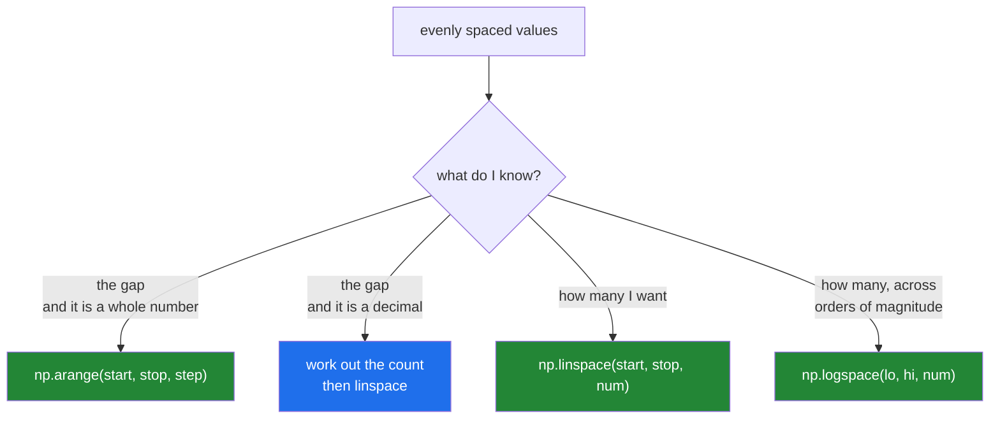

# 3.4 — `linspace` — say how many, not how far apart

## One-line answer

`np.linspace(start, stop, num)` gives you exactly `num` evenly spaced values with `start` and `stop`
both included, so the count cannot drift and the endpoint is exact — which is why it, and not
`arange`, is the right tool for any grid of decimals.

---

## The story

Back to the chart with the tick marks.

The person marking it up has been counting in steps, and the marks keep coming out one too many or
one too few. So they change the question they are asking.

Instead of "start at the left edge and move 0.1 along each time until you pass the right edge", they
say: "I want seven marks, the first one on the left edge and the last one on the right edge, evenly
spread."

Now the job is different. Put a mark at each end. Divide what is left into six equal gaps. Place the
five remaining marks.

They cannot end up with eight marks, because they decided there were seven before they started. And
the last mark is exactly on the right edge, because they put it there deliberately rather than
arriving at it by accident.

Same chart, same spacing, and one of the two methods cannot go wrong.

---

## The idea in plain language

`np.linspace` — "linearly spaced" — takes the **count** where `arange` takes the **step**.

```
np.linspace(start, stop, num)
```

- `start` — the first value, always exactly this.
- `stop` — the last value, always exactly this. **Included**, unlike `arange`.
- `num` — how many values in total. Defaults to 50, which is worth knowing because it is a
  surprising default to hit by accident.

The gap between neighbours is `(stop − start) / (num − 1)`. Note the **minus one**: seven marks make
six gaps. This is the fence-post problem, and it is the only arithmetic in `linspace` you have to
think about.

Why this cannot drift. `arange` derives the count from a division, so the count is at the mercy of
floating-point rounding ([3.3](3.3-arange-and-the-float-step.md)). `linspace` is given the count, so
there is nothing to derive. It then computes each value from the endpoints and assigns the last
element to be exactly `stop`, rather than hoping the arithmetic lands there.

Three arguments beyond the first three are worth knowing:

- **`endpoint=False`** — exclude the stop, making `linspace` behave like `arange` but still with an
  exact count. `np.linspace(0, 1, 10, endpoint=False)` gives the same ten values as
  `np.arange(0, 1, 0.1)` and cannot come out with eleven.
- **`retstep=True`** — return `(values, step)` as a tuple, so you can see the gap it chose. Useful
  when the spacing itself matters, for instance as a width in an integral.
- **`dtype=`** — as everywhere else. The default is `float64` even when the endpoints are integers,
  which is right for a grid and surprising the first time.

There is also `np.logspace(start, stop, num)`, which is `linspace` in the exponent: it gives evenly
spaced values on a log scale, from `10**start` to `10**stop`. That is the correct shape for a
learning-rate or regularisation sweep, where you care about orders of magnitude rather than
absolute gaps.

The rule from [3.3](3.3-arange-and-the-float-step.md), restated now that both halves exist:
**`arange` for whole numbers you are counting, `linspace` for a range you are dividing up.**

---

## Why Setu needs it

- **Every hyper-parameter sweep from Day 45 onwards is a `linspace` or a `logspace`.** A threshold
  sweep is `np.linspace(0, 1, 101)`; a learning-rate sweep is `np.logspace(-4, -1, 4)`.
- **Day 40's decision-boundary plots need a grid over the feature space**, built from two
  `linspace` calls and a `meshgrid`.
- **Day 24's numerical integration divides an interval into slices**, and the slice width comes
  straight from `retstep=True`.
- **Any x-axis you plot on from Day 31 onwards** is a `linspace`, because a plot is defined by its
  endpoints and its resolution, not by a step size.

---

## The mechanism

The basic call, and the fence-post arithmetic.

```python
import numpy as np

print("linspace(0, 1, 11)  :", np.linspace(0, 1, 11))
print("linspace(0, 1, 5)   :", np.linspace(0, 1, 5))
print("linspace(0, 0.6, 7) :", np.linspace(0, 0.6, 7))
print("gap for 7 points    :", (0.6 - 0) / (7 - 1))
print("dtype               :", np.linspace(0, 1, 5).dtype)
print("endpoint exact      :", np.linspace(0, 0.6, 7)[-1] == 0.6)
```

**Line by line:**

- `np.linspace(0, 1, 11)` — eleven points, so ten gaps of 0.1. Both 0 and 1 are present. Compare with
  `np.arange(0, 1, 0.1)`, which gives ten points and no 1.
- `np.linspace(0, 1, 5)` — five points, four gaps of 0.25.
- `(0.6 - 0) / (7 - 1)` — the gap, computed by hand. **The `- 1` is the whole trick**: seven marks,
  six gaps.
- `np.linspace(0, 1, 5).dtype` — `float64`, even though both endpoints are integers. `linspace`
  divides, and division produces floats
  ([Day 5, 1.2](../../../day-05-operators-and-conditionals/parts/01-operators/1.2-the-two-divisions.md)).
- `[-1] == 0.6` — `True`. This is the line that fails for `arange` and passes here, and it is the
  entire argument for this function.

```text
linspace(0, 1, 11)  : [0.  0.1 0.2 0.3 0.4 0.5 0.6 0.7 0.8 0.9 1. ]
linspace(0, 1, 5)   : [0.   0.25 0.5  0.75 1.  ]
linspace(0, 0.6, 7) : [0.  0.1 0.2 0.3 0.4 0.5 0.6]
gap for 7 points    : 0.09999999999999999
dtype               : float64
endpoint exact      : True
```

Look at the gap: `0.09999999999999999`. The **spacing** is still inexact, because dividing 0.6 by 6
in binary is inexact. What `linspace` guarantees is the count and the two endpoints, not that every
interior value is a round number. That is an honest and sufficient guarantee — it is exactly the
part `arange` cannot give you.

Now the three arguments that come up in real code:

```python
import numpy as np

no_endpoint = np.linspace(0, 1, 10, endpoint=False)
values, step = np.linspace(0, 1, 5, retstep=True)
integers = np.linspace(0, 100, 5, dtype=np.int64)

print("endpoint=False :", no_endpoint)
print("same as arange :", np.allclose(no_endpoint, np.arange(0, 1, 0.1)))
print("retstep values :", values)
print("retstep step   :", step)
print("dtype=int64    :", integers, integers.dtype)
print("logspace(-4,-1,4):", np.logspace(-4, -1, 4))
```

**Line by line:**

- `endpoint=False` — ten points from 0, stopping just before 1. The gap is now `(1 - 0) / 10` rather
  than `/ 9`, because there are ten gaps rather than nine when the last point is dropped.
- `np.allclose(no_endpoint, np.arange(0, 1, 0.1))` — `True`. They agree, and `linspace` got there
  without risking the count. **This is how you replace an `arange` with a decimal step**: work out
  the count you meant and pass `endpoint=False`.
- `values, step = np.linspace(..., retstep=True)` — tuple unpacking of a two-element return
  ([Day 8, 1.4](../../../day-08-containers/parts/01-sequences/1.4-unpacking-and-star-rest.md)).
  Forgetting to unpack is a common slip, and the symptom is an array that suddenly has two very
  strange elements.
- `dtype=np.int64` — `linspace` computes in floating point and then casts, which **truncates**
  ([2.4](../02-dtypes/2.4-astype-and-the-copy.md)). For 0 to 100 in five steps the values are exact
  so nothing is lost, but `np.linspace(0, 1, 3, dtype=np.int64)` gives `[0, 0, 1]`, not what anybody
  wants.
- `np.logspace(-4, -1, 4)` — four values from 10⁻⁴ to 10⁻¹. **The arguments are the exponents**, not
  the values, which catches everybody once.

```text
endpoint=False : [0.  0.1 0.2 0.3 0.4 0.5 0.6 0.7 0.8 0.9]
same as arange : True
retstep values : [0.   0.25 0.5  0.75 1.  ]
retstep step   : 0.25
dtype=int64    : [  0  25  50  75 100] int64
logspace(-4,-1,4): [0.0001 0.001  0.01   0.1   ]
```

The two functions, decided by what you know:



---

## When it breaks

**The fence-post error:**

```text
$ uv run python -c "
import numpy as np
print('want 0 to 1 in steps of 0.1')
print('linspace(0, 1, 10):', np.linspace(0, 1, 10))
print('linspace(0, 1, 11):', np.linspace(0, 1, 11))
"
want 0 to 1 in steps of 0.1
linspace(0, 1, 10): [0.         0.11111111 0.22222222 0.33333333 0.44444444 0.55555556
 0.66666667 0.77777778 0.88888889 1.        ]
linspace(0, 1, 11): [0.  0.1 0.2 0.3 0.4 0.5 0.6 0.7 0.8 0.9 1. ]
```

**What it means.** Ten points from 0 to 1 makes nine gaps of one ninth, not ten gaps of 0.1. The
array is perfectly valid and completely wrong for the intention. **There is no error here at all**,
which is why the `- 1` deserves a moment's thought every time: *number of points = number of gaps +
1*.

**A count of one, or zero:**

```text
$ uv run python -c "
import numpy as np
print('num=1 :', np.linspace(0, 10, 1))
print('num=0 :', np.linspace(0, 10, 0))
print('num=-1:', np.linspace(0, 10, -1))
" 2>&1 | tail -4
    raise ValueError(
ValueError: Number of samples, -1, must be non-negative.
num=1 : [0.]
num=0 : []
```

**What it means.** `num=1` gives `[0.]` — the **start**, not the stop, and not the midpoint. That is
a defensible choice and it is not the one people expect; a single sample of a range usually should
have been the midpoint or an error. `num=0` gives an empty array with no complaint, which then
produces `nan` from any mean downstream. `num=-1` raises `ValueError: Number of samples, -1, must be
non-negative`. When `num` is computed rather than typed, guard it.

**Passing the values to `logspace` instead of the exponents:**

```text
$ uv run python -c "
import numpy as np
print('meant 1e-4 to 1e-1:', np.logspace(1e-4, 1e-1, 4))
print('actually wanted   :', np.logspace(-4, -1, 4))
"
meant 1e-4 to 1e-1: [1.00023029 1.07994093 1.16600389 1.25892541]
actually wanted   : [0.0001 0.001  0.01   0.1   ]
```

**What it means.** `logspace` raises 10 to the power of each argument, so passing `1e-4` asks for
10 to the power of 0.0001, which is almost exactly 1. Four learning rates between 1.0 and 1.26,
when the intention was four values spanning four orders of magnitude below one — a sweep that
appears to run and tests nothing you meant. Nothing raises, the shapes are right, and
the experiment is meaningless. **Read `logspace`'s arguments out loud as exponents** and the mistake
becomes impossible.

**An integer dtype that truncates the grid:**

```text
$ uv run python -c "
import numpy as np
print('float :', np.linspace(0, 1, 4))
print('int   :', np.linspace(0, 1, 4, dtype=np.int64))
"
float : [0.         0.33333333 0.66666667 1.        ]
int   : [0 0 0 1]
```

**What it means.** `linspace` computes in floating point and then casts, and the cast truncates
([2.4](../02-dtypes/2.4-astype-and-the-copy.md)). Three quarters of the grid collapsed to zero. If
you want evenly spaced *integers*, `np.arange` is the right function — the whole point of
[3.3](3.3-arange-and-the-float-step.md) is that `arange` is exact for integers, and this is the
mirror image of that rule.

---

## In production

**What a professional writes instead of the teaching version.** They name the sweep, they state the
count rather than deriving it, and they keep the grid definition next to the thing it sweeps:

```python
import numpy as np

THRESHOLDS = np.linspace(0.0, 1.0, 101)
LEARNING_RATES = np.logspace(-4, -1, 4)


def best_threshold(scores: np.ndarray, labels: np.ndarray) -> tuple[float, float]:
    """The threshold with the highest accuracy, chosen over a fixed grid."""
    if scores.shape != labels.shape:
        raise ValueError(f"scores {scores.shape} and labels {labels.shape} disagree")
    predictions = scores[None, :] >= THRESHOLDS[:, None]
    accuracy = (predictions == labels[None, :]).mean(axis=1)
    winner = int(accuracy.argmax())
    return float(THRESHOLDS[winner]), float(accuracy[winner])
```

**Line by line:**

- `THRESHOLDS = np.linspace(0.0, 1.0, 101)` — 101 points, so a hundred gaps of exactly 0.01, and
  both 0.0 and 1.0 are in it. Written as a module constant so the grid is one thing, defined once,
  visible in a diff when somebody changes it.
- `np.logspace(-4, -1, 4)` — `[0.0001, 0.001, 0.01, 0.1]`. Learning rates are compared across orders
  of magnitude, so evenly spaced exponents is the right grid and evenly spaced values is not.
- `if scores.shape != labels.shape: raise ValueError(...)` — the shapes are checked before any
  broadcasting happens, because a mismatch here would broadcast into a plausible wrong answer rather
  than an error.
- `scores[None, :] >= THRESHOLDS[:, None]` — `None` inserts a new axis
  ([Day 21, 1.6](../../../day-21-indexing-and-views/parts/01-one-element/1.6-ellipsis-and-newaxis.md)),
  so a `(1, n)` row is compared against a `(101, 1)` column and broadcasting produces the whole
  `(101, n)` grid of decisions in one operation
  ([Day 22, 1.3](../../../day-22-broadcasting-and-shape/parts/01-broadcasting/1.3-a-row-against-a-table.md)).
  No loop over thresholds.
- `.mean(axis=1)` — accuracy per threshold, giving 101 numbers.
- `argmax()` — the **position** of the largest, not the value. That position indexes back into
  `THRESHOLDS`, which is why keeping the grid as a named array rather than regenerating it matters.
- `float(...)` on both returns — plain Python floats out of the function, because these go into a log
  line or a JSON config and `np.float64` is not JSON-serialisable.

**What changes at scale.** `linspace` itself is trivial; what grows is what you do with it. The
`(101, n)` broadcast above is 101 times the memory of the score array, which is fine at ten thousand
scores (8 MB) and not fine at ten million (8 GB). At that point you either coarsen the grid, chunk
the scores, or switch to a sort-based method that computes every threshold in one pass. That is a
real decision, and noticing it requires multiplying the grid size by the data size before running
anything.

**The failure that only appears with real data.** A calibration grid defined as
`np.linspace(0, 1, 100)` — a hundred points, so gaps of 1/99 = 0.0101… rather than 0.01. Every
reported threshold was a number like 0.4747474747, which looked like a precision artefact and was
actually the grid. The tuning results were slightly wrong for a year and the numbers were odd enough
that people stopped reading them.

**The review comment a senior engineer leaves.** *"`np.linspace(0, 1, 100)` gives gaps of 1/99. You
want 101 for hundredths. Also make it a module constant — it is referenced in three places and they
have to be the same grid, or `argmax` indexes into the wrong one."*

**The interview question.** *"When would you use `linspace` over `arange`?"* Whenever the values are
decimals. `arange` takes a step and derives the count from a floating-point division, so the count
can be off by one and the last value can miss the endpoint by a bit. `linspace` takes the count and
guarantees both endpoints exactly, so neither failure is possible. The follow-up worth pre-empting:
*"how do you get `arange`'s exclusive stop from `linspace`?"* — `endpoint=False`. And the trap to
mention unprompted is the fence post: `num` points make `num - 1` gaps, so a grid of hundredths from
0 to 1 needs 101, not 100.

---

## Check yourself

```bash
uv run python -c "
import numpy as np
print('linspace(0, 1, 11)  :', np.linspace(0, 1, 11))
print('linspace(0, 1, 10)  :', np.linspace(0, 1, 10))
print('endpoint=False      :', np.linspace(0, 1, 10, endpoint=False))
print('retstep             :', np.linspace(0, 1, 5, retstep=True)[1])
"
```

Lines two and three both produce ten values and they are not the same ten. Say why.

**Answer out loud, without scrolling up:**

> How many points does `np.linspace` need to give gaps of 0.01 from 0 to 1, and why is it not 100?
> Then say the one guarantee `linspace` makes that `arange` cannot.

---

**Next:** [3.5 — the `_like` family, `eye` and `identity`](3.5-like-and-the-identity.md).
