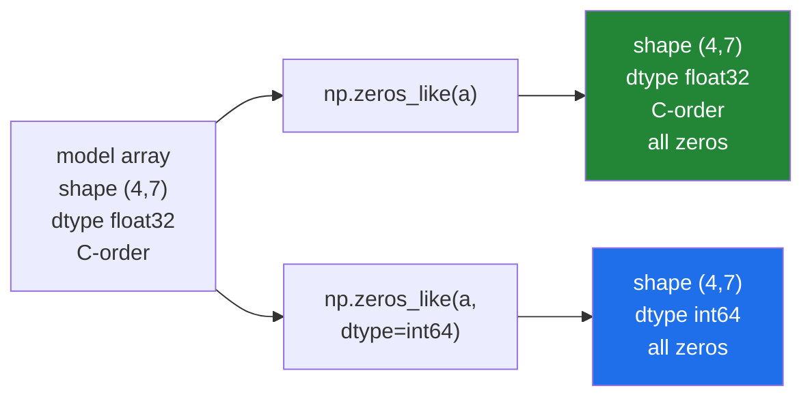

# 3.5 — The `_like` family, `eye` and `identity` — arrays shaped by another array

## One-line answer

`np.zeros_like(x)` builds a zero array with **the same shape and the same dtype as `x`**, which is
the difference between a helper that keeps working when its input changes and one that has to be
edited every time — and `np.eye(n)` builds the diagonal matrix that linear algebra needs.

---

## The story

Somebody is making a second copy of the step-count grid, to write notes in.

The first version of this job goes: measure the original, count four rows and seven columns, take a
fresh sheet, rule four by seven. Fine.

Then the grid grows to five weeks. The notes sheet is still four by seven, because nobody thought to
change it. The two sheets no longer line up, and the last week's notes go in the wrong place — or
worse, off the edge, where nobody sees them at all.

The second version of the job goes: put the original on the photocopier, copy it, and use white
correction fluid on the numbers.

Now the notes sheet is the right size **because it was made from the original**, and when the grid
grows to five weeks the copy grows too, with nobody having to remember anything.

That is the entire idea of the `_like` family: describe the new array by the old one, not by
numbers you typed in.

---

## The idea in plain language

Every creation function from [3.2](3.2-zeros-ones-full-and-empty.md) has a `_like` twin that takes
an **array** instead of a shape:

| Explicit | From another array |
|---|---|
| `np.zeros(shape, dtype)` | `np.zeros_like(a)` |
| `np.ones(shape, dtype)` | `np.ones_like(a)` |
| `np.full(shape, v, dtype)` | `np.full_like(a, v)` |
| `np.empty(shape, dtype)` | `np.empty_like(a)` |

The `_like` version copies **three** things from its model: the shape, the dtype, and the memory
order (whether it is laid out row-major or column-major,
[1.3](../01-the-block/1.3-one-block-and-strides.md)). It copies **no values**.

That third one — the memory order — is why `_like` is worth preferring even when you know the shape.
A result array laid out the same way as its input means the loop that fills it walks memory in
order, which is measurably faster on large arrays and free to ask for.

You can override any of them: `np.zeros_like(a, dtype=np.float32)` keeps the shape and changes the
type. That combination is common enough to be worth remembering — "same shape, different type" is a
very frequent need.

**The trap in `np.full_like`.** It takes the dtype from the model array, so filling an integer array
with `np.nan` does not do what you hope. `np.full_like(int_array, np.nan)` produces the most
negative `int64`, silently, exactly as in [2.4](../02-dtypes/2.4-astype-and-the-copy.md). Pass
`dtype=np.float64` when the fill value is a float and the model is not.

Then there are two functions with no `_like` twin, because they are inherently square:

- **`np.eye(n)`** — an `n × n` array with ones on the diagonal and zeros everywhere else. It also
  takes `M` for a different number of columns and `k` to shift the diagonal up or down.
- **`np.identity(n)`** — the same thing with a shorter signature and no `k`. Use `eye` and forget
  `identity` exists; the only reason to know the second name is to read other people's code.

The diagonal-ones matrix is called the **identity matrix**, and it matters because multiplying any
matrix by it leaves that matrix unchanged — it is the matrix equivalent of multiplying a number by
one. That property is what makes it the starting point for inverses and for the regularisation term
in ridge regression on Day 47.

One more shape helper that belongs here: **`np.diag`**. Given a one-dimensional array it builds a
square matrix with those values on the diagonal; given a two-dimensional array it extracts the
diagonal. Two behaviours in one function, decided by the input's `ndim`, which is unusual and worth
knowing before it surprises you.

---

## Why Setu needs it

- **Day 25's stats module allocates its output with `np.empty_like(x)`**, so it returns `float32` for
  `float32` input and `float64` for `float64` input without a single `if`.
- **Day 44's imputer builds a mask the same shape as the data**, and `np.zeros_like(x, dtype=bool)`
  is exactly that.
- **Day 47's ridge regression adds `alpha * np.eye(n_features)` to a covariance matrix**, which is
  the whole of what "ridge" means.
- **Day 118's PyTorch code has the same family** — `torch.zeros_like`, `torch.ones_like` — with the
  same reasoning, so the habit transfers unchanged.

---

## The mechanism

The `_like` family following its model.

```python
import numpy as np

week = np.array([8213, 10442, 6180, 0, 12007, 9631, 7204], dtype=np.int32)
month = np.zeros((4, 7), dtype=np.float32)

print("week  :", week.shape, week.dtype)
print("zeros_like(week)  :", np.zeros_like(week), np.zeros_like(week).dtype)
print("ones_like(week)   :", np.ones_like(week), np.ones_like(week).dtype)
print("full_like(week,-1):", np.full_like(week, -1))
print()
print("month :", month.shape, month.dtype)
print("zeros_like(month) :", np.zeros_like(month).shape, np.zeros_like(month).dtype)
print("override dtype    :", np.zeros_like(month, dtype=np.int64).dtype)
```

**Line by line:**

- `dtype=np.int32` on `week` — chosen so the `_like` results can be seen to inherit something other
  than the default. With `int64` you could not tell inheritance from the default.
- `np.zeros_like(week)` — seven zeros, `int32`. Compare `np.zeros(7)`, which would be `float64`:
  **the `_like` version gets the dtype right for free**, and that is most of its value.
- `np.full_like(week, -1)` — a sentinel array matching the input. This is the common "not computed
  yet" marker for integer data, where `np.nan` is unavailable
  ([2.3](../02-dtypes/2.3-floats-nan-and-precision.md)).
- `np.zeros_like(month)` — shape `(4, 7)`, dtype `float32`. Both inherited, neither typed out.
- `np.zeros_like(month, dtype=np.int64)` — the override. Shape kept, dtype replaced. This is the
  form to reach for when you want a counter or a mask shaped like your data.

```text
week  : (7,) int32
zeros_like(week)  : [0 0 0 0 0 0 0] int32
ones_like(week)   : [1 1 1 1 1 1 1] int32
full_like(week,-1): [-1 -1 -1 -1 -1 -1 -1]
month : (4, 7) float32
zeros_like(month) : (4, 7) float32
override dtype    : int64
```

Now `eye`, and why it is called the identity:

```python
import numpy as np

print("eye(3):")
print(np.eye(3))
print("eye(3, k=1):")
print(np.eye(3, k=1))
print("eye(2, 4):")
print(np.eye(2, 4))
print("diag from a vector:")
print(np.diag([2, 5, 9]))
print("diag from a matrix:", np.diag(np.arange(9).reshape(3, 3)))
```

**Line by line:**

- `np.eye(3)` — three by three, ones on the main diagonal. The dtype is `float64` by default, which
  is what linear algebra wants.
- `np.eye(3, k=1)` — `k` shifts the diagonal. `k=1` is one place above the main diagonal, `k=-1` one
  below. This is how you build a matrix that shifts a vector by one position, which turns up in time
  series work on Day 108.
- `np.eye(2, 4)` — a second positional argument is the number of columns, so the result is not
  square. The diagonal still starts at the top left.
- `np.diag([2, 5, 9])` — a **one-dimensional** input, so `diag` *builds* a square matrix with those
  values on the diagonal.
- `np.diag(np.arange(9).reshape(3, 3))` — a **two-dimensional** input, so the same function
  *extracts* the diagonal instead. One name, two jobs, chosen by `ndim`. Read it carefully whenever
  you meet it in somebody else's code.

```text
eye(3):
[[1. 0. 0.]
 [0. 1. 0.]
 [0. 0. 1.]]
eye(3, k=1):
[[0. 1. 0.]
 [0. 0. 1.]
 [0. 0. 0.]]
eye(2, 4):
[[1. 0. 0. 0.]
 [0. 1. 0. 0.]]
diag from a vector:
[[2 0 0]
 [0 5 0]
 [0 0 9]]
diag from a matrix: [0 4 8]
```

And the property that gives the identity matrix its name:

```python
import numpy as np

grid = np.arange(9).reshape(3, 3)
same = grid @ np.eye(3)

print("grid:")
print(grid)
print("grid @ eye(3):")
print(same)
print("unchanged? :", np.allclose(grid, same))
print("dtype moved:", grid.dtype, "->", same.dtype)
```

**Line by line:**

- `@` — the matrix multiplication operator, added to Python for exactly this purpose. It is *not*
  elementwise multiplication; `grid * np.eye(3)` would zero everything off the diagonal instead. Day
  24 is matrix arithmetic in full.
- `grid @ np.eye(3)` — the same numbers come back. That is what "identity" means: it is the matrix
  that does nothing, the way `1` is the number that does nothing to a product.
- `np.allclose` rather than `==` — the multiplication went through floating point, so a tolerance is
  the correct comparison ([2.3](../02-dtypes/2.3-floats-nan-and-precision.md)).
- `grid.dtype, "->", same.dtype` — **`int64` became `float64`**, because `np.eye` is `float64` and
  the multiplication promoted. If you need to stay in integers, `np.eye(3, dtype=np.int64)`.

```text
grid:
[[0 1 2]
 [3 4 5]
 [6 7 8]]
grid @ eye(3):
[[0. 1. 2.]
 [3. 4. 5.]
 [6. 7. 8.]]
unchanged? : True
dtype moved: int64 -> float64
```

What inherits what:



---

## When it breaks

**`full_like` with a float value and an integer model:**

```text
$ uv run python -c "
import numpy as np
counts = np.array([8213, 10442, 6180])
print('wrong:', np.full_like(counts, np.nan))
print('right:', np.full_like(counts, np.nan, dtype=np.float64))
" 2>&1
.venv/Lib/site-packages/numpy/_core/numeric.py:475: RuntimeWarning: invalid value encountered in cast
  multiarray.copyto(res, fill_value, casting='unsafe')
wrong: [-9223372036854775808 -9223372036854775808 -9223372036854775808]
right: [nan nan nan]
```

**What it means.** `full_like` took the dtype from `counts`, which is `int64`, and there is no `NaN`
in an integer array. The fill value was cast, producing the sentinel from
[2.4](../02-dtypes/2.4-astype-and-the-copy.md). Only a `RuntimeWarning` on stderr marks it. **When
the fill value's type does not match the model's, pass `dtype=` explicitly** — and if you find
yourself doing that often, `np.full(shape, value)` with the shape written out is clearer.

**`_like` inheriting a dtype you had forgotten about:**

```text
$ uv run python -c "
import numpy as np
mask = np.array([True, False, True])
counter = np.zeros_like(mask)
counter[0] = 5
print(counter, counter.dtype)
"
[ True False False] bool
```

**What it means.** The model is a boolean array, so the counter is boolean too. It starts as three
`False` values, and assigning `5` to slot zero stores `True` — because every non-zero number is
truthy ([Day 5, 2.2](../../../day-05-operators-and-conditionals/parts/02-conditionals/2.2-truthiness.md)).
No error, no warning, and a counter that can only ever hold 0 or 1. This is the cost of
`_like`: it inherits the dtype **whether or not that was the point**. When the new array serves a
different purpose from the model, say the dtype: `np.zeros_like(mask, dtype=np.int64)`.

**`eye` versus `ones` — a very common slip:**

```text
$ uv run python -c "
import numpy as np
grid = np.arange(9).reshape(3, 3)
print('grid @ eye :', (grid @ np.eye(3)).sum())
print('grid @ ones:', (grid @ np.ones((3, 3))).sum())
print('grid * eye :')
print(grid * np.eye(3))
"
grid @ eye : 36.0
grid @ ones: 108.0
grid * eye :
[[0. 0. 0.]
 [0. 4. 0.]
 [0. 0. 8.]]
```

**What it means.** Three plausible-looking expressions, three different answers. `@ eye` leaves the
matrix alone. `@ ones` replaces every entry with a row total, tripling the sum. `* eye` — elementwise
— keeps the diagonal and zeros everything else, which is occasionally what you want and never what
you want by accident. **The operator matters as much as the matrix**, and `@` versus `*` is the
single most common confusion in early linear algebra code.

**`np.diag` doing the other thing:**

```text
$ uv run python -c "
import numpy as np
v = np.array([2, 5, 9])
m = np.diag(v)
print('diag of a vector -> shape', m.shape)
print('diag of that     ->', np.diag(m))
print('diag of diag of diag ->', np.diag(np.diag(m)).shape)
"
diag of a vector -> shape (3, 3)
diag of that     -> [2 5 9]
diag of diag of diag -> (3, 3)
```

**What it means.** `np.diag` alternates between building and extracting depending on how many
dimensions its input has, so applying it twice returns you to where you started. In a chain of
transformations this means a `diag` call can do the opposite of what the author intended when the
input's `ndim` is not what they assumed. `np.diagflat` always builds and `np.diagonal` always
extracts, and using those two names instead makes the intent unambiguous.

---

## In production

**What a professional writes instead of the teaching version.** They allocate results with `_like`
so a function works for every input dtype without branching:

```python
import numpy as np


def z_score(values: np.ndarray, *, ddof: int = 1) -> np.ndarray:
    """Standardise, keeping the input's float width and returning NaN where the spread is zero."""
    if values.dtype.kind != "f":
        raise TypeError(f"expected a float array, got {values.dtype}")
    out = np.full_like(values, np.nan)
    spread = values.std(ddof=ddof)
    if spread == 0:
        return out
    np.subtract(values, values.mean(), out=out)
    np.divide(out, spread, out=out)
    return out
```

**Line by line:**

- `values.dtype.kind != "f"` — the family check from [2.1](../02-dtypes/2.1-a-dtype-is-a-promise.md),
  so `float32` and `float64` both pass and an integer array is refused at the door rather than
  silently promoted.
- `np.full_like(values, np.nan)` — the output buffer, **the same width as the input**. A `float32`
  input gives a `float32` result; writing `np.full(values.shape, np.nan)` instead would silently
  return `float64` and double the memory of a `float32` pipeline
  ([2.5](../02-dtypes/2.5-nep-50-and-the-python-number.md)).
- Filling with `np.nan` rather than zeros — so an early `return` hands back something visibly
  uncomputed rather than a plausible column of zeros.
- `ddof: int = 1` — degrees of freedom, keyword-only-ish and explicit, because NumPy's default of 0
  is the population standard deviation and almost every statistics course means the sample one.
  Principle 4 again: never accept the default silently.
- `if spread == 0: return out` — a constant column has no z-score, and dividing by zero would give
  `inf` and `nan` mixed together ([2.3](../02-dtypes/2.3-floats-nan-and-precision.md)). Returning
  all-`NaN` says "undefined" honestly.
- `np.subtract(..., out=out)` and `np.divide(..., out=out)` — writing into the buffer we already
  allocated instead of creating two temporaries. On a 4 GB array that is 8 GB of allocation avoided.
  This is the pattern `_like` exists to enable.

**What changes at scale.** `_like` stops being a convenience and becomes a correctness tool. In a
pipeline that is `float32` end to end, every explicitly-typed allocation is a place where somebody
can write `np.zeros(shape)` and silently insert a `float64` — doubling memory from that point on,
with no error and no obvious symptom beyond the job running out of memory later than it should. A
codebase that consistently uses `_like` cannot develop that bug, because the dtype is never typed
in twice.

`np.eye` has its own scale story: it is dense, so `np.eye(100_000)` is 80 GB. An identity matrix of
any real size is stored sparsely (`scipy.sparse.identity`) or, far more often, not stored at all —
adding `alpha * I` to a matrix is done by adding `alpha` to the diagonal in place, which touches n
elements instead of n².

**The failure that only appears with real data.** A feature transformer allocated its output as
`np.zeros(x.shape)` and worked perfectly for two years on `float64` data. The team moved the
pipeline to `float32` to halve memory, measured no improvement at all, and spent a week looking for
the cause. The transformer was promoting everything back to `float64` at the first step, and the
only visible symptom was memory that refused to go down.

**The review comment a senior engineer leaves.** *"`np.zeros(x.shape)` returns `float64` regardless
of what `x` is. Use `np.zeros_like(x)` so this function stops being the place our `float32` pipeline
widens."*

**The interview question.** *"What does `np.zeros_like(a)` give you that `np.zeros(a.shape)` does
not?"* The dtype and the memory order, as well as the shape. That matters most in a mixed-precision
pipeline, where `np.zeros(a.shape)` silently returns `float64` and quietly doubles the memory of
everything downstream. The follow-up worth volunteering is the trap: `np.full_like` also inherits
the dtype, so filling an integer array with `np.nan` produces the most negative `int64` with only a
`RuntimeWarning` — pass `dtype=` when the fill value's type does not match the model's.

---

## Check yourself

```bash
uv run python -c "
import numpy as np
week = np.array([8213, 10442, 6180], dtype=np.int32)
print('zeros(3)      :', np.zeros(3).dtype)
print('zeros_like    :', np.zeros_like(week).dtype)
print('override      :', np.zeros_like(week, dtype=np.float32).dtype)
print('eye(3) @ grid :', np.allclose(np.eye(3) @ np.arange(9).reshape(3, 3), np.arange(9).reshape(3, 3)))
"
```

The first two lines differ, and nothing about the shape explains it.

**Answer out loud, without scrolling up:**

> Name the three things `np.zeros_like` copies from its model. Then say what
> `np.full_like(int_array, np.nan)` actually produces, and why.

---

**Next:** [4.1 — `default_rng`, the generator you pass around](../04-random/4.1-default-rng-the-generator.md).
