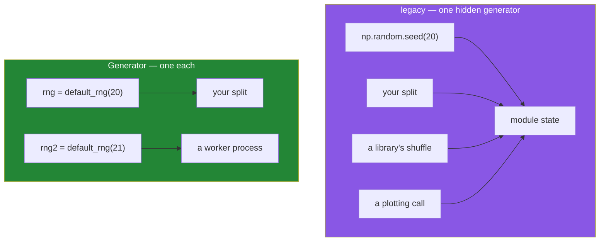

# 4.1 — `default_rng` — the generator, and the global state you stop using

## One-line answer

`np.random.default_rng(seed)` hands you a **generator object** that you keep and pass around, which
replaces the older `np.random.seed()` plus `np.random.rand()` style where every part of the program
shared one hidden pile of state.

---

## The story

A board game comes with one die, kept in the box lid.

Three people are playing, and each of them reaches into the lid when it is their turn. That works
until somebody wants to check something: "what did I roll two turns ago?" Nobody can say. The die
does not remember, and it has been picked up by three different hands since.

Worse, one player has a habit of idly rolling the die while waiting. It changes nothing about the
game — except that when the next player's turn comes, the roll they get is not the roll they would
have got. Every idle roll shifts everything that follows.

Now imagine the same game with three dice, one in front of each player, and each one started from a
known position. Every player's sequence is their own. Somebody rolling out of turn affects only
themselves. And if you want to replay the game exactly, you set the three dice back to their
starting positions and the whole thing runs again identically.

Same randomness, and a completely different ability to reason about what happened.

---

## The idea in plain language

NumPy has two random interfaces. You need to be able to read both and you should only write one.

**The old one — the die in the box lid.** `np.random.seed(20)` sets one hidden generator that lives
inside the `numpy.random` module, and `np.random.rand()`, `np.random.randint()` and friends all draw
from it. Any code anywhere in the process — your code, a library you imported, a plotting call — can
advance it or reset it. That is a **global mutable state**, and it has all the problems global
mutable state always has: you cannot tell who touched it, and two parts of a program cannot have
independent streams.

**The new one — a die each.** `np.random.default_rng(seed)` returns a `Generator` object. All the
methods hang off that object: `rng.random()`, `rng.integers()`, `rng.normal()`. Nothing global is
involved. Two generators seeded the same way produce the same sequence; two generators seeded
differently are independent; and nobody else's code can touch yours because they do not have a
reference to it.

The new interface arrived in NumPy 1.17 and is described in *NEP 19 — Random number generator
policy* (2018, <https://numpy.org/neps/nep-0019-rng-policy.html>). The legacy functions are kept
working forever for old code, and NumPy's own documentation says plainly that new code should use
`default_rng`.

Three practical differences beyond the object-versus-global one:

- **`integers` replaces `randint`, and its `high` is exclusive by default.** `rng.integers(0, 10)`
  gives 0 to 9. Pass `endpoint=True` to include 10. The old `np.random.randint` was also exclusive;
  the old `np.random.random_integers` was inclusive, which is exactly the sort of confusion the
  rewrite removed.
- **A `Generator` can be `spawn`ed** into independent children, which is the correct way to give
  worker processes their own streams
  ([4.3](4.3-passing-the-generator.md)).
- **The underlying algorithm changed** from Mersenne Twister to PCG64, which is faster and has
  better statistical properties. That is also why the two interfaces produce *different* numbers
  from the same seed — the seed is meaningful only together with the generator that consumed it.

**A seed is not a secret and not a magic number.** It is an integer that chooses which point in a
very long fixed sequence you start from. Any integer works. `default_rng()` with no seed picks one
from the operating system's entropy, which is right for a game and wrong for anything you will want
to reproduce.

---

## Why Setu needs it

- **Principle 4 says pin everything, including `random_state=`.** A generator you created with a
  written-down seed is the array equivalent of a pinned version, and
  [4.2](4.2-the-seed-is-part-of-the-result.md) is the whole argument.
- **Every train/test split from Day 42 onwards takes a seed**, and a split you cannot reproduce is a
  result you cannot defend.
- **Day 130's weight initialisation is random**, and two runs that differ only in their seed can
  differ by percentage points of accuracy. Reporting one number from one seed is how people fool
  themselves.
- **Day 233's eval suite must be deterministic**, or a red test cannot be distinguished from an
  unlucky one.

---

## The mechanism

The generator, and what "same seed" means.

```python
import numpy as np

rng = np.random.default_rng(20)
print("type(rng)      :", type(rng))
print("rng.random(4)  :", rng.random(4))
print("rng.random(4)  :", rng.random(4), " <- different, same generator")

again = np.random.default_rng(20)
print("fresh, seed 20 :", again.random(4), " <- identical to the first")
```

**Line by line:**

- `np.random.default_rng(20)` — build a generator seeded with 20. The seed can be any non-negative
  integer; 20 is this project's convention so that examples are comparable.
- `type(rng)` — a `Generator` object, not a module and not a function. This is the thing you keep.
- `rng.random(4)` — four values from 0 up to but not including 1. Note the method is on `rng`, not on
  `np.random`.
- **The second call gives different numbers**, because the generator advanced. A generator is
  stateful by design: consecutive draws are supposed to differ.
- `np.random.default_rng(20)` a second time — a **new** generator, reset to the same starting point,
  so its first four values match the first four of the original. That is reproducibility: same seed,
  same sequence, from the beginning.

```text
type(rng)      : <class 'numpy.random._generator.Generator'>
rng.random(4)  : [0.28007596 0.46114671 0.12171969 0.52260835]
rng.random(4)  : [0.40916841 0.07163955 0.09896668 0.98628836]  <- different, same generator
fresh, seed 20 : [0.28007596 0.46114671 0.12171969 0.52260835]  <- identical to the first
```

The methods you will actually use:

```python
import numpy as np

rng = np.random.default_rng(20)

print("random(3)        :", rng.random(3))
print("integers(5000, 15000, 7):", np.random.default_rng(20).integers(5000, 15000, size=7))
print("normal(9000, 2000, 5)   :", np.round(np.random.default_rng(20).normal(9000, 2000, 5)))
print("choice of days   :", np.random.default_rng(20).choice(["Mon", "Tue", "Wed"], 5))
print("permutation      :", np.random.default_rng(20).permutation(np.arange(7)))
print("shape (2, 3)     :", np.random.default_rng(20).random((2, 3)).shape)
```

**Line by line:**

- `rng.random(3)` — uniform between 0 and 1. The workhorse.
- `rng.integers(5000, 15000, size=7)` — seven plausible step counts. **`size=` is a keyword here**,
  where `random` takes the shape positionally; that inconsistency is inherited from the old API and
  is worth knowing before it costs you a minute.
- `rng.normal(9000, 2000, 5)` — the bell curve, with a mean of 9 000 and a standard deviation of
  2 000. Note that a normal distribution has no floor, so a large enough sample will produce
  negative "step counts" — a reminder that a distribution is a model, not the data.
- `rng.choice(["Mon", "Tue", "Wed"], 5)` — sampling from a list, with replacement by default. Pass
  `replace=False` for sampling without.
- `rng.permutation(np.arange(7))` — a shuffled copy. `rng.shuffle(a)` does it in place and returns
  `None`, which is the same distinction as `sorted()` against `.sort()`
  ([Day 8, 1.5](../../../day-08-containers/parts/01-sequences/1.5-sort-sorted-and-key.md)).
- `rng.random((2, 3))` — a tuple gives a shaped result. Every one of these methods takes a shape,
  which is why you almost never need a loop to build random data.
- A fresh `default_rng(20)` on each line so that every result is reproducible independently. In real
  code you would create one generator and reuse it.

```text
random(3)        : [0.28007596 0.46114671 0.12171969]
integers(5000, 15000, 7): [13922  7800  7616  9611 13949  6217  7492]
normal(9000, 2000, 5)   : [ 8281. 11407. 11794.  9634.  9828.]
choice of days   : ['Wed' 'Mon' 'Mon' 'Tue' 'Wed']
permutation      : [5 0 4 6 1 3 2]
shape (2, 3)     : (2, 3)
```

And the old interface, so you can recognise it:

```python
import numpy as np

np.random.seed(20)
print("legacy rand(3)   :", np.random.rand(3))
np.random.seed(20)
print("legacy rand(3)   :", np.random.rand(3), " <- reset by hand")

print("same as new API? :", np.allclose(np.random.default_rng(20).random(3), np.random.rand(3)))
```

**Line by line:**

- `np.random.seed(20)` — sets the module-level generator. **No object is returned**, which is the
  whole difference: there is nothing to hold, so there is nothing to pass and nothing to isolate.
- `np.random.rand(3)` — draws from that hidden state. Any other code in the process draws from the
  same one.
- The second `np.random.seed(20)` — resetting by hand to get the same numbers again. In a real
  program this line has to be placed correctly relative to every other draw, everywhere, which is
  the maintenance problem.
- `np.allclose(...)` — **`False`.** Same seed, different algorithm, different numbers. Migrating a
  script from the old API to the new one *will* change its results, and that is expected rather than
  a bug.

```text
legacy rand(3)   : [0.5881308  0.89771373 0.89153073]
legacy rand(3)   : [0.5881308  0.89771373 0.89153073]  <- reset by hand
same as new API? : False
```

The two designs:



In the purple box every arrow points at the same thing. That is the bug.

---

## When it breaks

**A library moves your sequence:**

```text
$ uv run python -c "
import numpy as np

def some_library_call():
    np.random.rand(1)

np.random.seed(20)
first = np.random.rand(2)
np.random.seed(20)
some_library_call()
second = np.random.rand(2)
print('without the call:', first)
print('with the call   :', second)
print('same?           :', np.allclose(first, second))
"
without the call: [0.5881308  0.89771373]
with the call   : [0.89771373 0.89153073]
same?           : False
```

**What it means.** The seed was the same and the results were not, because something in between drew
one number from the shared state. In a real program `some_library_call` is a plotting function, a
model's initialiser or a tokeniser, and you have no way to know it draws. **A `Generator` cannot be
disturbed this way**, because nobody else has it.

**Forgetting `size=`:**

```text
$ uv run python -c "
import numpy as np
rng = np.random.default_rng(20)
print('integers(0, 10, 5) :', rng.integers(0, 10, 5))
print('integers(0, 10)    :', rng.integers(0, 10))
print('integers(10)       :', rng.integers(10))
"
integers(0, 10, 5) : [8 2 2 4 8]
integers(0, 10)    : 1
integers(10)       : 2
```

**What it means.** With two arguments you get **one** number, not ten; the third positional is the
size. And with one argument, `10` is read as `high` with `low=0`, exactly like `range`. Neither is
an error, so a missing `size=` produces a scalar where an array was expected, and the failure
happens later when something tries to index it.

**An unseeded generator in a test:**

```text
$ uv run python -c "
import numpy as np
a = np.random.default_rng().random(3)
b = np.random.default_rng().random(3)
print('run a:', a)
print('run b:', b)
print('same?:', np.allclose(a, b))
"
run a: [0.15878085 0.8156915  0.24349545]
run b: [0.11717589 0.66063186 0.54202905]
same?: False
```

**What it means.** Those two lines will be different again on your machine and different again next
time, which is the point. `default_rng()` with no argument seeds itself from the operating system, so two
generators made a microsecond apart are unrelated. That is correct for a simulation you want to vary
and fatal for a test: the test passes on Tuesday, fails on Wednesday, and passes again when you run
it to investigate. **Any randomness inside a test takes a written seed**, without exception.

**Using the old function names on a `Generator`:**

```text
$ uv run python -c "
import numpy as np
rng = np.random.default_rng(20)
rng.randint(0, 10, 5)
" 2>&1 | tail -2
AttributeError: 'numpy.random._generator.Generator' object has no attribute 'randint'
```

**What it means.** The `Generator` deliberately does not carry the legacy names — `randint`, `rand`,
`randn` and `random_sample` are all absent from it, replaced by `integers`, `random` and
`standard_normal`. The message does not suggest the replacement, so the mapping is worth learning
once: `rand` becomes `random`, `randn` becomes `standard_normal`, `randint` becomes `integers`.
Every pre-2020 tutorial will hand you `rng.randint`.

---

## In production

**What a professional writes instead of the teaching version.** The seed is a parameter of the
program, not a literal buried in a function, and the generator is created once at the top and passed
down:

```python
import numpy as np

DEFAULT_SEED = 20


def make_rng(seed: int | None = None) -> np.random.Generator:
    """One place the project's randomness is created, so one place decides the default."""
    return np.random.default_rng(DEFAULT_SEED if seed is None else seed)


def sample_days(steps: np.ndarray, n: int, *, rng: np.random.Generator) -> np.ndarray:
    """Pick n days without replacement, using the caller's generator."""
    if n > steps.size:
        raise ValueError(f"asked for {n} of {steps.size} days")
    return rng.choice(steps, size=n, replace=False)
```

**Line by line:**

- `DEFAULT_SEED = 20` — written down once, at module level, where a reader finds it and a diff shows
  it changing.
- `seed: int | None = None` — `None` means "use the project default", which is different from "use a
  random one". Making that distinction explicit is why the parameter is not simply
  `seed: int = DEFAULT_SEED`: a caller who genuinely wants fresh randomness passes their own seed
  from entropy, and it is visible at the call site.
- `-> np.random.Generator` — the annotation for a generator. Knowing this name matters, because it is
  what you write in every downstream signature.
- `*, rng: np.random.Generator` — **keyword-only and required.** No default. A function that creates
  its own generator when none is given is the subtle version of the global-state problem: it looks
  reproducible and is not, because two calls get two generators. Forcing the caller to supply one
  makes the randomness visible in the call.
- `rng.choice(steps, size=n, replace=False)` — sampling without replacement, so no day is picked
  twice. The default is `True`, which is another framework default worth stating rather than
  inheriting.
- `if n > steps.size: raise ValueError(...)` — without replacement, asking for more than exists is
  impossible, and NumPy's own message for it is less clear than this one.

**What changes at scale.** Two things. First, threading and multiprocessing: the legacy global state
is shared across threads in one process, so two threads drawing at once get an interleaved and
unreproducible sequence, and forked worker processes all inherit the *same* state and therefore
generate identical "random" data. `Generator.spawn` exists precisely to fix that, and it is
[4.3](4.3-passing-the-generator.md). Second, throughput: PCG64 generates roughly twice as fast as
the legacy Mersenne Twister, which matters when you are drawing a million dropout masks per epoch.

**The failure that only appears with real data.** A data-augmentation pipeline used the legacy API
and ran in four worker processes forked from the parent. Every worker inherited the same generator
state, so all four applied *identical* random crops and flips to their batches. The effective
dataset was a quarter of what everyone believed, training plateaued early, and the model was blamed
for months. The clue — that four workers produced correlated batches — is invisible unless you look
for it.

**The review comment a senior engineer leaves.** *"`np.random.shuffle` here uses the global state, so
this split is reproducible only if nothing else in the process draws first — and the plotting import
does. Take an `rng: np.random.Generator` parameter and pass it in from `main`."*

**The interview question.** *"Why does NumPy have two random APIs, and which should you use?"* The
legacy `np.random.seed` / `np.random.rand` functions share one hidden module-level generator, so any
code in the process can advance or reset it and two components cannot have independent streams. The
`Generator` returned by `np.random.default_rng(seed)` is an ordinary object you create, hold and pass
explicitly, which makes reproducibility a property of the call graph rather than of global ordering.
New code uses `default_rng`. The details worth adding: the algorithm changed from Mersenne Twister
to PCG64, so the same seed gives different numbers in the two APIs; `randint` became `integers`; and
`spawn` gives worker processes independent streams, which the legacy API cannot do safely at all.

---

## Check yourself

```bash
uv run python -c "
import numpy as np
a = np.random.default_rng(20)
b = np.random.default_rng(20)
print('a first :', a.random(3))
print('b first :', b.random(3))
print('a second:', a.random(3))
print('b second:', b.random(3))
print('unseeded:', np.random.default_rng().random(3))
"
```

Run it twice. Four of the five lines are identical both times; one is not.

**Answer out loud, without scrolling up:**

> Name the one problem with `np.random.seed` that a `Generator` object fixes. Then say why the same
> seed gives different numbers in the two APIs.

---

**Next:** [4.2 — the seed is part of the result](4.2-the-seed-is-part-of-the-result.md).
