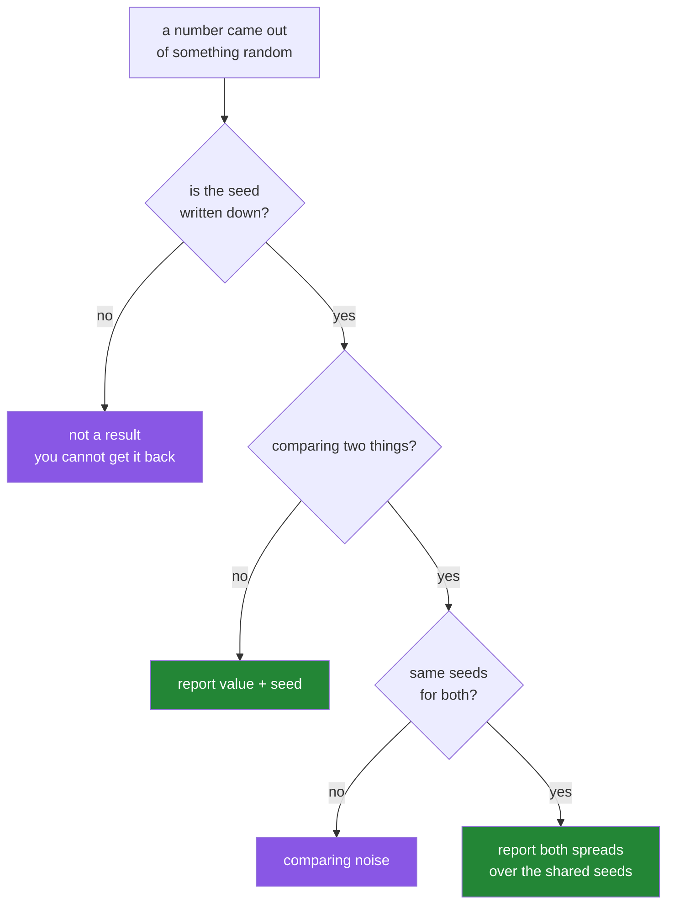

# 4.2 — The seed is part of the result

## One-line answer

A number produced with randomness in it is not a fact until you can say which seed produced it — so
the seed is recorded and reported alongside the answer, and a single unrepeated run is a guess
wearing a decimal point.

---

## The story

Two people are arguing about which of two walking routes is longer.

One of them walks route A on Monday and gets 8 213 steps. The other walks route B on Tuesday and
gets 8 940 steps. Route B wins by seven hundred steps, and that seems settled.

Then somebody points out that Monday was dry and Tuesday it rained, so one of them took the covered
way round the car park. And one of them was carrying shopping. And the phone counts differently in
a coat pocket than in a hand.

So they do it again. This time route A gives 8 601 and route B gives 8 455. Route A wins.

Nobody was lying either time. Both numbers were real measurements. What was missing was any sense of
how much a single measurement of the same route varies — and until you know that, a seven hundred
step gap means nothing at all.

The fix is not a better step counter. It is walking each route several times, and writing down which
day each number came from.

---

## The idea in plain language

Anything with randomness in it produces a **distribution of answers**, not an answer. The seed
chooses which one of those answers you happen to see.

That gives you three obligations, and they are the whole of this part.

**Record the seed with the result.** A number in a report, a model checkpoint, a benchmark, a
notebook cell — if randomness went into it, the seed goes next to it. Otherwise nobody, including
you next month, can get that number back. This is Principle 4 applied to randomness: the seed is a
pin, exactly like a version number, and an unpinned seed is an unpinned dependency.

**Never compare two things on one seed each.** If model A scores 0.83 with seed 20 and model B
scores 0.85 with seed 21, you have learned nothing, because the seed-to-seed variation might be
larger than 0.02. The honest comparison runs both across the *same set* of several seeds and
compares the spreads.

**Report the spread, not just the middle.** "0.84" is a claim you cannot check. "0.84, ranging from
0.81 to 0.86 across five seeds" is a claim somebody can disagree with, which is what makes it a
result.

Two things a seed does **not** buy you, which people assume it does.

**A seed does not make results portable across libraries or versions.** The same seed gives
different numbers in NumPy's legacy API and its `Generator` API
([4.1](4.1-default-rng-the-generator.md)), and different numbers again in Python's `random` module,
in PyTorch and in scikit-learn — each has its own generator. A pipeline with three sources of
randomness needs three seeds set, or one seed threaded through all three
([4.3](4.3-passing-the-generator.md)).

**A seed does not make a result true.** Fixing the seed makes it *reproducible*, which is a
different and lesser property. A reproducibly wrong number is still wrong, and choosing the seed
that gives the best score — sometimes politely called seed hunting — is a way of reporting noise
as a finding.

One more term, since it appears constantly from Day 42 on. Libraries usually spell this parameter
**`random_state=`** rather than `seed=`, and it accepts either an integer or a `Generator`. The
project rule is the same either way: pass it, every time, explicitly.

---

## Why Setu needs it

- **Principle 4 names it directly: `random_state=` on every estimator.** This part is why that
  sentence is in the plan.
- **Day 42's train/test split decides which rows a model never sees.** Two seeds give two different
  test sets and two different scores, and reporting the friendlier one is the most common quiet
  dishonesty in applied machine learning.
- **Day 233's eval suite gates the whole capstone.** A test that fails one run in five because of an
  unseeded shuffle teaches everybody to ignore failures, which is worse than having no test.
- **Day 239's portfolio README reports numbers to a reader who cannot rerun them.** Every number
  there carries its seed, or it is decoration.

---

## The mechanism

How much does a seed actually move an answer? Measure it rather than assuming.

```python
import numpy as np

TRUE_MEAN = 9000
SPREAD = 2000
SAMPLE = 30

for seed in (20, 21, 22, 23, 24):
    sample = np.random.default_rng(seed).normal(TRUE_MEAN, SPREAD, SAMPLE)
    print(f"seed {seed}: mean {sample.mean():8.1f}  std {sample.std(ddof=1):8.1f}")
```

**Line by line:**

- `TRUE_MEAN` and `SPREAD` as named constants — the point of the demonstration is that the answers
  *should* all be 9 000 and are not, so the true value has to be visible.
- `SAMPLE = 30` — thirty days of steps. Small enough that sampling noise is obvious, which is exactly
  the size of many real experiments.
- `np.random.default_rng(seed)` inside the loop — a fresh generator per seed, so each line is one
  independent experiment rather than a continuation of the last.
- `sample.std(ddof=1)` — the **sample** standard deviation. NumPy's default is `ddof=0`, the
  population version, which understates the spread for a sample. Passing it is Principle 4 again:
  the default is a framework default.
- `{sample.mean():8.1f}` — fixed width and one decimal, so the column lines up and the variation is
  readable at a glance rather than buried in seventeen digits.

```text
seed 20: mean   8420.5  std   2067.3
seed 21: mean   9397.2  std   2169.4
seed 22: mean   8784.0  std   2266.1
seed 23: mean   8972.2  std   2025.5
seed 24: mean   8740.4  std   2003.2
```

**The five means span 8 420 to 9 397.** That is a range of almost a thousand steps, from five runs
of exactly the same code, differing only in a number nobody would think to write down. If somebody
reported "9 397.2" from seed 21, every digit of it would be true and the impression it gives would
be false.

Now the comparison mistake, made and then corrected:

```python
import numpy as np

TRUE_MEAN = 9000
SPREAD = 2000
SAMPLE = 30


def measure(seed: int, bonus: float) -> float:
    """A fake 'treatment' that adds a fixed bonus to every reading."""
    return float(np.random.default_rng(seed).normal(TRUE_MEAN, SPREAD, SAMPLE).mean() + bonus)


print("one seed each:")
print(f"  route A (no bonus, seed 22): {measure(22, 0.0):8.1f}")
print(f"  route B (no bonus, seed 23): {measure(23, 0.0):8.1f}")
print()

seeds = range(20, 40)
a = np.array([measure(s, 0.0) for s in seeds])
b = np.array([measure(s, 0.0) for s in seeds])
print("twenty shared seeds, no real difference:")
print(f"  A mean {a.mean():8.1f}  range {a.min():8.1f} to {a.max():8.1f}")
print(f"  B mean {b.mean():8.1f}  range {b.min():8.1f} to {b.max():8.1f}")
print(f"  identical? {np.array_equal(a, b)}")
```

**Line by line:**

- `measure(seed, bonus)` — one function, so the two "routes" differ only in the bonus. With
  `bonus=0.0` for both, **there is no real difference at all**, and anything the comparison shows is
  noise.
- `measure(22, 0.0)` against `measure(23, 0.0)` — the wrong comparison. Two different seeds, one run
  each, no difference in the underlying thing being measured.
- `seeds = range(20, 40)` — **the same twenty seeds for both**, which is the correction. Sharing the
  seeds removes the seed as a source of difference, so any remaining gap is real.
- `float(...)` in `measure` — returns a plain Python float rather than a `np.float64`, so the results
  go cleanly into a report or a JSON file.
- `np.array_equal(a, b)` — `True`, because with the same seeds and no bonus the two are literally
  identical. That is the demonstration: **once the seeds are shared, a difference of zero looks like
  zero.**

```text
one seed each:
  route A (no bonus, seed 22):   8784.0
  route B (no bonus, seed 23):   8972.2

twenty shared seeds, no real difference:
  A mean   8936.8  range   8420.5 to   9397.2
  B mean   8936.8  range   8420.5 to   9397.2
  identical? True
```

Read the first two lines and then the last three. **Route B "beat" route A by 188 steps, and the two
routes are the same route.** The twenty-seed version shows the truth: identical means, identical
ranges, and a per-seed spread of almost a thousand steps that dwarfs the "difference" the
single-seed comparison found.

The decision, as a picture:



---

## When it breaks

**Two generators, one seed set:**

```text
$ uv run python -c "
import random
import numpy as np
np.random.seed(20)
random.seed(20)
print('numpy new   :', np.random.default_rng(20).random(3))
print('stdlib      :', [round(random.random(), 8) for _ in range(3)])
print('numpy legacy:', np.random.rand(3))
"
numpy new   : [0.28007596 0.46114671 0.12171969]
stdlib      : [0.90563968, 0.68625416, 0.76650926]
numpy legacy: [0.5881308  0.89771373 0.89153073]
```

**What it means.** Three generators, three different sequences, and setting one has no effect on the
others. A pipeline that shuffles with Python's `random`, splits with NumPy and initialises weights
with PyTorch has **three** independent sources of randomness, and seeding two of them produces a
result that is reproducible only two thirds of the way. The symptom is a run that is *almost* the
same each time, which is more confusing than one that is completely different.

**A seed that is not where you think it is:**

```text
$ uv run python -c "
import numpy as np
rng = np.random.default_rng(20)

def experiment():
    return rng.random(3).mean()

print('call 1:', experiment())
print('call 2:', experiment())
print('call 3:', experiment())
"
call 1: 0.2876474550031811
call 2: 0.3344721025659341
call 3: 0.5931076407142885
```

**What it means.** The seed was set once, outside the function, so the three calls are three
consecutive slices of one stream and give three different answers. That is often what you want, and
it is emphatically **not** reproducible per call: run `experiment()` a fourth time and you get a
fourth answer. If each call must be repeatable on its own, the seed goes inside — or better, the
generator is a parameter ([4.3](4.3-passing-the-generator.md)).

**Seed hunting, in the open:**

```text
$ uv run python -c "
import numpy as np
scores = {s: float(np.random.default_rng(s).normal(0.84, 0.02, 20).mean()) for s in range(10)}
best = max(scores, key=scores.get)
worst = min(scores, key=scores.get)
print(f'best  seed {best}: {scores[best]:.4f}')
print(f'worst seed {worst}: {scores[worst]:.4f}')
print(f'mean over all ten : {np.mean(list(scores.values())):.4f}')
"
best  seed 6: 0.8493
worst seed 7: 0.8337
mean over all ten : 0.8394
```

**What it means.** Ten seeds, one underlying process, and the reportable number ranges from 0.8337
to 0.8493 depending only on which seed you choose to mention. Reporting `0.8493` is not fabrication
— the run happened, the code is correct, anybody can reproduce it — and it is still misleading,
because the selection was the finding. **The defence is to fix the seed list before you look at the
scores**, and to report all of them. Note also that the mean over all ten, 0.8394, is below the
0.84 the data was generated from — twenty samples is simply not many.

**An unseeded default in a helper:**

```text
$ uv run python -c "
import numpy as np

def split(n, *, rng=None):
    rng = rng or np.random.default_rng()
    return rng.permutation(n)[:3]

print('call 1:', split(10))
print('call 2:', split(10))
print('with a seed:', split(10, rng=np.random.default_rng(20)))
print('with a seed:', split(10, rng=np.random.default_rng(20)))
"
call 1: [3 0 8]
call 2: [4 5 2]
with a seed: [8 7 4]
with a seed: [8 7 4]
```

**What it means.** `rng=None` with a fallback to `default_rng()` looks like a kindness and is a trap:
the function is reproducible **only if every caller remembers to pass a generator**, and the two
that forget get silently different data. A helper that can be non-deterministic without anybody
saying so will be, eventually, in the one place it matters. Make `rng` required.

---

## In production

**What a professional writes instead of the teaching version.** The seed is an input to the program,
it is logged with the output, and multi-seed runs are the default rather than a special occasion:

```python
import json
import numpy as np

SEEDS = (20, 21, 22, 23, 24)


def evaluate(seed: int) -> float:
    """One run of whatever is being measured. Deterministic given the seed."""
    rng = np.random.default_rng(seed)
    return float(rng.normal(0.84, 0.02, 200).mean())


def report() -> str:
    """Every number a reader needs to disagree with the claim."""
    scores = np.array([evaluate(seed) for seed in SEEDS])
    return json.dumps(
        {
            "seeds": list(SEEDS),
            "scores": [round(float(s), 4) for s in scores],
            "mean": round(float(scores.mean()), 4),
            "std": round(float(scores.std(ddof=1)), 4),
            "numpy": np.__version__,
        },
        indent=2,
    )
```

**Line by line:**

- `SEEDS = (20, 21, 22, 23, 24)` — a **tuple**, so it cannot be modified after the fact, and a module
  constant, so it appears in a diff when somebody changes it. Fixing the seed list before looking at
  the scores is what makes the report honest.
- `evaluate(seed)` takes the seed and builds its own generator — correct here because each run is
  deliberately independent, unlike the shared-stream case in
  [4.3](4.3-passing-the-generator.md).
- `float(...)` around the mean — a plain Python float, because `np.float64` is not JSON-serialisable
  and `json.dumps` would raise on it.
- `"scores": [...]` — **every individual score, not only the summary.** A reader who has only the
  mean cannot tell one lucky run from five consistent ones.
- `"std": ...` with `ddof=1` — the sample standard deviation over the five runs. This is the number
  that says whether a rival's 0.85 is meaningfully better than your 0.84.
- `"numpy": np.__version__` — the library version, because a seed only reproduces a result together
  with the generator that consumed it. A NumPy upgrade can legitimately change the numbers, and this
  field is what lets somebody two years from now tell that apart from a real regression.
- `json.dumps(..., indent=2)` — machine-readable, so the report can be diffed between runs and
  checked by a test rather than read by eye.

**What changes at scale.** Multi-seed evaluation multiplies your compute by the number of seeds, and
at the size of a real training run that is a genuine budget decision rather than a free habit. What
teams actually do is stratify: cheap evaluations get five or ten seeds, expensive ones get three,
and the number is stated in the report. What they do not do is drop to one and stay quiet about it.

A second scale problem is that full determinism gets harder as the system grows. Parallel reductions
sum in whatever order threads finish, and floating-point addition is not associative
([2.3](../02-dtypes/2.3-floats-nan-and-precision.md)), so the same seed on the same data can give
answers that differ in the last few bits — and on a GPU, sometimes more than that. The professional
position is to seed everything you can, record the versions, and assert with a tolerance rather than
with `==`.

**The failure that only appears with real data.** A team compared two retrieval configurations on
one shuffle each and shipped the winner. Three months later somebody reran the comparison across ten
seeds and found the two were indistinguishable — the original 3% gap was inside the seed-to-seed
noise. The change had been shipped, defended in a review, and built upon, and undoing it cost more
than the original evaluation would have.

**The review comment a senior engineer leaves.** *"This reports 0.8503 from a single run. Please run
the fixed seed list and report the mean and the standard deviation, and put the seeds in the output
— right now nobody can tell whether the improvement is real or which of ten runs this was."*

**The interview question.** *"Why do you set a random seed?"* The weak answer is "for
reproducibility", which is true and stops too early. The full answer is that anything random
produces a distribution of results and the seed selects one sample from it, so the seed is part of
the result and belongs next to it. That has three consequences: a reported number without its seed
cannot be checked; comparing two systems on one seed each compares noise, so you use a shared list
of seeds and report the spread; and picking the seed that flatters your result is a way of
publishing noise. The detail that shows experience is that a seed does not travel — Python's
`random`, NumPy, and PyTorch each have their own generator, and full determinism also depends on
library versions and on thread scheduling in parallel reductions.

---

## Check yourself

```bash
uv run python -c "
import numpy as np
for seed in range(20, 25):
    sample = np.random.default_rng(seed).normal(9000, 2000, 30)
    print(f'seed {seed}: mean {sample.mean():8.1f}')
print('true mean was 9000')
"
```

Five runs of identical code. Write down the largest and the smallest, then say what an "improvement"
of 200 steps would be worth.

**Answer out loud, without scrolling up:**

> Why is a score reported without its seed not a result? Then say what is wrong with comparing model
> A on seed 20 against model B on seed 21.

---

**Next:** [4.3 — passing the generator, not the seed](4.3-passing-the-generator.md).
