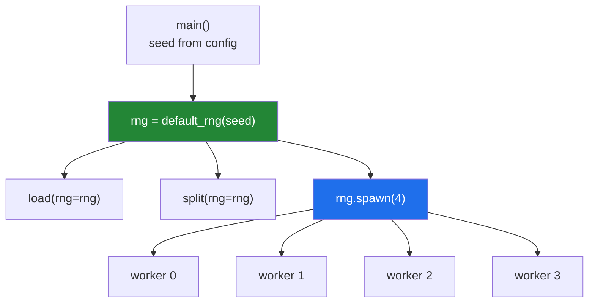

# 4.3 — Passing the generator, not the seed — and `spawn` for parallel work

## One-line answer

A function that takes a `Generator` draws from the caller's one stream and stays reproducible; a
function that takes a *seed* and builds its own generator gives identical output on every call,
which is a bug that looks like a feature — and for parallel workers, `rng.spawn(n)` is the only safe
way to hand out independent streams.

---

## The story

Three people are each dealing a hand of cards from their own deck.

They want the deal to be repeatable, so somebody has a good idea: everyone shuffles their deck the
same number of times, starting from a brand-new pack in factory order.

It works. The deal is repeatable. It is also identical — all three of them deal exactly the same
hand, because they started from the same place and did the same thing.

Nobody notices at first, because each person only looks at their own cards.

The fix is not to abandon the idea. It is to keep one shuffled deck for the table and deal from it
three times, so each hand comes from a different part of the same known shuffle. One starting point,
three different hands, and you can still replay the whole evening.

---

## The idea in plain language

There are two ways to give a function access to randomness, and they behave completely differently.

**Passing a seed.** The function does `rng = np.random.default_rng(seed)` internally. Every call with
that seed rebuilds the generator from scratch, so **every call returns the same numbers**. Call it
three times in a loop and you get three identical results.

**Passing the generator.** The function takes `rng: np.random.Generator` and uses it. The generator
advances as it is used, so consecutive calls get consecutive parts of one stream — different from
each other, and reproducible as a whole because the stream started from a known seed.

The second is almost always what you want, and the rule is short:

> **Seeds are created at the edge of a program. Generators are passed through it.**

One `make_rng(seed)` at the top of `main`, and everything below takes `rng` as a parameter. That way
the program has exactly one place where randomness begins, the seed appears in one log line, and no
function can secretly be non-deterministic.

**Now the parallel problem, which is where this stops being tidiness and becomes correctness.**

When work is split across processes, each worker needs its own stream. Three obvious approaches all
fail:

- **Share one generator across processes.** Impossible — each process has its own memory, so after a
  fork they are separate copies that produce *identical* sequences.
- **Give each worker the same seed.** Same problem, stated more honestly.
- **Give each worker seed + i.** Better, and still wrong. Nearby seeds are not guaranteed to give
  independent streams; for some generators they produce sequences that overlap or correlate. It
  usually works and it is not something to rely on.

The correct approach is **`rng.spawn(n)`**, which asks the generator for `n` children that are
constructed to be statistically independent, all derived from the parent's seed. One seed at the
top, `n` provably independent streams below, and the whole thing replays exactly.

Under the hood, `spawn` uses the `SeedSequence` machinery that NumPy's generator API was designed
around — the same design described in *NEP 19 — Random number generator policy* (2018,
<https://numpy.org/neps/nep-0019-rng-policy.html>). You do not need the details; you need to know
that `spawn` exists and that seed arithmetic is not a substitute for it.

Threads have a second problem on top of this one. A `Generator` is **not thread-safe**: two threads
drawing from it at the same time can interleave and corrupt its state. Since threads share memory,
the fix is one generator per thread, again from `spawn`. This is the same shared-mutable-state
hazard you met with the counter that lost updates on
[Day 19, 4.3](../../../day-19-typing-dataclasses-and-concurrency/parts/04-concurrency/4.3-threads.md).

---

## Why Setu needs it

- **Day 25's stats module takes an `rng` parameter**, and its tests pass a seeded one, which is how
  a test of random behaviour can go RED deliberately (Principle 7).
- **Day 42's cross-validation needs k independent splits from one seed**, which is exactly what
  `spawn` is for.
- **Day 130's data loader augments in worker processes.** Without `spawn`, every worker applies the
  same crops and flips, and the effective dataset shrinks by the number of workers with nothing to
  show it.
- **Day 19's `asyncio` and `ProcessPoolExecutor` work becomes relevant the moment randomness is
  involved**, and this part is the bridge between those two days.

---

## The mechanism

The seed-taking function, and why it is wrong.

```python
import numpy as np


def pick_days_by_seed(steps: np.ndarray, n: int, seed: int) -> np.ndarray:
    """Wrong: rebuilds the generator every call, so every call is the same."""
    rng = np.random.default_rng(seed)
    return rng.choice(steps, size=n, replace=False)


def pick_days(steps: np.ndarray, n: int, *, rng: np.random.Generator) -> np.ndarray:
    """Right: draws from the caller's stream, so consecutive calls differ."""
    return rng.choice(steps, size=n, replace=False)


week = np.array([8213, 10442, 6180, 0, 12007, 9631, 7204])

print("by seed:")
for _ in range(3):
    print("  ", pick_days_by_seed(week, 3, seed=20))

print("by generator:")
shared = np.random.default_rng(20)
for _ in range(3):
    print("  ", pick_days(week, 3, rng=shared))
```

**Line by line:**

- `pick_days_by_seed(..., seed: int)` — the version that looks reproducible. `np.random.default_rng`
  runs inside, so the generator is brand new on every call and starts from the same point.
- `pick_days(..., *, rng: np.random.Generator)` — keyword-only and required. The caller owns the
  stream; this function only borrows it and advances it.
- `replace=False` — no day picked twice, stated rather than inherited
  ([4.1](4.1-default-rng-the-generator.md)).
- The two loops are identical apart from which function they call, so the output is a controlled
  comparison.

```text
by seed:
   [12007  7204 10442]
   [12007  7204 10442]
   [12007  7204 10442]
by generator:
   [12007  7204 10442]
   [10442     0  8213]
   [ 7204  8213 10442]
```

**Three identical rows against three different ones.** Both are reproducible — run the whole script
again and you get exactly this output — but the first one is reproducible in a way that destroys the
point of sampling. In a bootstrap, a cross-validation or an augmentation loop, that is the whole
experiment silently collapsing to one repeated draw.

Now the parallel version, done wrong and then right:

```python
import numpy as np

parent = np.random.default_rng(20)

same_seed = [np.random.default_rng(20) for _ in range(3)]
nearby = [np.random.default_rng(20 + i) for i in range(3)]
children = parent.spawn(3)

print("all workers, same seed:")
for i, rng in enumerate(same_seed):
    print(f"  worker {i}: {rng.random(3)}")

print("workers with seed + i:")
for i, rng in enumerate(nearby):
    print(f"  worker {i}: {rng.random(3)}")

print("workers from parent.spawn(3):")
for i, rng in enumerate(children):
    print(f"  worker {i}: {rng.random(3)}")
```

**Line by line:**

- `[np.random.default_rng(20) for _ in range(3)]` — three generators from one seed. **This is what a
  forked worker pool does by accident**, because each child inherits the parent's state.
- `[np.random.default_rng(20 + i) for i in range(3)]` — the seed-arithmetic approach. It does produce
  different streams here, and it carries no guarantee that they are independent, which is a different
  and weaker claim.
- `parent.spawn(3)` — three children derived from the parent's seed sequence, constructed to be
  independent. **One seed at the top of the program, three provably independent streams below.**
- `enumerate(...)` — the worker index printed alongside, so the identical rows in the first block are
  unmissable.

```text
all workers, same seed:
  worker 0: [0.28007596 0.46114671 0.12171969]
  worker 1: [0.28007596 0.46114671 0.12171969]
  worker 2: [0.28007596 0.46114671 0.12171969]
workers with seed + i:
  worker 0: [0.28007596 0.46114671 0.12171969]
  worker 1: [0.78111759 0.60584703 0.70980119]
  worker 2: [0.36634692 0.19929538 0.08855837]
workers from parent.spawn(3):
  worker 0: [0.11863563 0.21805977 0.9670422 ]
  worker 1: [0.55098457 0.64582006 0.01163923]
  worker 2: [0.8591958  0.64818449 0.09509629]
```

The first block is the bug: three workers, one sequence, three identical batches. The third block is
the fix, and it costs one method call.

And `spawn` really does replay:

```python
import numpy as np


def worker_output(parent_seed: int, n_workers: int) -> list[float]:
    """What a whole pool produces, from one seed."""
    children = np.random.default_rng(parent_seed).spawn(n_workers)
    return [float(child.random(5).mean()) for child in children]


first = worker_output(20, 4)
second = worker_output(20, 4)
print("run 1:", [round(v, 6) for v in first])
print("run 2:", [round(v, 6) for v in second])
print("identical run to run :", first == second)
print("distinct within a run:", len(set(first)) == len(first))
```

**Line by line:**

- `worker_output(parent_seed, n_workers)` — the whole pool's behaviour as one function of one seed.
  That is the property to aim for: the program has a single random input.
- `.spawn(n_workers)` — the children are derived deterministically from the parent's seed, so the
  same seed and the same worker count give the same set of children every time.
- `first == second` — **`True`.** The pool replays exactly, which is what makes a parallel job
  debuggable.
- `len(set(first)) == len(first)` — **`True`.** The four workers produced four different results, so
  they are genuinely independent streams and not four copies. **Both checks matter**, and testing
  only the first is how the identical-workers bug survives a test suite.

```text
run 1: [0.494157, 0.359167, 0.546368, 0.373392]
run 2: [0.494157, 0.359167, 0.546368, 0.373392]
identical run to run : True
distinct within a run: True
```

Where randomness enters a program:



One green box in the whole program. That is the target.

---

## When it breaks

**Forked workers producing identical data:**

```text
$ cat pool_bad.py
import numpy as np
from concurrent.futures import ProcessPoolExecutor


def draw(_):
    return round(float(np.random.default_rng(20).random()), 6)


if __name__ == "__main__":
    with ProcessPoolExecutor(max_workers=3) as pool:
        print("same seed inside:", list(pool.map(draw, range(3))))

$ uv run python pool_bad.py
same seed inside: [0.280076, 0.280076, 0.280076]
```

**What it means.** Three workers, three identical numbers. Each one built its own generator from the
same hard-coded seed, so the "parallel" work was one piece of work done three times. Nothing raises
and the shapes are all correct. **In an augmentation pipeline this is invisible** — every worker
returns a plausible augmented batch — and the only symptom is a model that behaves as though the
dataset were smaller than it is.

**A generator shared across threads:**

```text
$ uv run python -c "
import numpy as np
from concurrent.futures import ThreadPoolExecutor

rng = np.random.default_rng(20)

def draw(_):
    return rng.random(1000).sum()

with ThreadPoolExecutor(max_workers=4) as pool:
    totals = list(pool.map(draw, range(4)))
print('four totals:', [round(t, 4) for t in totals])
print('all distinct:', len(set(totals)) == 4)
"
four totals: [np.float64(491.7463), np.float64(501.7429), np.float64(489.1169), np.float64(496.8635)]
all distinct: True
```

**What it means.** Four distinct totals, so this one *appears* to work — which is the worst kind of
concurrency bug. Note also that `round()` on a `np.float64` gives back a `np.float64`, which is why
the list prints with the type wrapped around each value. A
`Generator` holds mutable state that is advanced on every draw, and NumPy makes no thread-safety
promise about it, so two threads drawing at once can interleave. Most of the time the operating
system schedules them apart and nothing goes wrong; occasionally two draws collide and the results
are not what any single-threaded run would produce. It is also non-reproducible even with a seed,
because thread scheduling is not deterministic. **One generator per thread, from `spawn`.**

**A "reproducible" function that is not:**

```text
$ uv run python -c "
import numpy as np

def augment(batch, *, rng=None):
    rng = rng if rng is not None else np.random.default_rng()
    return batch + rng.normal(0, 1, batch.shape)

batch = np.zeros(3)
print('call 1:', np.round(augment(batch), 4))
print('call 2:', np.round(augment(batch), 4))
"
call 1: [ 0.1744 -1.9278  0.2876]
call 2: [-0.9785 -0.2602  0.0085]
```

**What it means.** The default `rng=None` makes the parameter optional, so a caller who forgets it
gets an unseeded generator and unreproducible output — with no warning, and with a signature that
advertises reproducibility. This is the single most common way a "seeded" pipeline turns out not to
be. **Make `rng` a required keyword argument**, so forgetting it is a `TypeError` rather than a
quiet loss of determinism.

**`spawn` called twice on the same parent:**

```text
$ uv run python -c "
import numpy as np
parent = np.random.default_rng(20)
a = parent.spawn(2)
b = parent.spawn(2)
print('first  spawn:', [round(float(c.random()), 6) for c in a])
print('second spawn:', [round(float(c.random()), 6) for c in b])
"
first  spawn: [0.118636, 0.550985]
second spawn: [0.859196, 0.030039]
```

**What it means.** The parent tracks how many children it has produced, so a second `spawn` gives
*new* children rather than repeating the first two. That is the right behaviour and it has a
consequence: **the children you get depend on how many times `spawn` has already been called**, so
adding a `spawn` call earlier in the program changes every worker's data downstream. Spawn once, at
the point where the pool is created, and keep the children.

---

## In production

**What a professional writes instead of the teaching version.** One entry point creates the
generator, every function below takes it as a required keyword, and the pool gets children:

```python
import numpy as np
from concurrent.futures import ProcessPoolExecutor


def augment(batch: np.ndarray, *, rng: np.random.Generator) -> np.ndarray:
    """Add noise using the caller's stream. Never creates a generator."""
    return batch + rng.normal(0.0, 1.0, batch.shape)


def run_pool(batches: list[np.ndarray], *, seed: int, workers: int) -> list[np.ndarray]:
    """One seed in, independent worker streams out, fully replayable."""
    children = np.random.default_rng(seed).spawn(workers)
    with ProcessPoolExecutor(max_workers=workers) as pool:
        return list(pool.map(_one, batches, [children[i % workers] for i in range(len(batches))]))


def _one(batch: np.ndarray, rng: np.random.Generator) -> np.ndarray:
    return augment(batch, rng=rng)
```

**Line by line:**

- `*, rng: np.random.Generator` on `augment` — required, keyword-only, no default. A caller who
  forgets it gets `TypeError: augment() missing 1 required keyword-only argument: 'rng'` at the call
  site, which is exactly the right failure.
- `np.random.default_rng(seed).spawn(workers)` — **the only place a generator is constructed.** One
  seed, `workers` independent children, derived rather than guessed.
- `children[i % workers]` — each batch is assigned a child. Note that with more batches than workers
  the children are reused, so batches sharing a child draw from consecutive parts of that child's
  stream — still independent of the other children, and still replayable.
- `ProcessPoolExecutor` — processes, not threads, because augmentation is CPU-bound and the GIL
  would serialise threads
  ([Day 19, 4.2](../../../day-19-typing-dataclasses-and-concurrency/parts/04-concurrency/4.2-the-gil.md)).
- `_one` as a module-level function — `pool.map` has to pickle what it sends to workers, and a
  `lambda` or a closure cannot be pickled. A leading underscore marks it private
  ([Day 13, 3.1](../../../day-13-inheritance-and-abstraction/parts/03-encapsulation/3.1-public-protected-private.md)).
- A `Generator` **is** picklable, which is what makes passing children to workers possible at all.

**What changes at scale.** Three things. First, the number of workers becomes part of the result:
`spawn(4)` and `spawn(8)` give different children, so changing the worker count changes the data
even with the same seed. That is unavoidable, and the fix is to record the worker count next to the
seed ([4.2](4.2-the-seed-is-part-of-the-result.md)). Second, on a GPU there is a separate generator
entirely, and seeding NumPy does nothing for it. Third, at very large scale even `spawn` needs care:
generating a hundred thousand children from one parent is fine, but re-spawning inside a loop is not,
because each call advances the parent and the children stop being stable across code changes.

**The failure that only appears with real data.** A team's augmentation pipeline used
`np.random.seed(config.seed)` at import time and eight forked data-loader workers. Every worker
produced identical augmentations for two years. Validation accuracy was consistently a few points
below what the same architecture achieved elsewhere, and the difference was attributed to the
dataset. The bug was found only when somebody printed a batch from each worker side by side.

**The review comment a senior engineer leaves.** *"`rng=None` defaulting to a fresh generator makes
this function silently non-deterministic when a caller forgets. Make it required. And the pool
should get `parent.spawn(n_workers)` rather than `seed + i` — adjacent seeds are not guaranteed
independent."*

**The interview question.** *"How do you make a parallel job with randomness reproducible?"* One seed
at the entry point, a single `Generator` built from it, and `rng.spawn(n)` to give each worker an
independent child stream — then record the seed and the worker count with the result, because
changing the worker count changes the children. The failure to name unprompted is the fork problem:
workers that build their own generator from a shared seed, or that inherit the parent's state,
produce **identical** data with no error at all, and in an augmentation pipeline that silently
shrinks the dataset by a factor of the worker count. Adding that a `Generator` is not thread-safe,
so threads also need one each, shows you have hit this rather than read about it.

---

## Check yourself

```bash
uv run python -c "
import numpy as np
parent = np.random.default_rng(20)
children = parent.spawn(3)
for i, child in enumerate(children):
    print(f'child {i}:', child.random(3))
print()
again = np.random.default_rng(20).spawn(3)
print('replays?', all(np.array_equal(a.random(3), b.random(3)) for a, b in zip(np.random.default_rng(20).spawn(3), again, strict=True)))
"
```

Three different rows, and the last line says the whole set replays. Both facts have to hold.

**Answer out loud, without scrolling up:**

> Why does a function that takes a seed and builds its own generator return the same thing every
> call? Then say what is wrong with giving worker *i* the seed `base + i`.

---

**Next:** [5.1 — reading the week in, typed on purpose](../05-the-module/5.1-reading-the-week-typed-on-purpose.md).
