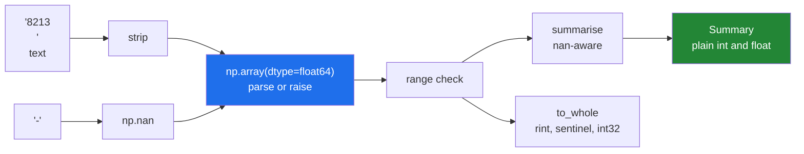

# 5.1 — Reading the week in, typed on purpose

## One-line answer

Every idea from today lands in one small module: parse text at the boundary with a **stated dtype**,
keep the missing day as `NaN` rather than zero, narrow to a small integer type only after checking
the range, and return plain Python types to whatever comes next.

---

## The story

The step counts have been living in the phone. Somebody exports them, and what comes out is a text
file — one number per line, and a dash on Thursday because the phone had nothing to report.

```text
8213
10442
6180
-
12007
9631
7204
```

Seven lines. Six numbers and a dash.

Whoever reads this file has to make four decisions, and the file itself makes none of them.

What is the dash? Not zero — nobody walked zero steps, the phone was simply not there. What type are
the numbers? They are text on the page and counts in the world. How wide should the numbers be
stored? And what happens if line four of next month's file says `rest` instead of a dash?

Those four decisions are the entire module. Getting them right at the point where the text becomes
numbers is what stops all four coming back as bugs somewhere further downstream.

---

## The idea in plain language

This part assembles the day. Nothing new is introduced; everything here has a part behind it.

**The boundary is where types are decided.** Text arrives from outside — a file, an API, a database
cursor — and the moment it becomes an array is the moment its dtype is fixed. State it, and let bad
data fail there ([2.1](../02-dtypes/2.1-a-dtype-is-a-promise.md)) rather than three modules later.

**A missing value is not a zero.** Thursday's dash means "unknown", and writing 0 would be a claim
that the person stood still. `np.nan` is the value that means "no number", and it forces the array
to be `float64` ([2.3](../02-dtypes/2.3-floats-nan-and-precision.md)). That is a real cost and it
buys honesty: `values.mean()` comes back as `nan`, which is the array insisting somebody decide what
Thursday counts as.

**Narrow late, and check first.** `int32` halves the memory of `int64`
([2.2](../02-dtypes/2.2-integers-and-the-silent-wrap.md)) and cannot hold `NaN`, so narrowing is a
separate step that needs a sentinel for the missing day and a range check before the cast
([2.4](../02-dtypes/2.4-astype-and-the-copy.md)).

**Return plain Python types at the far boundary.** `np.int64` is not JSON-serialisable and
`np.float64` prints as `np.float64(8946.17)` in a log. A summary object made of `int` and `float` is
what the rest of the world can use.

The shape of the module, in four functions:

| Function | Job | Decisions it makes |
|---|---|---|
| `load_counts(rows)` | text → `float64` array | what a dash means, what a bad row does |
| `to_whole(values)` | `float64` → `int32` array | the sentinel, the range check, round not truncate |
| `summarise(values)` | array → `Summary` | which statistics, and how holes are handled |
| `Summary` | the result | plain Python types, frozen |

One design point worth stating, because it is the reason there are two array functions rather than
one. **`load_counts` and `to_whole` are separate because they answer different questions.** The
first asks "is this data at all"; the second asks "does it fit in the storage we chose". Merging
them would mean a range error and a parse error arriving through the same door with the same
message.

---

## Why Setu needs it

- **Day 25's vectorised stats module extends exactly this file**, adding the reductions that must
  beat a loop by 50×. The parsing and typing done here is what it builds on.
- **Day 27 does the same job with pandas**, and having written it by hand once is what makes
  `pd.read_csv(dtype=...)` legible rather than magic — Principle 2, from scratch before library.
- **Day 44's imputer replaces the `NaN`s this module preserves.** If they had been turned into zeros
  here, there would be nothing left to impute and the model would learn from a lie.
- **Principle 6 says the notebook is a scratchpad.** This is the graduation: the code that survives
  goes into `src/setu/` with a test the same day ([5.2](5.2-the-test-that-can-go-red.md)).

---

## The mechanism

The whole module, then a run of it.

```python
"""Read a column of daily step counts into a typed array, and describe it."""

from __future__ import annotations

from dataclasses import dataclass

import numpy as np

STEP_DTYPE = np.dtype(np.int32)  # daily counts; worst realistic case ~200_000
MISSING = "-"


@dataclass(frozen=True, slots=True)
class Summary:
    """What one run of counts looks like, in plain Python types."""

    days: int
    recorded: int
    total: int
    mean: float
    best: int
    nbytes: int
```

**Line by line:**

- `from __future__ import annotations` — annotations become strings, so a forward reference costs
  nothing and there is no import-time evaluation
  ([Day 19, 1.1](../../../day-19-typing-dataclasses-and-concurrency/parts/01-type-hints/1.1-a-hint-is-a-note.md)).
- `STEP_DTYPE = np.dtype(np.int32)` — the storage decision, named once, with the reasoning in the
  comment. `np.dtype(...)` rather than the bare class so `np.iinfo(STEP_DTYPE)` and f-strings both
  behave ([2.2](../02-dtypes/2.2-integers-and-the-silent-wrap.md)).
- `MISSING = "-"` — the file's own convention, named rather than repeated as a literal.
- `@dataclass(frozen=True, slots=True)` — `frozen` because a summary of past data should not be
  edited, `slots` because it is cheap and catches typos on attribute assignment
  ([Day 19, 2.3](../../../day-19-typing-dataclasses-and-concurrency/parts/02-dataclasses/2.3-frozen-slots-kw-only.md)).
- Every field is `int` or `float`, never `np.int64` — the far boundary from the idea section above.

Parsing:

```python
def load_counts(rows: list[str]) -> np.ndarray:
    """Parse one column of daily step counts. A '-' means the day was not recorded."""
    cleaned = [np.nan if row.strip() == MISSING else row.strip() for row in rows]
    values = np.array(cleaned, dtype=np.float64)
    if np.any(values[~np.isnan(values)] < 0):
        raise ValueError(f"negative step count in input: {np.nanmin(values)}")
    return values
```

**Line by line:**

- `[np.nan if row.strip() == MISSING else row.strip() for row in rows]` — a comprehension
  ([Day 9, 1.2](../../../day-09-comprehensions/parts/01-list-comprehensions/1.2-the-filter-clause.md))
  that turns the dash into `np.nan` and leaves everything else as text. **Mixing a float and strings
  in one list is deliberate**: the next line's `dtype=np.float64` is what resolves them.
- `.strip()` — trailing newlines and stray spaces are what real files contain
  ([Day 7, 2.1](../../../day-07-strings/parts/02-methods/2.1-normalising-strip-and-case.md)).
- `np.array(cleaned, dtype=np.float64)` — **the stated dtype is the whole point.** Without it, one
  unparseable row would make the array `<U21` text and every problem would surface later
  ([2.1](../02-dtypes/2.1-a-dtype-is-a-promise.md)). With it, a bad row raises here.
- `values[~np.isnan(values)] < 0` — the domain rule, applied only to the real values. Comparing a
  `NaN` with `<` gives `False` and a `RuntimeWarning`, so masking first is both correct and quiet.
- `np.nanmin(values)` in the message — the offending value, so nobody has to reproduce the failure
  ([Day 18, 3.3](../../../day-18-exceptions/parts/03-your-own/3.3-the-message-is-an-interface.md)).

Narrowing:

```python
def to_whole(values: np.ndarray, *, fill: int = -1) -> np.ndarray:
    """Narrow to the project dtype, with a visible sentinel where a day is missing."""
    limits = np.iinfo(STEP_DTYPE)
    real = values[~np.isnan(values)]
    if real.size and (real.min() < limits.min or real.max() > limits.max):
        raise ValueError(f"values span {real.min()}..{real.max()}, outside {STEP_DTYPE}")
    out = np.full(values.shape, fill, dtype=STEP_DTYPE)
    mask = ~np.isnan(values)
    out[mask] = np.rint(values[mask]).astype(STEP_DTYPE)
    return out
```

**Line by line:**

- `*, fill: int = -1` — keyword-only, so a call reads `to_whole(v, fill=-1)` and nobody passes it by
  accident. `-1` is impossible for a step count, which is what makes it usable as a sentinel.
- `np.iinfo(STEP_DTYPE)` — the bounds come from the dtype, so changing `STEP_DTYPE` changes the check
  ([2.2](../02-dtypes/2.2-integers-and-the-silent-wrap.md)).
- `real = values[~np.isnan(values)]` — the range check applies to real values only. This is boolean
  masking, which Day 21 covers in full
  ([Day 21, 3.2](../../../day-21-indexing-and-views/parts/03-boolean-masks/3.2-indexing-with-a-mask.md)).
- `if real.size and (...)` — the `real.size` guard first, because `min()` on an empty array raises.
  Python's `and` short-circuits, so the second half never runs when the first is `False`
  ([Day 5, 2.4](../../../day-05-operators-and-conditionals/parts/02-conditionals/2.4-and-or-return-operands.md)).
- `np.full(values.shape, fill, dtype=STEP_DTYPE)` — the output starts as **all sentinel**, so any
  position the code forgets to write stays visibly unwritten. `np.empty` here would leave garbage
  ([3.2](../03-creating/3.2-zeros-ones-full-and-empty.md)).
- `np.rint(values[mask])` — **round, then cast.** `astype` alone truncates, which biases every value
  downwards ([2.4](../02-dtypes/2.4-astype-and-the-copy.md)).
- `out[mask] = ...` — assignment through a boolean mask writes only the real days and leaves the
  sentinel in place for Thursday.

Summarising:

```python
def summarise(values: np.ndarray) -> Summary:
    """Describe a run of counts without letting one missing day poison the answer."""
    if values.dtype.kind != "f":
        raise TypeError(f"expected a float array, got {values.dtype}")
    recorded = int(np.count_nonzero(~np.isnan(values)))
    if recorded == 0:
        raise ValueError("no recorded days")
    return Summary(
        days=int(values.size),
        recorded=recorded,
        total=int(np.nansum(values)),
        mean=float(np.nanmean(values)),
        best=int(np.nanmax(values)),
        nbytes=int(to_whole(values).nbytes),
    )
```

**Line by line:**

- `values.dtype.kind != "f"` — the family check, so `float32` and `float64` both pass and an integer
  array is refused ([2.1](../02-dtypes/2.1-a-dtype-is-a-promise.md)). An integer array cannot carry
  `NaN`, so being handed one means the caller has already lost the missing days.
- `np.count_nonzero(~np.isnan(values))` — **how many days are real, reported rather than assumed.**
  This is the number that tells a reader whether the mean is over seven days or over six.
- `if recorded == 0: raise ValueError(...)` — every statistic below would be `nan`, and a summary of
  nothing is a caller error rather than a legitimate answer.
- `np.nansum`, `np.nanmean`, `np.nanmax` — the `nan`-skipping family. **Using these is the decision
  that Thursday is excluded**, not treated as zero, and it is a decision the code makes visibly.
- `int(...)` and `float(...)` on every field — plain Python types out, as argued above.
- `to_whole(values).nbytes` — the storage cost of this run, computed rather than guessed
  ([1.2](../01-the-block/1.2-shape-dtype-and-the-rest.md)).

Running it:

```python
rows = ["8213", "10442", "6180", "-", "12007", "9631", "7204"]
values = load_counts(rows)

print("parsed   :", values)
print("dtype    :", values.dtype)
print("narrowed :", to_whole(values))
print("summary  :", summarise(values))
print("naive mean (wrong):", values.mean())
```

**Line by line:**

- `rows` is the file's seven lines, dash included.
- `values.dtype` — `float64`, not `int64`, and the dash is why.
- `to_whole(values)` — `int32`, with `-1` where Thursday was.
- `values.mean()` — **`nan`.** This line is in the demonstration on purpose: it is what happens when
  somebody skips `summarise` and calls the obvious method.

```text
parsed   : [ 8213. 10442.  6180.    nan 12007.  9631.  7204.]
dtype    : float64
narrowed : [ 8213 10442  6180    -1 12007  9631  7204]
summary  : Summary(days=7, recorded=6, total=53677, mean=8946.166666666666, best=12007, nbytes=28)
naive mean (wrong): nan
```

`days=7, recorded=6` — the summary says out loud that one day is missing, so nobody has to infer it
from a suspicious mean. And `nbytes=28`: seven `int32` values, against 56 as `float64`.

The path a value takes:



The blue box is the only place text becomes numbers, and it is the only place a parse error can come
from. That is the property worth designing for.

---

## When it breaks

**A row that is not a number and not the missing marker:**

```text
$ uv run python -c "
import numpy as np
np.array(['8213', 'rest'], dtype=np.float64)   # what load_counts does
" 2>&1 | tail -2
ValueError: could not convert string to float: 'rest'
```

**What it means.** The stated `dtype=np.float64` did its job: the parse failed at the boundary, on
the row that caused it, with the offending text in the message. Compare the alternative — omitting
the dtype gives a `<U21` array, everything downstream appears to work, and the failure surfaces as
an incomprehensible `add.reduce` error inside `mean`
([2.1](../02-dtypes/2.1-a-dtype-is-a-promise.md)). **The good failure is the one that happens at the
door.**

**A negative count:**

```text
$ uv run python -c "
import numpy as np
values = np.array([8213.0, -5.0])              # what load_counts checks next
if np.any(values[~np.isnan(values)] < 0):
    raise ValueError(f'negative step count in input: {np.nanmin(values)}')
" 2>&1 | tail -2
ValueError: negative step count in input: -5.0
```

**What it means.** `-5` parses perfectly well as a float, so the dtype cannot catch it. A dtype
constrains the *type*, never the *domain* — "must be non-negative" is a separate rule and needs a
separate check. Note also that `-5` is not the same as the `-` sentinel, and a file that used `-1`
for missing would collide with the sentinel `to_whole` writes. That is a real design hazard, and the
defence is that `MISSING` is a named constant rather than a magic string.

**An integer array handed to `summarise`:**

```text
$ uv run python -c "
import numpy as np
values = np.array([8213, 10442, 6180])         # what summarise checks first
if values.dtype.kind != 'f':
    raise TypeError(f'expected a float array, got {values.dtype}')
" 2>&1 | tail -2
TypeError: expected a float array, got int64
```

**What it means.** An integer array **cannot** hold `NaN`, so if the caller has one, the missing days
were already lost — turned into zeros, or dropped, somewhere upstream. Accepting it and computing a
mean would produce a confident wrong number. `TypeError` is the right class here, because the
complaint is about the type rather than the values
([Day 18, 2.2](../../../day-18-exceptions/parts/02-the-hierarchy/2.2-which-built-in-to-raise.md)).

**A value that does not fit the narrow dtype:**

```text
$ uv run python -c "
import numpy as np
STEP_DTYPE = np.dtype(np.int32)                # what to_whole checks before casting
real = np.array([3e9])
limits = np.iinfo(STEP_DTYPE)
if real.size and (real.min() < limits.min or real.max() > limits.max):
    raise ValueError(f'values span {real.min()}..{real.max()}, outside {STEP_DTYPE}')
" 2>&1 | tail -2
ValueError: values span 3000000000.0..3000000000.0, outside int32
```

**What it means.** Three billion exceeds `int32`, whose ceiling is about 2.1 billion. Without this
check the cast would have wrapped to a negative number with only a `RuntimeWarning`
([2.2](../02-dtypes/2.2-integers-and-the-silent-wrap.md)), and a negative step count would have
travelled all the way into a report. The check costs one pass over the data and converts a silent
corruption into a message naming the range and the dtype.

---

## In production

**What a professional writes instead of the teaching version.** Three changes, all of them about
what happens when the file is large or the caller is not you.

First, **the parse does not go through a Python list.** `load_counts` builds a comprehension of seven
items, which is fine for seven and wrong for seven million: it materialises every row as a Python
object before NumPy sees it, which is the 38 ms measured in
[1.4](../01-the-block/1.4-a-million-floats-measured.md). The production form reads straight into an
array:

```python
import numpy as np


def load_counts_from_file(path: str) -> np.ndarray:
    """Read a one-column file into a float array without building a Python list."""
    return np.loadtxt(path, dtype=np.float64, converters={0: _parse}, ndmin=1)


def _parse(raw: bytes | str) -> float:
    text = raw.decode() if isinstance(raw, bytes) else raw
    return np.nan if text.strip() == "-" else float(text)
```

**Line by line:**

- `np.loadtxt(path, dtype=np.float64, ...)` — NumPy reads the file and fills the array itself, so the
  intermediate list never exists. `np.genfromtxt` is the more forgiving cousin and
  `pd.read_csv` is what Day 27 uses; the pattern is the same.
- `converters={0: _parse}` — a per-column hook, so the dash is handled during the read rather than
  in a pass beforehand. Column 0 is the only column here.
- `ndmin=1` — force at least one dimension. **Without it, a one-line file gives a zero-dimensional
  array** ([3.1](../03-creating/3.1-np-array-and-what-it-infers.md)), which then fails on `len()`
  somewhere far away. This is the single-row edge case, and it appears in production and never in
  testing.
- `bytes | str` — `loadtxt` hands converters bytes on some paths and text on others, so the function
  handles both rather than assuming.
- `_parse` at module level with a leading underscore — private, and not a `lambda`, so it has a name
  in a traceback.

Second, **the sentinel is a design decision that needs an owner.** `-1` works because step counts
cannot be negative, and that reasoning does not transfer: for a temperature column there is no
impossible value, and the honest answer is to carry a separate boolean mask, or to use a
`numpy.ma` masked array, or to keep the column as float and never narrow it. A sentinel with no
impossible value behind it is a bug waiting for the day the data contains it.

Third, **the range check is O(n) and belongs at the boundary, not in a loop.** `real.min()` and
`real.max()` each scan the array. On seven elements that is nothing; inside a per-batch loop over ten
million rows it doubles the cost of the pipeline. Check once, on the way in, and trust the type
afterwards.

**What changes at scale.** The `float64` intermediate is the memory problem. Ten million counts are
80 MB as `float64` and 40 MB as `int32`, and the module holds both at once during `to_whole` — 120 MB
of peak for 40 MB of result. At a hundred times that size it is the whole machine. The production
answer is to read in chunks, narrow each chunk, and concatenate the narrow arrays, which never holds
the wide version of the whole dataset.

**The failure that only appears with real data.** A file whose last line has no trailing newline, so
the final row arrives as `"7204"` with no separator, and a different exporter that writes `""` for a
missing day rather than `-`. The empty string is not the `MISSING` marker, so it reaches
`np.array(..., dtype=np.float64)` and raises `ValueError: could not convert string to float: ''` —
which is correct behaviour and a confusing message, because the row *looks* empty rather than
wrong. Real
loaders accept a set of missing markers, and `""` is always in it.

**The review comment a senior engineer leaves.** *"`summarise` calls `to_whole` just to get
`nbytes`, which allocates the whole narrowed array and throws it away. Compute it as
`values.size * STEP_DTYPE.itemsize` — same number, no allocation."*

**The interview question.** *"You are handed a column of counts with some missing values. How do you
get it into NumPy?"* State the dtype at the parse so bad rows fail at the boundary rather than
turning the whole column into strings; represent missing as `np.nan`, which forces the array to
float and makes `mean()` return `nan` until somebody decides what missing means; then use the
`nan`-aware reductions and report how many values were real alongside the statistic. If memory
matters, narrow to a smaller integer dtype afterwards — but only after a range check, with an
impossible-value sentinel for the holes, and rounding rather than truncating on the cast. The detail
that shows experience is that a dtype constrains type and not domain, so "non-negative" is always a
separate check.

---

## Check yourself

```bash
uv run python -c "
import numpy as np
rows = ['8213', '10442', '6180', '-', '12007', '9631', '7204']
cleaned = [np.nan if r == '-' else r for r in rows]
values = np.array(cleaned, dtype=np.float64)
print('dtype    :', values.dtype)
print('mean     :', values.mean())
print('nanmean  :', np.nanmean(values))
print('recorded :', np.count_nonzero(~np.isnan(values)), 'of', values.size)
"
```

Two means, and only one of them is a number. Say which decision the second one made on your behalf.

**Answer out loud, without scrolling up:**

> Why does one dash in a column of counts make the whole array `float64`? Then name the two checks
> that a stated dtype does **not** perform for you.

---

**Next:** [5.2 — the test that must be able to fail](5.2-the-test-that-can-go-red.md).
