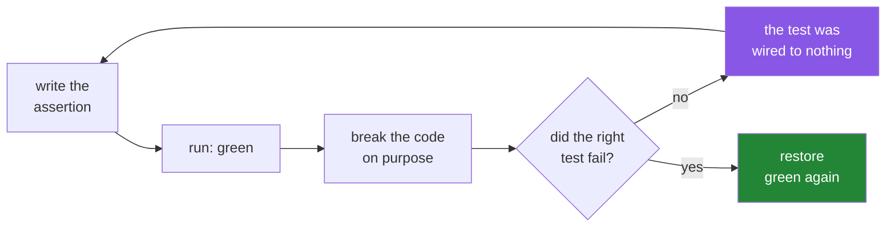

# 5.2 — The test that must be able to fail

## One-line answer

Every decision the module made — the dash is `NaN` and not zero, the mean is `nan` until somebody
chooses, the cast rounds, the range is checked — becomes an assertion, and you prove each one can go
RED by breaking the code on purpose and watching the right test fail.

---

## The story

The module works. Somebody runs it on the seven-line file, the numbers look right, and it goes into
the project.

Two months later a different person is tidying up. They see the line that turns a dash into a `NaN`
and think: a missing day is really zero steps, isn't it? The person wasn't walking. They change
`np.nan` to `0`, run the program, and it works. No error. The weekly total is the same, because
adding zero changes nothing.

The mean is different. It is now the total over seven days instead of six, so it is lower — by about
1 300 steps. Nothing in the output says that a definition changed. The number just moved.

A test would have caught it in a second, and only if somebody had thought to write down "the dash is
not a zero" as a thing that could be checked. That sentence is not obvious enough to be assumed. It
is a decision, and decisions are what tests are for.

---

## The idea in plain language

Principle 7 says every lab ends with at least one test that can go RED. This part is that test, and
the interesting word is **can**.

A test that passes tells you nothing on its own. A test that passes *and* which you have watched fail
for the right reason tells you two things: the behaviour is correct now, and the test is wired to
that behaviour rather than to nothing. A surprising number of tests in real codebases assert
something that is true no matter what the code does.

So the workflow is three steps, always in this order:

1. **Write the assertion** for a decision the code made.
2. **Break the code** in the smallest way that should violate it.
3. **Check that the failure names the right thing** — then put the code back.

Step 3 is where you find out whether you tested what you meant.

What is worth asserting here comes straight from the decisions
[5.1](5.1-reading-the-week-typed-on-purpose.md) listed:

| Decision | The assertion |
|---|---|
| a dash becomes `NaN`, not zero | `np.isnan(values[3])` and `recorded == 6` |
| the naive mean is honest about the hole | `np.isnan(values.mean())` |
| the nan-aware mean skips it | `assert_allclose(np.nanmean(values), 8946.166…)` |
| narrowing rounds rather than truncates | `to_whole([7999.6])[0] == 8000` |
| the hole survives narrowing, visibly | `narrowed[1] == -1` |
| a bad row fails at the boundary | `pytest.raises(ValueError, match=...)` |
| the summary returns plain Python types | `type(summary.total) is int` |
| the array really is smaller than the list | `arr.nbytes * 4 < list_bytes` |

Two rules that apply to every numeric test from here to Day 240.

**Never assert a computed float with `==`.** Use `np.testing.assert_allclose`, which takes a
tolerance and, when it fails, prints which elements differ and by how much. This is
[2.3](../02-dtypes/2.3-floats-nan-and-precision.md), and a test that violates it passes on your
machine and fails on the runner.

**Assert on the message, not only the exception class.**
`pytest.raises(ValueError, match="negative step count")` fails if the code raises the right class for
the wrong reason, which is the failure mode a bare `pytest.raises(ValueError)` cannot see
([Day 18, 4.4](../../../day-18-exceptions/parts/04-in-anger/4.4-pytest-raises.md)).

---

## Why Setu needs it

- **Principle 7 is not satisfied by a test that cannot fail.** Watching it go red is the part people
  skip, and it is the part that makes the rest worth anything.
- **Day 25's gate asserts a speed ratio**, which is a much harder test to write honestly than a value
  test. Getting the habits right on easy assertions first is why this comes before that.
- **Day 233's eval suite gates the whole capstone.** Every pattern there — tolerance-based float
  comparison, message matching, a deliberate red run — is established here.
- **`./m check` runs these on every commit**, so a test that is slow or that touches the network
  breaks the loop for everybody. These run offline in under a second.

---

## The mechanism

The test file, in four groups.

```python
"""Day 20's eval: every claim the module makes, asserted."""

from __future__ import annotations

import numpy as np
import pytest

from setu.steps import STEP_DTYPE, Summary, load_counts, summarise, to_whole

WEEK = ["8213", "10442", "6180", "-", "12007", "9631", "7204"]


def test_a_missing_day_becomes_nan_not_zero():
    values = load_counts(WEEK)
    assert values.dtype == np.float64
    assert np.isnan(values[3])
    assert np.count_nonzero(~np.isnan(values)) == 6


def test_the_naive_mean_is_nan_and_the_nan_mean_is_not():
    values = load_counts(WEEK)
    assert np.isnan(values.mean())
    np.testing.assert_allclose(np.nanmean(values), 8946.166666666666, rtol=1e-12)
```

**Line by line:**

- `WEEK` at module level — one fixture, used by every test, so a test that fails points at behaviour
  rather than at its own setup. Seven strings, dash included, exactly the file from
  [5.1](5.1-reading-the-week-typed-on-purpose.md).
- `assert values.dtype == np.float64` — **the dtype is part of the contract**, not an implementation
  detail. A change that made this `int64` would have silently dropped the missing day.
- `assert np.isnan(values[3])` — position 3 is Thursday. Note it is `np.isnan`, never `values[3] ==
  np.nan`, which is always `False` ([2.3](../02-dtypes/2.3-floats-nan-and-precision.md)).
- `np.count_nonzero(~np.isnan(values)) == 6` — six real days out of seven. This is the assertion that
  catches the "surely a dash is zero" edit from the story.
- `assert np.isnan(values.mean())` — **asserting that the obvious call gives `nan` is deliberate.**
  It looks like testing a NumPy behaviour, and it is really testing that the module has not quietly
  filled the hole in.
- `np.testing.assert_allclose(..., rtol=1e-12)` — the value, with a stated tolerance. `rtol=1e-12`
  is tight enough to catch a real change and loose enough to survive a different summation order.

The structure and the narrowing:

```python
def test_summary_reports_how_many_days_were_real():
    summary = summarise(load_counts(WEEK))
    assert isinstance(summary, Summary)
    assert (summary.days, summary.recorded) == (7, 6)
    assert summary.total == 53677
    assert summary.best == 12007
    np.testing.assert_allclose(summary.mean, 8946.166666666666, rtol=1e-12)


def test_summary_returns_plain_python_types():
    summary = summarise(load_counts(WEEK))
    assert type(summary.total) is int
    assert type(summary.mean) is float


def test_narrowing_rounds_and_marks_the_hole():
    narrowed = to_whole(load_counts(["7999.6", "-"]))
    assert narrowed.dtype == STEP_DTYPE
    assert narrowed[0] == 8000
    assert narrowed[1] == -1
```

**Line by line:**

- `assert (summary.days, summary.recorded) == (7, 6)` — both numbers in one assertion, as a tuple, so
  a failure prints `(7, 7) == (7, 6)` and you can see which half moved.
- `summary.total == 53677` — an integer, so `==` is correct here. The float rule applies to computed
  floats, not to counts.
- `type(summary.total) is int` — **`type(...) is int`, not `isinstance(...)`.** `isinstance` would
  pass for a `bool`, and more importantly `np.int64` is not a subclass of `int` on any platform, so
  this is the assertion that catches a `np.int64` leaking out to a JSON encoder.
- `to_whole(load_counts(["7999.6", "-"]))` — a value chosen so that rounding and truncating disagree:
  `np.rint` gives 8000 and `astype` alone would give 7999.
- `narrowed[1] == -1` — the sentinel survived. If narrowing had used `np.zeros` as its canvas this
  would be 0 and indistinguishable from a real quiet day.

The failure paths and the memory claim:

```python
def test_a_bad_row_fails_at_the_boundary():
    with pytest.raises(ValueError, match="could not convert string to float"):
        load_counts(["8213", "rest"])


def test_a_negative_count_is_refused():
    with pytest.raises(ValueError, match="negative step count"):
        load_counts(["8213", "-5"])


def test_an_integer_array_is_refused():
    with pytest.raises(TypeError, match="expected a float array"):
        summarise(np.array([8213, 10442]))


def test_a_value_too_large_for_the_dtype_is_refused():
    with pytest.raises(ValueError, match="outside int32"):
        to_whole(np.array([3e9]))


def test_the_array_is_smaller_than_the_list():
    import sys

    rng = np.random.default_rng(20)
    arr = rng.integers(0, 20_000, size=100_000)
    lst = arr.tolist()
    list_bytes = sys.getsizeof(lst) + sum(sys.getsizeof(x) for x in lst)
    assert arr.nbytes * 4 < list_bytes
```

**Line by line:**

- `pytest.raises(ValueError, match="...")` — `match` is a regular expression searched against the
  message. **Both halves matter**: the class says what kind of failure, the message says which one.
- `match="negative step count"` and `match="could not convert"` — two different `ValueError`s from
  the same function, told apart by their messages. Without `match`, one test would pass while the
  other's code path was broken.
- `match="outside int32"` — note this is checking the *project's* message rather than NumPy's,
  because the range check exists precisely so that NumPy's silent wrap never happens
  ([2.2](../02-dtypes/2.2-integers-and-the-silent-wrap.md)).
- `np.random.default_rng(20)` in the memory test — **seeded**, so the test is deterministic
  ([4.2](../04-random/4.2-the-seed-is-part-of-the-result.md)). An unseeded generator here would make
  the byte count wobble.
- `size=100_000` rather than a million — big enough for the ratio to be unambiguous and small enough
  that the test stays well under a second, because `./m check` runs it on every commit.
- `arr.nbytes * 4 < list_bytes` — asserting a **ratio of at least four**, not an exact byte count.
  Exact byte counts depend on the CPython version and the platform; the ratio is the claim
  [1.4](../01-the-block/1.4-a-million-floats-measured.md) actually made.

Green:

```text
$ uv run python -m pytest -q test_steps.py
..........                                                               [100%]
10 passed in 0.24s
```

Now the part that matters. **Break it on purpose** — change the one line that turns a dash into
`np.nan` so it produces `0` instead, exactly the edit from the story:

```text
$ uv run python -m pytest -q test_steps.py::test_a_missing_day_becomes_nan_not_zero
F                                                                        [100%]
================================== FAILURES ===================================
___________________ test_a_missing_day_becomes_nan_not_zero ___________________

    def test_a_missing_day_becomes_nan_not_zero():
        values = load_counts(WEEK)
        assert values.dtype == np.float64
>       assert np.isnan(values[3])
E       AssertionError: assert np.False_
E        +  where np.False_ = <ufunc 'isnan'>(np.float64(0.0))
E        +    where <ufunc 'isnan'> = np.isnan

test_steps.py:16: AssertionError
=========================== short test summary info ===========================
FAILED test_steps.py::test_a_missing_day_becomes_nan_not_zero - AssertionErro...
1 failed in 0.12s
```

Read the failure. `np.isnan(np.float64(0.0))` — pytest expanded the expression and showed the actual
value that reached `isnan`. **It was `0.0`, which is the bug, named.** That is a test wired to the
behaviour rather than to nothing.

And the whole suite on the broken version:

```text
$ uv run python -m pytest -q test_steps.py
=========================== short test summary info ===========================
FAILED test_steps.py::test_a_missing_day_becomes_nan_not_zero - AssertionErro...
FAILED test_steps.py::test_the_naive_mean_is_nan_and_the_nan_mean_is_not - As...
FAILED test_steps.py::test_summary_reports_how_many_days_were_real - assert (...
FAILED test_steps.py::test_narrowing_rounds_and_marks_the_hole - assert np.in...
4 failed, 6 passed in 0.18s
```

**Four tests caught a one-character change**, and the third one prints `assert (7, 7) == (7, 6)` —
the recorded-day count moving from six to seven, which is the actual meaning of the bug rather than
a symptom of it. Then put the line back and confirm ten green again.

The loop:



---

## When it breaks

**A test that cannot fail:**

```text
$ uv run python -c "
import numpy as np
values = np.array([8213.0, np.nan, 6180.0])
print('this assertion can never fail:', values.shape == values.shape)
print('nor can this one            :', np.isnan(values).sum() >= 0)
"
this assertion can never fail: True
nor can this one            : True
```

**What it means.** Both assertions are true for every possible input, so they test the language
rather than the code. They pass forever, they appear in the count, and they protect nothing. This is
why step 2 of the workflow is not optional: an assertion you have never seen fail might be one of
these.

**A float compared with `==`:**

```text
$ uv run python -c "
import numpy as np
computed = np.array([0.1, 0.2]).sum()
assert computed == 0.3
" 2>&1 | tail -2
AssertionError
```

**What it means.** `AssertionError` and nothing else — no values, no explanation. Two problems in one
line: the comparison is wrong ([2.3](../02-dtypes/2.3-floats-nan-and-precision.md)), and a bare
`assert x == y` on floats gives a failure message with no information in it.
`np.testing.assert_allclose(computed, 0.3)` would both pass and, when it did fail, print the maximum
absolute and relative difference.

**`pytest.raises` with no `match`:**

```text
$ uv run python -c "
import pytest

def load(rows):
    raise ValueError('unrelated typo in the loader')

with pytest.raises(ValueError):
    load(['8213', 'rest'])
print('the test passed, and the code is broken')
"
the test passed, and the code is broken
```

**What it means.** The function raised `ValueError` for a completely different reason and the test
was satisfied. In a real module a typo in an unrelated branch can produce the right exception class
by accident, and a class-only assertion will not notice. `match=` is one extra argument and it is
what makes the test about the behaviour.

**Comparing arrays with `assert a == b`:**

```text
$ uv run python -c "
import numpy as np
a = np.array([1, 2, 3])
b = np.array([1, 2, 3])
assert a == b
" 2>&1 | tail -2
ValueError: The truth value of an array with more than one element is ambiguous. Use a.any() or a.all()
```

**What it means.** `a == b` on two arrays gives an *array* of booleans, and `assert` needs a single
true-or-false, so Python asks the array for its truth value and NumPy refuses
([Day 21, 3.3](../../../day-21-indexing-and-views/parts/03-boolean-masks/3.3-and-or-not-and-why-and-raises.md)
is the same error from the other direction). Use `np.array_equal(a, b)` for exact integer arrays and
`np.testing.assert_array_equal` or `assert_allclose` in tests, because those print the differing
elements when they fail.

---

## In production

**What a professional writes instead of the teaching version.** Three additions, and none of them is
more assertions.

**A fixture instead of a module-level constant**, once more than one test needs to modify the input:

```python
import numpy as np
import pytest


@pytest.fixture
def week() -> list[str]:
    """One week of exported counts, with Thursday missing."""
    return ["8213", "10442", "6180", "-", "12007", "9631", "7204"]


@pytest.fixture
def counts(week: list[str]) -> np.ndarray:
    """The parsed form, so tests that do not care about parsing skip it."""
    from setu.steps import load_counts

    return load_counts(week)
```

**Line by line:**

- `@pytest.fixture` — a function pytest calls to build the input, fresh for every test
  ([Day 2, 3.2](../../../day-02-quality-gate/parts/03-pytest/3.2-fixtures-and-tmp-path.md)). A
  module-level list is shared, so a test that mutates it changes the next one.
- `def counts(week: list[str])` — **a fixture taking a fixture.** pytest resolves the chain by
  parameter name, so `counts` gets the freshly built `week`.
- The import inside `counts` rather than at the top — only when the module under test is slow to
  import or optional. For this module a top-level import is better; it is shown here because you
  will meet the pattern.

**Parametrise the cases that differ only in data:**

```python
import pytest

from setu.steps import load_counts


@pytest.mark.parametrize(
    ("rows", "message"),
    [
        (["8213", "rest"], "could not convert string to float"),
        (["8213", "-5"], "negative step count"),
        (["8213", ""], "could not convert string to float"),
    ],
)
def test_bad_input_is_refused(rows: list[str], message: str):
    with pytest.raises(ValueError, match=message):
        load_counts(rows)
```

**Line by line:**

- `@pytest.mark.parametrize(("rows", "message"), [...])` — one test function, three cases, three
  separate results in the report. A `for` loop inside one test would stop at the first failure and
  hide the other two.
- The third case, `""`, is the empty-cell exporter from
  [5.1](5.1-reading-the-week-typed-on-purpose.md)'s production section — a real bug caught by adding
  one line to a list.
- Naming the parameters as a tuple rather than a comma-separated string is the clearer modern form.

**Property-based checks for the claims that are about all inputs, not one.** "Narrowing then widening
never changes a recorded value" and "the summary's `recorded` never exceeds `days`" are true for
every input, and a library like Hypothesis generates inputs trying to break them. That is beyond
today, and the habit worth forming now is noticing which of your assertions are examples and which
are properties.

**What changes at scale.** Test time becomes the constraint. `./m check` runs on every commit, so a
suite that takes two minutes stops being run. The memory test above is already the slow one at
100 000 elements, and the discipline is: keep value tests tiny, mark anything genuinely slow with
`@pytest.mark.slow` so it can be deselected
([Day 2, 3.3](../../../day-02-quality-gate/parts/03-pytest/3.3-markers-and-exit-code-five.md)), and
never let a unit test touch the network.

The second scale problem is timing assertions specifically. Day 25 has to assert a 50× speedup, and
a CI runner under load can be five times slower than your laptop while producing the *same ratio* —
which is exactly why the assertion is a ratio and not a duration. A test that asserts "under 10 ms"
will fail on somebody else's machine for reasons that have nothing to do with the code.

**The failure that only appears with real data.** A test suite whose every fixture was a clean
seven-row week. The module was correct for all of them and wrong for a file with a single line,
because `np.loadtxt` returns a zero-dimensional array for one row unless `ndmin=1` is passed
([3.1](../03-creating/3.1-np-array-and-what-it-infers.md)). The single-row case is the most commonly
untested shape there is, followed by the empty file, and both appear in production on day one.

**The review comment a senior engineer leaves.** *"All ten of these pass on the current code. Show me
one of them failing — change the `np.nan` to a `0` and paste the output. If nothing goes red, we
have ten green lights wired to nothing."*

**The interview question.** *"How do you know a test is any good?"* By watching it fail for the
reason you expect. A passing test proves nothing on its own, because an assertion that is true for
every possible input passes forever and protects nothing — so you break the code in the smallest way
that should violate the assertion and check that the right test fails with a message naming the
actual problem. For numeric code specifically there are two further rules: never compare computed
floats with `==`, because summation order varies between machines and array sizes, and always pass
`match=` to `pytest.raises`, because the right exception class raised for the wrong reason will
satisfy a class-only assertion.

---

## Check yourself

```bash
uv run python -m pytest -q tests/test_steps.py
```

Then open `src/setu/steps.py`, change the `np.nan` in `load_counts` to `0`, and run it again. Count
how many tests go red and read the third one's message before you put the line back.

**Answer out loud, without scrolling up:**

> Why is a test that has never failed not yet a test? Then name the two rules that apply to every
> numeric assertion in this project.

---

**Back to the hub:** [Day 20 — `ndarray`, dtypes and array creation](../../LESSON.md).
