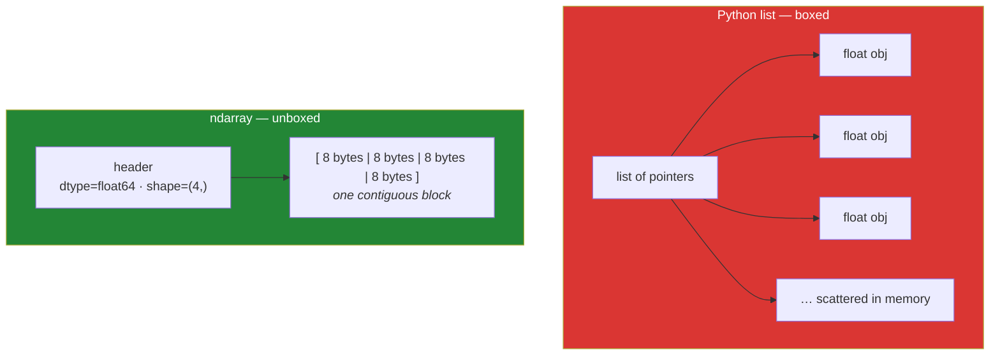

# Day 20 — `ndarray`, dtypes, and array creation

**Phase 3 · Module 3 · Numerical computing with NumPy** · IDs: **NP-01**, **NP-02**

> **Yesterday:** Phase 2 closed — `Paper` is a Pydantic model and the package is layered.
> **Today:** the array. Every number in the remaining 220 days lives in one — a pandas column is an
> array, a tensor is an array with a gradient, an embedding is an array of 384 floats.
> ⚠️ **NumPy 2.x removed names that appear in almost every tutorial written before 2024.** You will
> learn only the current ones.
> **Tomorrow:** indexing, slicing, and the view trap.

```bash
./m start 20 && ./m scaffold 20
```

**Time:** 100 minutes. **Request budget:** 0 model calls.

---

## §1 The story

A Python list of a million floats is a million separate objects, each with a type tag, a reference
count, and a pointer. The list itself holds a million pointers. Adding two lists element-wise means a
million interpreter loop iterations, each one dereferencing pointers and dispatching on type.

A NumPy array of a million floats is **one contiguous block of eight-megabyte memory**, plus a small
header saying "this is float64, shape (1000000,)". Adding two arrays is one C loop over contiguous
memory, with the type known once, up front.



That single structural difference buys three things:

1. **Memory.** Roughly 8 bytes per number instead of ~30–60.
2. **Speed.** 10–100× on element-wise work, because the loop is in C and the CPU can prefetch
   contiguous memory.
3. **Vectorised syntax.** `a + b` instead of a loop. That is not just prettier — it is what makes
   Day 95's gradient descent and Day 143's attention readable as mathematics.

The price is **homogeneity**: every element has the same type, fixed when the array is made. That is
why `dtype` is a first-class thing today and why choosing it wrong costs you either precision or
memory.

### ⚠️ The NumPy 2.x hazard

NumPy 2.0 removed a pile of long-deprecated aliases. They are all over Stack Overflow answers and
older tutorials, and they now raise `AttributeError`:

| Dead (pre-2.0) | Use instead |
|---|---|
| `np.float_`, `np.complex_` | `np.float64`, `np.complex128` |
| `np.int0`, `np.uint0` | `np.intp`, `np.uintp` |
| `np.NaN`, `np.NAN` | `np.nan` |
| `np.Inf`, `np.Infinity`, `np.NINF` | `np.inf`, `-np.inf` |
| `np.in1d` | `np.isin` |
| `np.round_` | `np.round` |
| `np.alltrue`, `np.sometrue` | `np.all`, `np.any` |
| `np.unicode_`, `np.string_` | `np.str_`, `np.bytes_` |

You will never learn the dead ones, because today only shows the live ones. When a tutorial gives you
an `AttributeError` on Day 130, come back to this table.

---

## §2 Setup — run this

```bash
uv add "numpy==2.5.2"
mkdir -p days/day-20/lab
touch days/day-20/lab/arrays.py
touch src/setu/arrays.py
touch tests/test_arrays.py
```

- Pin whatever **your** Day-1 `verify_pins.py` run reported. If it differs from `2.5.2`, pin yours and
  log the drift in `docs/CHANGELOG_PLAN_DS.md` (Principle 4).

Confirm the major version before anything else:

```bash
uv run python -c "import numpy as np; print(np.__version__); print(hasattr(np, 'float_'))"
```

- Must print a version starting with `2.` and then `False`. If `float_` exists, you are on NumPy 1.x
  and every "removed name" note below does not apply yet — **stop and fix the pin**.

---

## §3 NP-01 — what an array actually is

`days/day-20/lab/arrays.py`:

```python
"""NP-01 / NP-02: the ndarray, its dtype, and every way to create one."""

from __future__ import annotations

import sys
import time

import numpy as np


def anatomy() -> None:
    a = np.array([[1, 2, 3], [4, 5, 6]])
    print(f"\n{a=}")
    print(f"{a.shape=}    <- (rows, cols); a TUPLE, so 1-D is (3,) not (3)")
    print(f"{a.ndim=}     <- number of dimensions = len(shape)")
    print(f"{a.size=}     <- total elements = product of shape")
    print(f"{a.dtype=}    <- ONE type for every element")
    print(f"{a.itemsize=} <- bytes per element")
    print(f"{a.nbytes=}   <- size * itemsize")
    print(f"{a.T.shape=}  <- transpose, no data copied")


def memory_and_speed() -> None:
    n = 1_000_000
    as_list = list(range(n))
    as_array = np.arange(n, dtype=np.int64)

    list_bytes = sys.getsizeof(as_list) + sum(sys.getsizeof(x) for x in as_list[:1000]) * n // 1000
    print(f"\nlist  : ~{list_bytes:>12,} bytes (pointers + boxed ints)")
    print(f"array : {as_array.nbytes:>13,} bytes")

    start = time.perf_counter()
    [x * 2 for x in as_list]
    loop = time.perf_counter() - start

    start = time.perf_counter()
    as_array * 2
    vec = time.perf_counter() - start

    print(f"\ndoubling {n:,} values")
    print(f"  comprehension: {loop:.4f}s")
    print(f"  vectorised:    {vec:.4f}s")
    print(f"  ~{loop / vec:,.0f}x faster")


def dtypes() -> None:
    print(f"\n{np.array([1, 2, 3]).dtype=}         <- int64 inferred")
    print(f"{np.array([1.0, 2, 3]).dtype=}       <- one float makes them all float")
    print(f"{np.array([1, 2, 'x']).dtype=}       <- one string makes them all strings!")
    print(f"{np.array([True, False]).dtype=}")

    small = np.array([1, 2, 3], dtype=np.int8)
    print(f"\n{small.nbytes=} vs {np.array([1, 2, 3]).nbytes=}   <- 8x less memory")
    print(f"{(small + np.int8(127)).dtype=}")

    over = np.array([127], dtype=np.int8)
    print(f"\n{over=}")
    with np.errstate(over="ignore"):
        print(f"  127 + 1 as int8 -> {(over + np.int8(1))[0]}   <- WRAPS. no exception by default.")

    print(f"\n{np.float32(0.1) == np.float64(0.1)=}   <- different precision, not equal")
    print(f"{np.float64(0.1) + np.float64(0.2) == 0.3=}   <- Day 4's float lesson, again")


def dead_names() -> None:
    print("\n-- NumPy 2.x removed these; confirm each raises --")
    for name in ("float_", "int0", "NaN", "Inf", "in1d", "round_", "alltrue"):
        print(f"  np.{name:<9} exists? {hasattr(np, name)}")
    print(f"\n  live replacements: {np.float64=} {np.nan=} {np.inf=}")
    print(f"  {np.isin([1, 2, 5], [1, 2, 3])=}   <- was np.in1d")
```

**Line by line:**

- `a.shape` is a **tuple**. A 1-D array of three elements has shape `(3,)` — note the trailing comma
  (Day 8's one-element-tuple rule). `(3)` is just an integer, and confusing the two is where "why is
  my array 0-dimensional" comes from.
- `a.ndim` and `a.size` — dimensions and total element count. `size` is the product of `shape`.
- `a.itemsize` / `a.nbytes` — bytes per element and in total. On Day 155 you will hold 100 000
  embeddings of 384 float32s; `nbytes` is how you find out that is 147 MB before you allocate it.
- `a.T` — transpose. **No data is copied**; only the shape and strides change. Tomorrow's lesson.
- `np.arange(n, dtype=np.int64)` — explicit dtype. Do not rely on the platform default; on Windows the
  default integer has historically differed from Linux, and Principle 4 says nothing floats.
- `as_array * 2` — one expression, no loop. Run it: typically 20–100× faster.
- `np.array([1, 2, 'x']).dtype` becomes a **string** dtype — everything is silently converted. This is
  how one bad cell in a CSV turns a numeric column into text, and you will meet it again on Day 27.
- `dtype=np.int8` — one byte per value instead of eight. **The overflow demo is the point:** `127 + 1`
  as `int8` wraps to `-128` with no exception. NumPy does not raise on integer overflow by default.
  Small dtypes save memory and can silently corrupt data; choose deliberately.
- `np.errstate(over="ignore")` — a context manager (Day 16!) controlling NumPy's floating-point error
  policy for a block. You can set it to `"raise"` to turn silent problems into exceptions, which is
  worth knowing when a training run produces NaNs on Day 129.
- `np.float32(0.1) != np.float64(0.1)` — different precisions store different approximations. Day 4's
  float lesson with a memory-size dimension added: `float32` halves your memory and costs precision.
  Embeddings use `float32`; statistics use `float64`.
- `dead_names()` — prints `False` for all seven. **Run it once so the table in §1 is something you saw
  rather than something you read.**

---

## §4 NP-02 — every way to make an array

Add to the same file:

```python
def creation_from_data() -> None:
    print(f"\n{np.array([1, 2, 3])=}")
    print(f"{np.array([[1, 2], [3, 4]]).shape=}")
    print(f"{np.asarray([1, 2, 3]) is np.asarray(np.array([1, 2, 3]))=}")
    existing = np.array([1, 2, 3])
    print(f"{np.asarray(existing) is existing=}   <- asarray does NOT copy an existing array")
    print(f"{np.array(existing) is existing=}     <- array() DOES copy by default")


def creation_from_ranges() -> None:
    print(f"\n{np.arange(5)=}")
    print(f"{np.arange(2, 11, 3)=}        <- start, stop (exclusive), step")
    print(f"{np.arange(0, 1, 0.3)=}       <- float steps accumulate error; prefer linspace")
    print(f"{np.linspace(0, 1, 5)=}       <- start, stop (INCLUSIVE), count")
    print(f"{np.linspace(0, 1, 5, endpoint=False)=}")
    print(f"{np.logspace(0, 3, 4)=}       <- 10^0 .. 10^3; Day 106 uses this for search grids")


def creation_filled() -> None:
    print(f"\n{np.zeros((2, 3))=}")
    print(f"{np.ones(3, dtype=np.int32)=}")
    print(f"{np.full((2, 2), 7)=}")
    print(f"{np.eye(3)=}")
    print(f"{np.empty(3).shape=}   <- UNINITIALISED memory: contains garbage. Never read it first.")

    template = np.array([[1, 2], [3, 4]])
    print(f"\n{np.zeros_like(template)=}   <- same shape AND dtype")


def creation_random() -> None:
    rng = np.random.default_rng(seed=42)          # the modern generator
    print(f"\n{rng.random(3)=}")
    print(f"{rng.integers(0, 10, size=5)=}")
    print(f"{rng.normal(loc=0, scale=1, size=3)=}")
    print(f"{rng.choice(['a', 'b', 'c'], size=4)=}")

    again = np.random.default_rng(seed=42)
    print(f"\n{np.array_equal(rng := np.random.default_rng(42).random(3), again.random(3))=}")
    print("  ^ same seed, same numbers: reproducibility (Principle 4)")

    print("\n  legacy np.random.seed(42) + np.random.rand() still works but is DISCOURAGED:")
    print("  it uses one hidden global state, so two libraries can fight over it.")


def nan_and_inf() -> None:
    a = np.array([1.0, np.nan, 3.0, np.inf])
    print(f"\n{a=}")
    print(f"{a.sum()=}          <- nan poisons the whole sum")
    print(f"{np.nansum(a)=}      <- nan-aware version ignores it")
    print(f"{np.isnan(a)=}")
    print(f"{np.isfinite(a)=}")
    print(f"{np.nan == np.nan=}   <- FALSE. never compare with ==; use np.isnan")


if __name__ == "__main__":
    anatomy()
    memory_and_speed()
    dtypes()
    dead_names()
    creation_from_data()
    creation_from_ranges()
    creation_filled()
    creation_random()
    nan_and_inf()
```

**Line by line:**

- `np.array(existing)` **copies**; `np.asarray(existing)` does **not** if it is already an array of the
  right dtype. Use `asarray` at the top of a function that accepts "array-like" input — it costs
  nothing when given an array and converts when given a list.
  ⚠️ In NumPy 2.x, `np.array(x, copy=False)` now **raises** if a copy is unavoidable, rather than
  quietly copying. If you meant "avoid a copy if you can", that is `np.asarray`.
- `np.arange(0, 1, 0.3)` — floating-point steps accumulate rounding error, and whether the endpoint
  sneaks in is unpredictable. **Use `linspace` for float ranges**; it takes a count, not a step.
- `np.linspace(0, 1, 5)` — endpoint **included** by default, unlike `arange` and unlike Python's
  `range`. That inconsistency catches everyone once.
- `np.logspace(0, 3, 4)` — log-spaced. Day 106's hyperparameter search over learning rates uses this,
  because the interesting values are 0.001, 0.01, 0.1 — not 0.25, 0.5, 0.75.
- `np.empty` — allocates without initialising. It is faster and it contains **whatever was in that
  memory before**. Only use it when you will overwrite every element immediately.
- `np.zeros_like(template)` — matches shape *and* dtype. Safer than retyping the shape by hand.
- `np.random.default_rng(seed=42)` — **the modern API**. `np.random.seed()` + `np.random.rand()` is
  legacy: it mutates one hidden global, so a library you import can reseed it underneath you and your
  "reproducible" run stops being reproducible. Every random draw in this project goes through an
  explicit `rng` object (Principle 4 — nothing floats, including randomness).
- `a.sum()` with a NaN present returns `nan` — **one missing value poisons the whole aggregate.** This
  is Day 76's missing-data lesson arriving early, and it is why `np.nansum`, `np.nanmean` and friends
  exist.
- `np.nan == np.nan` is `False`. It is defined that way in IEEE 754. **Never compare with `==`;** use
  `np.isnan`. Every `df["x"] == np.nan` returning all-False traces back to this.

---

## §5 Build brief — `src/setu/arrays.py`

Layer 1. The array helpers Phase 8's statistics and Phase 18's embeddings both use.

```python
"""Array helpers. NumPy 2.x only. Layer 1: imports errors and nothing else from setu."""

from __future__ import annotations

import numpy as np

from setu.errors import DataError

DEFAULT_SEED = 42


def as_float_array(values, *, dtype=np.float64) -> np.ndarray:
    """TODO(me): convert array-like to a 1-D float array.

    - use np.asarray (do NOT copy an array that is already correct)
    - raise DataError if the result is not 1-D
    - raise DataError if it contains any inf (nan is allowed; inf is not)
    - an empty input is allowed and returns an empty array
    """
    raise NotImplementedError


def describe(values) -> dict[str, float]:
    """TODO(me): {'n', 'n_missing', 'mean', 'std', 'min', 'max'} ignoring NaN.

    - use the nan-aware functions
    - std must use ddof=1 (the SAMPLE standard deviation - Day 60 explains why)
    - if every value is missing, mean/std/min/max are float('nan'), not an exception
    """
    raise NotImplementedError


def make_rng(seed: int | None = None) -> np.random.Generator:
    """TODO(me): return np.random.default_rng(seed if seed is not None else DEFAULT_SEED).

    Every random draw in this project goes through here. Never np.random.seed().
    """
    raise NotImplementedError


def memory_report(shape: tuple[int, ...], dtype=np.float32) -> dict[str, float]:
    """TODO(me): {'elements', 'bytes', 'mib'} for an array of this shape and dtype.

    Use np.dtype(dtype).itemsize. You will call this on Day 155 before allocating
    100_000 x 384 embeddings, to find out it is ~147 MiB BEFORE trying it.
    """
    raise NotImplementedError
```

- `as_float_array` rejecting `inf` but allowing `nan` is a real distinction: NaN means *missing* and
  is handled downstream; infinity almost always means a division by zero you have not noticed yet.
- `ddof=1` — NumPy's `std` defaults to `ddof=0` (the *population* standard deviation). Day 60 covers
  why the sample version divides by n−1. Setting it here means every later statistic in the project is
  consistent, and the choice is written down once.

---

## §6 The eval that must be able to fail

`tests/test_arrays.py`:

```python
import numpy as np
import pytest

from setu.arrays import as_float_array, describe, make_rng, memory_report
from setu.errors import DataError


def test_numpy_is_version_2():
    assert np.__version__.startswith("2."), "this project targets NumPy 2.x"


@pytest.mark.parametrize("name", ["float_", "int0", "NaN", "Inf", "in1d", "round_", "alltrue"])
def test_removed_aliases_are_really_gone(name):
    assert not hasattr(np, name), f"np.{name} exists - are you on NumPy 1.x?"


def test_as_float_array_does_not_copy_a_correct_array():
    a = np.array([1.0, 2.0])
    assert as_float_array(a) is a, "use np.asarray, not np.array"


def test_as_float_array_converts_a_list():
    out = as_float_array([1, 2, 3])
    assert out.dtype == np.float64
    assert isinstance(out, np.ndarray)


def test_as_float_array_rejects_2d():
    with pytest.raises(DataError):
        as_float_array([[1, 2], [3, 4]])


def test_as_float_array_rejects_infinity_but_allows_nan():
    assert np.isnan(as_float_array([1.0, np.nan])).sum() == 1
    with pytest.raises(DataError):
        as_float_array([1.0, np.inf])


def test_as_float_array_allows_empty():
    assert as_float_array([]).size == 0


def test_describe_ignores_missing_values():
    out = describe([1.0, 2.0, np.nan, 4.0])
    assert out["n"] == 4
    assert out["n_missing"] == 1
    assert out["mean"] == pytest.approx(7 / 3)
    assert out["min"] == 1.0 and out["max"] == 4.0


def test_describe_uses_the_sample_standard_deviation():
    out = describe([2.0, 4.0, 4.0, 4.0, 5.0, 5.0, 7.0, 9.0])
    assert out["std"] == pytest.approx(2.13809, rel=1e-4), "ddof=0 gives 2.0 - use ddof=1"


def test_describe_all_missing_does_not_raise():
    out = describe([np.nan, np.nan])
    assert out["n"] == 2 and out["n_missing"] == 2
    assert np.isnan(out["mean"])


def test_rng_is_reproducible():
    assert np.array_equal(make_rng(7).random(5), make_rng(7).random(5))


def test_rng_default_seed_is_stable():
    assert np.array_equal(make_rng().random(3), make_rng().random(3))


def test_different_seeds_differ():
    assert not np.array_equal(make_rng(1).random(5), make_rng(2).random(5))


def test_memory_report_matches_reality():
    report = memory_report((1000, 384), dtype=np.float32)
    actual = np.zeros((1000, 384), dtype=np.float32)
    assert report["elements"] == actual.size
    assert report["bytes"] == actual.nbytes
    assert report["mib"] == pytest.approx(actual.nbytes / 1024**2)


def test_no_legacy_random_in_src():
    from pathlib import Path

    offenders = [
        f"{p.name}:{i}"
        for p in Path("src/setu").rglob("*.py")
        for i, line in enumerate(p.read_text(encoding="utf-8").splitlines(), 1)
        if "np.random.seed" in line or "np.random.rand(" in line
    ]
    assert not offenders, f"legacy global RNG used: {offenders} - use make_rng()"
```

**Line by line:**

- `test_removed_aliases_are_really_gone` — seven parametrised checks that you are genuinely on 2.x.
  It looks trivial; it is the tripwire that tells you *why* a tutorial's code fails on Day 130.
- `test_as_float_array_does_not_copy_a_correct_array` — `is`, an identity check (Day 5). `np.array()`
  copies and fails this; `np.asarray()` passes. On a 147 MB embedding matrix, an accidental copy is
  147 MB and a visible pause.
- `test_describe_uses_the_sample_standard_deviation` — **the day's sharpest test.** That eight-value
  dataset gives 2.0 with `ddof=0` and 2.138 with `ddof=1`. A single default, silently wrong, would
  propagate into every confidence interval you compute from Day 68 onward.
- `pytest.approx(..., rel=1e-4)` — the correct way to compare floats (Day 4). Never `==`.
- `test_describe_all_missing_does_not_raise` — the degenerate case. NumPy emits a `RuntimeWarning` for
  `nanmean` of an all-NaN slice and returns `nan`; your function must return that cleanly rather than
  exploding on real data with an empty group.
- `test_rng_is_reproducible` — two independent generators with the same seed produce identical
  streams. This is what makes every later experiment repeatable.
- `test_no_legacy_random_in_src` — a repo-wide guard, same family as Days 17, 18 and 26. It is the
  reproducibility rule made mechanical.

```bash
uv run python -m pytest tests/test_arrays.py -v
```

---

## §7 Request budget

| Resource | Spent today |
|---|---|
| LLM calls | **0** |
| Network | one `uv add` resolution |

---

## §8 Traps

- **Copying a pre-2024 tutorial.** `np.float_`, `np.NaN`, `np.in1d` all raise on NumPy 2.x.
- **`np.array(x, copy=False)`.** In 2.x this **raises** when a copy is needed. Use `np.asarray`.
- **Small integer dtypes without thinking.** `int8` wraps at 127 with no exception.
- **One string in a numeric list.** The whole array becomes strings, silently.
- **`arange` with a float step.** Rounding error; the endpoint is unpredictable. Use `linspace`.
- **Forgetting `linspace` includes the endpoint** while `arange` and `range` do not.
- **Reading `np.empty` before writing it.** It is uninitialised memory.
- **`x == np.nan`.** Always `False`. Use `np.isnan`.
- **`.sum()` on data with NaN.** Poisons the result. Use `np.nansum` / `np.nanmean`.
- **`np.random.seed()`.** One hidden global; any library can reseed it. Use `default_rng`.
- **Relying on `std`'s default `ddof=0`.** That is the population formula. Decide, then be consistent.

---

## §9 Verify before you code

Written **2026-08-21**. NumPy 2.x is current; check before trusting anything older:

- <https://numpy.org/doc/stable/numpy_2_0_migration_guide.html> — the removed-names table. **Read this
  one properly.**
- <https://numpy.org/doc/stable/reference/arrays.dtypes.html> — dtype rules and promotion.
- <https://numpy.org/doc/stable/reference/random/generator.html> — `default_rng` and why the legacy
  API is discouraged.
- <https://numpy.org/doc/stable/reference/generated/numpy.std.html> — confirm `ddof` still defaults to 0.

---

## §10 Say it in an interview

> "An ndarray is one contiguous typed buffer with a small header, versus a list which is a million
> pointers to a million boxed objects — so you get roughly an order of magnitude on memory and one to
> two on element-wise speed, and the syntax becomes the mathematics. The two things I'm careful about
> are dtype and randomness. Integer overflow doesn't raise in NumPy, it wraps, so a memory-saving
> `int8` can silently corrupt data. And every random draw goes through one `default_rng` helper rather
> than `np.random.seed`, because the legacy API mutates a single hidden global that any imported
> library can reseed underneath you — there's a test that greps the package for it."

---

## §11 Done when

Tick [`CHECKLIST.md`](CHECKLIST.md), then `./m check && ./m done 20`.
